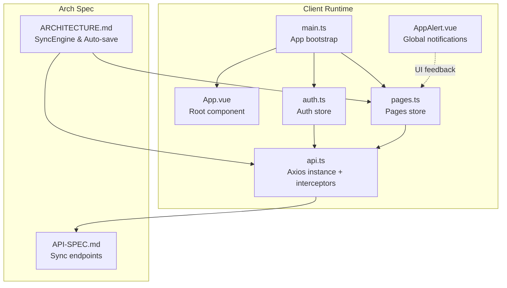
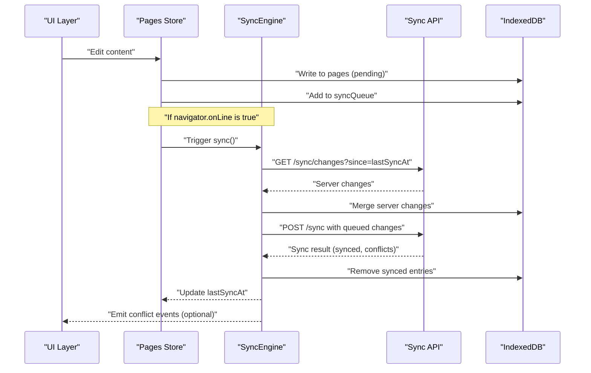
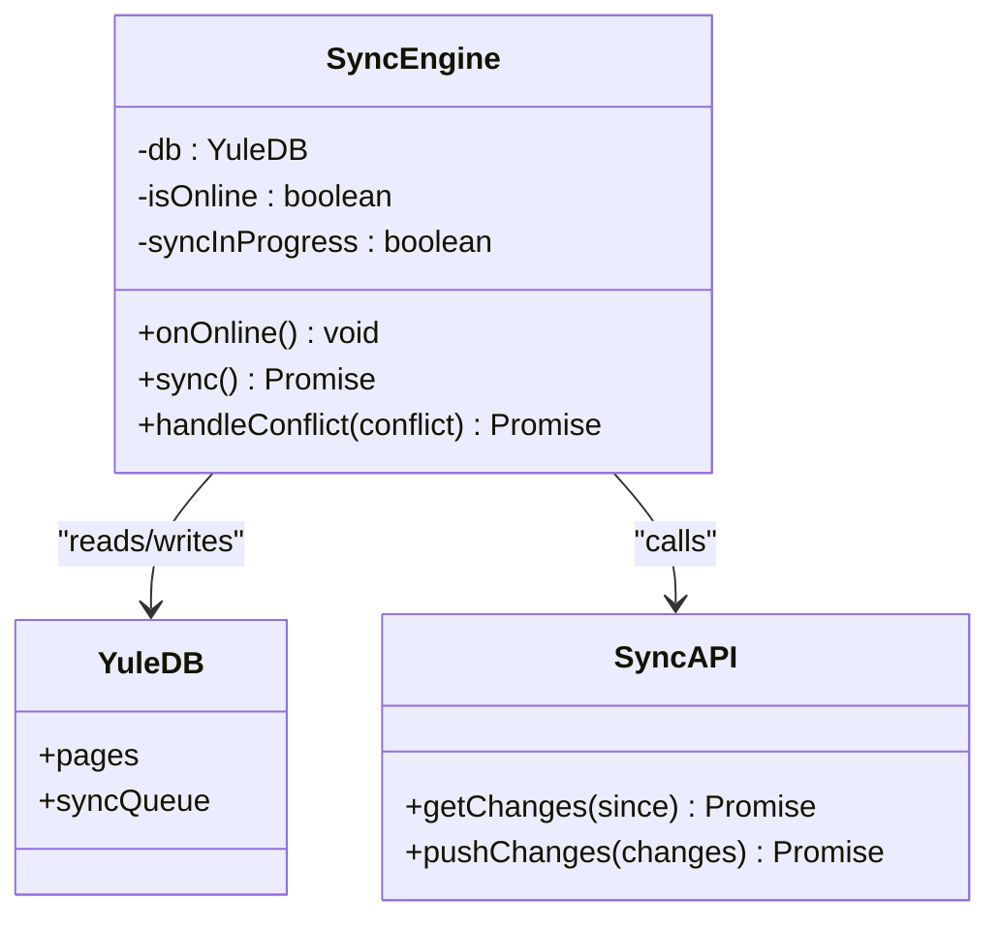
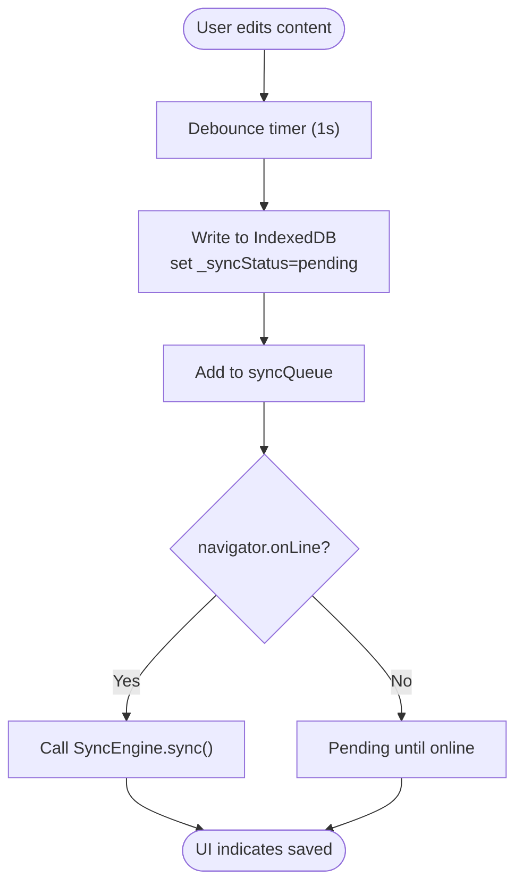
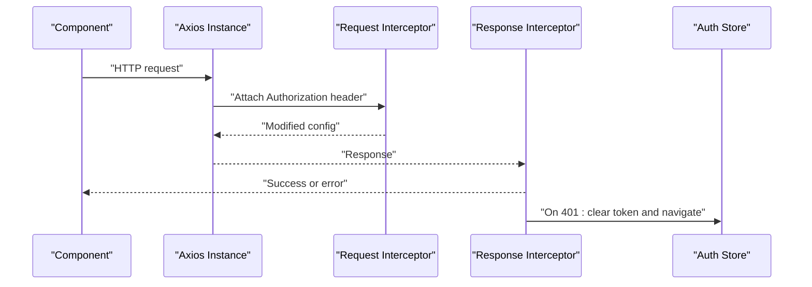
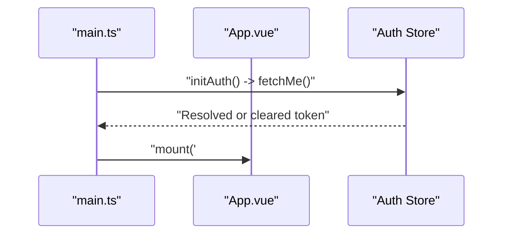
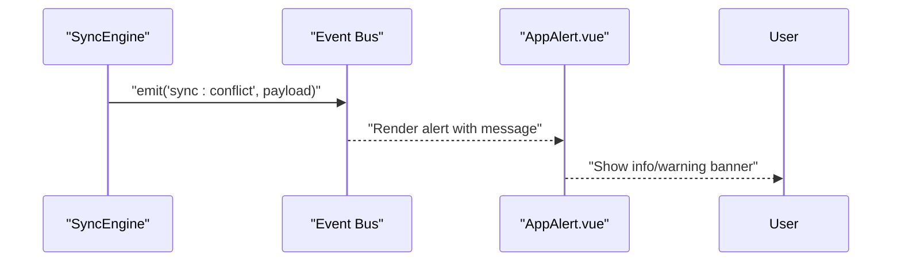
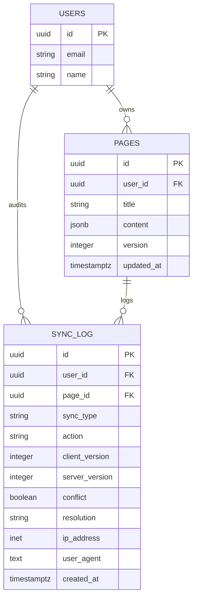
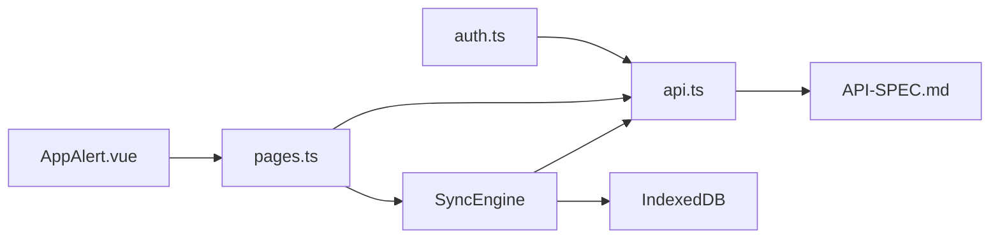

# Network Management

<cite>
**Referenced Files in This Document**
- [ARCHITECTURE.md](file://arch/ARCHITECTURE.md)
- [API-SPEC.md](file://api-spec/API-SPEC.md)
- [App.vue](file://code/client/src/App.vue)
- [main.ts](file://code/client/src/main.ts)
- [AppAlert.vue](file://code/client/src/components/common/AppAlert.vue)
- [api.ts](file://code/client/src/services/api.ts)
- [auth.ts](file://code/client/src/stores/auth.ts)
- [pages.ts](file://code/client/src/stores/pages.ts)
- [index.ts](file://code/client/src/types/index.ts)
- [001_init.sql](file://db/001_init.sql)
- [20260319_init.ts](file://code/server/src/db/migrations/20260319_init.ts)
</cite>

## Table of Contents
1. [Introduction](#introduction)
2. [Project Structure](#project-structure)
3. [Core Components](#core-components)
4. [Architecture Overview](#architecture-overview)
5. [Detailed Component Analysis](#detailed-component-analysis)
6. [Dependency Analysis](#dependency-analysis)
7. [Performance Considerations](#performance-considerations)
8. [Troubleshooting Guide](#troubleshooting-guide)
9. [Conclusion](#conclusion)

## Introduction
This document explains the network connectivity management and handling in the client application. It covers how the system detects online/offline status using the browser’s navigator.onLine API, how it triggers synchronization upon network restoration, and how it manages manual sync controls. It also documents offline state detection, connection status monitoring, error handling strategies, and practical guidance for building network-aware UI components, loading states, user notifications, background sync processes, retry logic, and graceful handling of intermittent connectivity.

## Project Structure
The network management spans several layers:
- Application bootstrap initializes stores and theme after authentication recovery.
- Global HTTP client sets up request/response interceptors for authentication and error handling.
- Stores manage application state and integrate with persistence and sync.
- Architecture documentation defines the SyncEngine and auto-save flow that rely on navigator.onLine and IndexedDB queues.

**Diagram sources**
- [main.ts:1-54](file://code/client/src/main.ts#L1-L54)
- [App.vue:1-20](file://code/client/src/App.vue#L1-L20)
- [api.ts:1-64](file://code/client/src/services/api.ts#L1-L64)
- [auth.ts:1-138](file://code/client/src/stores/auth.ts#L1-L138)
- [pages.ts:1-165](file://code/client/src/stores/pages.ts#L1-L165)
- [AppAlert.vue:1-136](file://code/client/src/components/common/AppAlert.vue#L1-L136)
- [ARCHITECTURE.md:398-520](file://arch/ARCHITECTURE.md#L398-L520)
- [API-SPEC.md:687-811](file://api-spec/API-SPEC.md#L687-L811)

**Section sources**
- [main.ts:1-54](file://code/client/src/main.ts#L1-L54)
- [App.vue:1-20](file://code/client/src/App.vue#L1-L20)
- [api.ts:1-64](file://code/client/src/services/api.ts#L1-L64)
- [auth.ts:1-138](file://code/client/src/stores/auth.ts#L1-L138)
- [pages.ts:1-165](file://code/client/src/stores/pages.ts#L1-L165)
- [AppAlert.vue:1-136](file://code/client/src/components/common/AppAlert.vue#L1-L136)
- [ARCHITECTURE.md:398-520](file://arch/ARCHITECTURE.md#L398-L520)
- [API-SPEC.md:687-811](file://api-spec/API-SPEC.md#L687-L811)

## Core Components
- SyncEngine: Orchestrates pull/push synchronization, conflict resolution, and last-sync timestamp updates. It listens for online events to trigger sync automatically.
- Auto-save pipeline: Debounced writes to IndexedDB, queueing of pending changes, and conditional sync on navigator.onLine.
- HTTP client: Centralized Axios instance with request/response interceptors for token injection and 401 handling.
- Stores: Authentication and pages state management, integrating with persistence and sync.
- Notifications: Global alert component for user-visible network and sync messages.

Key behaviors:
- Online detection via navigator.onLine gates sync operations.
- Pending changes are queued locally and synced when online.
- Conflict resolution follows last-writer-wins semantics with user notification.
- Offline-first UX with IndexedDB-backed persistence and PWA caching strategy.

**Section sources**
- [ARCHITECTURE.md:398-520](file://arch/ARCHITECTURE.md#L398-L520)
- [API-SPEC.md:687-811](file://api-spec/API-SPEC.md#L687-L811)
- [api.ts:1-64](file://code/client/src/services/api.ts#L1-L64)
- [auth.ts:1-138](file://code/client/src/stores/auth.ts#L1-L138)
- [pages.ts:1-165](file://code/client/src/stores/pages.ts#L1-L165)
- [AppAlert.vue:1-136](file://code/client/src/components/common/AppAlert.vue#L1-L136)

## Architecture Overview
The network-aware architecture centers on a SyncEngine that coordinates:
- Pulling server-side changes since the last successful sync.
- Pushing queued local changes to the server.
- Resolving conflicts using last-writer-wins.
- Updating the last-sync timestamp after completion.

**Diagram sources**
- [ARCHITECTURE.md:398-520](file://arch/ARCHITECTURE.md#L398-L520)
- [API-SPEC.md:687-811](file://api-spec/API-SPEC.md#L687-L811)

## Detailed Component Analysis

### SyncEngine
The SyncEngine encapsulates the core synchronization logic:
- Online gating: Prevents sync when offline or when a sync is already in progress.
- Pull phase: Fetches incremental server changes since last successful sync.
- Merge phase: Applies server changes locally using last-writer-wins semantics.
- Push phase: Sends queued local changes to the server.
- Conflict handling: Emits events and replaces local versions with server-supplied ones.
- Cleanup: Removes successfully synced items from the queue.
- Timestamp maintenance: Updates the last sync marker.

**Diagram sources**
- [ARCHITECTURE.md:398-469](file://arch/ARCHITECTURE.md#L398-L469)

**Section sources**
- [ARCHITECTURE.md:398-469](file://arch/ARCHITECTURE.md#L398-L469)

### Auto-save and Queueing
Auto-save debounces content changes, writes to IndexedDB, marks pending sync, and enqueues changes. If the browser reports being online, it triggers SyncEngine.sync immediately.

**Diagram sources**
- [ARCHITECTURE.md:471-507](file://arch/ARCHITECTURE.md#L471-L507)

**Section sources**
- [ARCHITECTURE.md:471-507](file://arch/ARCHITECTURE.md#L471-L507)

### HTTP Client and Interceptors
The Axios instance centralizes:
- Base URL and timeout configuration.
- Request interceptor injecting Authorization header from localStorage.
- Response interceptor handling 401 by clearing token and redirecting to login.

**Diagram sources**
- [api.ts:1-64](file://code/client/src/services/api.ts#L1-L64)
- [auth.ts:114-122](file://code/client/src/stores/auth.ts#L114-L122)

**Section sources**
- [api.ts:1-64](file://code/client/src/services/api.ts#L1-L64)
- [auth.ts:114-122](file://code/client/src/stores/auth.ts#L114-L122)

### Authentication and Bootstrapping
The application bootstraps by restoring authentication state and mounting the app. This ensures that network-dependent flows (like fetching user info) occur after the auth store is ready.

**Diagram sources**
- [main.ts:33-53](file://code/client/src/main.ts#L33-L53)
- [auth.ts:114-122](file://code/client/src/stores/auth.ts#L114-L122)

**Section sources**
- [main.ts:33-53](file://code/client/src/main.ts#L33-L53)
- [auth.ts:114-122](file://code/client/src/stores/auth.ts#L114-L122)

### Network-Aware UI and Notifications
- Global alerts: A reusable component displays transient messages with automatic dismissal and manual close support.
- Integration points: Emit sync conflict events and show user-facing notifications.

**Diagram sources**
- [ARCHITECTURE.md:457-467](file://arch/ARCHITECTURE.md#L457-L467)
- [AppAlert.vue:1-136](file://code/client/src/components/common/AppAlert.vue#L1-L136)

**Section sources**
- [ARCHITECTURE.md:457-467](file://arch/ARCHITECTURE.md#L457-L467)
- [AppAlert.vue:1-136](file://code/client/src/components/common/AppAlert.vue#L1-L136)

### Data Models and Sync Contracts
- Sync endpoints and payloads are defined in the API specification, including push and pull operations, conflict handling rules, and incremental change retrieval.
- Backend migration includes a sync log table for auditing and debugging.

**Diagram sources**
- [API-SPEC.md:687-811](file://api-spec/API-SPEC.md#L687-L811)
- [001_init.sql:137-144](file://db/001_init.sql#L137-L144)
- [20260319_init.ts:166-181](file://code/server/src/db/migrations/20260319_init.ts#L166-L181)

**Section sources**
- [API-SPEC.md:687-811](file://api-spec/API-SPEC.md#L687-L811)
- [001_init.sql:137-144](file://db/001_init.sql#L137-L144)
- [20260319_init.ts:166-181](file://code/server/src/db/migrations/20260319_init.ts#L166-L181)

## Dependency Analysis
- SyncEngine depends on YuleDB (pages and syncQueue) and SyncAPI (remote endpoints).
- Pages store integrates with IndexedDB and the sync queue; it also emits UI signals.
- HTTP client is consumed by both auth and sync flows.
- AppAlert receives events from the engine to inform users.

**Diagram sources**
- [pages.ts:1-165](file://code/client/src/stores/pages.ts#L1-L165)
- [auth.ts:1-138](file://code/client/src/stores/auth.ts#L1-L138)
- [api.ts:1-64](file://code/client/src/services/api.ts#L1-L64)
- [ARCHITECTURE.md:398-520](file://arch/ARCHITECTURE.md#L398-L520)
- [API-SPEC.md:687-811](file://api-spec/API-SPEC.md#L687-L811)
- [AppAlert.vue:1-136](file://code/client/src/components/common/AppAlert.vue#L1-L136)

**Section sources**
- [pages.ts:1-165](file://code/client/src/stores/pages.ts#L1-L165)
- [auth.ts:1-138](file://code/client/src/stores/auth.ts#L1-L138)
- [api.ts:1-64](file://code/client/src/services/api.ts#L1-L64)
- [ARCHITECTURE.md:398-520](file://arch/ARCHITECTURE.md#L398-L520)
- [API-SPEC.md:687-811](file://api-spec/API-SPEC.md#L687-L811)
- [AppAlert.vue:1-136](file://code/client/src/components/common/AppAlert.vue#L1-L136)

## Performance Considerations
- Debounce edits to reduce unnecessary IndexedDB writes and queue entries.
- Batch push operations by leveraging the sync queue to minimize round trips.
- Use last-writer-wins to avoid expensive merge computations; ensure clients remain responsive during conflict resolution.
- Prefer cache-first strategies for static assets and network-only for API requests to optimize bandwidth and latency.
- Keep UI updates minimal during sync to avoid layout thrashing.

## Troubleshooting Guide
Common issues and resolutions:
- 401 Unauthorized responses:
  - Symptom: Redirect to login and token cleared.
  - Cause: Invalid/expired token.
  - Resolution: Re-authenticate; ensure request interceptor attaches Authorization header.
  - Section sources
    - [api.ts:48-61](file://code/client/src/services/api.ts#L48-L61)
    - [auth.ts:114-122](file://code/client/src/stores/auth.ts#L114-L122)

- Sync does not start after reconnection:
  - Symptom: Changes remain pending.
  - Cause: navigator.onLine false or sync already in progress.
  - Resolution: Verify online state; ensure SyncEngine.onOnline triggers sync; check syncInProgress flag.
  - Section sources
    - [ARCHITECTURE.md:406-410](file://arch/ARCHITECTURE.md#L406-L410)
    - [ARCHITECTURE.md:412-455](file://arch/ARCHITECTURE.md#L412-L455)

- Conflicts not resolved:
  - Symptom: Local version persists despite server updates.
  - Cause: Conflict handling did not replace local version.
  - Resolution: Confirm handleConflict replaces local page with server version and emits event.
  - Section sources
    - [ARCHITECTURE.md:457-467](file://arch/ARCHITECTURE.md#L457-L467)

- UI not showing offline state:
  - Symptom: No visual indicator of offline mode.
  - Resolution: Add explicit offline UI state using navigator.onLine; surface via global alerts.
  - Section sources
    - [ARCHITECTURE.md:498-500](file://arch/ARCHITECTURE.md#L498-L500)
    - [AppAlert.vue:59-71](file://code/client/src/components/common/AppAlert.vue#L59-L71)

- Excessive network requests:
  - Symptom: High latency or throttling.
  - Resolution: Increase debounce interval; batch changes; leverage incremental sync endpoints.
  - Section sources
    - [API-SPEC.md:773-808](file://api-spec/API-SPEC.md#L773-L808)

## Conclusion
The application implements a robust, offline-first network management strategy centered on navigator.onLine, IndexedDB-backed persistence, and a SyncEngine that orchestrates pull/push synchronization with conflict resolution. The HTTP client provides centralized authentication and error handling, while global notifications keep users informed. By following the recommended patterns and troubleshooting steps, teams can maintain a resilient, responsive experience under varying connectivity conditions.