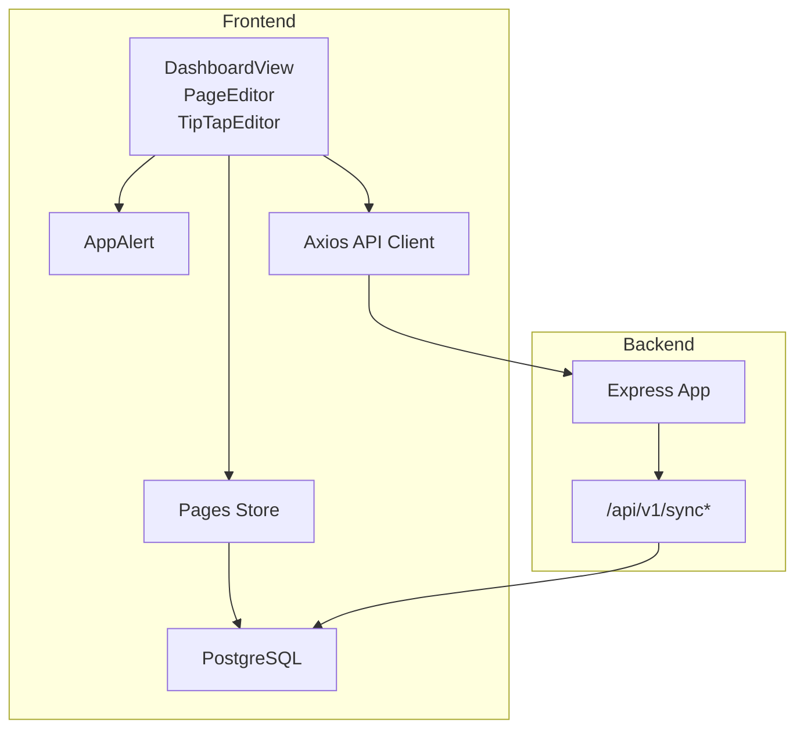
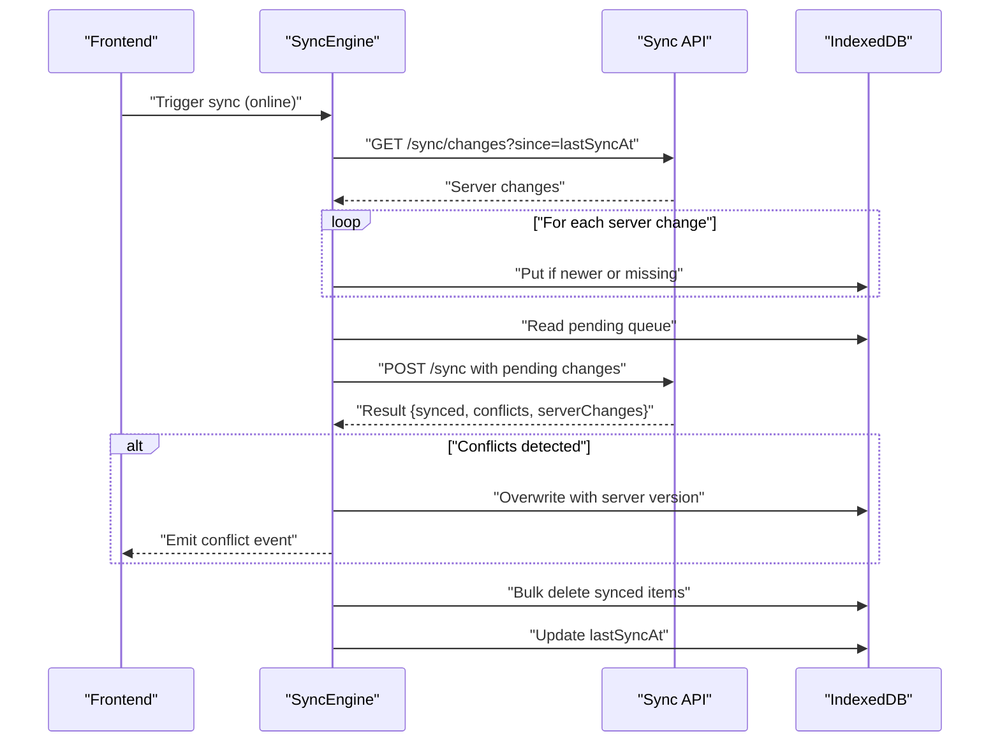
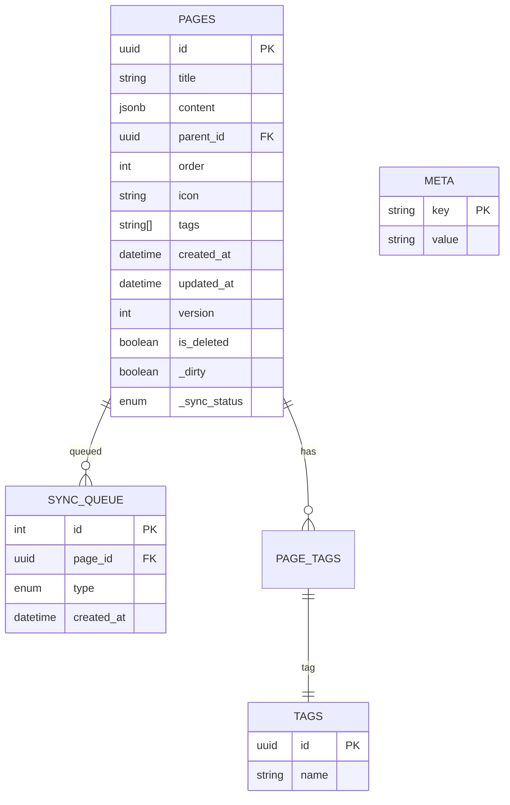
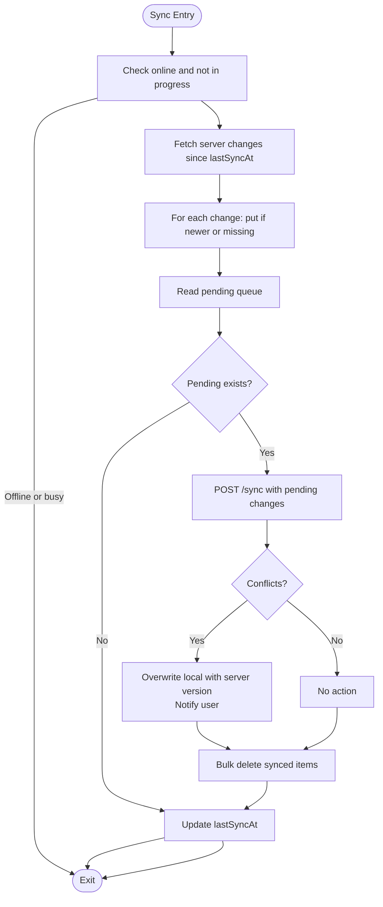
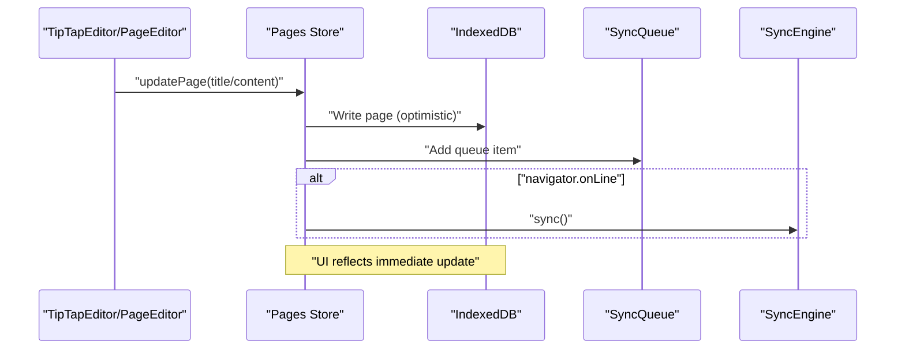
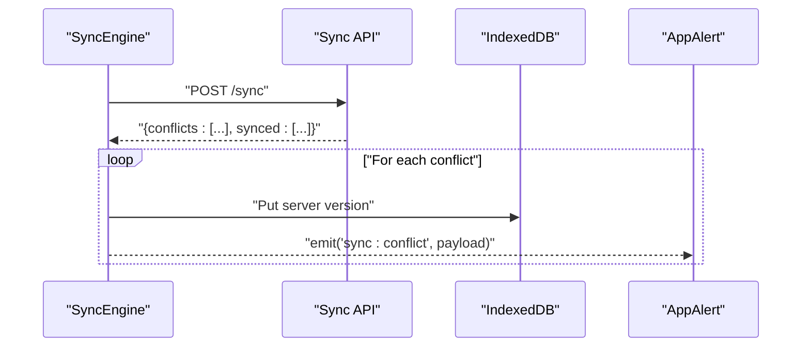
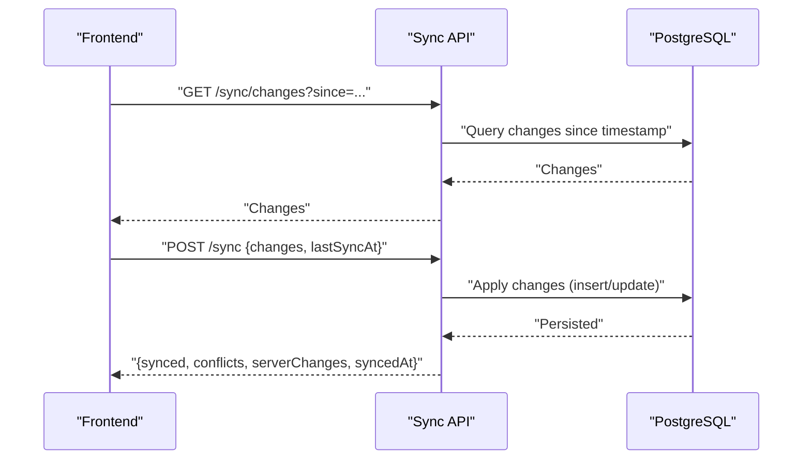
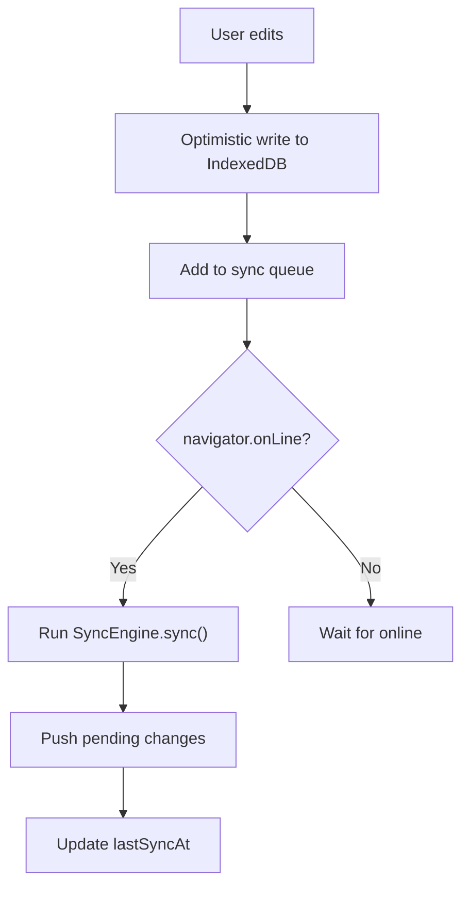
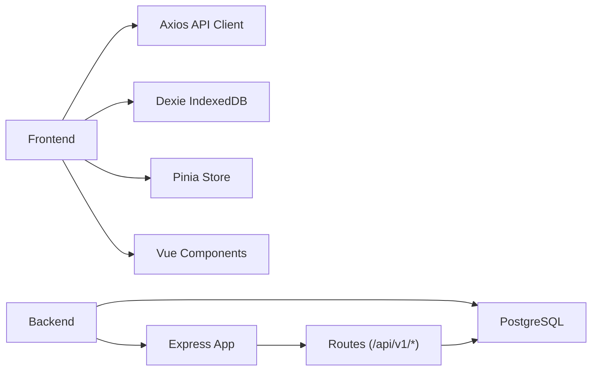

# Offline Synchronization

<cite>
**Referenced Files in This Document**
- [ARCHITECTURE.md](file://arch/ARCHITECTURE.md)
- [API-SPEC.md](file://api-spec/API-SPEC.md)
- [PRD-v1.0.md](file://prd/PRD-v1.0.md)
- [ER-DIAGRAM.md](file://db/ER-DIAGRAM.md)
- [pages.ts](file://code/client/src/stores/pages.ts)
- [api.ts](file://code/client/src/services/api.ts)
- [AppAlert.vue](file://code/client/src/components/common/AppAlert.vue)
- [DashboardView.vue](file://code/client/src/views/DashboardView.vue)
- [PageEditor.vue](file://code/client/src/components/editor/PageEditor.vue)
- [TipTapEditor.vue](file://code/client/src/components/editor/TipTapEditor.vue)
- [main.ts](file://code/client/src/main.ts)
- [app.ts](file://code/server/src/app.ts)
- [20260319_init.ts](file://code/server/src/db/migrations/20260319_init.ts)
</cite>

## Table of Contents
1. [Introduction](#introduction)
2. [Project Structure](#project-structure)
3. [Core Components](#core-components)
4. [Architecture Overview](#architecture-overview)
5. [Detailed Component Analysis](#detailed-component-analysis)
6. [Dependency Analysis](#dependency-analysis)
7. [Performance Considerations](#performance-considerations)
8. [Troubleshooting Guide](#troubleshooting-guide)
9. [Conclusion](#conclusion)
10. [Appendices](#appendices)

## Introduction
This document explains the offline-first synchronization system implemented in the project. It covers IndexedDB-backed local storage, conflict resolution strategies, sync queue management, the synchronization algorithm, data consistency mechanisms, and frontend integration with optimistic updates and automatic retries. It also documents backend sync endpoints, conflict detection and merge strategies, network connectivity detection, user notifications, and practical handling of complex scenarios such as concurrent edits, network failures, and data corruption recovery.

## Project Structure
The offline synchronization spans three layers:
- Frontend (Vue + Pinia + IndexedDB via Dexie): local state, optimistic updates, auto-save, and sync orchestration.
- Backend (Express + PostgreSQL): sync endpoints, conflict detection, and database triggers for consistency.
- Shared specs: API contract and architecture docs define the protocol and schema.

**Diagram sources**
- [DashboardView.vue:10-22](file://code/client/src/views/DashboardView.vue#L10-L22)
- [PageEditor.vue:10-49](file://code/client/src/components/editor/PageEditor.vue#L10-L49)
- [TipTapEditor.vue:13-46](file://code/client/src/components/editor/TipTapEditor.vue#L13-L46)
- [pages.ts:44-165](file://code/client/src/stores/pages.ts#L44-L165)
- [AppAlert.vue:59-93](file://code/client/src/components/common/AppAlert.vue#L59-L93)
- [api.ts:14-64](file://code/client/src/services/api.ts#L14-L64)
- [app.ts:65-121](file://code/server/src/app.ts#L65-L121)

**Section sources**
- [DashboardView.vue:10-22](file://code/client/src/views/DashboardView.vue#L10-L22)
- [PageEditor.vue:10-49](file://code/client/src/components/editor/PageEditor.vue#L10-L49)
- [TipTapEditor.vue:13-46](file://code/client/src/components/editor/TipTapEditor.vue#L13-L46)
- [pages.ts:44-165](file://code/client/src/stores/pages.ts#L44-L165)
- [AppAlert.vue:59-93](file://code/client/src/components/common/AppAlert.vue#L59-L93)
- [api.ts:14-64](file://code/client/src/services/api.ts#L14-L64)
- [app.ts:65-121](file://code/server/src/app.ts#L65-L121)

## Core Components
- IndexedDB schema and local page model with sync metadata.
- Sync engine orchestrating pull/push, conflict handling, and queue cleanup.
- Auto-save composable for optimistic updates and queue insertion.
- Frontend stores and UI components for user feedback.
- Backend sync endpoints and database schema supporting conflict detection.

Key implementation references:
- IndexedDB schema and local page model: [ARCHITECTURE.md:354-396](file://arch/ARCHITECTURE.md#L354-L396)
- Sync engine core logic: [ARCHITECTURE.md:398-469](file://arch/ARCHITECTURE.md#L398-L469)
- Auto-save flow: [ARCHITECTURE.md:471-507](file://arch/ARCHITECTURE.md#L471-L507)
- Backend sync endpoints: [API-SPEC.md:728-811](file://api-spec/API-SPEC.md#L728-L811), [PRD-v1.0.md:559-607](file://prd/PRD-v1.0.md#L559-L607)
- Database schema and triggers: [ER-DIAGRAM.md:7-78](file://db/ER-DIAGRAM.md#L7-L78), [20260319_init.ts:247-278](file://code/server/src/db/migrations/20260319_init.ts#L247-L278)

**Section sources**
- [ARCHITECTURE.md:354-507](file://arch/ARCHITECTURE.md#L354-L507)
- [API-SPEC.md:728-811](file://api-spec/API-SPEC.md#L728-L811)
- [PRD-v1.0.md:559-607](file://prd/PRD-v1.0.md#L559-L607)
- [ER-DIAGRAM.md:7-78](file://db/ER-DIAGRAM.md#L7-L78)
- [20260319_init.ts:247-278](file://code/server/src/db/migrations/20260319_init.ts#L247-L278)

## Architecture Overview
The offline-first architecture follows a pull-then-push model with Last-Writer-Wins (LWW) conflict resolution:
- Pull: Fetch server-side changes since last sync.
- Merge: Apply server changes locally using LWW on timestamps.
- Push: Send queued local changes to the server.
- Resolve: On conflicts, server version wins and user is notified.
- Cleanup: Remove synced items from the queue.
- Timestamp: Persist last successful sync time.

**Diagram sources**
- [ARCHITECTURE.md:398-469](file://arch/ARCHITECTURE.md#L398-L469)
- [API-SPEC.md:728-811](file://api-spec/API-SPEC.md#L728-L811)

**Section sources**
- [ARCHITECTURE.md:398-469](file://arch/ARCHITECTURE.md#L398-L469)
- [API-SPEC.md:728-811](file://api-spec/API-SPEC.md#L728-L811)

## Detailed Component Analysis

### IndexedDB Integration and Local Data Model
- Database schema defines tables for pages, tags, syncQueue, and meta.
- Local page model extends server-side page with local-only fields for sync status and dirty flags.
- Indexes support efficient queries by id, parent, updated time, and title.

**Diagram sources**
- [ARCHITECTURE.md:354-396](file://arch/ARCHITECTURE.md#L354-L396)
- [ER-DIAGRAM.md:7-78](file://db/ER-DIAGRAM.md#L7-L78)

**Section sources**
- [ARCHITECTURE.md:354-396](file://arch/ARCHITECTURE.md#L354-L396)
- [ER-DIAGRAM.md:7-78](file://db/ER-DIAGRAM.md#L7-L78)

### Sync Engine and Queue Management
- Maintains online/offline state and prevents concurrent sync runs.
- Pulls server changes since last sync and merges using LWW.
- Pushes pending changes from the queue and handles conflicts.
- Cleans up the queue for synced items and updates lastSyncAt.

**Diagram sources**
- [ARCHITECTURE.md:398-469](file://arch/ARCHITECTURE.md#L398-L469)

**Section sources**
- [ARCHITECTURE.md:398-469](file://arch/ARCHITECTURE.md#L398-L469)

### Auto-Save and Optimistic Updates
- Debounced auto-save writes to IndexedDB immediately and marks item as pending.
- Adds a queue item for later push.
- Triggers sync when online.
- Updates UI save status.

**Diagram sources**
- [ARCHITECTURE.md:471-507](file://arch/ARCHITECTURE.md#L471-L507)
- [PageEditor.vue:33-49](file://code/client/src/components/editor/PageEditor.vue#L33-L49)
- [TipTapEditor.vue:13-46](file://code/client/src/components/editor/TipTapEditor.vue#L13-L46)
- [pages.ts:98-104](file://code/client/src/stores/pages.ts#L98-L104)

**Section sources**
- [ARCHITECTURE.md:471-507](file://arch/ARCHITECTURE.md#L471-L507)
- [PageEditor.vue:33-49](file://code/client/src/components/editor/PageEditor.vue#L33-L49)
- [TipTapEditor.vue:13-46](file://code/client/src/components/editor/TipTapEditor.vue#L13-L46)
- [pages.ts:98-104](file://code/client/src/stores/pages.ts#L98-L104)

### Conflict Resolution and User Notifications
- Conflict resolution uses LWW: latest updatedAt wins.
- When server version is newer, overwrite local and emit a conflict event.
- AppAlert displays user-visible notifications.

**Diagram sources**
- [ARCHITECTURE.md:457-468](file://arch/ARCHITECTURE.md#L457-L468)
- [API-SPEC.md:728-772](file://api-spec/API-SPEC.md#L728-L772)
- [AppAlert.vue:59-93](file://code/client/src/components/common/AppAlert.vue#L59-L93)

**Section sources**
- [ARCHITECTURE.md:457-468](file://arch/ARCHITECTURE.md#L457-L468)
- [API-SPEC.md:728-772](file://api-spec/API-SPEC.md#L728-L772)
- [AppAlert.vue:59-93](file://code/client/src/components/common/AppAlert.vue#L59-L93)

### Backend Sync Endpoint Handling
- GET /api/v1/sync/changes?since=timestamp returns incremental changes for the user.
- POST /api/v1/sync accepts queued changes, returns synced ids, conflicts, and serverChanges.
- Conflict semantics: LWW on updatedAt; server version wins.

**Diagram sources**
- [API-SPEC.md:728-811](file://api-spec/API-SPEC.md#L728-L811)
- [PRD-v1.0.md:559-607](file://prd/PRD-v1.0.md#L559-L607)
- [app.ts:65-121](file://code/server/src/app.ts#L65-L121)

**Section sources**
- [API-SPEC.md:728-811](file://api-spec/API-SPEC.md#L728-L811)
- [PRD-v1.0.md:559-607](file://prd/PRD-v1.0.md#L559-L607)
- [app.ts:65-121](file://code/server/src/app.ts#L65-L121)

### Network Connectivity Detection and Background Sync
- Uses navigator.onLine to gate optimistic saves and trigger sync.
- On network restoration, sync is automatically triggered.
- PWA caching strategy ensures app shell remains usable offline.

**Diagram sources**
- [ARCHITECTURE.md:471-507](file://arch/ARCHITECTURE.md#L471-L507)

**Section sources**
- [ARCHITECTURE.md:471-507](file://arch/ARCHITECTURE.md#L471-L507)

## Dependency Analysis
- Frontend depends on:
  - IndexedDB (Dexie) for persistence.
  - Axios for authenticated requests.
  - Pinia store for state.
  - UI components for user feedback.
- Backend depends on:
  - Express routing and middleware.
  - PostgreSQL with migrations and triggers.
  - Logging and rate limiting middleware.

**Diagram sources**
- [api.ts:14-64](file://code/client/src/services/api.ts#L14-L64)
- [pages.ts:44-165](file://code/client/src/stores/pages.ts#L44-L165)
- [app.ts:65-121](file://code/server/src/app.ts#L65-L121)

**Section sources**
- [api.ts:14-64](file://code/client/src/services/api.ts#L14-L64)
- [pages.ts:44-165](file://code/client/src/stores/pages.ts#L44-L165)
- [app.ts:65-121](file://code/server/src/app.ts#L65-L121)

## Performance Considerations
- Debounced auto-save reduces IndexedDB writes and queue entries.
- LWW conflict resolution minimizes merge complexity.
- Bulk deletes reduce queue maintenance overhead.
- Network-first app shell improves perceived responsiveness.

[No sources needed since this section provides general guidance]

## Troubleshooting Guide
Common issues and remedies:
- Conflicts occur when multiple devices edit the same page. The system resolves by applying the server version and notifying the user.
- If sync fails mid-run, the engine prevents overlapping runs and will retry on next opportunity.
- If IndexedDB becomes inconsistent, re-syncing from server changes will reconcile differences.
- For corrupted data, re-fetch server changes and overwrite local records.

**Section sources**
- [ARCHITECTURE.md:457-468](file://arch/ARCHITECTURE.md#L457-L468)
- [API-SPEC.md:728-772](file://api-spec/API-SPEC.md#L728-L772)

## Conclusion
The offline-first synchronization system combines IndexedDB-backed local storage, a robust sync engine with LWW conflict resolution, and a clean separation of concerns between frontend and backend. It supports optimistic updates, automatic retries, and user notifications, while maintaining data consistency across devices.

[No sources needed since this section summarizes without analyzing specific files]

## Appendices

### API Endpoints and Payloads
- GET /api/v1/sync/changes?since=timestamp
  - Returns incremental changes for the user.
- POST /api/v1/sync
  - Accepts queued changes.
  - Returns synced ids, conflicts, serverChanges, and syncedAt.

**Section sources**
- [API-SPEC.md:728-811](file://api-spec/API-SPEC.md#L728-L811)
- [PRD-v1.0.md:559-607](file://prd/PRD-v1.0.md#L559-L607)

### Database Schema Notes
- Pages table includes content as JSONB, versioning, soft-delete flags, and timestamps.
- Triggers update updated_at on row changes.
- Sync log table captures sync events for auditing.

**Section sources**
- [ER-DIAGRAM.md:7-78](file://db/ER-DIAGRAM.md#L7-L78)
- [20260319_init.ts:247-278](file://code/server/src/db/migrations/20260319_init.ts#L247-L278)