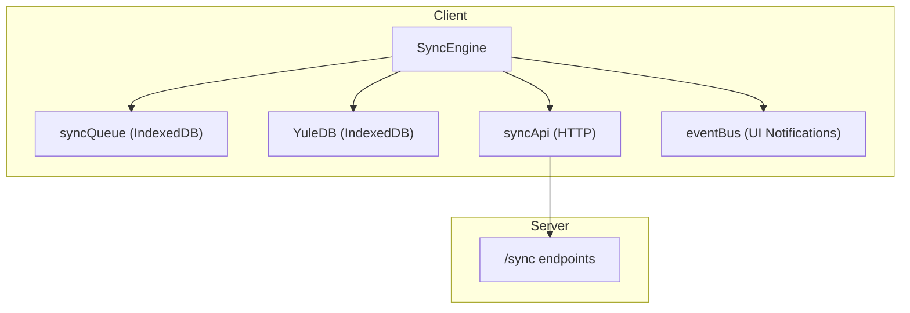
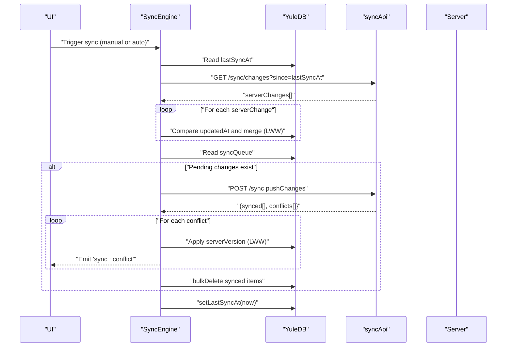
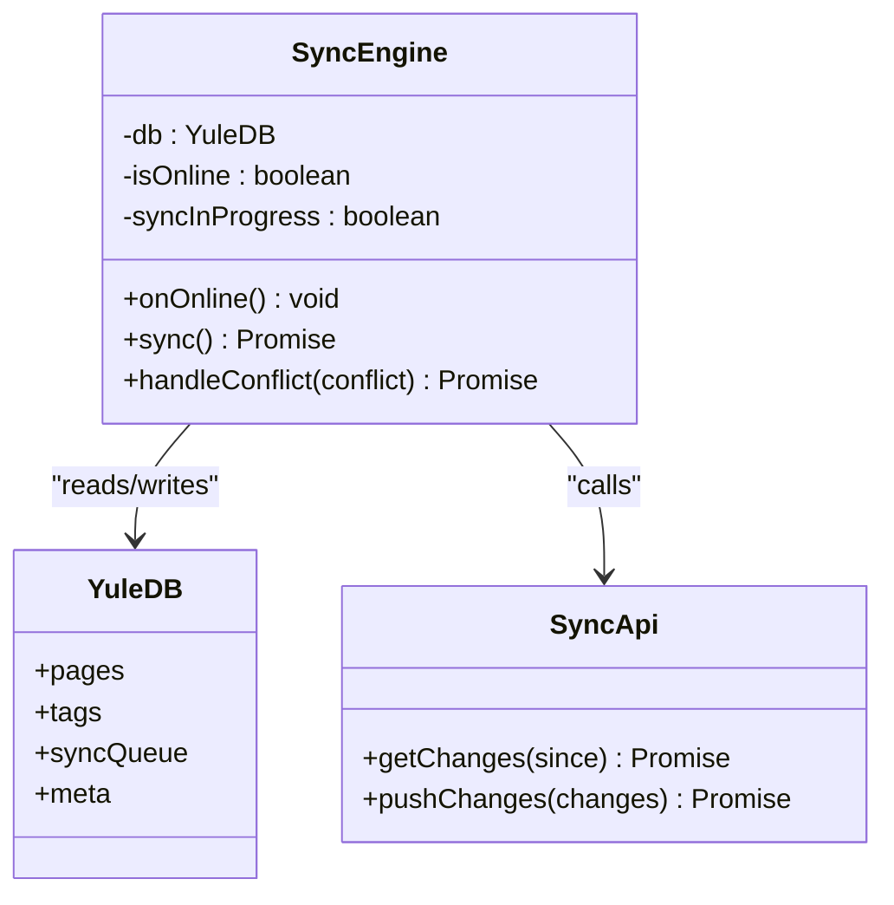
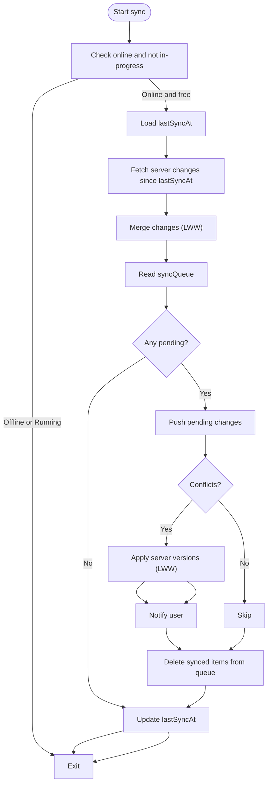
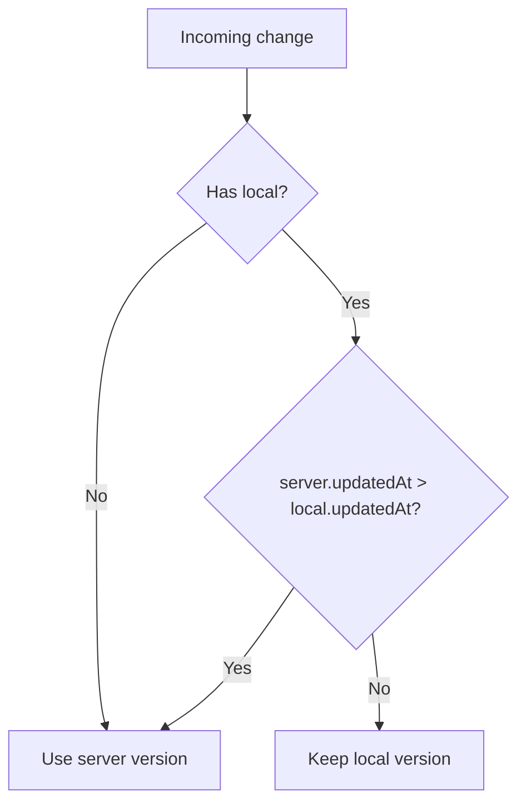
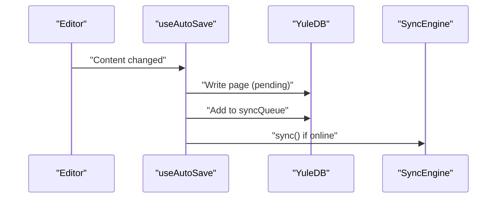
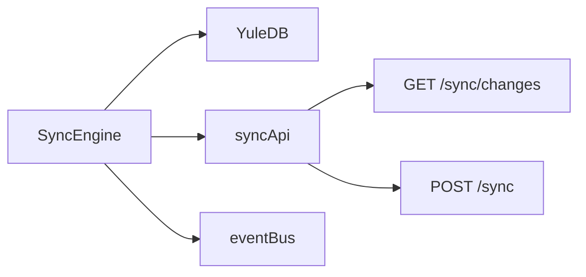

# Sync Engine Core

<cite>
**Referenced Files in This Document**
- [ARCHITECTURE.md](file://arch/ARCHITECTURE.md)
- [API-SPEC.md](file://api-spec/API-SPEC.md)
</cite>

## Table of Contents
1. [Introduction](#introduction)
2. [Project Structure](#project-structure)
3. [Core Components](#core-components)
4. [Architecture Overview](#architecture-overview)
5. [Detailed Component Analysis](#detailed-component-analysis)
6. [Dependency Analysis](#dependency-analysis)
7. [Performance Considerations](#performance-considerations)
8. [Troubleshooting Guide](#troubleshooting-guide)
9. [Conclusion](#conclusion)

## Introduction
This document explains the core synchronization engine for offline-first editing. It covers the SyncEngine class architecture, network detection, sync scheduling, state management, and the end-to-end sync workflow. It also documents the Last-Write-Wins (LWW) conflict resolution strategy, automatic triggers on network events, and practical guidance for initiating sync, tracking progress, handling errors, preventing concurrent runs, retries, and graceful degradation.

## Project Structure
The synchronization engine is part of the client-side architecture and integrates with IndexedDB (via Dexie), a local sync queue, and the server’s sync endpoints. The engine coordinates:
- Detecting online/offline state
- Scheduling and executing sync
- Applying server-side changes locally (LWW)
- Pushing queued local changes to the server
- Resolving conflicts and updating sync metadata

**Diagram sources**
- [ARCHITECTURE.md:398-469](file://arch/ARCHITECTURE.md#L398-L469)
- [ARCHITECTURE.md:354-374](file://arch/ARCHITECTURE.md#L354-L374)
- [API-SPEC.md:728-782](file://api-spec/API-SPEC.md#L728-L782)

**Section sources**
- [ARCHITECTURE.md:311-352](file://arch/ARCHITECTURE.md#L311-L352)
- [ARCHITECTURE.md:354-374](file://arch/ARCHITECTURE.md#L354-L374)

## Core Components
- SyncEngine: orchestrates sync lifecycle, network-aware scheduling, concurrency control, and conflict handling.
- IndexedDB (YuleDB): stores pages, tags, syncQueue, and metadata.
- syncApi: HTTP client wrapper for server sync endpoints.
- eventBus: emits UI notifications for conflict events.

Key responsibilities:
- Network detection: uses browser online/offline signals.
- Sync scheduling: triggers immediately upon network recovery and optionally on timers.
- State management: tracks online state and prevents concurrent sync runs.
- Conflict resolution: applies LWW and notifies users.

**Section sources**
- [ARCHITECTURE.md:398-469](file://arch/ARCHITECTURE.md#L398-L469)
- [ARCHITECTURE.md:354-374](file://arch/ARCHITECTURE.md#L354-L374)

## Architecture Overview
The sync engine follows an incremental, timestamp-based model with LWW conflict resolution. It merges server changes into local storage and pushes queued changes to the server, then cleans up the queue and updates the last-sync timestamp.

**Diagram sources**
- [ARCHITECTURE.md:398-469](file://arch/ARCHITECTURE.md#L398-L469)
- [API-SPEC.md:728-782](file://api-spec/API-SPEC.md#L728-L782)

## Detailed Component Analysis

### SyncEngine Class
Responsibilities:
- Track online/offline state and prevent concurrent runs.
- Fetch server-side changes since last successful sync.
- Merge server changes locally using LWW.
- Push pending changes from the local queue to the server.
- Resolve conflicts via LWW and notify the UI.
- Clean up the sync queue and update the last-sync timestamp.

Concurrency control:
- Prevents overlapping sync runs by setting an internal flag during execution.

Network-aware scheduling:
- Triggers sync automatically when online.
- Optionally triggered by periodic timers or manual actions.

Conflict handling:
- Applies server versions to local pages.
- Emits a UI event to inform users of conflicts.

**Diagram sources**
- [ARCHITECTURE.md:398-469](file://arch/ARCHITECTURE.md#L398-L469)
- [ARCHITECTURE.md:354-374](file://arch/ARCHITECTURE.md#L354-L374)

**Section sources**
- [ARCHITECTURE.md:398-469](file://arch/ARCHITECTURE.md#L398-L469)

### Sync Workflow: Steps and Logic
1. Detect changes
   - Read lastSyncAt from metadata.
   - Request server changes since that timestamp.

2. Apply server updates (LWW)
   - For each server change, fetch the current local page.
   - If missing or newer, write the server version locally.
   - Otherwise, keep local and expect server to push it later.

3. Push local changes
   - Read pending changes from syncQueue.
   - Send to server; receive synced page IDs and conflicts.

4. Handle conflicts (LWW)
   - For each conflict, apply the server version to local storage.
   - Emit a UI notification.

5. Cleanup and finalize
   - Delete synced items from syncQueue.
   - Update lastSyncAt to now.

**Diagram sources**
- [ARCHITECTURE.md:398-469](file://arch/ARCHITECTURE.md#L398-L469)

**Section sources**
- [ARCHITECTURE.md:398-469](file://arch/ARCHITECTURE.md#L398-L469)

### Last-Write-Wins (LWW) Strategy
- Comparison basis: compare updatedAt timestamps.
- Resolution:
  - If server updatedAt > local updatedAt, server wins.
  - If equal or local newer, keep local.
- Server response contract:
  - Conflicts include localVersion, serverVersion, and serverPage.
  - Resolution field indicates server_wins when applicable.

**Diagram sources**
- [ARCHITECTURE.md:398-469](file://arch/ARCHITECTURE.md#L398-L469)
- [API-SPEC.md:728-782](file://api-spec/API-SPEC.md#L728-L782)

**Section sources**
- [API-SPEC.md:728-782](file://api-spec/API-SPEC.md#L728-L782)

### Sync Scheduler and Automatic Triggers
- Network recovery: onOnline() triggers immediate sync.
- Auto-save integration: when content changes, after a debounce, the engine writes to IndexedDB and queues a sync; if online, it calls sync().

**Diagram sources**
- [ARCHITECTURE.md:471-507](file://arch/ARCHITECTURE.md#L471-L507)

**Section sources**
- [ARCHITECTURE.md:471-507](file://arch/ARCHITECTURE.md#L471-L507)

## Dependency Analysis
- SyncEngine depends on:
  - YuleDB for persistence (pages, tags, syncQueue, meta).
  - syncApi for server communication.
  - eventBus for UI notifications.
- Server endpoints:
  - GET /api/v1/sync/changes?since=timestamp
  - POST /api/v1/sync

**Diagram sources**
- [ARCHITECTURE.md:398-469](file://arch/ARCHITECTURE.md#L398-L469)
- [API-SPEC.md:728-782](file://api-spec/API-SPEC.md#L728-L782)

**Section sources**
- [API-SPEC.md:728-782](file://api-spec/API-SPEC.md#L728-L782)

## Performance Considerations
- Debounce local edits to batch IndexedDB writes and reduce queue entries.
- Process server changes in a single pass per sync cycle to minimize DB transactions.
- Use updatedAt comparisons for O(1) conflict decisions per item.
- Keep syncQueue bounded by cleaning up after successful sync.

## Troubleshooting Guide
Common issues and remedies:
- Concurrent sync runs
  - Symptom: skipped runs while a sync is in progress.
  - Cause: syncInProgress guard.
  - Action: avoid manual triggers while a sync is running; rely on automatic scheduling.

- Offline scenarios
  - Symptom: edits accumulate in syncQueue; no immediate server sync.
  - Cause: isOnline flag false.
  - Action: wait for onLine; onOnline() will trigger sync.

- Conflicts
  - Symptom: user receives a “sync:conflict” notification.
  - Cause: server updatedAt newer than local.
  - Action: engine applies server version; user sees update.

- Stuck syncQueue
  - Symptom: pending changes never cleared.
  - Cause: server push failures or partial responses.
  - Action: inspect server response fields synced[] and conflicts[]; re-run sync; ensure network stability.

- Timestamp drift
  - Symptom: unexpected merge behavior.
  - Cause: clock differences between client and server.
  - Action: rely on updatedAt timestamps; ensure consistent time sources.

**Section sources**
- [ARCHITECTURE.md:398-469](file://arch/ARCHITECTURE.md#L398-L469)

## Conclusion
The SyncEngine implements a robust, offline-first synchronization strategy centered on incremental changes and LWW conflict resolution. It integrates tightly with IndexedDB, a dedicated sync queue, and server endpoints to deliver reliable data consistency across devices. The design emphasizes simplicity, concurrency safety, and user transparency through conflict notifications.