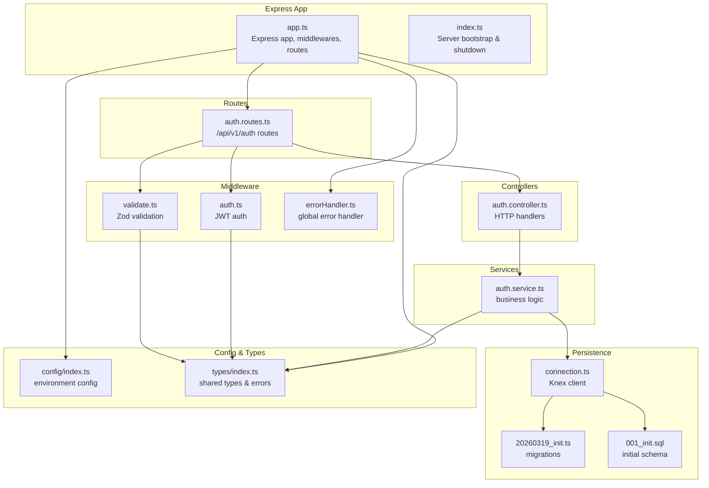
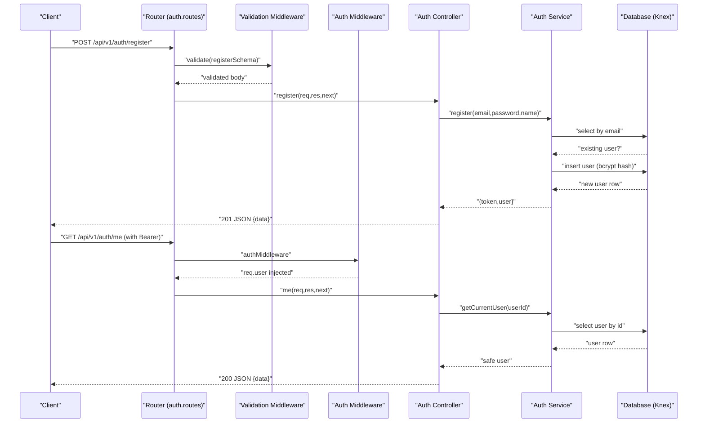
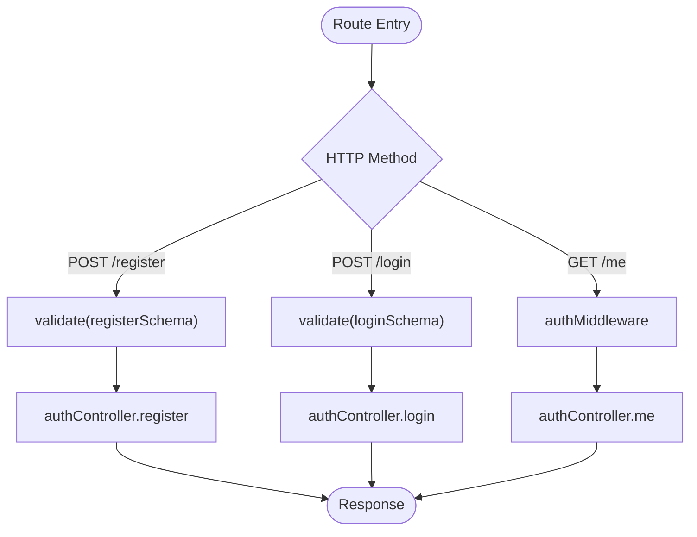
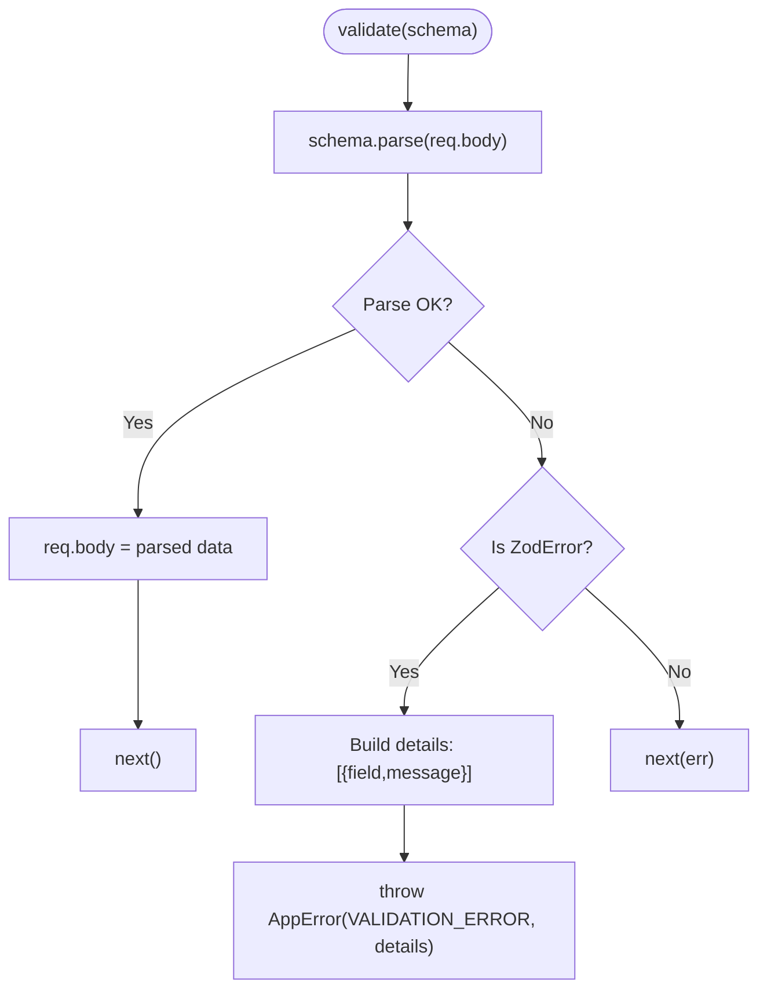
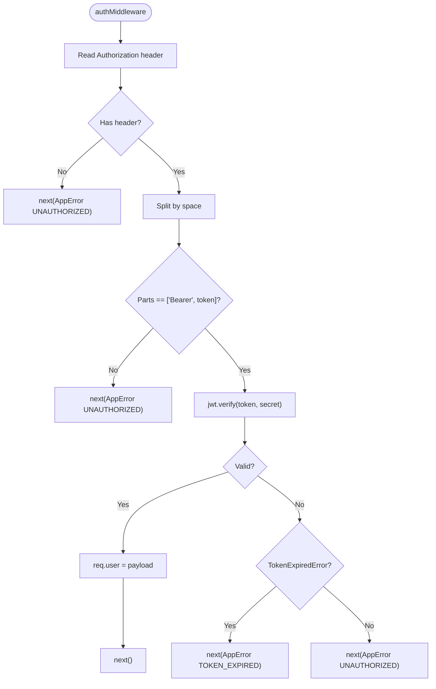
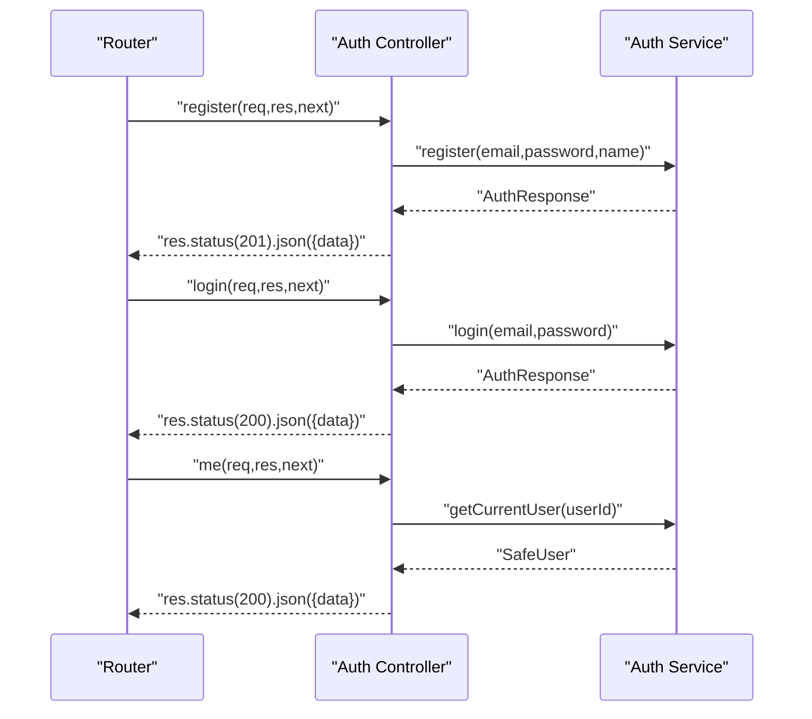
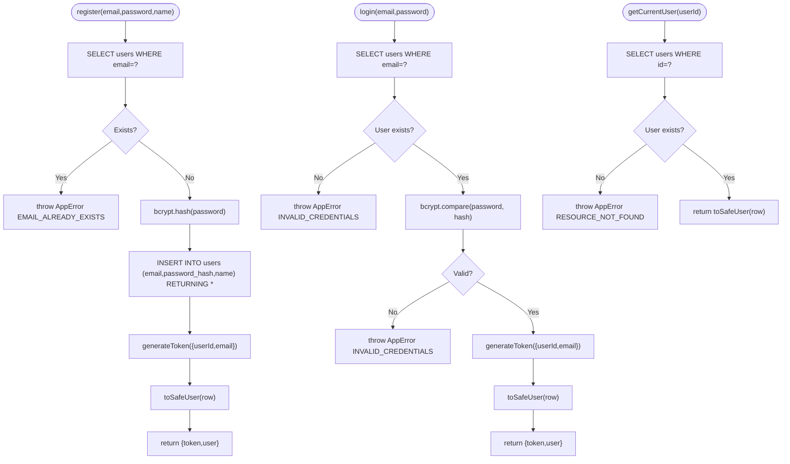
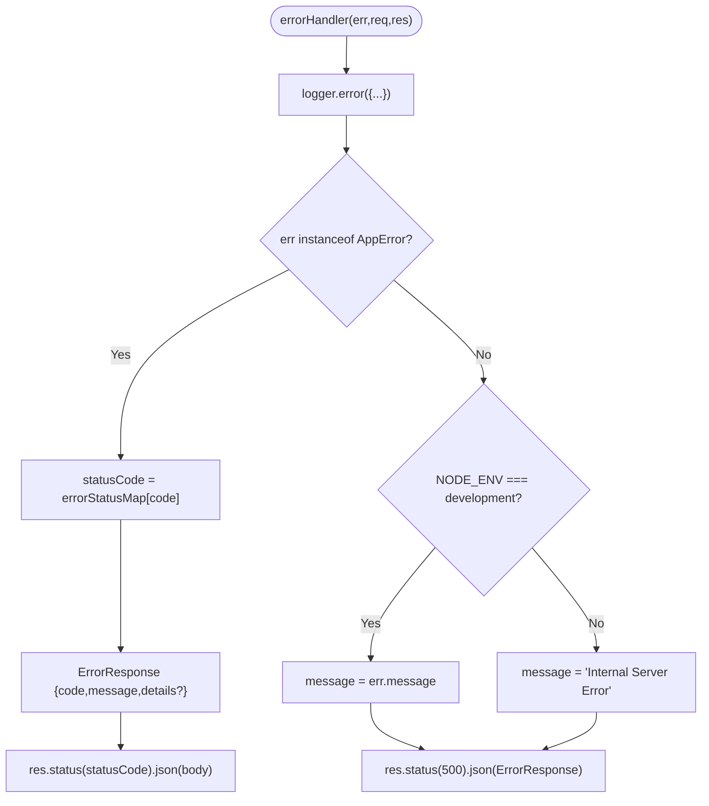
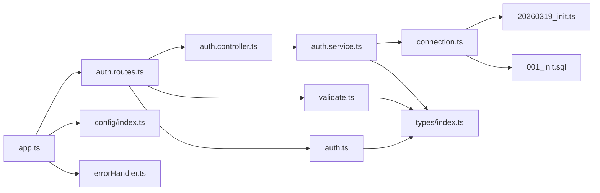

# Backend Page Controller

<cite>
**Referenced Files in This Document**
- [app.ts](file://code/server/src/app.ts)
- [index.ts](file://code/server/src/index.ts)
- [auth.routes.ts](file://code/server/src/routes/auth.routes.ts)
- [auth.controller.ts](file://code/server/src/controllers/auth.controller.ts)
- [auth.service.ts](file://code/server/src/services/auth.service.ts)
- [auth.middleware.ts](file://code/server/src/middleware/auth.ts)
- [validate.middleware.ts](file://code/server/src/middleware/validate.ts)
- [error.handler.ts](file://code/server/src/middleware/errorHandler.ts)
- [connection.ts](file://code/server/src/db/connection.ts)
- [config.index.ts](file://code/server/src/config/index.ts)
- [types.index.ts](file://code/server/src/types/index.ts)
- [20260319_init.ts](file://code/server/src/db/migrations/20260319_init.ts)
- [001_init.sql](file://db/001_init.sql)
</cite>

## Table of Contents
1. [Introduction](#introduction)
2. [Project Structure](#project-structure)
3. [Core Components](#core-components)
4. [Architecture Overview](#architecture-overview)
5. [Detailed Component Analysis](#detailed-component-analysis)
6. [Dependency Analysis](#dependency-analysis)
7. [Performance Considerations](#performance-considerations)
8. [Troubleshooting Guide](#troubleshooting-guide)
9. [Conclusion](#conclusion)
10. [Appendices](#appendices)

## Introduction
This document explains the backend architecture for authentication and page-related operations in the Yule Notion project. It focuses on the controller-layer implementation, service-layer business logic, middleware integration (validation and authentication), database interactions, and error handling. It also documents request validation, response formatting, and operational patterns that apply to CRUD-like flows for pages, including soft deletion, ordering, and optimistic concurrency via versioning.

Where applicable, this document references the actual source files and highlights how routes, controllers, services, and middleware collaborate to implement secure, robust, and maintainable backend APIs.

## Project Structure
The backend is organized around a layered architecture:
- Routes define endpoints and compose middleware.
- Controllers handle HTTP concerns (request parsing, response formatting).
- Services encapsulate business logic and database operations.
- Middleware enforces validation and authentication.
- Database layer uses Knex with PostgreSQL and migrations for schema management.
- Configuration and shared types unify behavior across modules.



**Diagram sources**
- [app.ts:1-121](file://code/server/src/app.ts#L1-L121)
- [index.ts:1-77](file://code/server/src/index.ts#L1-L77)
- [auth.routes.ts:1-106](file://code/server/src/routes/auth.routes.ts#L1-L106)
- [auth.controller.ts:1-82](file://code/server/src/controllers/auth.controller.ts#L1-L82)
- [auth.service.ts:1-166](file://code/server/src/services/auth.service.ts#L1-L166)
- [auth.middleware.ts:1-60](file://code/server/src/middleware/auth.ts#L1-L60)
- [validate.middleware.ts:1-72](file://code/server/src/middleware/validate.ts#L1-L72)
- [error.handler.ts:1-68](file://code/server/src/middleware/errorHandler.ts#L1-L68)
- [connection.ts:1-40](file://code/server/src/db/connection.ts#L1-L40)
- [20260319_init.ts:32-290](file://code/server/src/db/migrations/20260319_init.ts#L32-L290)
- [001_init.sql:33-253](file://db/001_init.sql#L33-L253)
- [config.index.ts:1-101](file://code/server/src/config/index.ts#L1-L101)
- [types.index.ts:1-187](file://code/server/src/types/index.ts#L1-L187)

**Section sources**
- [app.ts:1-121](file://code/server/src/app.ts#L1-L121)
- [index.ts:1-77](file://code/server/src/index.ts#L1-L77)
- [auth.routes.ts:1-106](file://code/server/src/routes/auth.routes.ts#L1-L106)
- [auth.controller.ts:1-82](file://code/server/src/controllers/auth.controller.ts#L1-L82)
- [auth.service.ts:1-166](file://code/server/src/services/auth.service.ts#L1-L166)
- [auth.middleware.ts:1-60](file://code/server/src/middleware/auth.ts#L1-L60)
- [validate.middleware.ts:1-72](file://code/server/src/middleware/validate.ts#L1-L72)
- [error.handler.ts:1-68](file://code/server/src/middleware/errorHandler.ts#L1-L68)
- [connection.ts:1-40](file://code/server/src/db/connection.ts#L1-L40)
- [config.index.ts:1-101](file://code/server/src/config/index.ts#L1-L101)
- [types.index.ts:1-187](file://code/server/src/types/index.ts#L1-L187)
- [20260319_init.ts:32-290](file://code/server/src/db/migrations/20260319_init.ts#L32-L290)
- [001_init.sql:33-253](file://db/001_init.sql#L33-L253)

## Core Components
- Route layer: Defines endpoints under /api/v1/auth and composes validation and auth middleware.
- Controller layer: Handles HTTP concerns, extracts request data, invokes service methods, and formats responses.
- Service layer: Implements business logic, performs database operations, and transforms data for safe API output.
- Middleware: Provides Zod-based request validation and JWT-based authentication.
- Database: Uses Knex with PostgreSQL, migrations, and indexes optimized for page queries.
- Configuration and types: Centralized environment configuration and shared types/enums for errors and payloads.

Key responsibilities:
- Validation: Strict request body validation using Zod schemas.
- Authentication: Bearer token verification and user identity injection.
- Business logic: Registration, login, current user retrieval, password hashing, JWT generation.
- Persistence: Knex queries against users and pages tables with indexes and constraints.
- Error handling: Unified error responses and logging.

**Section sources**
- [auth.routes.ts:1-106](file://code/server/src/routes/auth.routes.ts#L1-L106)
- [auth.controller.ts:1-82](file://code/server/src/controllers/auth.controller.ts#L1-L82)
- [auth.service.ts:1-166](file://code/server/src/services/auth.service.ts#L1-L166)
- [auth.middleware.ts:1-60](file://code/server/src/middleware/auth.ts#L1-L60)
- [validate.middleware.ts:1-72](file://code/server/src/middleware/validate.ts#L1-L72)
- [connection.ts:1-40](file://code/server/src/db/connection.ts#L1-L40)
- [types.index.ts:1-187](file://code/server/src/types/index.ts#L1-L187)

## Architecture Overview
The system follows a clean architecture with clear separation of concerns:
- Routes define the contract and compose middleware.
- Controllers focus on HTTP specifics.
- Services encapsulate domain logic and persistence.
- Middleware handles cross-cutting concerns (validation, auth).
- Database schema and migrations define data contracts and indexes.



**Diagram sources**
- [auth.routes.ts:72-102](file://code/server/src/routes/auth.routes.ts#L72-L102)
- [validate.middleware.ts:31-71](file://code/server/src/middleware/validate.ts#L31-L71)
- [auth.middleware.ts:29-59](file://code/server/src/middleware/auth.ts#L29-L59)
- [auth.controller.ts:26-81](file://code/server/src/controllers/auth.controller.ts#L26-L81)
- [auth.service.ts:68-165](file://code/server/src/services/auth.service.ts#L68-L165)
- [connection.ts:22-29](file://code/server/src/db/connection.ts#L22-L29)

## Detailed Component Analysis

### Authentication Routes
- Defines three endpoints under /api/v1/auth:
  - POST /register: No auth required; validates request body using Zod schema.
  - POST /login: No auth required; validates request body using Zod schema.
  - GET /me: Requires Bearer token; injects user identity into request.
- Composes middleware in order: validation → controller.
- Uses a dedicated router factory for modularity.



**Diagram sources**
- [auth.routes.ts:72-102](file://code/server/src/routes/auth.routes.ts#L72-L102)

**Section sources**
- [auth.routes.ts:1-106](file://code/server/src/routes/auth.routes.ts#L1-L106)

### Validation Middleware (Zod)
- Factory function creates a reusable validator that:
  - Parses and validates req.body with the provided Zod schema.
  - On success, replaces req.body with validated data and continues.
  - On failure, constructs a structured error with field-level details and passes it to the error handler.



**Diagram sources**
- [validate.middleware.ts:31-71](file://code/server/src/middleware/validate.ts#L31-L71)

**Section sources**
- [validate.middleware.ts:1-72](file://code/server/src/middleware/validate.ts#L1-L72)

### Authentication Middleware (JWT)
- Extracts Authorization header, verifies Bearer token format, and decodes JWT using the configured secret.
- Injects user identity (userId, email) into req.user for downstream controllers.
- Returns standardized errors for missing/expired/invalid tokens.



**Diagram sources**
- [auth.middleware.ts:29-59](file://code/server/src/middleware/auth.ts#L29-L59)

**Section sources**
- [auth.middleware.ts:1-60](file://code/server/src/middleware/auth.ts#L1-L60)

### Authentication Controller
- register: Extracts email/password/name, delegates to service, responds with 201 and { data: result }.
- login: Extracts email/password, delegates to service, responds with 200 and { data: result }.
- me: Uses req.user injected by auth middleware, delegates to service, responds with 200 and { data: user }.



**Diagram sources**
- [auth.controller.ts:26-81](file://code/server/src/controllers/auth.controller.ts#L26-L81)
- [auth.service.ts:68-165](file://code/server/src/services/auth.service.ts#L68-L165)

**Section sources**
- [auth.controller.ts:1-82](file://code/server/src/controllers/auth.controller.ts#L1-L82)

### Authentication Service
- register:
  - Checks for existing user by email.
  - Hashes password with bcrypt.
  - Inserts user record returning the new row.
  - Generates JWT and returns { token, user: SafeUser }.
- login:
  - Finds user by email (with password_hash).
  - Compares password; throws standardized error on mismatch.
  - Generates JWT and returns { token, user: SafeUser }.
- getCurrentUser:
  - Loads user by id and returns SafeUser; throws if not found.



**Diagram sources**
- [auth.service.ts:68-165](file://code/server/src/services/auth.service.ts#L68-L165)

**Section sources**
- [auth.service.ts:1-166](file://code/server/src/services/auth.service.ts#L1-L166)

### Database Interactions and Indexing
- Users table: Unique email, timestamps, and indexes for efficient lookups.
- Pages table: UUID primary key, foreign keys, JSONB content, ordering, soft delete, versioning, and multiple indexes for user-scoped queries and full-text search.
- Migrations define constraints, indexes, triggers, and comments for clarity and performance.
- Knex connection pool manages connections efficiently.

```mermaid
erDiagram
USERS {
uuid id PK
string email UK
string password_hash
string name
timestamptz created_at
timestamptz updated_at
}
PAGES {
uuid id PK
uuid user_id FK
string title
jsonb content
uuid parent_id FK
int "order"
string icon
boolean is_deleted
timestamptz deleted_at
int version
timestamptz created_at
timestamptz updated_at
tsvector search_vector
}
USERS ||--o{ PAGES : "owns"
```

**Diagram sources**
- [20260319_init.ts:46-101](file://code/server/src/db/migrations/20260319_init.ts#L46-L101)
- [001_init.sql:36-55](file://db/001_init.sql#L36-L55)

**Section sources**
- [connection.ts:1-40](file://code/server/src/db/connection.ts#L1-L40)
- [20260319_init.ts:32-290](file://code/server/src/db/migrations/20260319_init.ts#L32-L290)
- [001_init.sql:33-253](file://db/001_init.sql#L33-L253)

### Global Error Handling
- Logs errors with request metadata.
- Converts AppError instances to structured JSON with appropriate HTTP status.
- For unknown errors, returns 500 with environment-aware messages.



**Diagram sources**
- [error.handler.ts:29-67](file://code/server/src/middleware/errorHandler.ts#L29-L67)

**Section sources**
- [error.handler.ts:1-68](file://code/server/src/middleware/errorHandler.ts#L1-L68)

### Configuration and Environment
- Environment variables are parsed and validated using Zod, with defaults for local development.
- Production requires strict security settings (JWT secret length and allowed origins).
- Configuration is centralized and consumed by app, middleware, and services.

**Section sources**
- [config.index.ts:1-101](file://code/server/src/config/index.ts#L1-L101)

### Types and Error Codes
- Shared types for requests, responses, JWT payloads, and safe user output.
- Comprehensive error codes mapped to HTTP status codes for consistent responses.

**Section sources**
- [types.index.ts:1-187](file://code/server/src/types/index.ts#L1-L187)

## Dependency Analysis
- Routes depend on validation and auth middleware and controllers.
- Controllers depend on services.
- Services depend on database connection and types.
- Middleware depends on configuration and types.
- App depends on routes, middleware, and configuration.



**Diagram sources**
- [app.ts:17-120](file://code/server/src/app.ts#L17-L120)
- [auth.routes.ts:10-14](file://code/server/src/routes/auth.routes.ts#L10-L14)
- [auth.controller.ts:13-15](file://code/server/src/controllers/auth.controller.ts#L13-L15)
- [auth.service.ts:12-17](file://code/server/src/services/auth.service.ts#L12-L17)
- [auth.middleware.ts:10-14](file://code/server/src/middleware/auth.ts#L10-L14)
- [validate.middleware.ts:11-13](file://code/server/src/middleware/validate.ts#L11-L13)
- [error.handler.ts:13-16](file://code/server/src/middleware/errorHandler.ts#L13-L16)
- [connection.ts:8-29](file://code/server/src/db/connection.ts#L8-L29)
- [config.index.ts:8-44](file://code/server/src/config/index.ts#L8-L44)
- [types.index.ts:153-186](file://code/server/src/types/index.ts#L153-L186)

**Section sources**
- [app.ts:1-121](file://code/server/src/app.ts#L1-L121)
- [auth.routes.ts:1-106](file://code/server/src/routes/auth.routes.ts#L1-L106)
- [auth.controller.ts:1-82](file://code/server/src/controllers/auth.controller.ts#L1-L82)
- [auth.service.ts:1-166](file://code/server/src/services/auth.service.ts#L1-L166)
- [auth.middleware.ts:1-60](file://code/server/src/middleware/auth.ts#L1-L60)
- [validate.middleware.ts:1-72](file://code/server/src/middleware/validate.ts#L1-L72)
- [error.handler.ts:1-68](file://code/server/src/middleware/errorHandler.ts#L1-L68)
- [connection.ts:1-40](file://code/server/src/db/connection.ts#L1-L40)
- [config.index.ts:1-101](file://code/server/src/config/index.ts#L1-L101)
- [types.index.ts:1-187](file://code/server/src/types/index.ts#L1-L187)

## Performance Considerations
- Database pooling: Knex pool configured with min/max connections to balance resource usage.
- Indexes: Pages table includes composite indexes for user-scoped queries, ordering, and full-text search to optimize reads.
- Constraints: Check constraints on order and version fields ensure data integrity and support optimistic concurrency.
- JSONB storage: Content stored as JSONB with GIN index supports efficient querying and updates.
- JWT overhead: Stateless verification avoids session storage but still requires signature verification per request.

[No sources needed since this section provides general guidance]

## Troubleshooting Guide
Common issues and resolutions:
- Validation failures: Ensure request bodies match Zod schemas; check field-level details returned in the error payload.
- Authentication failures: Confirm Authorization header format and validity; verify JWT secret and expiration.
- Resource not found: For GET /me or page operations, confirm the user exists and the token corresponds to the intended user.
- Rate limiting: Exceeded limits return a structured error; adjust client retry behavior.
- Internal errors: Review server logs for stack traces; in production, generic messages are returned to clients.

**Section sources**
- [validate.middleware.ts:51-68](file://code/server/src/middleware/validate.ts#L51-L68)
- [auth.middleware.ts:33-58](file://code/server/src/middleware/auth.ts#L33-L58)
- [error.handler.ts:38-66](file://code/server/src/middleware/errorHandler.ts#L38-L66)

## Conclusion
The backend employs a clean, modular architecture with explicit separation between routing, controllers, services, and middleware. Validation and authentication are enforced consistently, while the service layer encapsulates business logic and database interactions. The database schema and migrations provide strong indexing and constraints suited to page-centric operations. Together, these components deliver a secure, maintainable foundation for CRUD-like page operations, including soft deletion, ordering, and optimistic concurrency.

[No sources needed since this section summarizes without analyzing specific files]

## Appendices

### API Endpoint Definitions
- POST /api/v1/auth/register
  - Validation: Zod schema for email, password, name.
  - Response: 201 with { data: { token, user: SafeUser } }.
- POST /api/v1/auth/login
  - Validation: Zod schema for email, password.
  - Response: 200 with { data: { token, user: SafeUser } }.
- GET /api/v1/auth/me
  - Authentication: Bearer token required.
  - Response: 200 with { data: SafeUser }.

**Section sources**
- [auth.routes.ts:72-102](file://code/server/src/routes/auth.routes.ts#L72-L102)
- [auth.controller.ts:26-81](file://code/server/src/controllers/auth.controller.ts#L26-L81)
- [auth.service.ts:68-165](file://code/server/src/services/auth.service.ts#L68-L165)

### Response Formatting Patterns
- Success responses: { data: ... } with appropriate HTTP status.
- Error responses: { error: { code, message, details? } } with mapped status codes.

**Section sources**
- [auth.controller.ts:30-77](file://code/server/src/controllers/auth.controller.ts#L30-L77)
- [error.handler.ts:41-53](file://code/server/src/middleware/errorHandler.ts#L41-L53)
- [types.index.ts:139-145](file://code/server/src/types/index.ts#L139-L145)

### Data Transformation Patterns
- toSafeUser: Converts database rows to API-safe output, removing sensitive fields and normalizing date serialization.
- JWT payload: Carries userId and email; generated upon successful registration/login.

**Section sources**
- [auth.service.ts:29-38](file://code/server/src/services/auth.service.ts#L29-L38)
- [auth.service.ts:93-99](file://code/server/src/services/auth.service.ts#L93-L99)
- [auth.service.ts:135-142](file://code/server/src/services/auth.service.ts#L135-L142)

### Transaction Handling
- Current implementation does not wrap operations in explicit transactions. For multi-step writes (e.g., creating a page with associated tags), introduce transaction blocks to ensure atomicity.

[No sources needed since this section provides general guidance]

### Authorization and Data Sanitization
- Authorization: Bearer token required for protected endpoints; user identity injected into request.
- Data sanitization: Zod validation ensures shape and constraints; toSafeUser removes sensitive fields before response.

**Section sources**
- [auth.middleware.ts:29-59](file://code/server/src/middleware/auth.ts#L29-L59)
- [validate.middleware.ts:44-69](file://code/server/src/middleware/validate.ts#L44-L69)
- [auth.service.ts:29-38](file://code/server/src/services/auth.service.ts#L29-L38)