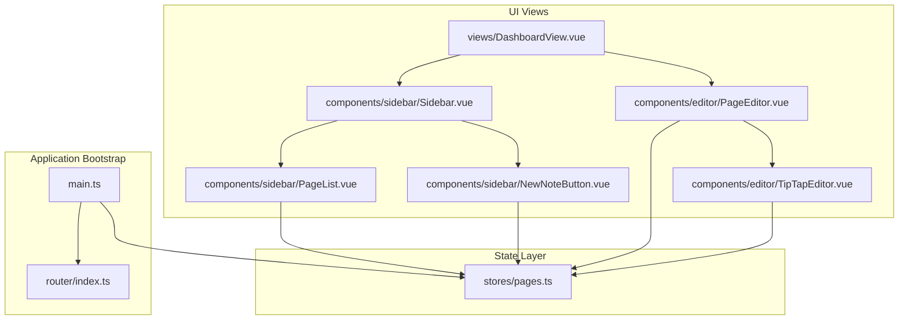
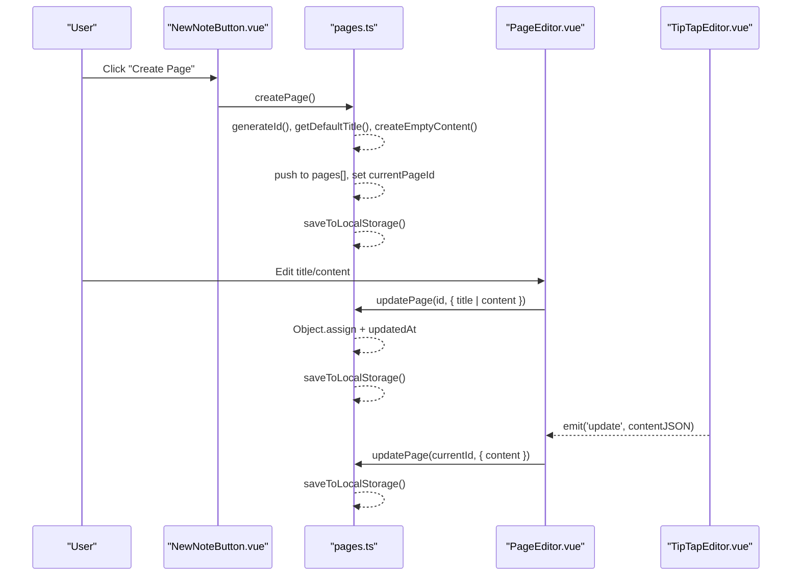
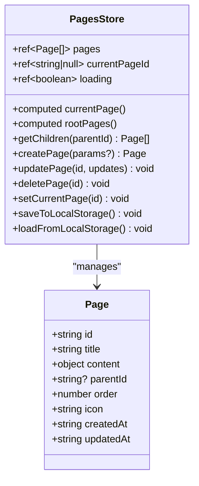
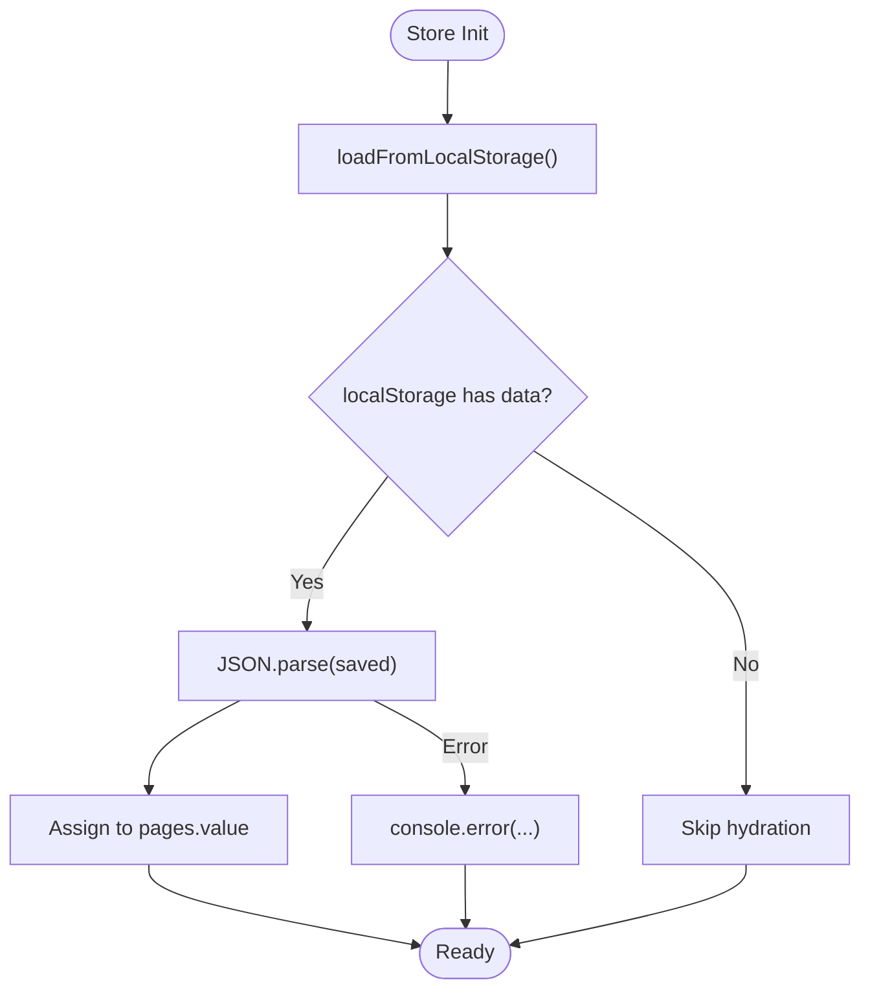
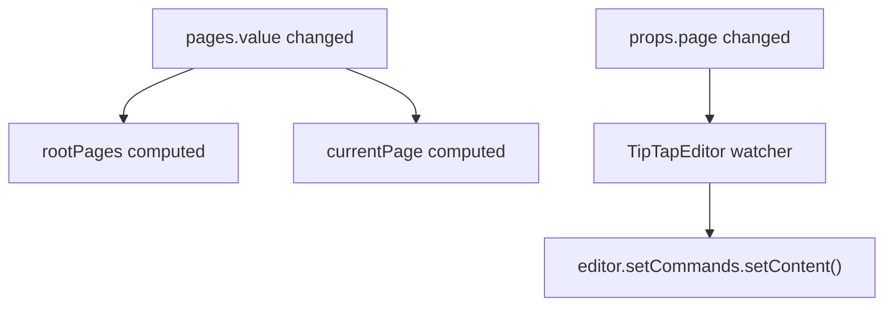
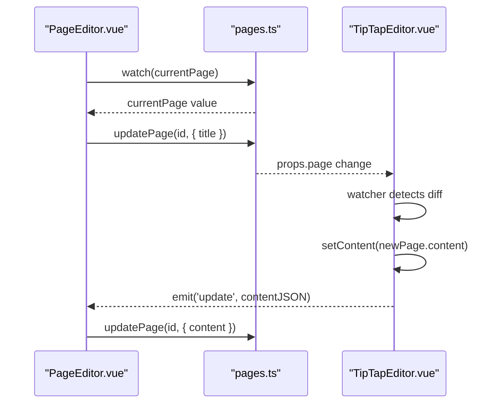
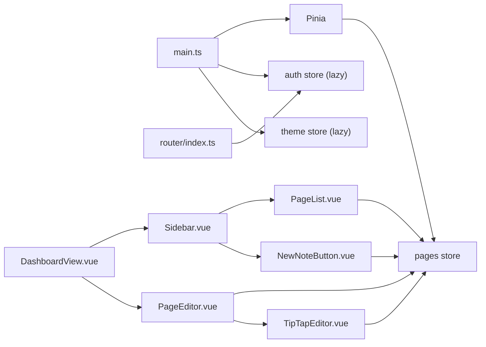

# Frontend State Management

<cite>
**Referenced Files in This Document**
- [pages.ts](file://code/client/src/stores/pages.ts)
- [index.ts](file://code/client/src/router/index.ts)
- [main.ts](file://code/client/src/main.ts)
- [DashboardView.vue](file://code/client/src/views/DashboardView.vue)
- [Sidebar.vue](file://code/client/src/components/sidebar/Sidebar.vue)
- [PageList.vue](file://code/client/src/components/sidebar/PageList.vue)
- [NewNoteButton.vue](file://code/client/src/components/sidebar/NewNoteButton.vue)
- [PageEditor.vue](file://code/client/src/components/editor/PageEditor.vue)
- [TipTapEditor.vue](file://code/client/src/components/editor/TipTapEditor.vue)
- [index.ts](file://code/client/src/types/index.ts)
</cite>

## Table of Contents
1. [Introduction](#introduction)
2. [Project Structure](#project-structure)
3. [Core Components](#core-components)
4. [Architecture Overview](#architecture-overview)
5. [Detailed Component Analysis](#detailed-component-analysis)
6. [Dependency Analysis](#dependency-analysis)
7. [Performance Considerations](#performance-considerations)
8. [Troubleshooting Guide](#troubleshooting-guide)
9. [Conclusion](#conclusion)

## Introduction
This document explains the frontend page state management system built with Pinia. It covers the pages store implementation, including state properties, getters, and actions. It documents local storage persistence, ID generation, default content creation, reactive data flow, computed properties, and synchronization patterns with the TipTap editor. It also provides usage examples in components, integration patterns, performance considerations, memory management, and state hydration during application startup.

## Project Structure
The state management is centered around a single Pinia store module that manages page data, current selection, and loading state. Components integrate with the store to render lists, edit titles, and synchronize content with the TipTap editor.

**Diagram sources**
- [main.ts:1-54](file://code/client/src/main.ts#L1-L54)
- [index.ts:1-93](file://code/client/src/router/index.ts#L1-L93)
- [pages.ts:44-165](file://code/client/src/stores/pages.ts#L44-L165)
- [DashboardView.vue:10-32](file://code/client/src/views/DashboardView.vue#L10-L32)
- [Sidebar.vue:11-24](file://code/client/src/components/sidebar/Sidebar.vue#L11-L24)
- [PageList.vue:10-32](file://code/client/src/components/sidebar/PageList.vue#L10-L32)
- [NewNoteButton.vue:10-41](file://code/client/src/components/sidebar/NewNoteButton.vue#L10-L41)
- [PageEditor.vue:10-64](file://code/client/src/components/editor/PageEditor.vue#L10-L64)
- [TipTapEditor.vue:13-50](file://code/client/src/components/editor/TipTapEditor.vue#L13-L50)

**Section sources**
- [main.ts:1-54](file://code/client/src/main.ts#L1-L54)
- [index.ts:1-93](file://code/client/src/router/index.ts#L1-L93)
- [DashboardView.vue:10-32](file://code/client/src/views/DashboardView.vue#L10-L32)

## Core Components
- Pinia store module for pages: defines state, getters, and actions; persists to local storage; hydrates on startup.
- Dashboard view composes the sidebar and editor areas.
- Sidebar provides navigation and controls for pages.
- Page list renders root pages and reflects the current selection.
- New note button triggers creation of a new page.
- Page editor handles title editing and delegates content updates to the store.
- TipTap editor synchronizes content with the current page and emits updates.

**Section sources**
- [pages.ts:44-165](file://code/client/src/stores/pages.ts#L44-L165)
- [DashboardView.vue:10-32](file://code/client/src/views/DashboardView.vue#L10-L32)
- [Sidebar.vue:11-24](file://code/client/src/components/sidebar/Sidebar.vue#L11-L24)
- [PageList.vue:10-32](file://code/client/src/components/sidebar/PageList.vue#L10-L32)
- [NewNoteButton.vue:10-41](file://code/client/src/components/sidebar/NewNoteButton.vue#L10-L41)
- [PageEditor.vue:10-64](file://code/client/src/components/editor/PageEditor.vue#L10-L64)
- [TipTapEditor.vue:13-50](file://code/client/src/components/editor/TipTapEditor.vue#L13-L50)

## Architecture Overview
The pages store encapsulates all page-related state and exposes reactive getters and actions. Components subscribe to store state via refs and computed properties. Changes propagate through actions and persist automatically to local storage. The TipTap editor reads the current page content and emits updates that are written back to the store.

**Diagram sources**
- [NewNoteButton.vue:19-21](file://code/client/src/components/sidebar/NewNoteButton.vue#L19-L21)
- [pages.ts:73-93](file://code/client/src/stores/pages.ts#L73-L93)
- [pages.ts:98-104](file://code/client/src/stores/pages.ts#L98-L104)
- [pages.ts:130-132](file://code/client/src/stores/pages.ts#L130-L132)
- [PageEditor.vue:33-49](file://code/client/src/components/editor/PageEditor.vue#L33-L49)
- [TipTapEditor.vue:177-180](file://code/client/src/components/editor/TipTapEditor.vue#L177-L180)

## Detailed Component Analysis

### Pages Store (Pinia)
The pages store defines:
- State: pages array, currentPageId, loading flag.
- Getters: currentPage (by id), rootPages (no parent), getChildren(parentId).
- Actions: createPage, updatePage, deletePage, setCurrentPage, save/load helpers.

Key behaviors:
- ID generation uses a hybrid base-36 timestamp plus random suffix.
- Default titles include a localized timestamp.
- Default content is a minimal TipTap doc with a paragraph.
- Persistence uses localStorage with JSON serialization.
- Hydration occurs on store initialization by loading from localStorage.

**Diagram sources**
- [pages.ts:44-165](file://code/client/src/stores/pages.ts#L44-L165)
- [index.ts:72-101](file://code/client/src/types/index.ts#L72-L101)

**Section sources**
- [pages.ts:44-165](file://code/client/src/stores/pages.ts#L44-L165)
- [index.ts:72-101](file://code/client/src/types/index.ts#L72-L101)

### Local Storage Persistence
- Save: After create/update/delete, the store writes the pages array to localStorage under a fixed key.
- Load: On store initialization, the store attempts to parse and hydrate pages from localStorage.
- Error handling: Parsing failures are caught and logged.

**Diagram sources**
- [pages.ts:137-146](file://code/client/src/stores/pages.ts#L137-L146)

**Section sources**
- [pages.ts:130-146](file://code/client/src/stores/pages.ts#L130-L146)

### ID Generation Strategy
- Uses a timestamp in base-36 concatenated with a random string segment.
- Designed to be short, URL-safe, and collision-resistant for typical usage.

**Section sources**
- [pages.ts:17-19](file://code/client/src/stores/pages.ts#L17-L19)

### Default Content Creation
- Empty content conforms to TipTap’s doc/paragraph structure.
- Ensures the editor initializes with a valid, empty paragraph.

**Section sources**
- [pages.ts:32-42](file://code/client/src/stores/pages.ts#L32-L42)

### Reactive Data Flow and Computed Properties
- currentPage getter derives the selected page from pages by id.
- rootPages filters and sorts pages with no parentId.
- getChildren filters and sorts children by order.
- Components reactively observe currentPage and rootPages via computed properties.

**Diagram sources**
- [pages.ts:54-67](file://code/client/src/stores/pages.ts#L54-L67)
- [TipTapEditor.vue:301-308](file://code/client/src/components/editor/TipTapEditor.vue#L301-L308)

**Section sources**
- [pages.ts:54-67](file://code/client/src/stores/pages.ts#L54-L67)
- [TipTapEditor.vue:301-308](file://code/client/src/components/editor/TipTapEditor.vue#L301-L308)

### State Synchronization Patterns
- Two-way binding:
  - PageEditor watches currentPage to keep editingTitle in sync.
  - TipTapEditor watches props.page to keep editor content in sync.
- One-way updates:
  - PageEditor writes title changes to the store.
  - TipTapEditor emits content updates to PageEditor, which writes to the store.

**Diagram sources**
- [PageEditor.vue:23-28](file://code/client/src/components/editor/PageEditor.vue#L23-L28)
- [PageEditor.vue:33-49](file://code/client/src/components/editor/PageEditor.vue#L33-L49)
- [TipTapEditor.vue:177-180](file://code/client/src/components/editor/TipTapEditor.vue#L177-L180)
- [TipTapEditor.vue:301-308](file://code/client/src/components/editor/TipTapEditor.vue#L301-L308)

**Section sources**
- [PageEditor.vue:23-49](file://code/client/src/components/editor/PageEditor.vue#L23-L49)
- [TipTapEditor.vue:177-180](file://code/client/src/components/editor/TipTapEditor.vue#L177-L180)
- [TipTapEditor.vue:301-308](file://code/client/src/components/editor/TipTapEditor.vue#L301-L308)

### Store Usage Examples in Components
- Creating a new page:
  - NewNoteButton invokes the store’s createPage action.
- Selecting a page:
  - PageList calls setCurrentPage with the clicked page id.
- Editing title:
  - PageEditor watches currentPage and writes updates via updatePage.
- Editing content:
  - TipTapEditor emits content JSON; PageEditor forwards it to updatePage.

**Section sources**
- [NewNoteButton.vue:19-21](file://code/client/src/components/sidebar/NewNoteButton.vue#L19-L21)
- [PageList.vue:18-20](file://code/client/src/components/sidebar/PageList.vue#L18-L20)
- [PageEditor.vue:33-49](file://code/client/src/components/editor/PageEditor.vue#L33-L49)
- [TipTapEditor.vue:177-180](file://code/client/src/components/editor/TipTapEditor.vue#L177-L180)

## Dependency Analysis
- Initialization order:
  - main.ts installs Pinia, then initializes auth and theme stores.
  - pages store hydrates from localStorage upon creation.
- Routing:
  - router guards depend on auth store; pages store is independent of routing.
- UI composition:
  - DashboardView composes Sidebar and PageEditor.
  - Sidebar composes PageList and NewNoteButton.
  - PageEditor depends on pages store and TipTapEditor.

**Diagram sources**
- [main.ts:26-28](file://code/client/src/main.ts#L26-L28)
- [index.ts:68-90](file://code/client/src/router/index.ts#L68-L90)
- [DashboardView.vue:10-22](file://code/client/src/views/DashboardView.vue#L10-L22)
- [Sidebar.vue:11-24](file://code/client/src/components/sidebar/Sidebar.vue#L11-L24)
- [PageList.vue:10-32](file://code/client/src/components/sidebar/PageList.vue#L10-L32)
- [NewNoteButton.vue:10-41](file://code/client/src/components/sidebar/NewNoteButton.vue#L10-L41)
- [PageEditor.vue:10-64](file://code/client/src/components/editor/PageEditor.vue#L10-L64)
- [TipTapEditor.vue:13-50](file://code/client/src/components/editor/TipTapEditor.vue#L13-L50)

**Section sources**
- [main.ts:26-28](file://code/client/src/main.ts#L26-L28)
- [index.ts:68-90](file://code/client/src/router/index.ts#L68-L90)
- [DashboardView.vue:10-22](file://code/client/src/views/DashboardView.vue#L10-L22)

## Performance Considerations
- Re-render minimization:
  - Prefer computed getters (rootPages, currentPage) to avoid recomputing derived state in templates.
  - Use watchers judiciously; deep watchers on large content should be avoided unless necessary.
- Memory management:
  - Large content payloads increase memory footprint; consider lazy-loading heavy pages or deferring updates.
  - Avoid frequent reassigns; batch updates via updatePage with a single payload.
- Persistence overhead:
  - Persist after bulk operations to reduce write frequency.
- Rendering cost:
  - TipTap editor can be expensive; ensure setContent is only called when content differs.
- Hydration:
  - Initial load parses localStorage; defer heavy operations until after hydration completes.

[No sources needed since this section provides general guidance]

## Troubleshooting Guide
- Pages not loading after refresh:
  - Verify localStorage key exists and contains valid JSON.
  - Check parsing errors in console.
- Current page not updating:
  - Ensure setCurrentPage is called with a valid id present in pages.
  - Confirm currentPage getter finds the page by id.
- Content not syncing:
  - Ensure TipTapEditor receives a valid page and emits updates.
  - Verify PageEditor forwards emitted content to updatePage.

**Section sources**
- [pages.ts:137-146](file://code/client/src/stores/pages.ts#L137-L146)
- [TipTapEditor.vue:301-308](file://code/client/src/components/editor/TipTapEditor.vue#L301-L308)

## Conclusion
The pages store provides a focused, reactive foundation for managing Notion-like pages. It offers straightforward actions for CRUD operations, computed getters for derived state, and automatic persistence to localStorage. Components integrate seamlessly through Pinia subscriptions and two-way synchronization with the TipTap editor. Following the recommended patterns ensures predictable state updates, efficient rendering, and robust hydration.