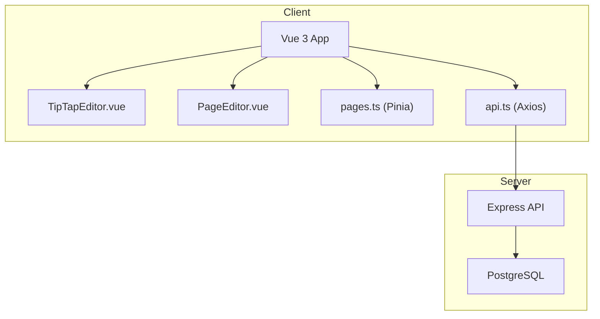
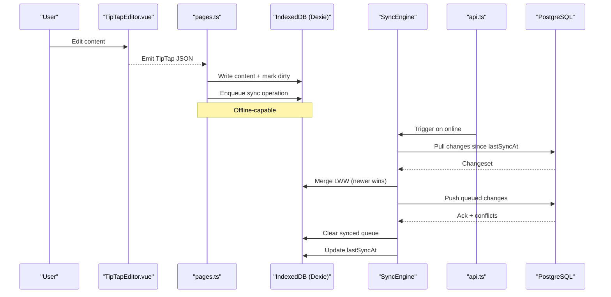
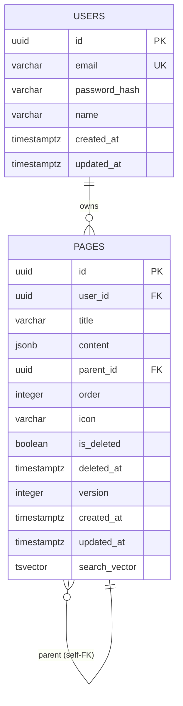
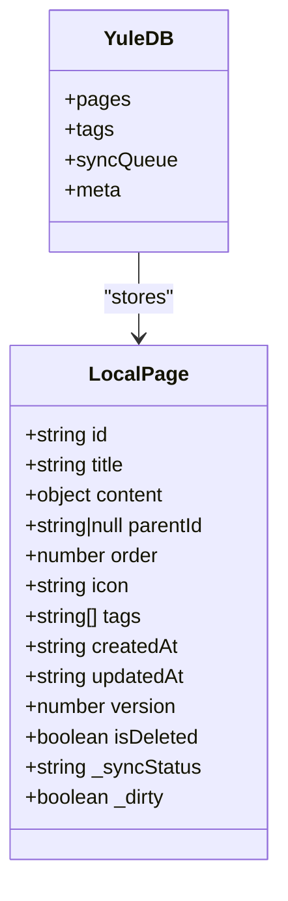
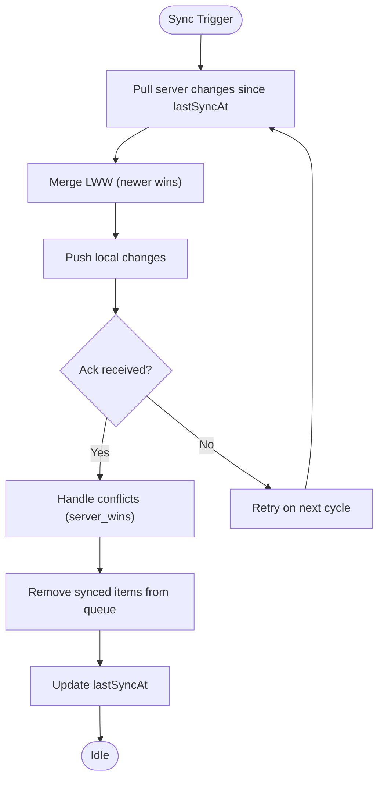
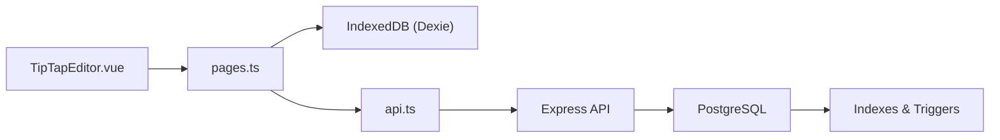

# Page Content Storage

<cite>
**Referenced Files in This Document**
- [001_init.sql](file://db/001_init.sql)
- [ER-DIAGRAM.md](file://db/ER-DIAGRAM.md)
- [ARCHITECTURE.md](file://arch/ARCHITECTURE.md)
- [API-SPEC.md](file://api-spec/API-SPEC.md)
- [PageEditor.vue](file://code/client/src/components/editor/PageEditor.vue)
- [TipTapEditor.vue](file://code/client/src/components/editor/TipTapEditor.vue)
- [pages.ts](file://code/client/src/stores/pages.ts)
- [index.ts](file://code/client/src/types/index.ts)
- [api.ts](file://code/client/src/services/api.ts)
- [README.md](file://README.md)
</cite>

## Table of Contents
1. [Introduction](#introduction)
2. [Project Structure](#project-structure)
3. [Core Components](#core-components)
4. [Architecture Overview](#architecture-overview)
5. [Detailed Component Analysis](#detailed-component-analysis)
6. [Dependency Analysis](#dependency-analysis)
7. [Performance Considerations](#performance-considerations)
8. [Troubleshooting Guide](#troubleshooting-guide)
9. [Conclusion](#conclusion)
10. [Appendices](#appendices)

## Introduction
This document explains how page content is stored, serialized, validated, and synchronized in the system. It covers:
- TipTap JSON content format and serialization
- Database schema design for storing page content
- Local storage implementation for offline functionality
- IndexedDB integration and synchronization mechanisms
- Validation, sanitization, and security considerations
- Migration, backup, and integrity checks
- Hybrid storage combining local and remote storage
- Conflict resolution for concurrent edits
- Performance optimization for large content volumes

## Project Structure
The system separates concerns across three layers:
- Frontend (Vue 3 + TipTap) handles authoring, local persistence, and offline synchronization
- Backend (Node.js + Express + PostgreSQL) persists structured data and provides APIs
- Shared data model uses TipTap JSON stored as JSONB for flexible content while maintaining relational integrity for metadata

**Diagram sources**
- [TipTapEditor.vue:112-194](file://code/client/src/components/editor/TipTapEditor.vue#L112-L194)
- [PageEditor.vue:10-49](file://code/client/src/components/editor/PageEditor.vue#L10-L49)
- [pages.ts:44-164](file://code/client/src/stores/pages.ts#L44-L164)
- [api.ts:15-63](file://code/client/src/services/api.ts#L15-L63)
- [API-SPEC.md:181-200](file://api-spec/API-SPEC.md#L181-L200)
- [001_init.sql:36-55](file://db/001_init.sql#L36-L55)

**Section sources**
- [README.md:23-41](file://README.md#L23-L41)
- [ARCHITECTURE.md:164-236](file://arch/ARCHITECTURE.md#L164-L236)

## Core Components
- TipTap JSON content: The editor emits a JSON structure representing blocks, marks, and text nodes. This is the canonical content format.
- Local persistence: The client writes TipTap JSON into IndexedDB via a dedicated schema and maintains a sync queue for offline changes.
- Remote persistence: The server stores page metadata and TipTap JSON in PostgreSQL’s JSONB column, with full-text search support and optimistic locking via a version field.
- Synchronization engine: Implements incremental sync with Last-Write-Wins (LWW) conflict resolution and audit logging.

**Section sources**
- [TipTapEditor.vue:177-180](file://code/client/src/components/editor/TipTapEditor.vue#L177-L180)
- [PageEditor.vue:45-49](file://code/client/src/components/editor/PageEditor.vue#L45-L49)
- [pages.ts:129-146](file://code/client/src/stores/pages.ts#L129-L146)
- [001_init.sql:36-55](file://db/001_init.sql#L36-L55)
- [ARCHITECTURE.md:354-468](file://arch/ARCHITECTURE.md#L354-L468)

## Architecture Overview
The system supports offline-first editing with automatic synchronization:
- Authoring occurs in the browser using TipTap; content is emitted as JSON.
- Local IndexedDB stores TipTap JSON plus metadata and a sync queue.
- On network availability, the sync engine pulls server-side changes and pushes local changes.
- Conflicts are resolved using LWW based on timestamps.

**Diagram sources**
- [TipTapEditor.vue:177-180](file://code/client/src/components/editor/TipTapEditor.vue#L177-L180)
- [pages.ts:129-146](file://code/client/src/stores/pages.ts#L129-L146)
- [ARCHITECTURE.md:398-468](file://arch/ARCHITECTURE.md#L398-L468)
- [api.ts:15-63](file://code/client/src/services/api.ts#L15-L63)
- [001_init.sql:36-55](file://db/001_init.sql#L36-L55)

## Detailed Component Analysis

### TipTap JSON Content Format and Serialization
- The editor emits TipTap JSON representing documents, blocks, and marks. The frontend stores this as-is in both local IndexedDB and remote PostgreSQL.
- The server schema defines the pages.content column as JSONB with a default empty document structure, ensuring compatibility with TipTap’s doc/content shape.
- The frontend also provides a helper to create an initial empty content structure aligned with TipTap’s expected format.

Key behaviors:
- Emission: The editor’s onUpdate handler emits TipTap JSON to the parent component.
- Persistence: The parent component forwards the JSON to the pages store, which persists it locally and enqueues a sync operation.
- Default content: A default empty TipTap doc is generated for new pages.

**Section sources**
- [TipTapEditor.vue:177-180](file://code/client/src/components/editor/TipTapEditor.vue#L177-L180)
- [PageEditor.vue:45-49](file://code/client/src/components/editor/PageEditor.vue#L45-L49)
- [pages.ts:32-42](file://code/client/src/stores/pages.ts#L32-L42)
- [001_init.sql:40-40](file://db/001_init.sql#L40-L40)

### Database Schema Design for Page Content
- Table: pages
  - Columns: id, user_id (FK), title, content (JSONB), parent_id (self-FK), order, icon, is_deleted, deleted_at, version, created_at, updated_at, search_vector (TSVECTOR)
  - Constraints: CHECK on order and version; soft-delete with deletion timestamp
  - Indexes: user-centric B-tree and conditional filters; GIN on search_vector and content; JSONB path_ops index for content queries
- Full-text search: A trigger extracts text from TipTap JSON content and title to populate search_vector with weighted relevance
- Versioning: A version integer enables optimistic concurrency checks during synchronization

**Diagram sources**
- [001_init.sql:14-76](file://db/001_init.sql#L14-L76)
- [ER-DIAGRAM.md:9-78](file://db/ER-DIAGRAM.md#L9-L78)

**Section sources**
- [001_init.sql:36-76](file://db/001_init.sql#L36-L76)
- [ER-DIAGRAM.md:94-125](file://db/ER-DIAGRAM.md#L94-L125)

### Local Storage Implementation for Offline Functionality
- IndexedDB schema (via Dexie):
  - pages: stores TipTap JSON content, metadata, version, deletion flag, and local-only fields for sync status and dirty flag
  - syncQueue: records pending create/update/delete operations
  - tags and meta: auxiliary tables for tags and key-value metadata
- Automatic save:
  - A composable watches content changes and debounces writes to IndexedDB, marking entries as pending and enqueueing sync operations
- Offline-first UX:
  - The UI remains responsive while changes are persisted locally and queued for later sync

**Diagram sources**
- [ARCHITECTURE.md:354-396](file://arch/ARCHITECTURE.md#L354-L396)

**Section sources**
- [ARCHITECTURE.md:354-396](file://arch/ARCHITECTURE.md#L354-L396)
- [ARCHITECTURE.md:471-506](file://arch/ARCHITECTURE.md#L471-L506)

### IndexedDB Integration and Synchronization Mechanisms
- Sync engine:
  - Pulls server changes since lastSyncAt
  - Merges using LWW (compare updatedAt)
  - Pushes local changes via a batch endpoint
  - Handles conflicts by overwriting local with server version and notifying the user
  - Updates lastSyncAt after successful completion
- Audit trail:
  - Optional sync_log table captures push/pull actions, types, versions, and outcomes for debugging

**Diagram sources**
- [ARCHITECTURE.md:398-468](file://arch/ARCHITECTURE.md#L398-L468)
- [001_init.sql:137-153](file://db/001_init.sql#L137-L153)

**Section sources**
- [ARCHITECTURE.md:398-468](file://arch/ARCHITECTURE.md#L398-L468)
- [001_init.sql:137-153](file://db/001_init.sql#L137-L153)

### Content Validation, Sanitization, and Security Considerations
- Validation:
  - Frontend: Emits TipTap JSON; ensure only TipTap-compatible structures are accepted
  - Backend: Pages content is stored as JSONB; maintain TipTap schema compatibility
- Sanitization:
  - TipTap JSON is treated as trusted authoring output; avoid re-parsing or transforming arbitrary JSON
  - For external imports, validate against TipTap schema before persisting
- Security:
  - Authentication: Bearer token via Authorization header
  - CORS: Configured per environment
  - Rate limiting and helmet applied at the server
  - Password hashing with bcrypt and secure JWT secret enforcement

**Section sources**
- [API-SPEC.md:10-24](file://api-spec/API-SPEC.md#L10-L24)
- [api.ts:30-41](file://code/client/src/services/api.ts#L30-L41)
- [ARCHITECTURE.md:121-134](file://arch/ARCHITECTURE.md#L121-L134)

### Examples: Content Migration, Backup Strategies, and Integrity Checks
- Content migration:
  - If TipTap schema evolves, introduce a migration step that transforms existing JSONB content to the new shape before persisting
  - Maintain backward compatibility by accepting older shapes during a transition period
- Backup strategies:
  - Database backups: Regular logical dumps of PostgreSQL for pages.content and related tables
  - Local backups: Periodic exports of IndexedDB content for user recovery
- Integrity checks:
  - Verify TipTap JSON validity before insert/update
  - Use PostgreSQL CHECK constraints and triggers to enforce data quality
  - Monitor sync_log for unexpected conflicts or missing acknowledgments

[No sources needed since this section provides general guidance]

### Hybrid Storage Approach and Conflict Resolution
- Hybrid storage:
  - Local: IndexedDB for offline editing and fast reads/writes
  - Remote: PostgreSQL for authoritative storage and collaboration
- Conflict resolution:
  - LWW based on updatedAt timestamps
  - On conflict, server version supersedes local; notify user

**Section sources**
- [ARCHITECTURE.md:315-352](file://arch/ARCHITECTURE.md#L315-L352)
- [ARCHITECTURE.md:457-467](file://arch/ARCHITECTURE.md#L457-L467)

### Performance Optimization for Large Content Volumes
- JSONB indexing: GIN index on content and search_vector enable efficient querying and full-text search
- Conditional indexes: Filter out soft-deleted rows to reduce scan overhead
- Debounced autosave: Minimizes write frequency and reduces contention
- Incremental sync: Reduces payload sizes and improves responsiveness

**Section sources**
- [001_init.sql:64-68](file://db/001_init.sql#L64-L68)
- [001_init.sql:57-62](file://db/001_init.sql#L57-L62)
- [ARCHITECTURE.md:509-518](file://arch/ARCHITECTURE.md#L509-L518)

## Dependency Analysis
The frontend depends on TipTap for content modeling and Dexie for IndexedDB. The backend depends on PostgreSQL for durable storage and exposes REST endpoints for synchronization.

**Diagram sources**
- [TipTapEditor.vue:112-194](file://code/client/src/components/editor/TipTapEditor.vue#L112-L194)
- [pages.ts:44-164](file://code/client/src/stores/pages.ts#L44-L164)
- [api.ts:15-63](file://code/client/src/services/api.ts#L15-L63)
- [001_init.sql:57-76](file://db/001_init.sql#L57-L76)

**Section sources**
- [TipTapEditor.vue:112-194](file://code/client/src/components/editor/TipTapEditor.vue#L112-L194)
- [pages.ts:44-164](file://code/client/src/stores/pages.ts#L44-L164)
- [api.ts:15-63](file://code/client/src/services/api.ts#L15-L63)
- [001_init.sql:36-76](file://db/001_init.sql#L36-L76)

## Performance Considerations
- Prefer JSONB for TipTap content to leverage native PostgreSQL JSON operators and indexing
- Use GIN indexes on JSONB and tsvector for search performance
- Keep autosave debounced to avoid frequent writes
- Batch sync operations to minimize round trips
- Use conditional indexes to exclude soft-deleted rows

[No sources needed since this section provides general guidance]

## Troubleshooting Guide
Common issues and remedies:
- Autosave not persisting:
  - Verify IndexedDB schema and permissions; confirm the composable is watching content and writing to pages table
- Sync conflicts:
  - Review sync_log for conflict events; ensure LWW merge is applied and user is notified
- Search not returning results:
  - Confirm search_vector trigger is active and GIN index exists
- CORS or authentication errors:
  - Check API interceptor injection of Authorization header and server CORS configuration

**Section sources**
- [ARCHITECTURE.md:398-468](file://arch/ARCHITECTURE.md#L398-L468)
- [001_init.sql:160-213](file://db/001_init.sql#L160-L213)
- [api.ts:30-61](file://code/client/src/services/api.ts#L30-L61)

## Conclusion
The system combines TipTap’s flexible JSON content model with robust local and remote persistence. PostgreSQL’s JSONB and tsvector enable efficient storage and search, while IndexedDB and a sync engine deliver reliable offline editing and seamless reconciliation. Adhering to LWW conflict resolution, strong validation, and continuous integrity checks ensures a resilient and scalable content platform.

[No sources needed since this section summarizes without analyzing specific files]

## Appendices

### Appendix A: Data Model Notes
- TipTap JSON is stored as-is in pages.content (JSONB)
- Soft-deletion and versioning support collaborative workflows and recovery
- Full-text search leverages a trigger-managed tsvector for fast, weighted results

**Section sources**
- [001_init.sql:36-76](file://db/001_init.sql#L36-L76)
- [ER-DIAGRAM.md:148-156](file://db/ER-DIAGRAM.md#L148-L156)