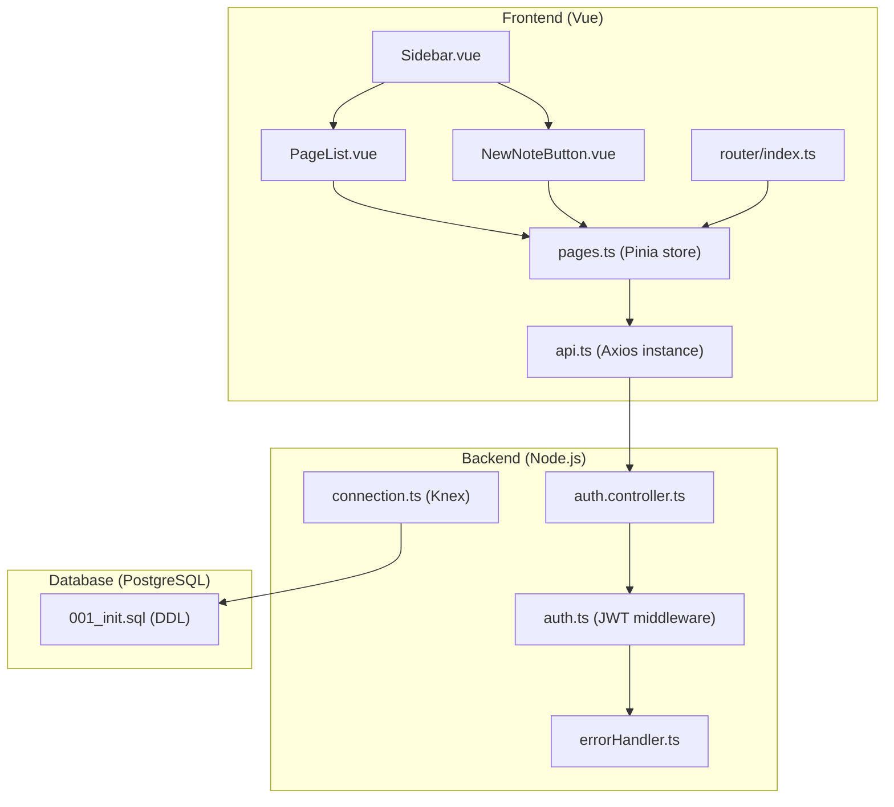
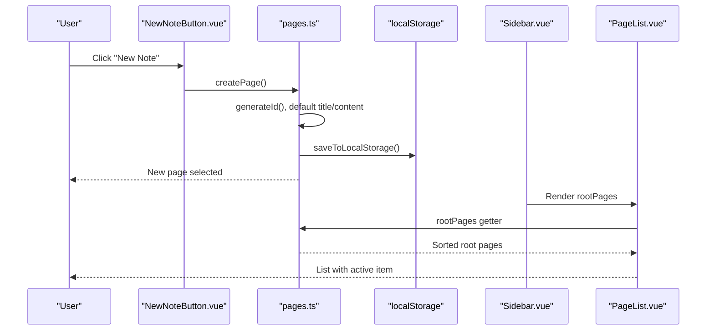
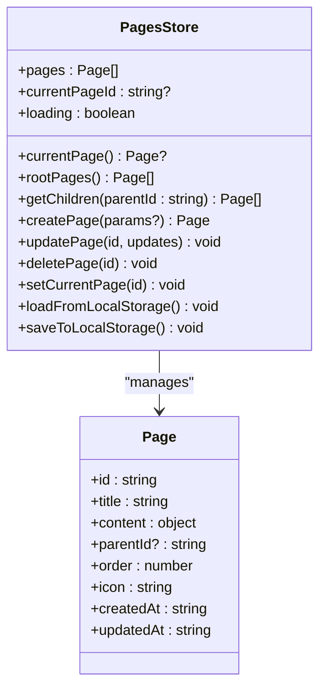
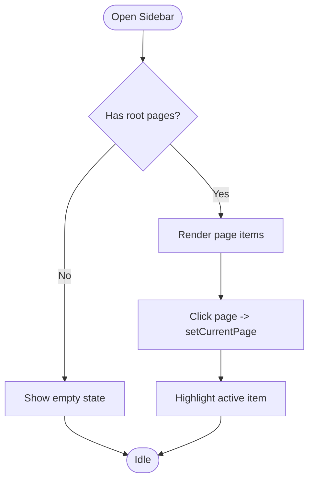
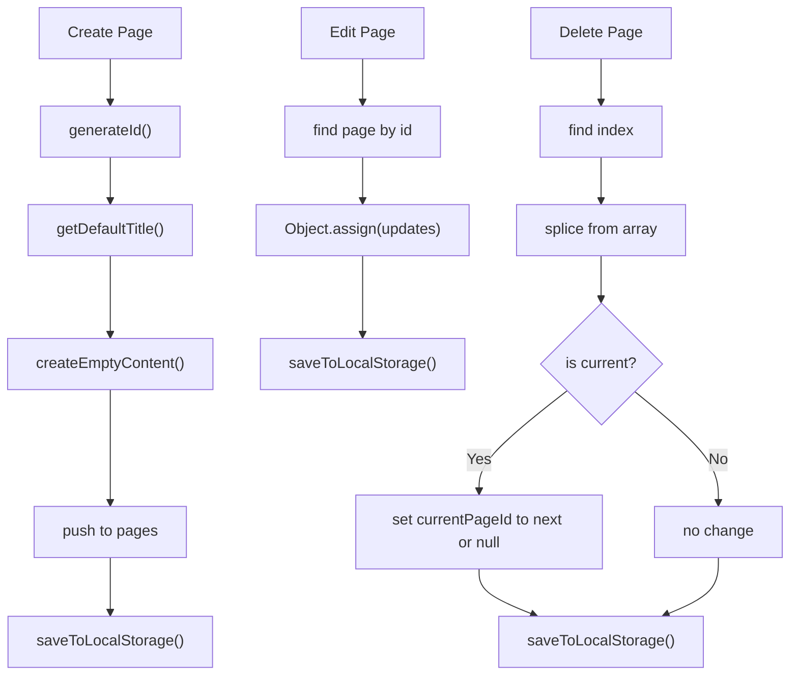
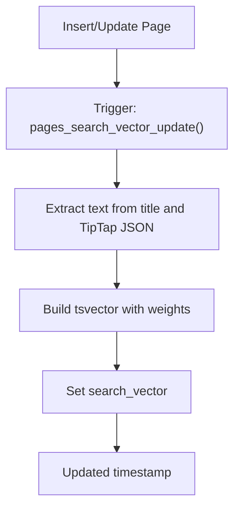
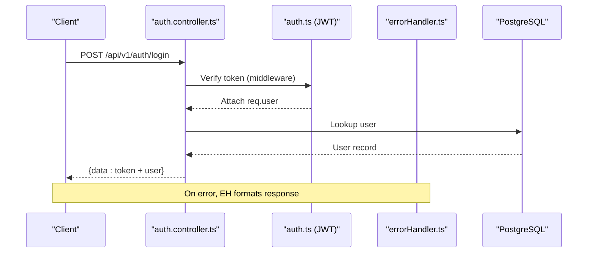
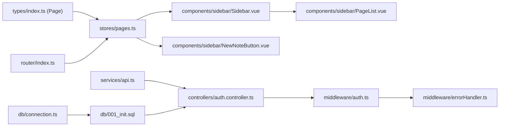
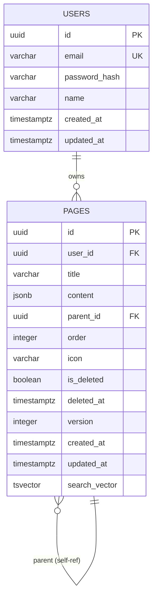

# Page Management

<cite>
**Referenced Files in This Document**
- [pages.ts](file://code/client/src/stores/pages.ts)
- [PageList.vue](file://code/client/src/components/sidebar/PageList.vue)
- [Sidebar.vue](file://code/client/src/components/sidebar/Sidebar.vue)
- [NewNoteButton.vue](file://code/client/src/components/sidebar/NewNoteButton.vue)
- [index.ts](file://code/client/src/router/index.ts)
- [api.ts](file://code/client/src/services/api.ts)
- [index.ts](file://code/client/src/types/index.ts)
- [001_init.sql](file://db/001_init.sql)
- [connection.ts](file://code/server/src/db/connection.ts)
- [auth.controller.ts](file://code/server/src/controllers/auth.controller.ts)
- [auth.ts](file://code/server/src/middleware/auth.ts)
- [errorHandler.ts](file://code/server/src/middleware/errorHandler.ts)
</cite>

## Table of Contents
1. [Introduction](#introduction)
2. [Project Structure](#project-structure)
3. [Core Components](#core-components)
4. [Architecture Overview](#architecture-overview)
5. [Detailed Component Analysis](#detailed-component-analysis)
6. [Dependency Analysis](#dependency-analysis)
7. [Performance Considerations](#performance-considerations)
8. [Troubleshooting Guide](#troubleshooting-guide)
9. [Conclusion](#conclusion)
10. [Appendices](#appendices)

## Introduction
This document explains the page management system in Yule-Notion, covering the hierarchical page structure, sidebar navigation, CRUD operations, frontend state management with Pinia, local-first persistence, and the backend database model. It also outlines search integration via PostgreSQL full-text search, optimistic UI patterns, and the current state of server-side APIs.

## Project Structure
The page management system spans the frontend (Vue + Pinia) and backend (Node.js + PostgreSQL). The frontend manages pages locally and persists them to localStorage. The backend defines the relational schema and authentication flow, while the frontend’s API service communicates with the backend under the /api/v1 base path.

**Diagram sources**
- [Sidebar.vue:1-216](file://code/client/src/components/sidebar/Sidebar.vue#L1-L216)
- [PageList.vue:1-168](file://code/client/src/components/sidebar/PageList.vue#L1-L168)
- [NewNoteButton.vue:1-114](file://code/client/src/components/sidebar/NewNoteButton.vue#L1-L114)
- [pages.ts:1-165](file://code/client/src/stores/pages.ts#L1-L165)
- [api.ts:1-64](file://code/client/src/services/api.ts#L1-L64)
- [index.ts:1-93](file://code/client/src/router/index.ts#L1-L93)
- [auth.controller.ts:1-82](file://code/server/src/controllers/auth.controller.ts#L1-L82)
- [auth.ts:1-60](file://code/server/src/middleware/auth.ts#L1-L60)
- [errorHandler.ts:1-68](file://code/server/src/middleware/errorHandler.ts#L1-L68)
- [connection.ts:1-40](file://code/server/src/db/connection.ts#L1-L40)
- [001_init.sql:1-254](file://db/001_init.sql#L1-L254)

**Section sources**
- [Sidebar.vue:1-216](file://code/client/src/components/sidebar/Sidebar.vue#L1-L216)
- [PageList.vue:1-168](file://code/client/src/components/sidebar/PageList.vue#L1-L168)
- [NewNoteButton.vue:1-114](file://code/client/src/components/sidebar/NewNoteButton.vue#L1-L114)
- [pages.ts:1-165](file://code/client/src/stores/pages.ts#L1-L165)
- [api.ts:1-64](file://code/client/src/services/api.ts#L1-L64)
- [index.ts:1-93](file://code/client/src/router/index.ts#L1-L93)
- [auth.controller.ts:1-82](file://code/server/src/controllers/auth.controller.ts#L1-L82)
- [auth.ts:1-60](file://code/server/src/middleware/auth.ts#L1-L60)
- [errorHandler.ts:1-68](file://code/server/src/middleware/errorHandler.ts#L1-L68)
- [connection.ts:1-40](file://code/server/src/db/connection.ts#L1-L40)
- [001_init.sql:1-254](file://db/001_init.sql#L1-L254)

## Core Components
- Pinia pages store: Manages page list, current selection, and CRUD actions. It generates IDs, defaults, and persists to localStorage.
- Sidebar and PageList: Render root-level pages and highlight the current selection.
- NewNoteButton: Creates new pages and supports keyboard shortcuts.
- Router: Guards protected routes and redirects unauthenticated users.
- API service: Provides Axios instance with request/response interceptors and Bearer token injection.
- Backend authentication controller and middleware: Handles JWT verification and global error formatting.
- Database schema: Defines pages table with adjacency-list hierarchy, ordering, soft-delete, versioning, and full-text search support.

**Section sources**
- [pages.ts:44-165](file://code/client/src/stores/pages.ts#L44-L165)
- [Sidebar.vue:11-24](file://code/client/src/components/sidebar/Sidebar.vue#L11-L24)
- [PageList.vue:10-32](file://code/client/src/components/sidebar/PageList.vue#L10-L32)
- [NewNoteButton.vue:10-41](file://code/client/src/components/sidebar/NewNoteButton.vue#L10-L41)
- [index.ts:68-90](file://code/client/src/router/index.ts#L68-L90)
- [api.ts:14-64](file://code/client/src/services/api.ts#L14-L64)
- [auth.controller.ts:26-81](file://code/server/src/controllers/auth.controller.ts#L26-L81)
- [auth.ts:29-59](file://code/server/src/middleware/auth.ts#L29-L59)
- [errorHandler.ts:29-67](file://code/server/src/middleware/errorHandler.ts#L29-L67)
- [001_init.sql:36-76](file://db/001_init.sql#L36-L76)

## Architecture Overview
The frontend maintains a local-first state for pages. When the user creates or edits pages, the store updates immediately (optimistic UI). The store serializes to localStorage for persistence across browser sessions. The sidebar lists root-level pages and allows switching the current page. Navigation guards protect dashboard access. Authentication is handled by a dedicated controller and middleware, with centralized error handling. The backend exposes authentication endpoints and uses Knex for database connectivity.

**Diagram sources**
- [NewNoteButton.vue:19-21](file://code/client/src/components/sidebar/NewNoteButton.vue#L19-L21)
- [pages.ts:73-93](file://code/client/src/stores/pages.ts#L73-L93)
- [pages.ts:130-132](file://code/client/src/stores/pages.ts#L130-L132)
- [Sidebar.vue:47](file://code/client/src/components/sidebar/Sidebar.vue#L47)
- [PageList.vue:63-83](file://code/client/src/components/sidebar/PageList.vue#L63-L83)

## Detailed Component Analysis

### Frontend State Management (Pinia Store)
The pages store encapsulates:
- State: pages array, current page ID, loading flag
- Getters: currentPage, rootPages, getChildren
- Actions: createPage, updatePage, deletePage, setCurrentPage, loadFromLocalStorage/saveToLocalStorage

**Diagram sources**
- [pages.ts:44-165](file://code/client/src/stores/pages.ts#L44-L165)
- [index.ts:72-90](file://code/client/src/types/index.ts#L72-L90)

**Section sources**
- [pages.ts:44-165](file://code/client/src/stores/pages.ts#L44-L165)
- [index.ts:72-90](file://code/client/src/types/index.ts#L72-L90)

### Sidebar Navigation and Page Listing
- Sidebar composes logo, new note button, page list, and user info.
- PageList renders root-level pages, highlights the current page, and shows last-updated dates.
- NewNoteButton triggers store.createPage and supports Ctrl/Cmd+N shortcut.

**Diagram sources**
- [Sidebar.vue:26-88](file://code/client/src/components/sidebar/Sidebar.vue#L26-L88)
- [PageList.vue:37-83](file://code/client/src/components/sidebar/PageList.vue#L37-L83)
- [NewNoteButton.vue:19-32](file://code/client/src/components/sidebar/NewNoteButton.vue#L19-L32)

**Section sources**
- [Sidebar.vue:11-24](file://code/client/src/components/sidebar/Sidebar.vue#L11-L24)
- [PageList.vue:10-32](file://code/client/src/components/sidebar/PageList.vue#L10-L32)
- [NewNoteButton.vue:10-41](file://code/client/src/components/sidebar/NewNoteButton.vue#L10-L41)

### CRUD Operations (Frontend)
- Create: NewNoteButton invokes store.createPage, which generates a unique ID, default title/content, assigns order, and saves to localStorage.
- Edit: updatePage merges partial updates and refreshes updatedAt.
- Delete: deletePage removes the page and selects another if needed, then persists.
- Reorder: The store does not expose explicit reorder actions; ordering is managed via the order property during creation and retrieval.

**Diagram sources**
- [pages.ts:73-93](file://code/client/src/stores/pages.ts#L73-L93)
- [pages.ts:98-104](file://code/client/src/stores/pages.ts#L98-L104)
- [pages.ts:109-118](file://code/client/src/stores/pages.ts#L109-L118)
- [pages.ts:130-132](file://code/client/src/stores/pages.ts#L130-L132)

**Section sources**
- [pages.ts:73-118](file://code/client/src/stores/pages.ts#L73-L118)
- [pages.ts:130-132](file://code/client/src/stores/pages.ts#L130-L132)

### Search Integration
The database schema includes a trigger that builds a full-text search vector from page title and TipTap JSON content. This enables efficient text search at the database level. The frontend currently persists pages locally and does not yet integrate with backend search endpoints.

**Diagram sources**
- [001_init.sql:166-213](file://db/001_init.sql#L166-L213)

**Section sources**
- [001_init.sql:36-76](file://db/001_init.sql#L36-L76)
- [001_init.sql:166-213](file://db/001_init.sql#L166-L213)

### Backend Authentication and API Foundation
- Authentication controller handles registration, login, and fetching current user.
- JWT middleware validates Bearer tokens and attaches user info to requests.
- Global error handler ensures consistent error responses.
- Knex connection manages PostgreSQL connectivity.

**Diagram sources**
- [auth.controller.ts:26-81](file://code/server/src/controllers/auth.controller.ts#L26-L81)
- [auth.ts:29-59](file://code/server/src/middleware/auth.ts#L29-L59)
- [errorHandler.ts:29-67](file://code/server/src/middleware/errorHandler.ts#L29-L67)

**Section sources**
- [auth.controller.ts:26-81](file://code/server/src/controllers/auth.controller.ts#L26-L81)
- [auth.ts:29-59](file://code/server/src/middleware/auth.ts#L29-L59)
- [errorHandler.ts:29-67](file://code/server/src/middleware/errorHandler.ts#L29-L67)
- [connection.ts:22-29](file://code/server/src/db/connection.ts#L22-L29)

## Dependency Analysis
- The pages store depends on the Page type definition and uses localStorage for persistence.
- Sidebar and PageList depend on the pages store getters to render UI.
- Router guards depend on the auth store to enforce access control.
- API service depends on localStorage for Bearer token injection.
- Backend controllers depend on middleware for authentication and on the error handler for consistent responses.
- Database schema defines foreign keys, indexes, and triggers supporting hierarchical pages and search.

**Diagram sources**
- [index.ts:72-90](file://code/client/src/types/index.ts#L72-L90)
- [pages.ts:10-12](file://code/client/src/stores/pages.ts#L10-L12)
- [Sidebar.vue:12-14](file://code/client/src/components/sidebar/Sidebar.vue#L12-L14)
- [PageList.vue:11](file://code/client/src/components/sidebar/PageList.vue#L11)
- [NewNoteButton.vue:12](file://code/client/src/components/sidebar/NewNoteButton.vue#L12)
- [index.ts:68-90](file://code/client/src/router/index.ts#L68-L90)
- [api.ts:32-35](file://code/client/src/services/api.ts#L32-L35)
- [auth.controller.ts:14](file://code/server/src/controllers/auth.controller.ts#L14)
- [auth.ts:10-14](file://code/server/src/middleware/auth.ts#L10-L14)
- [errorHandler.ts:14](file://code/server/src/middleware/errorHandler.ts#L14)
- [001_init.sql:36-76](file://db/001_init.sql#L36-L76)
- [connection.ts:8-29](file://code/server/src/db/connection.ts#L8-L29)

**Section sources**
- [index.ts:72-90](file://code/client/src/types/index.ts#L72-L90)
- [pages.ts:10-12](file://code/client/src/stores/pages.ts#L10-L12)
- [Sidebar.vue:12-14](file://code/client/src/components/sidebar/Sidebar.vue#L12-L14)
- [PageList.vue:11](file://code/client/src/components/sidebar/PageList.vue#L11)
- [NewNoteButton.vue:12](file://code/client/src/components/sidebar/NewNoteButton.vue#L12)
- [index.ts:68-90](file://code/client/src/router/index.ts#L68-L90)
- [api.ts:32-35](file://code/client/src/services/api.ts#L32-L35)
- [auth.controller.ts:14](file://code/server/src/controllers/auth.controller.ts#L14)
- [auth.ts:10-14](file://code/server/src/middleware/auth.ts#L10-L14)
- [errorHandler.ts:14](file://code/server/src/middleware/errorHandler.ts#L14)
- [001_init.sql:36-76](file://db/001_init.sql#L36-L76)
- [connection.ts:8-29](file://code/server/src/db/connection.ts#L8-L29)

## Performance Considerations
- Local-first persistence reduces network latency for UI interactions but does not replace server-side indexing and search.
- The database schema includes composite indexes for user-scoped queries and ordering, which are essential for efficient retrieval of root pages and children.
- Full-text search uses a GIN index on a generated tsvector, enabling fast text search.
- Consider adding debounced synchronization to localStorage for heavy editing sessions to reduce write frequency.

[No sources needed since this section provides general guidance]

## Troubleshooting Guide
- Authentication errors: The API service clears the token on 401 responses and redirects to login. Ensure the Authorization header is present and valid.
- Unauthorized access: The auth middleware checks for a proper Bearer token; missing or invalid tokens result in 401.
- Consistent error responses: The global error handler returns structured error bodies; inspect the error code and message for diagnostics.
- Local persistence issues: If pages fail to load from localStorage, verify the stored JSON format and clear corrupted entries if necessary.

**Section sources**
- [api.ts:48-61](file://code/client/src/services/api.ts#L48-L61)
- [auth.ts:29-59](file://code/server/src/middleware/auth.ts#L29-L59)
- [errorHandler.ts:29-67](file://code/server/src/middleware/errorHandler.ts#L29-L67)
- [pages.ts:137-146](file://code/client/src/stores/pages.ts#L137-L146)

## Conclusion
The page management system combines a local-first Vue/Pinia store with a PostgreSQL-backed schema supporting hierarchical pages, ordering, soft-deletion, versioning, and full-text search. The sidebar provides intuitive navigation, while the router and authentication middleware secure access. Future enhancements could include server synchronization, explicit reordering actions, and backend search endpoints.

[No sources needed since this section summarizes without analyzing specific files]

## Appendices

### Data Model Overview
The pages table models a hierarchical structure using adjacency-list with parent_id. Ordering is enforced per-user and per-parent. Soft-delete and version fields support auditability and optimistic concurrency.

**Diagram sources**
- [001_init.sql:14-23](file://db/001_init.sql#L14-L23)
- [001_init.sql:36-76](file://db/001_init.sql#L36-L76)

### API Endpoints (Authentication)
- POST /api/v1/auth/register
- POST /api/v1/auth/login
- GET /api/v1/auth/me (requires Bearer token)

**Section sources**
- [auth.controller.ts:26-81](file://code/server/src/controllers/auth.controller.ts#L26-L81)