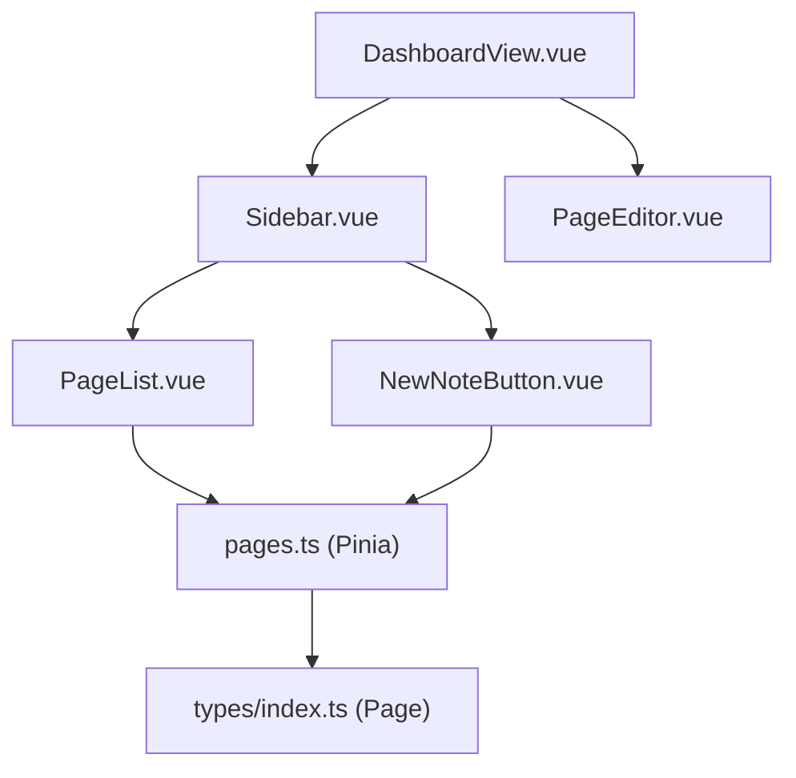
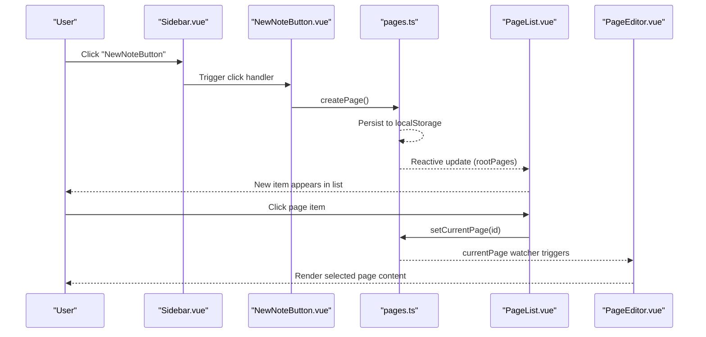
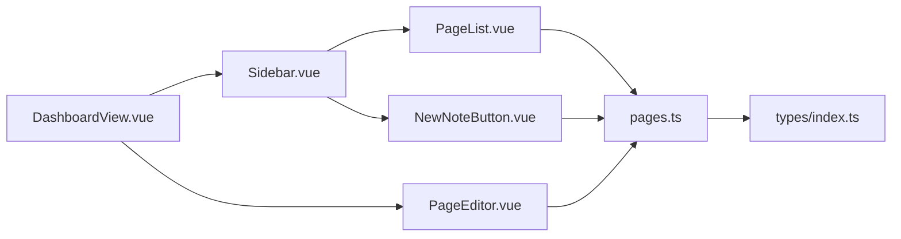

# Sidebar Navigation

<cite>
**Referenced Files in This Document**
- [Sidebar.vue](file://code/client/src/components/sidebar/Sidebar.vue)
- [PageList.vue](file://code/client/src/components/sidebar/PageList.vue)
- [NewNoteButton.vue](file://code/client/src/components/sidebar/NewNoteButton.vue)
- [DashboardView.vue](file://code/client/src/views/DashboardView.vue)
- [pages.ts](file://code/client/src/stores/pages.ts)
- [index.ts](file://code/client/src/types/index.ts)
- [PageEditor.vue](file://code/client/src/components/editor/PageEditor.vue)
- [main.ts](file://code/client/src/main.ts)
</cite>

## Table of Contents
1. [Introduction](#introduction)
2. [Project Structure](#project-structure)
3. [Core Components](#core-components)
4. [Architecture Overview](#architecture-overview)
5. [Detailed Component Analysis](#detailed-component-analysis)
6. [Dependency Analysis](#dependency-analysis)
7. [Performance Considerations](#performance-considerations)
8. [Troubleshooting Guide](#troubleshooting-guide)
9. [Conclusion](#conclusion)

## Introduction
This document explains the sidebar navigation system that powers hierarchical page browsing and creation. It covers:
- Hierarchical page display using a recursive tree structure
- Parent-child relationships and ordering
- New note creation via the NewNoteButton
- Page selection and current page management
- Sidebar layout and integration with the main dashboard view
- Examples of page tree traversal and indentation logic
- Visual indicators for hierarchy and selection
- Accessibility and keyboard navigation support

## Project Structure
The sidebar system is composed of three primary components and integrates with the dashboard view and Pinia store:
- Sidebar: Hosts the logo, new note button, page list, and user info
- PageList: Renders the root-level pages and provides selection
- NewNoteButton: Creates new pages and supports keyboard shortcuts
- DashboardView: Places the sidebar alongside the editor
- pages store: Manages pages, current selection, and persistence

**Diagram sources**
- [DashboardView.vue:15-22](file://code/client/src/views/DashboardView.vue#L15-L22)
- [Sidebar.vue:26-88](file://code/client/src/components/sidebar/Sidebar.vue#L26-L88)
- [PageList.vue:34-84](file://code/client/src/components/sidebar/PageList.vue#L34-L84)
- [NewNoteButton.vue:43-68](file://code/client/src/components/sidebar/NewNoteButton.vue#L43-L68)
- [pages.ts:44-164](file://code/client/src/stores/pages.ts#L44-L164)
- [index.ts:72-90](file://code/client/src/types/index.ts#L72-L90)
- [PageEditor.vue:66-124](file://code/client/src/components/editor/PageEditor.vue#L66-L124)

**Section sources**
- [DashboardView.vue:10-31](file://code/client/src/views/DashboardView.vue#L10-L31)
- [Sidebar.vue:11-24](file://code/client/src/components/sidebar/Sidebar.vue#L11-L24)

## Core Components
- Sidebar: Provides the fixed-width left panel with branding, new note action, page list, and user controls.
- PageList: Displays root-level pages and handles selection; currently renders flat lists but is structured to support recursion.
- NewNoteButton: Creates new pages and listens for keyboard shortcuts.
- pages store: Centralized state for pages, current selection, getters for root and children, and persistence.

Key responsibilities:
- Sidebar: Layout, theming, and orchestration of child components
- PageList: Selection UX and empty-state handling
- NewNoteButton: Creation UX and keyboard shortcut handling
- pages store: Data model, sorting, and persistence

**Section sources**
- [Sidebar.vue:26-88](file://code/client/src/components/sidebar/Sidebar.vue#L26-L88)
- [PageList.vue:34-84](file://code/client/src/components/sidebar/PageList.vue#L34-L84)
- [NewNoteButton.vue:19-40](file://code/client/src/components/sidebar/NewNoteButton.vue#L19-L40)
- [pages.ts:44-164](file://code/client/src/stores/pages.ts#L44-L164)

## Architecture Overview
The sidebar integrates tightly with the dashboard and editor. The pages store persists data locally and exposes computed getters for root and child pages. The sidebar composes the new note button and page list, while the dashboard places the editor to the right.

**Diagram sources**
- [Sidebar.vue:13-14](file://code/client/src/components/sidebar/Sidebar.vue#L13-L14)
- [NewNoteButton.vue:19-21](file://code/client/src/components/sidebar/NewNoteButton.vue#L19-L21)
- [pages.ts:73-93](file://code/client/src/stores/pages.ts#L73-L93)
- [pages.ts:130-132](file://code/client/src/stores/pages.ts#L130-L132)
- [pages.ts:60-67](file://code/client/src/stores/pages.ts#L60-L67)
- [PageList.vue:18-20](file://code/client/src/components/sidebar/PageList.vue#L18-L20)
- [pages.ts:123-125](file://code/client/src/stores/pages.ts#L123-L125)
- [PageEditor.vue:24-28](file://code/client/src/components/editor/PageEditor.vue#L24-L28)

## Detailed Component Analysis

### Sidebar.vue
Responsibilities:
- Compose the sidebar layout with header, new note button, page list, and user section
- Provide responsive container sizing and theming
- Manage logout action via auth store

Highlights:
- Fixed width sidebar with vertical stacking
- Scoped styles for consistent theming
- Logout button wired to auth store

Accessibility and UX:
- Clear focusable elements and hover states
- Visual affordances for interactive elements

**Section sources**
- [Sidebar.vue:26-88](file://code/client/src/components/sidebar/Sidebar.vue#L26-L88)
- [Sidebar.vue:91-215](file://code/client/src/components/sidebar/Sidebar.vue#L91-L215)

### PageList.vue
Responsibilities:
- Render root-level pages and handle selection
- Provide empty-state messaging
- Format dates for last-updated display

Current behavior:
- Lists root pages only
- Uses a simple loop over rootPages getter
- Highlights the current page with active/inactive styles

Extensibility for recursion:
- The component is structured to support nested rendering by iterating over children and recursively rendering sublists
- Indentation can be achieved by passing a nesting level prop and applying consistent spacing

Selection mechanism:
- Clicking a page item invokes setCurrentPage in the pages store
- The active state is derived from currentPageId comparison

Date formatting:
- Uses a helper to present localized month/day

**Section sources**
- [PageList.vue:34-84](file://code/client/src/components/sidebar/PageList.vue#L34-L84)
- [PageList.vue:18-31](file://code/client/src/components/sidebar/PageList.vue#L18-L31)
- [pages.ts:59-67](file://code/client/src/stores/pages.ts#L59-L67)

### NewNoteButton.vue
Responsibilities:
- Create a new page via the pages store
- Support keyboard shortcut Ctrl/Cmd + N globally
- Provide visual feedback and tooltip hints

Keyboard navigation:
- Registers a global keydown listener on mount
- Prevents default browser behavior for the shortcut
- Removes listeners on unmount for cleanup

Visual design:
- Prominent primary button with icon and shortcut hint
- Hover reveals shortcut hint

**Section sources**
- [NewNoteButton.vue:19-40](file://code/client/src/components/sidebar/NewNoteButton.vue#L19-L40)
- [NewNoteButton.vue:26-32](file://code/client/src/components/sidebar/NewNoteButton.vue#L26-L32)
- [NewNoteButton.vue:43-68](file://code/client/src/components/sidebar/NewNoteButton.vue#L43-L68)

### pages store (pages.ts)
Responsibilities:
- Define the Page type and CreatePageParams
- Manage pages array, current page ID, and loading state
- Provide computed getters for root pages and children
- Expose actions to create, update, delete, and set current page
- Persist to and load from localStorage

Tree model:
- Root pages are those with no parentId
- Children are filtered by parentId and sorted by order
- Order is maintained as an integer for deterministic rendering

Persistence:
- Saves and loads pages to/from localStorage on changes and initialization

**Section sources**
- [pages.ts:44-164](file://code/client/src/stores/pages.ts#L44-L164)
- [index.ts:72-100](file://code/client/src/types/index.ts#L72-L100)

### DashboardView.vue and PageEditor.vue
Integration:
- DashboardView places Sidebar and PageEditor side-by-side
- PageEditor watches the current page and renders title, metadata, and content editor
- When no page is selected, it shows an empty state with guidance

Responsive behavior:
- Flexbox layout fills the viewport
- Sidebar width is fixed; editor is flexible

**Section sources**
- [DashboardView.vue:15-31](file://code/client/src/views/DashboardView.vue#L15-L31)
- [PageEditor.vue:24-49](file://code/client/src/components/editor/PageEditor.vue#L24-L49)

## Dependency Analysis
The sidebar components depend on the pages store for data and state. The store depends on the Page type definition. The dashboard composes the sidebar and editor.

**Diagram sources**
- [Sidebar.vue:13-14](file://code/client/src/components/sidebar/Sidebar.vue#L13-L14)
- [PageList.vue:11](file://code/client/src/components/sidebar/PageList.vue#L11)
- [NewNoteButton.vue:12](file://code/client/src/components/sidebar/NewNoteButton.vue#L12)
- [pages.ts:12](file://code/client/src/stores/pages.ts#L12)
- [DashboardView.vue:11-12](file://code/client/src/views/DashboardView.vue#L11-L12)
- [PageEditor.vue:12](file://code/client/src/components/editor/PageEditor.vue#L12)

**Section sources**
- [pages.ts:12](file://code/client/src/stores/pages.ts#L12)
- [index.ts:72-100](file://code/client/src/types/index.ts#L72-L100)

## Performance Considerations
- Rendering cost: The current PageList iterates over root pages. For deep trees, consider virtualization or lazy loading of subtrees.
- Sorting: Children are sorted by order; keep order updates minimal to avoid frequent re-sorting.
- Persistence: LocalStorage writes occur on create/update/delete. Batch operations if creating many pages in sequence.
- Computed getters: rootPages and getChildren are recomputed when pages change; ensure minimal mutations per operation.

## Troubleshooting Guide
Common issues and resolutions:
- No pages appear: Check that pages are persisted to localStorage and loaded on startup. Verify the store’s loadFromLocalStorage behavior.
- Selection not updating: Ensure setCurrentPage is called and currentPageId is reactive. Confirm watchers in PageEditor are triggered.
- Keyboard shortcut not working: Verify global event listener registration and that preventDefault is applied for the shortcut.
- Empty state: The empty state is shown when rootPages length is zero; confirm initial pages are created or loaded.

**Section sources**
- [pages.ts:137-149](file://code/client/src/stores/pages.ts#L137-L149)
- [PageList.vue:37-60](file://code/client/src/components/sidebar/PageList.vue#L37-L60)
- [NewNoteButton.vue:34-40](file://code/client/src/components/sidebar/NewNoteButton.vue#L34-L40)
- [PageEditor.vue:69-90](file://code/client/src/components/editor/PageEditor.vue#L69-L90)

## Conclusion
The sidebar navigation system provides a clean, extensible foundation for hierarchical page browsing. It leverages a Pinia store with a robust tree model and local persistence. While the current PageList focuses on root-level items, the structure is ready for recursive rendering and advanced features like drag-and-drop reordering. The integration with the dashboard and editor ensures a cohesive user experience, and the keyboard shortcut support enhances productivity.