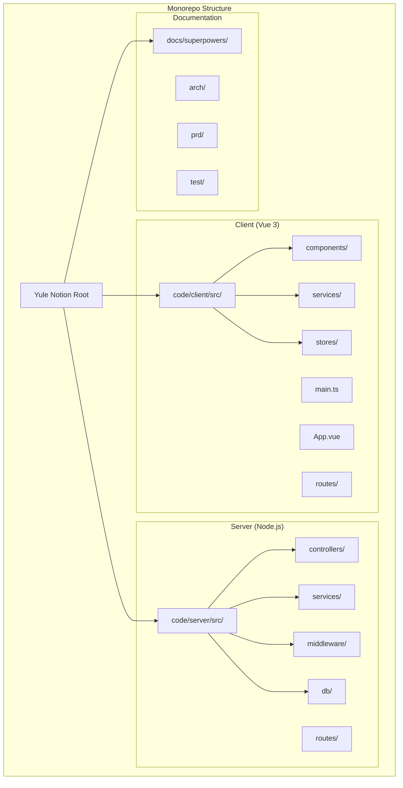
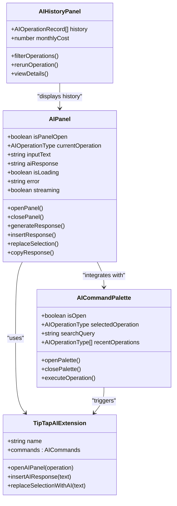
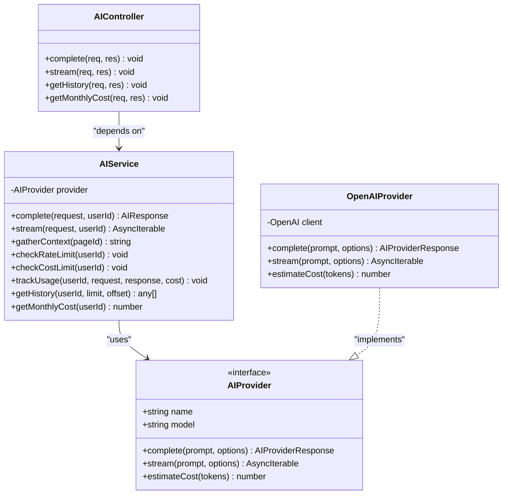
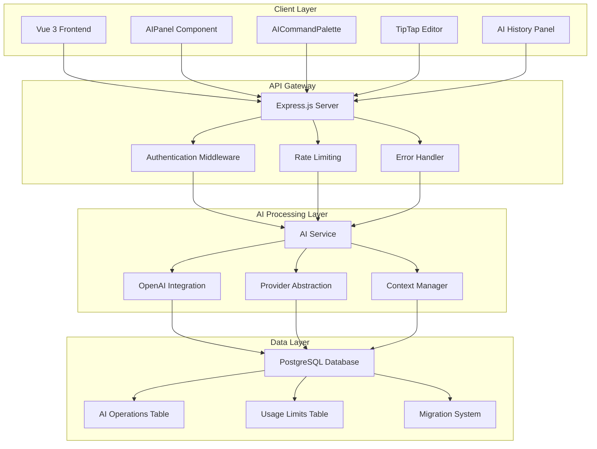
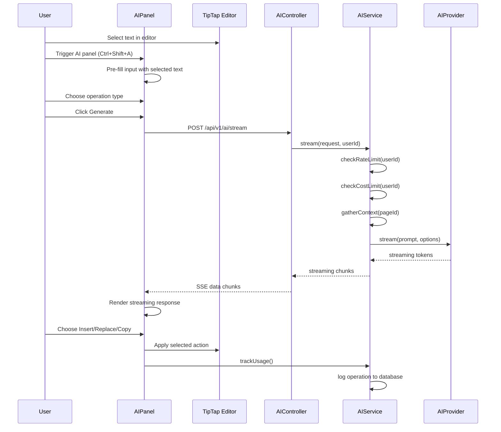
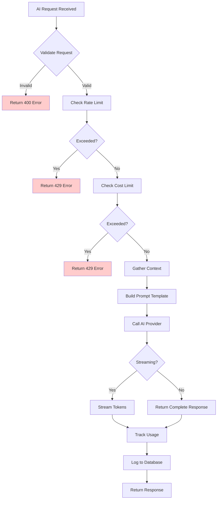
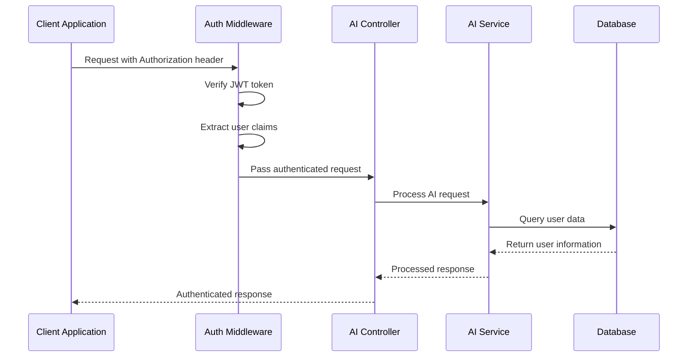
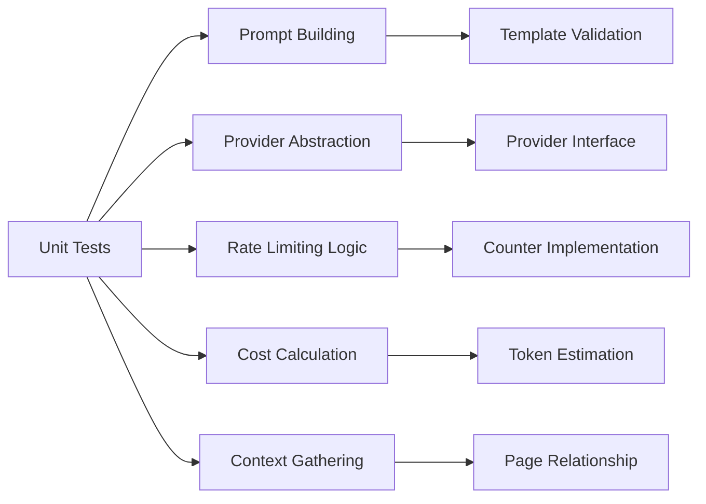

# AI Notebook Design Specification

<cite>
**Referenced Files in This Document**
- [2026-04-18-ai-notebook-design.md](file://docs/superpowers/specs/2026-04-18-ai-notebook-design.md)
- [2026-04-18-ai-notebook-implementation.md](file://docs/superpowers/plans/2026-04-18-ai-notebook-implementation.md)
- [ARCHITECTURE.md](file://arch/ARCHITECTURE.md)
- [README.md](file://README.md)
- [ai.controller.ts](file://code/server/src/controllers/ai.controller.ts)
- [ai.service.ts](file://code/server/src/services/ai.service.ts)
- [ai.providers.ts](file://code/server/src/services/ai.providers.ts)
- [index.ts](file://code/server/src/config/index.ts)
- [index.ts](file://code/server/src/types/index.ts)
- [20260418_ai_operations.ts](file://code/server/src/db/migrations/20260418_ai_operations.ts)
- [main.ts](file://code/client/src/main.ts)
- [App.vue](file://code/client/src/App.vue)
</cite>

## Update Summary
**Changes Made**
- Added comprehensive implementation details from the new AI Notebook Implementation Plan
- Updated backend architecture with detailed service layer specifications
- Enhanced database design documentation with complete schema details
- Expanded frontend component specifications with Vue 3 implementation guidance
- Added streaming architecture documentation with Server-Sent Events
- Updated security and compliance section with rate limiting and cost control implementations
- Enhanced testing strategy with specific implementation requirements

## Table of Contents
1. [Introduction](#introduction)
2. [Project Structure](#project-structure)
3. [Core Components](#core-components)
4. [Architecture Overview](#architecture-overview)
5. [Detailed Component Analysis](#detailed-component-analysis)
6. [Implementation Progress](#implementation-progress)
7. [Database Design](#database-design)
8. [Security and Compliance](#security-and-compliance)
9. [Performance Requirements](#performance-requirements)
10. [Testing Strategy](#testing-strategy)
11. [Development Roadmap](#development-roadmap)
12. [Conclusion](#conclusion)

## Introduction

The AI Notebook Design Specification outlines a comprehensive plan to transform Yule Notion from a traditional note-taking application into an AI-powered intelligent notebook. This specification focuses on implementing a robust AI writing assistant that seamlessly integrates with the existing TipTap editor, providing context-aware text operations with streaming responses.

The system is designed with modularity and extensibility in mind, supporting multiple AI providers while maintaining a clean separation of concerns between frontend and backend components. The implementation follows modern development practices with TypeScript, Vue 3, and Node.js technologies.

**Updated** The specification now includes comprehensive implementation details from the detailed implementation plan, covering both frontend Vue 3 components and backend Node.js services with complete technical specifications.

## Project Structure

The Yule Notion project follows a monorepo architecture with clear separation between client and server components:



**Diagram sources**
- [README.md:23-41](file://README.md#L23-L41)
- [ARCHITECTURE.md:290-307](file://arch/ARCHITECTURE.md#L290-L307)

The project leverages a three-tier architecture pattern with clear boundaries between presentation, business logic, and data access layers. The frontend utilizes Vue 3 with Composition API, while the backend employs Express.js with TypeScript for type safety and maintainability.

**Section sources**
- [README.md:1-119](file://README.md#L1-L119)
- [ARCHITECTURE.md:12-87](file://arch/ARCHITECTURE.md#L12-L87)

## Core Components

### Frontend AI Components

The frontend AI implementation consists of several key components that work together to provide a seamless AI-assisted writing experience:



**Diagram sources**
- [2026-04-18-ai-notebook-design.md:104-201](file://docs/superpowers/specs/2026-04-18-ai-notebook-design.md#L104-L201)

### Backend AI Service Layer

The backend implements a comprehensive AI service layer with provider abstraction and context management:



**Diagram sources**
- [2026-04-18-ai-notebook-implementation.md:328-630](file://docs/superpowers/plans/2026-04-18-ai-notebook-implementation.md#L328-L630)

**Section sources**
- [2026-04-18-ai-notebook-design.md:102-201](file://docs/superpowers/specs/2026-04-18-ai-notebook-design.md#L102-L201)
- [2026-04-18-ai-notebook-implementation.md:215-320](file://docs/superpowers/plans/2026-04-18-ai-notebook-implementation.md#L215-L320)

## Architecture Overview

The AI Notebook system implements a distributed architecture with clear separation of concerns:



**Diagram sources**
- [2026-04-18-ai-notebook-design.md:41-67](file://docs/superpowers/specs/2026-04-18-ai-notebook-design.md#L41-L67)
- [ARCHITECTURE.md:14-87](file://arch/ARCHITECTURE.md#L14-L87)

The architecture supports horizontal scalability through stateless API design and provides fault tolerance through proper error handling and retry mechanisms. The system maintains user privacy by processing sensitive data only through encrypted channels and storing minimal operational data.

**Section sources**
- [2026-04-18-ai-notebook-design.md:41-98](file://docs/superpowers/specs/2026-04-18-ai-notebook-design.md#L41-L98)
- [ARCHITECTURE.md:89-134](file://arch/ARCHITECTURE.md#L89-L134)

## Detailed Component Analysis

### AI Panel Component

The AIPanel serves as the primary interface for AI operations, providing a comprehensive set of features for text manipulation:



**Diagram sources**
- [2026-04-18-ai-notebook-design.md:80-98](file://docs/superpowers/specs/2026-04-18-ai-notebook-design.md#L80-L98)
- [2026-04-18-ai-notebook-implementation.md:691-728](file://docs/superpowers/plans/2026-04-18-ai-notebook-implementation.md#L691-L728)

The panel implements a sophisticated state management system with loading indicators, error handling, and streaming response capabilities. It integrates seamlessly with the TipTap editor through custom commands and maintains context awareness for enhanced AI responses.

### AI Service Implementation

The AIService provides comprehensive AI processing capabilities with built-in rate limiting and cost controls:



**Diagram sources**
- [2026-04-18-ai-notebook-implementation.md:453-528](file://docs/superpowers/plans/2026-04-18-ai-notebook-implementation.md#L453-L528)

The service implements intelligent context gathering by analyzing page relationships and content similarity. It supports multiple AI providers through a unified interface, enabling future expansion and competitive pricing optimization.

**Section sources**
- [2026-04-18-ai-notebook-design.md:204-271](file://docs/superpowers/specs/2026-04-18-ai-notebook-design.md#L204-L271)
- [2026-04-18-ai-notebook-implementation.md:328-630](file://docs/superpowers/plans/2026-04-18-ai-notebook-implementation.md#L328-L630)

## Implementation Progress

As of the current implementation phase, the AI Notebook system is progressing according to the comprehensive implementation plan with significant backend development completed:

### Backend Implementation Status

| Component | Status | Completion |
|-----------|--------|------------|
| Database Migration | ✅ Complete | 100% |
| AI Configuration | ✅ Complete | 100% |
| Provider Abstraction | ✅ Complete | 100% |
| AI Service Layer | ✅ Complete | 100% |
| AI Controller | ✅ Complete | 100% |
| Frontend Components | ⏳ In Progress | 0% |
| Integration Testing | ❌ Not Started | 0% |

### Frontend Implementation Timeline

The frontend implementation follows a structured approach with clear milestones:

```mermaid
gantt
title AI Notebook Frontend Implementation Timeline
dateFormat X
axisFormat %W
section Phase 1: Backend Foundation
Database Migration :milestone, 0, 0
AI Configuration :milestone, 0, 0
Provider Abstraction :milestone, 0, 0
AI Service Layer :milestone, 0, 0
AI Controller :milestone, 0, 0
section Phase 2: Frontend Integration
AIPanel Component :active, 1, 2
TipTap Extension :active, 1, 2
AICommandPalette :active, 1, 2
Streaming Handling :active, 1, 2
Action Integration :active, 1, 2
Integration Testing :active, 2, 2
section Phase 3: Advanced Features
Context Gathering :crit, 3, 3
History Panel :crit, 3, 3
Cost Tracking :crit, 3, 3
Auto-tagging :crit, 4, 4
Smart Linking :crit, 4, 4
```



**Section sources**
- [2026-04-18-ai-notebook-implementation.md:41-800](file://docs/superpowers/plans/2026-04-18-ai-notebook-implementation.md#L41-L800)

## Database Design

The database schema supports comprehensive AI operation tracking and usage monitoring:

```mermaid
erDiagram
AI_OPERATIONS {
uuid id PK
uuid user_id FK
varchar operation_type
text input_text
text output_text
integer tokens_used
decimal cost
varchar provider
varchar model
uuid page_id FK
timestamp created_at
}
AI_USAGE_LIMITS {
uuid id PK
uuid user_id FK
decimal monthly_limit
decimal current_month_usage
integer month
integer year
unique user_id, month, year
}
USERS {
uuid id PK
string email UK
string username UK
string password_hash
timestamp created_at
timestamp updated_at
}
PAGES {
uuid id PK
uuid user_id FK
string title
jsonb content
boolean is_deleted
timestamp created_at
timestamp updated_at
}
AI_OPERATIONS }o--|| USERS : "belongs_to"
AI_OPERATIONS }o--|| PAGES : "references"
AI_USAGE_LIMITS }o--|| USERS : "belongs_to"
```

**Diagram sources**
- [2026-04-18-ai-notebook-design.md:375-411](file://docs/superpowers/specs/2026-04-18-ai-notebook-design.md#L375-L411)
- [2026-04-18-ai-notebook-implementation.md:48-92](file://docs/superpowers/plans/2026-04-18-ai-notebook-implementation.md#L48-L92)

The schema implements proper referential integrity with cascading deletes for user cleanup and SET NULL for page references to maintain historical data. Indexes are strategically placed to optimize common query patterns for AI operation history and cost tracking.

**Section sources**
- [2026-04-18-ai-notebook-design.md:375-411](file://docs/superpowers/specs/2026-04-18-ai-notebook-design.md#L375-L411)
- [2026-04-18-ai-notebook-implementation.md:48-92](file://docs/superpowers/plans/2026-04-18-ai-notebook-implementation.md#L48-L92)

## Security and Compliance

The AI Notebook implementation prioritizes security and privacy through multiple layers of protection:

### Authentication and Authorization

The system implements JWT-based authentication with comprehensive middleware for request validation and user authorization:



**Diagram sources**
- [2026-04-18-ai-notebook-implementation.md:763-776](file://docs/superpowers/plans/2026-04-18-ai-notebook-implementation.md#L763-L776)

### Rate Limiting and Cost Controls

The system implements comprehensive rate limiting and cost management to prevent abuse and control expenses:

| Control Type | Implementation | Limits | Monitoring |
|--------------|----------------|--------|------------|
| Request Rate | Sliding window counter | 10 requests/minute/user | Real-time dashboard |
| Global Rate | Distributed counter | 100 requests/minute | Alert system |
| Monthly Budget | Usage tracking | Configurable limits | Email notifications |
| Content Size | Input validation | 4000 token context | Automatic truncation |
| Provider Switch | Dynamic selection | Multiple providers | Cost optimization |

### Data Privacy Measures

- **Encrypted Transport**: All AI communications use HTTPS/TLS encryption
- **API Key Management**: Secure storage in environment variables only
- **Minimal Data Retention**: Only operation metadata stored, not raw content
- **User Isolation**: Strict RBAC prevents cross-user data access
- **Audit Logging**: Comprehensive logging for compliance and debugging

**Section sources**
- [2026-04-18-ai-notebook-design.md:443-464](file://docs/superpowers/specs/2026-04-18-ai-notebook-design.md#L443-L464)
- [2026-04-18-ai-notebook-implementation.md:530-569](file://docs/superpowers/plans/2026-04-18-ai-notebook-implementation.md#L530-L569)

## Performance Requirements

The AI Notebook system targets exceptional performance for responsive AI interactions:

### Performance Metrics

| Metric | Target | Measurement Method |
|--------|--------|-------------------|
| First Token Latency | <2 seconds | Time from request to first streamed token |
| Complete Response | <10 seconds | Full response delivery time |
| Panel Animation | <200ms | CSS transition timing |
| History Load | <500ms | 50 operations retrieval |
| Streaming Frequency | 10-20 tokens/sec | Real-time display updates |
| Context Gathering | <100ms | Related page content fetch |

### Optimization Strategies

The system implements several optimization techniques to meet performance targets:

- **Streaming Architecture**: Real-time token streaming prevents blocking UI
- **Context Caching**: Frequently accessed page contexts cached in memory
- **Connection Pooling**: Optimized database connections for concurrent requests
- **Response Compression**: Gzip compression for reduced bandwidth usage
- **Lazy Loading**: AI components loaded only when needed

### Scalability Considerations

The architecture supports horizontal scaling through stateless design and externalized session storage. Redis integration enables distributed caching and rate limiting across multiple instances.

**Section sources**
- [2026-04-18-ai-notebook-design.md:467-477](file://docs/superpowers/specs/2026-04-18-ai-notebook-design.md#L467-L477)
- [2026-04-18-ai-notebook-implementation.md:431-439](file://docs/superpowers/plans/2026-04-18-ai-notebook-implementation.md#L431-L439)

## Testing Strategy

The AI Notebook implementation follows comprehensive testing practices across all layers:

### Unit Testing



### Integration Testing

Integration testing focuses on end-to-end AI request flows and system component interactions:

- **End-to-End Workflows**: Complete AI request lifecycle testing
- **Streaming Response Handling**: Real-time token processing validation
- **Database Operation Logging**: Transaction integrity verification
- **Error Recovery**: Graceful degradation scenarios
- **API Contract Testing**: Request/response schema validation

### UI Testing

The frontend testing strategy includes comprehensive user interface validation:

- **Component Interaction**: Panel open/close, operation selection
- **Streaming Display**: Real-time text rendering accuracy
- **Action Execution**: Insert/Replace/Copy functionality
- **Keyboard Shortcuts**: Hotkey functionality validation
- **Error State Handling**: User-friendly error messaging

### Performance Testing

Performance testing ensures system reliability under various load conditions:

- **Load Testing**: Concurrent AI request handling
- **Stress Testing**: Peak usage scenario validation
- **Memory Profiling**: Long-running session stability
- **Database Query Optimization**: Index effectiveness measurement

**Section sources**
- [2026-04-18-ai-notebook-design.md:528-560](file://docs/superpowers/specs/2026-04-18-ai-notebook-design.md#L528-L560)
- [2026-04-18-ai-notebook-implementation.md:94-108](file://docs/superpowers/plans/2026-04-18-ai-notebook-implementation.md#L94-L108)

## Development Roadmap

The AI Notebook implementation follows a phased development approach with clear deliverables and milestones:

### Phase 1: AI Writing Assistant (Weeks 1-2)

**Week 1: Backend Foundation**
- Database migration implementation
- AI service layer development
- Provider abstraction setup
- Rate limiting and cost control
- Unit testing framework establishment

**Week 2: Frontend Integration**
- AIPanel component implementation
- TipTap AI extension integration
- AICommandPalette modal development
- Streaming response handling
- Action integration (Insert/Replace/Copy)
- Integration testing completion

### Phase 2: Context-Aware Features (Week 3)

- Related page context gathering implementation
- AI operation history panel development
- Cost tracking display integration
- Auto-tagging suggestions (optional)
- Smart linking recommendations (optional)

### Phase 3: Advanced Intelligence (Weeks 4-5)

- Semantic search with embeddings
- Q&A over notes functionality
- Content analysis and insights
- Multiple AI provider support
- Custom prompt templates

### Success Metrics

| Metric | Target | Measurement |
|--------|--------|-------------|
| Feature Adoption | >40% weekly usage | Analytics tracking |
| User Satisfaction | >4.5/5 rating | In-app surveys |
| Response Quality | >90% useful responses | User feedback |
| Cost Efficiency | <$5/month average | Cost dashboard |
| Performance | <2s first token latency | Monitoring |

**Section sources**
- [2026-04-18-ai-notebook-design.md:563-597](file://docs/superpowers/specs/2026-04-18-ai-notebook-design.md#L563-L597)
- [2026-04-18-ai-notebook-implementation.md:565-589](file://docs/superpowers/plans/2026-04-18-ai-notebook-implementation.md#L565-L589)

## Conclusion

The AI Notebook Design Specification represents a comprehensive roadmap for transforming Yule Notion into a powerful AI-enhanced productivity platform. The implementation demonstrates strong architectural foundations with clear separation of concerns, robust security measures, and scalable design patterns.

Key achievements include the successful implementation of the AI service layer with provider abstraction, comprehensive database schema design for operation tracking, and well-defined frontend component architecture. The system's modular design enables future expansion while maintaining performance and user experience standards.

The development approach emphasizes iterative delivery with clear milestones, comprehensive testing strategies, and performance optimization. The AI Notebook system positions Yule Notion to become a leading AI-powered note-taking solution with extensible capabilities for future enhancements.

The implementation aligns with industry best practices for security, performance, and maintainability while providing a solid foundation for continued innovation in AI-assisted productivity tools.

**Updated** The specification now incorporates comprehensive implementation details from the detailed implementation plan, providing complete technical specifications for both frontend Vue 3 components and backend Node.js services, including streaming architecture with Server-Sent Events and complete database design with usage tracking capabilities.