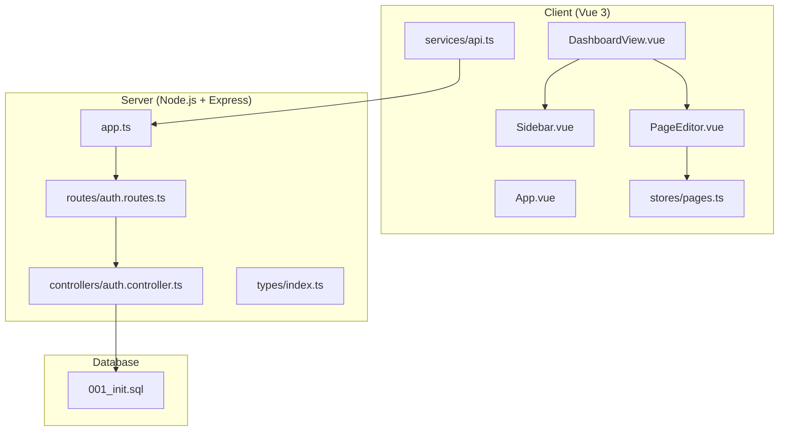
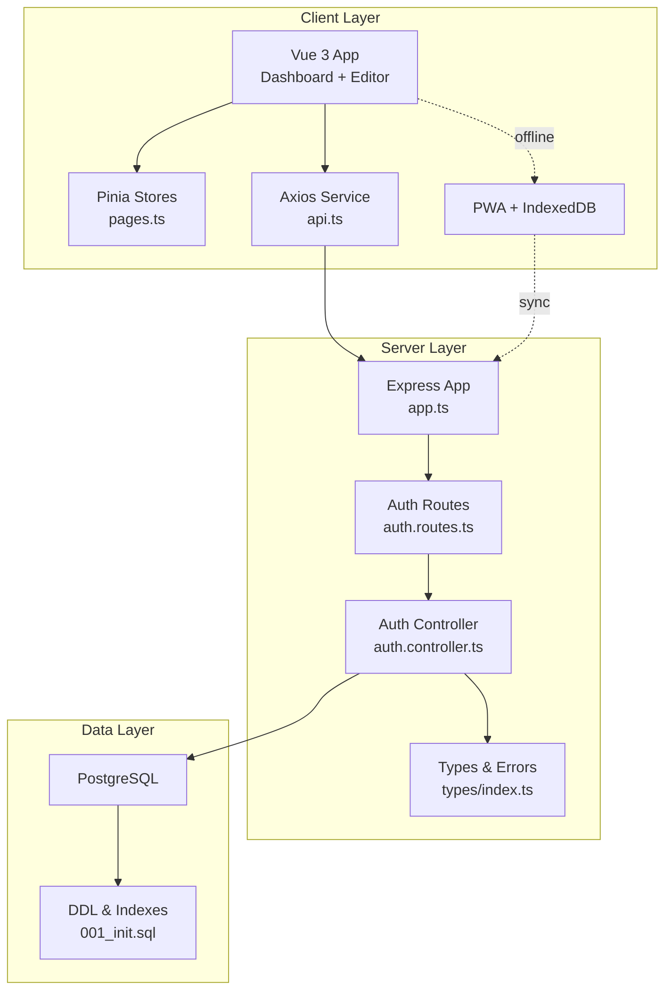
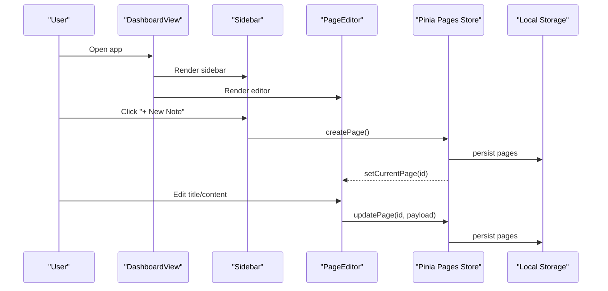
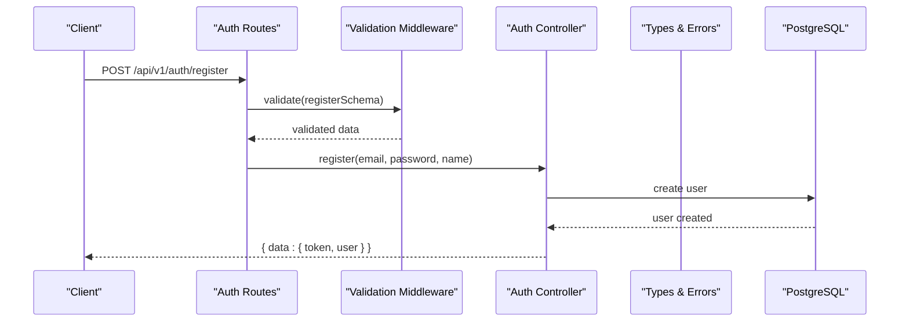
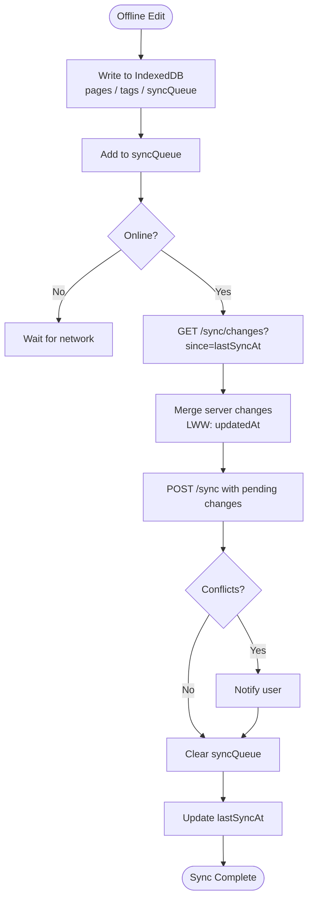
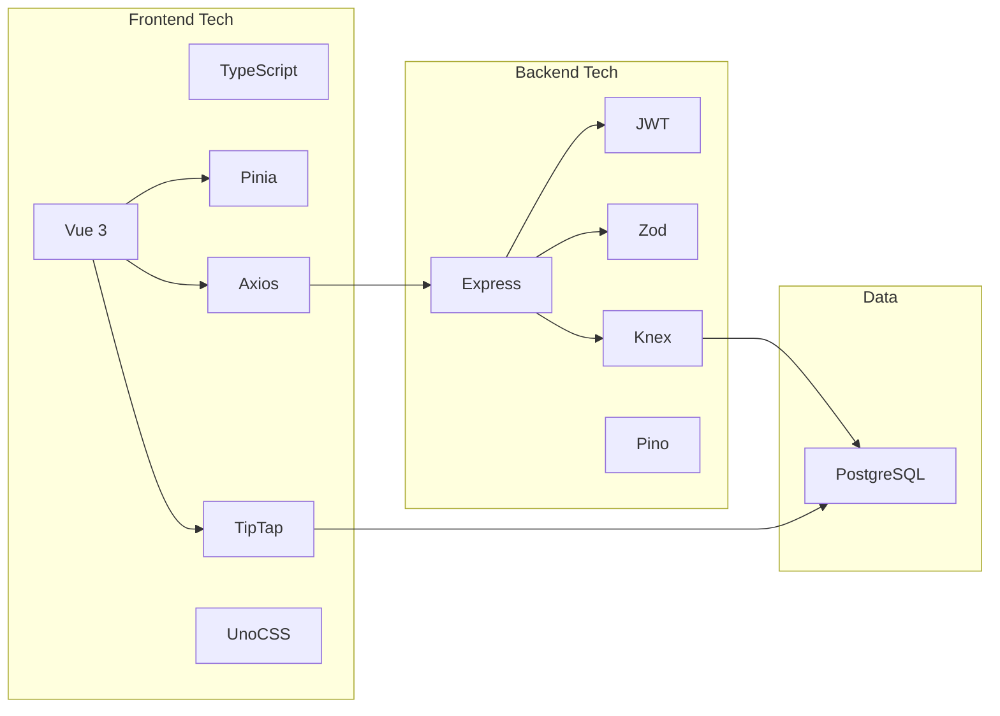

# Project Overview

<cite>
**Referenced Files in This Document**
- [README.md](file://README.md)
- [ARCHITECTURE.md](file://arch/ARCHITECTURE.md)
- [PRD-v1.0.md](file://prd/PRD-v1.0.md)
- [project-plan.md](file://plan/project-plan.md)
- [App.vue](file://code/client/src/App.vue)
- [DashboardView.vue](file://code/client/src/views/DashboardView.vue)
- [Sidebar.vue](file://code/client/src/components/sidebar/Sidebar.vue)
- [PageEditor.vue](file://code/client/src/components/editor/PageEditor.vue)
- [pages.ts](file://code/client/src/stores/pages.ts)
- [api.ts](file://code/client/src/services/api.ts)
- [app.ts](file://code/server/src/app.ts)
- [auth.controller.ts](file://code/server/src/controllers/auth.controller.ts)
- [auth.routes.ts](file://code/server/src/routes/auth.routes.ts)
- [index.ts](file://code/server/src/types/index.ts)
- [001_init.sql](file://db/001_init.sql)
- [package.json](file://code/client/package.json)
- [package.json](file://code/server/package.json)
</cite>

## Table of Contents
1. [Introduction](#introduction)
2. [Project Structure](#project-structure)
3. [Core Components](#core-components)
4. [Architecture Overview](#architecture-overview)
5. [Detailed Component Analysis](#detailed-component-analysis)
6. [Dependency Analysis](#dependency-analysis)
7. [Performance Considerations](#performance-considerations)
8. [Troubleshooting Guide](#troubleshooting-guide)
9. [Conclusion](#conclusion)
10. [Appendices](#appendices)

## Introduction
Yule Notion is a modern full-stack note-taking application designed as a personal knowledge notebook inspired by Notion. Its core value proposition centers on giving users complete control over their notes while delivering a smooth, offline-capable experience. The project targets individual knowledge workers who value self-hosted, privacy-focused solutions and require reliable offline editing with eventual synchronization.

Key differentiators:
- Modern full-stack architecture with Vue 3 frontend and Node.js backend
- Rich text editing powered by TipTap for block-based authoring
- Offline-first design with IndexedDB-backed local storage and automatic synchronization
- Self-deployable stack with Docker Compose and optional Electron desktop packaging
- Clean, efficient data model leveraging PostgreSQL JSONB and full-text search

Positioning in the market:
- Directly competes with personal note-taking tools emphasizing privacy and portability
- Appeals to users who want a Notion-like experience without cloud lock-in
- Offers a pragmatic MVP focused on core productivity needs (editing, organizing, searching, exporting, offline, and sync)

## Project Structure
The repository follows a monorepo layout with clear separation between client and server, plus supporting artifacts for API specs, architecture, design, and database.

**Diagram sources**
- [App.vue:1-20](file://code/client/src/App.vue#L1-L20)
- [DashboardView.vue:1-32](file://code/client/src/views/DashboardView.vue#L1-L32)
- [Sidebar.vue:1-216](file://code/client/src/components/sidebar/Sidebar.vue#L1-L216)
- [PageEditor.vue:1-208](file://code/client/src/components/editor/PageEditor.vue#L1-L208)
- [pages.ts:1-165](file://code/client/src/stores/pages.ts#L1-L165)
- [api.ts:1-64](file://code/client/src/services/api.ts#L1-L64)
- [app.ts:1-121](file://code/server/src/app.ts#L1-L121)
- [auth.routes.ts:1-106](file://code/server/src/routes/auth.routes.ts#L1-L106)
- [auth.controller.ts:1-82](file://code/server/src/controllers/auth.controller.ts#L1-L82)
- [index.ts:1-187](file://code/server/src/types/index.ts#L1-L187)
- [001_init.sql:1-254](file://db/001_init.sql#L1-L254)

**Section sources**
- [README.md:23-41](file://README.md#L23-L41)
- [ARCHITECTURE.md:288-307](file://arch/ARCHITECTURE.md#L288-L307)

## Core Components
- Frontend (Vue 3 SPA)
  - Router-driven layout with a dashboard view hosting sidebar and editor
  - Pinia-based state for pages and user session
  - Axios-based service layer with interceptors for auth and error handling
  - TipTap editor integrated for rich text editing with block-level operations
- Backend (Node.js + Express)
  - RESTful API under /api/v1 with JWT-based authentication
  - Zod-powered request validation and centralized error handling
  - Knex.js for database migrations and queries
- Database (PostgreSQL)
  - JSONB content storage for TipTap documents
  - Full-text search via GIN-indexed tsvector
  - Soft-delete and versioning for conflict detection

Practical examples:
- Creating and editing a page: open the dashboard, click “+ New Note,” type a title, and use the TipTap editor to insert blocks and images. Changes are automatically saved locally and synchronized when online.
- Organizing pages: drag and drop to nest pages under parent nodes in the sidebar tree.
- Searching and filtering: use the global search bar or Ctrl+K shortcut to find pages by title or content; apply tags to narrow results.
- Offline usage: with PWA enabled, the app remains usable offline; upon reconnection, queued changes are pushed and remote updates are merged.

**Section sources**
- [DashboardView.vue:10-23](file://code/client/src/views/DashboardView.vue#L10-L23)
- [Sidebar.vue:11-23](file://code/client/src/components/sidebar/Sidebar.vue#L11-L23)
- [PageEditor.vue:10-49](file://code/client/src/components/editor/PageEditor.vue#L10-L49)
- [pages.ts:44-164](file://code/client/src/stores/pages.ts#L44-L164)
- [api.ts:14-63](file://code/client/src/services/api.ts#L14-L63)
- [auth.controller.ts:26-81](file://code/server/src/controllers/auth.controller.ts#L26-L81)
- [auth.routes.ts:20-105](file://code/server/src/routes/auth.routes.ts#L20-L105)
- [001_init.sql:36-76](file://db/001_init.sql#L36-L76)

## Architecture Overview
The system adopts a classic three-tier architecture with front-end separation:
- Client layer: Vue 3 SPA with TipTap editor, Pinia state, and PWA caching
- Server layer: Express REST API with JWT auth, Zod validation, and Knex data access
- Data layer: PostgreSQL with JSONB for rich content and GIN indexes for full-text search

**Diagram sources**
- [DashboardView.vue:1-32](file://code/client/src/views/DashboardView.vue#L1-L32)
- [pages.ts:1-165](file://code/client/src/stores/pages.ts#L1-L165)
- [api.ts:1-64](file://code/client/src/services/api.ts#L1-L64)
- [app.ts:65-121](file://code/server/src/app.ts#L65-L121)
- [auth.routes.ts:20-105](file://code/server/src/routes/auth.routes.ts#L20-L105)
- [auth.controller.ts:1-82](file://code/server/src/controllers/auth.controller.ts#L1-L82)
- [index.ts:1-187](file://code/server/src/types/index.ts#L1-L187)
- [001_init.sql:1-254](file://db/001_init.sql#L1-L254)

**Section sources**
- [ARCHITECTURE.md:12-98](file://arch/ARCHITECTURE.md#L12-L98)
- [README.md:5-22](file://README.md#L5-L22)

## Detailed Component Analysis

### Frontend: Page Management and Rich Text Editing
- Layout and navigation: DashboardView orchestrates the sidebar and editor areas; App.vue hosts routing.
- Page management: pages store encapsulates CRUD actions, current selection, and persistence to local storage.
- Rich text editing: PageEditor integrates TipTap via a dedicated component, supports block insertion and content updates, and persists changes to local storage immediately.

**Diagram sources**
- [DashboardView.vue:10-23](file://code/client/src/views/DashboardView.vue#L10-L23)
- [Sidebar.vue:11-23](file://code/client/src/components/sidebar/Sidebar.vue#L11-L23)
- [PageEditor.vue:10-49](file://code/client/src/components/editor/PageEditor.vue#L10-L49)
- [pages.ts:73-104](file://code/client/src/stores/pages.ts#L73-L104)

**Section sources**
- [DashboardView.vue:10-23](file://code/client/src/views/DashboardView.vue#L10-L23)
- [Sidebar.vue:11-23](file://code/client/src/components/sidebar/Sidebar.vue#L11-L23)
- [PageEditor.vue:10-49](file://code/client/src/components/editor/PageEditor.vue#L10-L49)
- [pages.ts:44-164](file://code/client/src/stores/pages.ts#L44-L164)

### Backend: Authentication and API Design
- Express app configures security headers, CORS, rate limiting, logging, health checks, and routes.
- Auth routes define registration, login, and profile retrieval with Zod validation and JWT middleware.
- Controllers delegate to services and return structured responses; errors are normalized via a shared error type.

**Diagram sources**
- [app.ts:65-121](file://code/server/src/app.ts#L65-L121)
- [auth.routes.ts:20-105](file://code/server/src/routes/auth.routes.ts#L20-L105)
- [auth.controller.ts:26-81](file://code/server/src/controllers/auth.controller.ts#L26-L81)
- [index.ts:87-168](file://code/server/src/types/index.ts#L87-L168)
- [001_init.sql:14-25](file://db/001_init.sql#L14-L25)

**Section sources**
- [app.ts:29-121](file://code/server/src/app.ts#L29-L121)
- [auth.routes.ts:20-105](file://code/server/src/routes/auth.routes.ts#L20-L105)
- [auth.controller.ts:26-81](file://code/server/src/controllers/auth.controller.ts#L26-L81)
- [index.ts:87-168](file://code/server/src/types/index.ts#L87-L168)

### Offline Synchronization and Data Model
- Local data layer: IndexedDB-backed persistence for pages, tags, sync queue, and metadata.
- Sync engine: incremental timestamp-based synchronization with a Last-Write-Wins strategy; handles conflicts and updates last-sync timestamps.
- Database model: JSONB content storage, GIN-indexed full-text search vector, soft-delete with versioning, and associated tables for tags and uploads.

**Diagram sources**
- [ARCHITECTURE.md:315-352](file://arch/ARCHITECTURE.md#L315-L352)
- [ARCHITECTURE.md:354-396](file://arch/ARCHITECTURE.md#L354-L396)
- [ARCHITECTURE.md:398-469](file://arch/ARCHITECTURE.md#L398-L469)
- [001_init.sql:36-76](file://db/001_init.sql#L36-L76)

**Section sources**
- [ARCHITECTURE.md:311-518](file://arch/ARCHITECTURE.md#L311-L518)
- [001_init.sql:36-159](file://db/001_init.sql#L36-L159)

## Dependency Analysis
Technology choices and design philosophy:
- Frontend: Vue 3 + TypeScript for type safety and Composition API; Pinia for lightweight state; TipTap for block-based editing; UnoCSS for atomic styling; Axios for HTTP with interceptors; Vite for fast builds.
- Backend: Express + TypeScript; JWT for auth; Zod for runtime validation; Knex for migrations and SQL; Pino for logging; Helmet + CORS + rate limiting for security.
- Database: PostgreSQL with JSONB for rich content, GIN indexes for full-text search, and triggers to maintain search vectors.

**Diagram sources**
- [package.json:11-40](file://code/client/package.json#L11-L40)
- [package.json:15-26](file://code/server/package.json#L15-L26)
- [001_init.sql:1-254](file://db/001_init.sql#L1-L254)

**Section sources**
- [README.md:5-22](file://README.md#L5-L22)
- [package.json:11-40](file://code/client/package.json#L11-L40)
- [package.json:15-26](file://code/server/package.json#L15-L26)

## Performance Considerations
- Client-side responsiveness: Debounced auto-save reduces write frequency; TipTap’s virtual DOM minimizes reflows during editing.
- Database efficiency: JSONB storage avoids normalization overhead for content; GIN indexes accelerate full-text search; optimized composite indexes support tree queries and ordering.
- API throughput: Rate limiting prevents abuse; health checks and structured logging enable monitoring.
- Offline performance: IndexedDB transactions and local cache reduce network dependency; PWA caching ensures fast app shell loads.

[No sources needed since this section provides general guidance]

## Troubleshooting Guide
Common issues and remedies:
- Authentication failures: Verify JWT token presence in localStorage and Authorization header injection; check 401 handling and redirect to login.
- Validation errors: Ensure request bodies match Zod schemas for registration and login; confirm field constraints (length, format).
- Database connectivity: Confirm DATABASE_URL and migrations applied; check Knex configuration and PostgreSQL availability.
- Search not returning results: Confirm GIN index exists and trigger maintains search_vector; validate content extraction logic.

**Section sources**
- [api.ts:30-61](file://code/client/src/services/api.ts#L30-L61)
- [auth.routes.ts:35-66](file://code/server/src/routes/auth.routes.ts#L35-L66)
- [app.ts:73-96](file://code/server/src/app.ts#L73-L96)
- [001_init.sql:164-213](file://db/001_init.sql#L164-L213)

## Conclusion
Yule Notion delivers a focused, privacy-respecting note-taking experience built on modern web technologies. Its clean architecture, robust offline-first design, and pragmatic feature set position it as a strong alternative for personal knowledge management. The combination of Vue 3 + Express, TipTap, and PostgreSQL provides a scalable foundation for future enhancements while maintaining simplicity and performance.

[No sources needed since this section summarizes without analyzing specific files]

## Appendices
- Product goals and acceptance criteria are defined in the PRD, including core editing, offline capability, Docker deployment, and Electron packaging.
- The project plan outlines a tight 7-day MVP with clear milestones and risk mitigation strategies.

**Section sources**
- [PRD-v1.0.md:23-31](file://prd/PRD-v1.0.md#L23-L31)
- [project-plan.md:8-21](file://plan/project-plan.md#L8-L21)