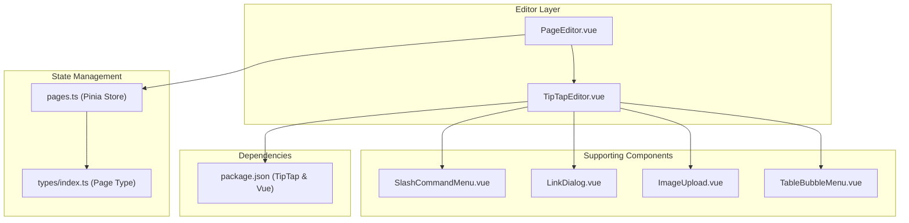
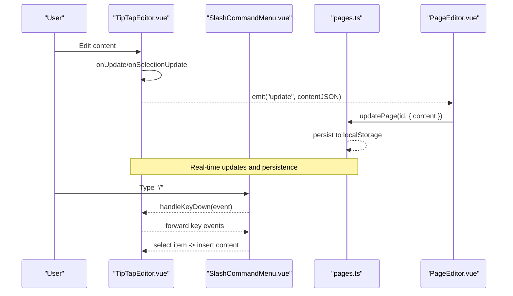
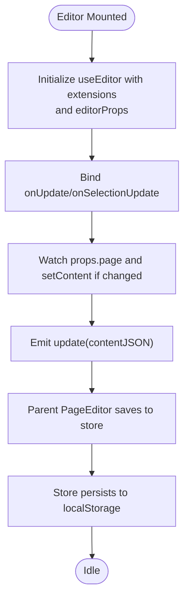
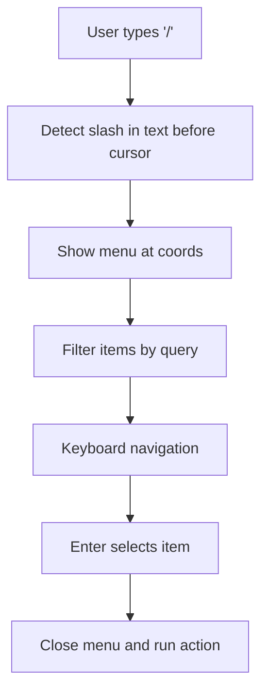
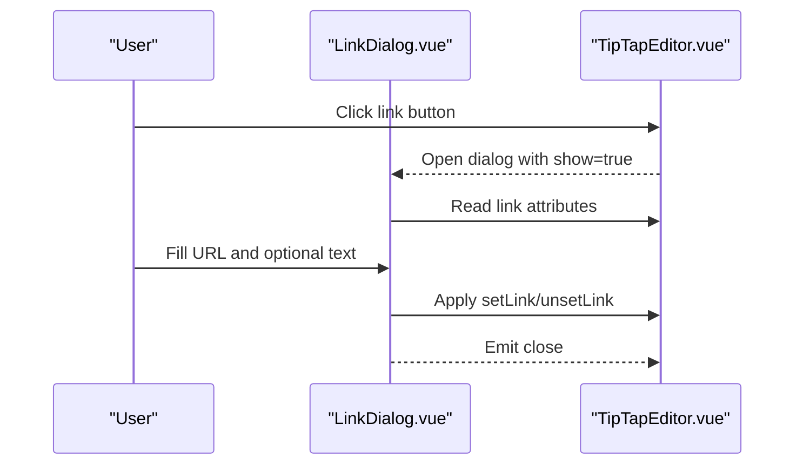
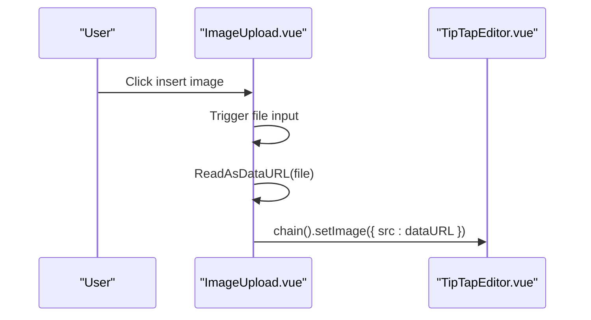
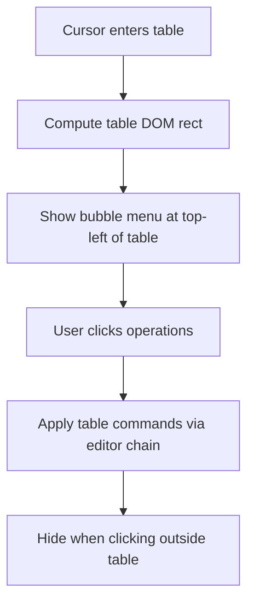
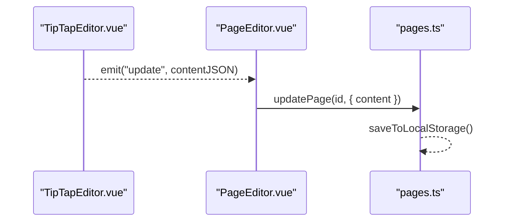
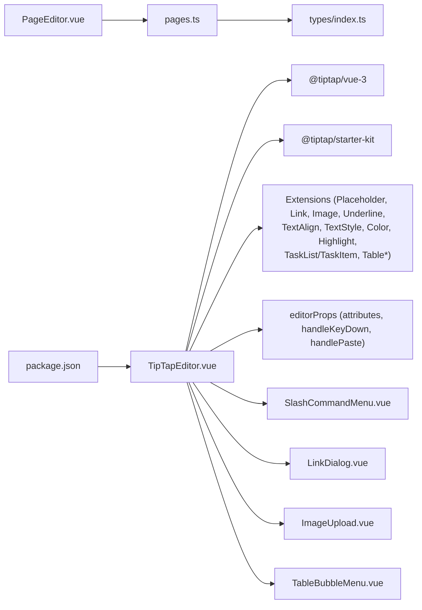

# Core Editor Implementation

<cite>
**Referenced Files in This Document**
- [TipTapEditor.vue](file://code/client/src/components/editor/TipTapEditor.vue)
- [PageEditor.vue](file://code/client/src/components/editor/PageEditor.vue)
- [pages.ts](file://code/client/src/stores/pages.ts)
- [index.ts](file://code/client/src/types/index.ts)
- [SlashCommandMenu.vue](file://code/client/src/components/editor/SlashCommandMenu.vue)
- [LinkDialog.vue](file://code/client/src/components/editor/LinkDialog.vue)
- [ImageUpload.vue](file://code/client/src/components/editor/ImageUpload.vue)
- [TableBubbleMenu.vue](file://code/client/src/components/editor/TableBubbleMenu.vue)
- [package.json](file://code/client/package.json)
</cite>

## Table of Contents
1. [Introduction](#introduction)
2. [Project Structure](#project-structure)
3. [Core Components](#core-components)
4. [Architecture Overview](#architecture-overview)
5. [Detailed Component Analysis](#detailed-component-analysis)
6. [Dependency Analysis](#dependency-analysis)
7. [Performance Considerations](#performance-considerations)
8. [Troubleshooting Guide](#troubleshooting-guide)
9. [Conclusion](#conclusion)

## Introduction
This document provides comprehensive documentation for the core TipTapEditor component implementation. It explains the editor initialization process, extension configuration, state management patterns, lifecycle, content serialization/deserialization, real-time update handling, editorProps configuration, content synchronization mechanisms, performance considerations, and practical examples for extending the editor with custom extensions.

## Project Structure
The editor is implemented as a Vue 3 component using TipTap’s Vue integration. It integrates with supporting components for slash commands, links, images, and table operations, and synchronizes content with a Pinia store.

**Diagram sources**
- [TipTapEditor.vue:13-329](file://code/client/src/components/editor/TipTapEditor.vue#L13-L329)
- [PageEditor.vue:10-49](file://code/client/src/components/editor/PageEditor.vue#L10-L49)
- [pages.ts:44-164](file://code/client/src/stores/pages.ts#L44-L164)
- [index.ts:72-90](file://code/client/src/types/index.ts#L72-L90)
- [SlashCommandMenu.vue:11-168](file://code/client/src/components/editor/SlashCommandMenu.vue#L11-L168)
- [LinkDialog.vue:10-84](file://code/client/src/components/editor/LinkDialog.vue#L10-L84)
- [ImageUpload.vue:9-44](file://code/client/src/components/editor/ImageUpload.vue#L9-L44)
- [TableBubbleMenu.vue:13-163](file://code/client/src/components/editor/TableBubbleMenu.vue#L13-L163)
- [package.json:11-41](file://code/client/package.json#L11-L41)

**Section sources**
- [TipTapEditor.vue:13-329](file://code/client/src/components/editor/TipTapEditor.vue#L13-L329)
- [PageEditor.vue:10-49](file://code/client/src/components/editor/PageEditor.vue#L10-L49)
- [pages.ts:44-164](file://code/client/src/stores/pages.ts#L44-L164)
- [index.ts:72-90](file://code/client/src/types/index.ts#L72-L90)
- [SlashCommandMenu.vue:11-168](file://code/client/src/components/editor/SlashCommandMenu.vue#L11-L168)
- [LinkDialog.vue:10-84](file://code/client/src/components/editor/LinkDialog.vue#L10-L84)
- [ImageUpload.vue:9-44](file://code/client/src/components/editor/ImageUpload.vue#L9-L44)
- [TableBubbleMenu.vue:13-163](file://code/client/src/components/editor/TableBubbleMenu.vue#L13-L163)
- [package.json:11-41](file://code/client/package.json#L11-L41)

## Core Components
- TipTapEditor.vue: The primary editor component that initializes TipTap, configures extensions, handles events, and manages UI interactions.
- PageEditor.vue: Wraps the TipTapEditor and coordinates with the pages store for content persistence and title editing.
- Supporting components: SlashCommandMenu.vue, LinkDialog.vue, ImageUpload.vue, TableBubbleMenu.vue.
- State management: pages.ts (Pinia store) and types/index.ts (Page interface).

Key responsibilities:
- Editor initialization and extension configuration
- Real-time content updates and serialization
- Content synchronization with page data
- Toolbars and contextual menus
- Paste handling and keyboard shortcuts
- Lifecycle cleanup and memory management

**Section sources**
- [TipTapEditor.vue:13-329](file://code/client/src/components/editor/TipTapEditor.vue#L13-L329)
- [PageEditor.vue:10-49](file://code/client/src/components/editor/PageEditor.vue#L10-L49)
- [pages.ts:44-164](file://code/client/src/stores/pages.ts#L44-L164)
- [index.ts:72-90](file://code/client/src/types/index.ts#L72-L90)

## Architecture Overview
The editor follows a unidirectional data flow with two-way synchronization:
- TipTap emits updates to the parent component (PageEditor).
- Parent component persists updates to the pages store.
- Watchers synchronize external page changes into the editor.

**Diagram sources**
- [TipTapEditor.vue:177-188](file://code/client/src/components/editor/TipTapEditor.vue#L177-L188)
- [SlashCommandMenu.vue:118-148](file://code/client/src/components/editor/SlashCommandMenu.vue#L118-L148)
- [PageEditor.vue:45-49](file://code/client/src/components/editor/PageEditor.vue#L45-L49)
- [pages.ts:98-104](file://code/client/src/stores/pages.ts#L98-L104)

## Detailed Component Analysis

### TipTapEditor.vue: Initialization, Extensions, and Events
- Initialization: Creates a TipTap editor instance with useEditor and configures extensions.
- Extensions: StarterKit (with heading levels and list behavior), Placeholder, Link, Image, Underline, TextAlign, TextStyle, Color, Highlight, TaskList/TaskItem, Table family, and more.
- EditorProps:
  - attributes: ProseMirror class configuration and focus behavior.
  - handleKeyDown: Delegates slash command keyboard handling to the slash menu component.
  - handlePaste: Detects clipboard image items and inserts base64-encoded images.
- Event handlers:
  - onUpdate: Emits content JSON to parent and triggers slash command detection.
  - onSelectionUpdate: Controls toolbar visibility and slash command detection.
- Slash command menu:
  - Detects "/" in text before cursor and computes position.
  - Provides selectable items with actions bound to editor chain commands.
- Content synchronization:
  - Watches incoming page prop and syncs content if it differs from editor JSON.
  - Emits empty doc when no page is present.
- Toolbar visibility:
  - Auto-hide with delay and debounced show on focus.
  - Handles scroll to hide when scrolled down.
- Cleanup:
  - Destroys editor instance and clears timers on unmount.

**Diagram sources**
- [TipTapEditor.vue:112-188](file://code/client/src/components/editor/TipTapEditor.vue#L112-L188)
- [TipTapEditor.vue:301-308](file://code/client/src/components/editor/TipTapEditor.vue#L301-L308)
- [TipTapEditor.vue:177-188](file://code/client/src/components/editor/TipTapEditor.vue#L177-L188)

**Section sources**
- [TipTapEditor.vue:112-188](file://code/client/src/components/editor/TipTapEditor.vue#L112-L188)
- [TipTapEditor.vue:190-274](file://code/client/src/components/editor/TipTapEditor.vue#L190-L274)
- [TipTapEditor.vue:286-329](file://code/client/src/components/editor/TipTapEditor.vue#L286-L329)

### SlashCommandMenu.vue: Command Menu Behavior
- Keyboard navigation: Up/Down cycles selection, Enter selects, Escape closes.
- Filtering: Filters items by label, description, or id when query is provided.
- Grouping: Shows “Recently Used” group when query is empty.
- Persistence: Stores recent command IDs in localStorage.

**Diagram sources**
- [TipTapEditor.vue:243-274](file://code/client/src/components/editor/TipTapEditor.vue#L243-L274)
- [SlashCommandMenu.vue:67-97](file://code/client/src/components/editor/SlashCommandMenu.vue#L67-L97)
- [SlashCommandMenu.vue:118-148](file://code/client/src/components/editor/SlashCommandMenu.vue#L118-L148)

**Section sources**
- [SlashCommandMenu.vue:11-168](file://code/client/src/components/editor/SlashCommandMenu.vue#L11-L168)

### LinkDialog.vue: Link Editing and Insertion
- Detects existing link attributes and pre-fills URL when editing.
- Supports inserting a link with selected text or standalone link.
- Emits close to reset state and dismiss dialog.

**Diagram sources**
- [TipTapEditor.vue:438-443](file://code/client/src/components/editor/TipTapEditor.vue#L438-L443)
- [LinkDialog.vue:27-84](file://code/client/src/components/editor/LinkDialog.vue#L27-L84)

**Section sources**
- [LinkDialog.vue:10-84](file://code/client/src/components/editor/LinkDialog.vue#L10-L84)

### ImageUpload.vue: Image Insertion
- Triggers file input click and reads selected images as base64.
- Inserts images into the editor using setImage.

**Diagram sources**
- [ImageUpload.vue:19-44](file://code/client/src/components/editor/ImageUpload.vue#L19-L44)
- [TipTapEditor.vue:224-239](file://code/client/src/components/editor/TipTapEditor.vue#L224-L239)

**Section sources**
- [ImageUpload.vue:9-44](file://code/client/src/components/editor/ImageUpload.vue#L9-L44)

### TableBubbleMenu.vue: Table Operations
- Detects when the cursor is inside a table and positions a floating menu above the table.
- Provides operations: equal/auto width, header row/column toggles, insert/delete rows/columns, merge/split cells, delete table.
- Listens to selectionUpdate and transaction events to keep visibility and position up-to-date.

**Diagram sources**
- [TableBubbleMenu.vue:27-62](file://code/client/src/components/editor/TableBubbleMenu.vue#L27-L62)
- [TableBubbleMenu.vue:138-163](file://code/client/src/components/editor/TableBubbleMenu.vue#L138-L163)

**Section sources**
- [TableBubbleMenu.vue:13-163](file://code/client/src/components/editor/TableBubbleMenu.vue#L13-L163)

### PageEditor.vue: Content Synchronization and Persistence
- Wires TipTapEditor to the pages store.
- Saves content updates to the store and persists to localStorage.
- Manages title editing and metadata display.

**Diagram sources**
- [PageEditor.vue:45-49](file://code/client/src/components/editor/PageEditor.vue#L45-L49)
- [pages.ts:98-104](file://code/client/src/stores/pages.ts#L98-L104)

**Section sources**
- [PageEditor.vue:10-49](file://code/client/src/components/editor/PageEditor.vue#L10-L49)
- [pages.ts:98-104](file://code/client/src/stores/pages.ts#L98-L104)

## Dependency Analysis
- TipTap ecosystem: @tiptap/vue-3, @tiptap/starter-kit, and individual extensions for placeholder, link, image, underline, text-align, text-style, color, highlight, task-list, task-item, and table family.
- UI and utilities: vue, pinia, emoji-picker-element, axios, vue-router, @vueuse/core.
- EditorProps dependencies: handleKeyDown and handlePaste rely on slash menu component and FileReader API.

**Diagram sources**
- [TipTapEditor.vue:15-141](file://code/client/src/components/editor/TipTapEditor.vue#L15-L141)
- [SlashCommandMenu.vue:11-168](file://code/client/src/components/editor/SlashCommandMenu.vue#L11-L168)
- [LinkDialog.vue:10-84](file://code/client/src/components/editor/LinkDialog.vue#L10-L84)
- [ImageUpload.vue:9-44](file://code/client/src/components/editor/ImageUpload.vue#L9-L44)
- [TableBubbleMenu.vue:13-163](file://code/client/src/components/editor/TableBubbleMenu.vue#L13-L163)
- [PageEditor.vue:10-49](file://code/client/src/components/editor/PageEditor.vue#L10-L49)
- [pages.ts:44-164](file://code/client/src/stores/pages.ts#L44-L164)
- [index.ts:72-90](file://code/client/src/types/index.ts#L72-L90)
- [package.json:11-41](file://code/client/package.json#L11-L41)

**Section sources**
- [package.json:11-41](file://code/client/package.json#L11-L41)
- [TipTapEditor.vue:15-141](file://code/client/src/components/editor/TipTapEditor.vue#L15-L141)

## Performance Considerations
- Large documents:
  - Prefer incremental updates via onUpdate and avoid unnecessary deep watchers.
  - Limit frequent re-computation of derived state; use computed properties judiciously.
  - Debounce toolbar visibility to reduce reflows.
- Memory management:
  - Destroy the editor instance on unmount to prevent leaks.
  - Clear timeouts and intervals to avoid lingering timers.
- Serialization:
  - TipTap JSON is compact and efficient; avoid serializing unnecessarily.
  - Batch store updates to minimize storage writes.
- Rendering:
  - Use Teleport for menus to avoid deep DOM nesting.
  - Keep table operations lightweight; avoid excessive DOM manipulation.

[No sources needed since this section provides general guidance]

## Troubleshooting Guide
- Editor not updating:
  - Verify props.page changes are detected and setContent is invoked when JSON differs.
  - Ensure onUpdate emits content JSON and parent saves to store.
- Slash menu not appearing:
  - Confirm handleKeyDown delegates to slash menu and slash command detection logic runs.
  - Check global click handler removes slash menu when clicking away.
- Paste image not inserted:
  - Ensure handlePaste detects image items and converts to data URL before insertion.
- Toolbar not hiding:
  - Validate hide timeout and scroll threshold logic.
- Table menu not visible:
  - Confirm selectionUpdate/transaction listeners are attached and DOM rect is computed.

**Section sources**
- [TipTapEditor.vue:301-308](file://code/client/src/components/editor/TipTapEditor.vue#L301-L308)
- [TipTapEditor.vue:147-175](file://code/client/src/components/editor/TipTapEditor.vue#L147-L175)
- [TipTapEditor.vue:104-109](file://code/client/src/components/editor/TipTapEditor.vue#L104-L109)
- [TableBubbleMenu.vue:138-163](file://code/client/src/components/editor/TableBubbleMenu.vue#L138-L163)

## Conclusion
The TipTapEditor component provides a robust, extensible rich text editing experience with integrated toolbars, slash commands, links, images, and tables. Its architecture emphasizes real-time updates, content synchronization with the pages store, and clean lifecycle management. By leveraging TipTap’s modular extension system and Vue’s reactive patterns, the editor scales effectively while maintaining a responsive UI.