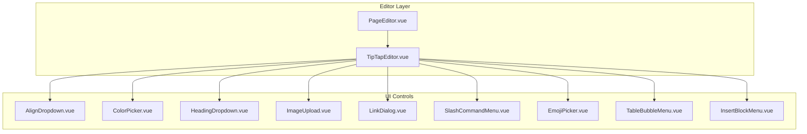
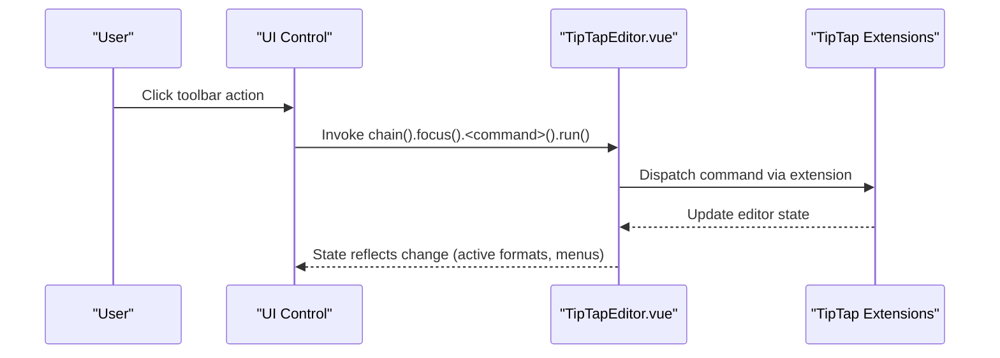
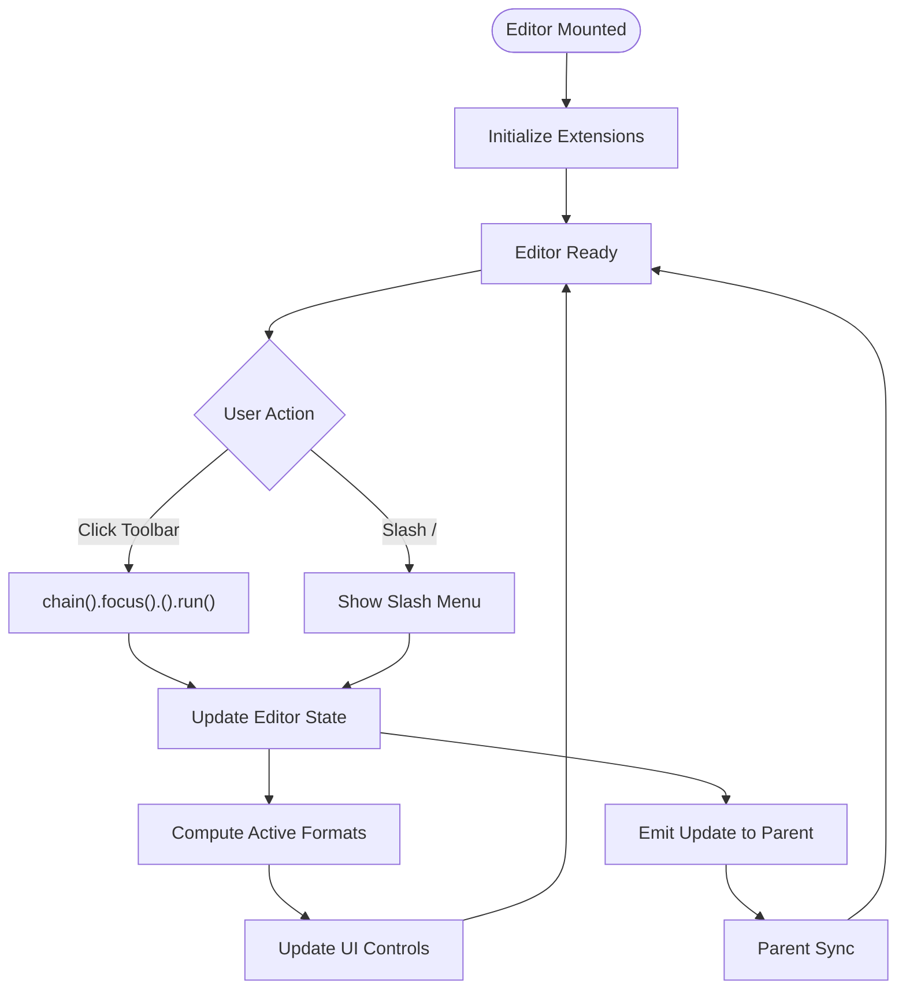

# Editor Extensions & Extensions System

<cite>
**Referenced Files in This Document**
- [TipTapEditor.vue](file://code/client/src/components/editor/TipTapEditor.vue)
- [PageEditor.vue](file://code/client/src/components/editor/PageEditor.vue)
- [AlignDropdown.vue](file://code/client/src/components/editor/AlignDropdown.vue)
- [ColorPicker.vue](file://code/client/src/components/editor/ColorPicker.vue)
- [HeadingDropdown.vue](file://code/client/src/components/editor/HeadingDropdown.vue)
- [ImageUpload.vue](file://code/client/src/components/editor/ImageUpload.vue)
- [LinkDialog.vue](file://code/client/src/components/editor/LinkDialog.vue)
- [TableBubbleMenu.vue](file://code/client/src/components/editor/TableBubbleMenu.vue)
- [SlashCommandMenu.vue](file://code/client/src/components/editor/SlashCommandMenu.vue)
- [EmojiPicker.vue](file://code/client/src/components/editor/EmojiPicker.vue)
- [InsertBlockMenu.vue](file://code/client/src/components/editor/InsertBlockMenu.vue)
- [package.json](file://code/client/package.json)
</cite>

## Table of Contents
1. [Introduction](#introduction)
2. [Project Structure](#project-structure)
3. [Core Components](#core-components)
4. [Architecture Overview](#architecture-overview)
5. [Detailed Component Analysis](#detailed-component-analysis)
6. [Dependency Analysis](#dependency-analysis)
7. [Performance Considerations](#performance-considerations)
8. [Troubleshooting Guide](#troubleshooting-guide)
9. [Conclusion](#conclusion)
10. [Appendices](#appendices)

## Introduction
This document explains the TipTap extension system used in the project and details the configuration and behavior of the included editor extensions. It covers the extension lifecycle, configuration options, customization patterns, and how extensions interact with each other and the editor state. It also documents extension-specific features such as table resizing, task list nesting, and placeholder text customization. Finally, it provides examples for adding custom extensions, configuring existing ones, troubleshooting conflicts, and best practices for performance and extension selection.

## Project Structure
The editor is implemented as a Vue component that composes TipTap extensions into a cohesive rich text editing experience. The main TipTap editor component initializes the editor instance with a curated set of extensions and wires up UI controls to drive editor commands. Supporting components encapsulate toolbar actions and menus.

**Diagram sources**
- [PageEditor.vue:10-125](file://code/client/src/components/editor/PageEditor.vue#L10-L125)
- [TipTapEditor.vue:13-499](file://code/client/src/components/editor/TipTapEditor.vue#L13-L499)
- [AlignDropdown.vue:9-160](file://code/client/src/components/editor/AlignDropdown.vue#L9-L160)
- [ColorPicker.vue:9-192](file://code/client/src/components/editor/ColorPicker.vue#L9-L192)
- [HeadingDropdown.vue:9-148](file://code/client/src/components/editor/HeadingDropdown.vue#L9-L148)
- [ImageUpload.vue:9-90](file://code/client/src/components/editor/ImageUpload.vue#L9-L90)
- [LinkDialog.vue:10-155](file://code/client/src/components/editor/LinkDialog.vue#L10-L155)
- [SlashCommandMenu.vue:11-300](file://code/client/src/components/editor/SlashCommandMenu.vue#L11-L300)
- [EmojiPicker.vue:10-198](file://code/client/src/components/editor/EmojiPicker.vue#L10-L198)
- [TableBubbleMenu.vue:13-337](file://code/client/src/components/editor/TableBubbleMenu.vue#L13-L337)
- [InsertBlockMenu.vue:11-410](file://code/client/src/components/editor/InsertBlockMenu.vue#L11-L410)

**Section sources**
- [PageEditor.vue:10-125](file://code/client/src/components/editor/PageEditor.vue#L10-L125)
- [TipTapEditor.vue:13-499](file://code/client/src/components/editor/TipTapEditor.vue#L13-L499)

## Core Components
- TipTapEditor: Initializes the editor with a configured set of extensions, editor props, and event handlers. It emits updates to the parent and manages toolbar visibility and slash command menu.
- PageEditor: Wraps the TipTapEditor and synchronizes page metadata and content with the store.
- UI Controls: AlignDropdown, ColorPicker, HeadingDropdown, ImageUpload, LinkDialog, SlashCommandMenu, EmojiPicker, TableBubbleMenu, InsertBlockMenu.

Key responsibilities:
- Extension initialization and configuration
- Editor lifecycle hooks and cleanup
- Event-driven updates (onUpdate, onSelectionUpdate)
- Integration with external UI components

**Section sources**
- [TipTapEditor.vue:112-188](file://code/client/src/components/editor/TipTapEditor.vue#L112-L188)
- [PageEditor.vue:10-64](file://code/client/src/components/editor/PageEditor.vue#L10-L64)

## Architecture Overview
The editor composes TipTap extensions into a single editor instance. Each extension contributes capabilities (commands, input rules, paste handlers, etc.) and interacts with the editor state. UI controls invoke chainable commands to mutate editor state safely.

**Diagram sources**
- [TipTapEditor.vue:310-322](file://code/client/src/components/editor/TipTapEditor.vue#L310-L322)
- [AlignDropdown.vue:36-39](file://code/client/src/components/editor/AlignDropdown.vue#L36-L39)
- [ColorPicker.vue:49-64](file://code/client/src/components/editor/ColorPicker.vue#L49-L64)
- [HeadingDropdown.vue:30-43](file://code/client/src/components/editor/HeadingDropdown.vue#L30-L43)
- [ImageUpload.vue:33-44](file://code/client/src/components/editor/ImageUpload.vue#L33-L44)
- [LinkDialog.vue:50-76](file://code/client/src/components/editor/LinkDialog.vue#L50-L76)
- [TableBubbleMenu.vue:218-271](file://code/client/src/components/editor/TableBubbleMenu.vue#L218-L271)
- [SlashCommandMenu.vue:157-160](file://code/client/src/components/editor/SlashCommandMenu.vue#L157-L160)
- [EmojiPicker.vue:54-57](file://code/client/src/components/editor/EmojiPicker.vue#L54-L57)
- [InsertBlockMenu.vue:119-159](file://code/client/src/components/editor/InsertBlockMenu.vue#L119-L159)

## Detailed Component Analysis

### TipTapEditor: Extension Configuration and Lifecycle
- Extensions initialized:
  - StarterKit with heading levels and list behavior
  - Placeholder with dynamic placeholder text per node type
  - Link with openOnClick disabled
  - Image
  - Underline
  - TextAlign restricted to heading and paragraph
  - TextStyle
  - Color
  - Highlight with multicolor enabled
  - TaskList
  - TaskItem with nested: true
  - Table with resizable and custom HTML attributes
  - TableRow, TableCell, TableHeader
- Editor props:
  - Attributes class for prose styling
  - handleKeyDown integrates slash menu
  - handlePaste inserts images from clipboard
- Lifecycle:
  - Emits update events with editor.getJSON()
  - Tracks selection to show toolbar and slash menu
  - Destroys editor on unmount

Extension-specific configuration highlights:
- Placeholder placeholder callback selects per-node type
- TextAlign applies to heading and paragraph
- Highlight multicolor enables distinct highlight colors
- TaskItem nested allows nested task lists
- Table resizable enables column resize handles

**Section sources**
- [TipTapEditor.vue:112-188](file://code/client/src/components/editor/TipTapEditor.vue#L112-L188)
- [TipTapEditor.vue:190-274](file://code/client/src/components/editor/TipTapEditor.vue#L190-L274)
- [TipTapEditor.vue:310-322](file://code/client/src/components/editor/TipTapEditor.vue#L310-L322)
- [TipTapEditor.vue:324-328](file://code/client/src/components/editor/TipTapEditor.vue#L324-L328)

### Extension Lifecycle and Interaction
- Initialization: Extensions are constructed and registered during useEditor initialization.
- Commands: UI controls call chain().focus().<command>().run() to apply changes.
- State observation: computed activeFormats reflect current selection state.
- Events: onUpdate and onSelectionUpdate propagate editor state to UI and menus.
- Cleanup: Editor destroyed on component unmount.

**Diagram sources**
- [TipTapEditor.vue:112-188](file://code/client/src/components/editor/TipTapEditor.vue#L112-L188)
- [TipTapEditor.vue:310-322](file://code/client/src/components/editor/TipTapEditor.vue#L310-L322)
- [TipTapEditor.vue:190-274](file://code/client/src/components/editor/TipTapEditor.vue#L190-L274)

**Section sources**
- [TipTapEditor.vue:112-188](file://code/client/src/components/editor/TipTapEditor.vue#L112-L188)
- [TipTapEditor.vue:310-322](file://code/client/src/components/editor/TipTapEditor.vue#L310-L322)

### Placeholder Extension
- Behavior: Placeholder text appears when nodes are empty.
- Dynamic placeholder: Uses a callback to customize placeholder text depending on node type (e.g., heading vs. paragraph).
- Styling: Empty paragraph pseudo-element displays placeholder content.

Customization pattern:
- Configure placeholder via configure({ placeholder }) with a function receiving node info.

**Section sources**
- [TipTapEditor.vue:119-124](file://code/client/src/components/editor/TipTapEditor.vue#L119-L124)
- [TipTapEditor.vue:605-611](file://code/client/src/components/editor/TipTapEditor.vue#L605-L611)

### Link Extension
- Behavior: Manages link marks; openOnClick disabled to prevent automatic opening.
- UI integration: LinkDialog supports inserting, editing, and removing links.
- Selection-awareness: Dialog reads current selection and link attributes to prefill inputs.

Customization pattern:
- Configure via configure({ openOnClick }) and related link options.

**Section sources**
- [TipTapEditor.vue:125](file://code/client/src/components/editor/TipTapEditor.vue#L125)
- [LinkDialog.vue:27-48](file://code/client/src/components/editor/LinkDialog.vue#L27-L48)
- [LinkDialog.vue:50-76](file://code/client/src/components/editor/LinkDialog.vue#L50-L76)

### Image Extension
- Behavior: Inserts inline images with provided attributes.
- UI integration: ImageUpload triggers file selection and inserts base64 image content.
- Paste handling: TipTapEditor handlePaste detects image clipboard items and inserts them.

Customization pattern:
- Configure via setImage attributes and paste handlers.

**Section sources**
- [TipTapEditor.vue:126](file://code/client/src/components/editor/TipTapEditor.vue#L126)
- [ImageUpload.vue:33-44](file://code/client/src/components/editor/ImageUpload.vue#L33-L44)
- [TipTapEditor.vue:154-175](file://code/client/src/components/editor/TipTapEditor.vue#L154-L175)

### Underline Extension
- Behavior: Adds underline support via marks.
- UI integration: Toolbar button toggles underline active state.

Customization pattern:
- No special configuration required; use isActive checks and toggleUnderline.

**Section sources**
- [TipTapEditor.vue:127](file://code/client/src/components/editor/TipTapEditor.vue#L127)
- [TipTapEditor.vue:392-396](file://code/client/src/components/editor/TipTapEditor.vue#L392-L396)

### TextAlign Extension
- Behavior: Applies text alignment to specified node types (heading, paragraph).
- UI integration: AlignDropdown sets textAlign values.

Customization pattern:
- Configure via configure({ types }) to restrict targets.

**Section sources**
- [TipTapEditor.vue:128](file://code/client/src/components/editor/TipTapEditor.vue#L128)
- [AlignDropdown.vue:29-34](file://code/client/src/components/editor/AlignDropdown.vue#L29-L34)
- [AlignDropdown.vue:36-39](file://code/client/src/components/editor/AlignDropdown.vue#L36-L39)

### TextStyle and Color/Highlight Extensions
- TextStyle: Provides generic text style attributes.
- Color: Sets text color via marks.
- Highlight: Sets background highlight; multicolor enabled for distinct colors.

UI integration:
- ColorPicker toggles color/unsetColor and highlight toggle/unsetHighlight.

Customization pattern:
- Use getAttributes('textStyle'|'highlight') to read current values.

**Section sources**
- [TipTapEditor.vue:129-131](file://code/client/src/components/editor/TipTapEditor.vue#L129-L131)
- [ColorPicker.vue:49-71](file://code/client/src/components/editor/ColorPicker.vue#L49-L71)

### TaskList and TaskItem Extensions
- TaskList: Creates task list nodes.
- TaskItem: Creates task items with checked state; nested: true enables nested lists.

UI integration:
- Toolbar button toggles task list active state.

Customization pattern:
- Configure nested: true for hierarchical tasks.

**Section sources**
- [TipTapEditor.vue:132-133](file://code/client/src/components/editor/TipTapEditor.vue#L132-L133)
- [TipTapEditor.vue:429-433](file://code/client/src/components/editor/TipTapEditor.vue#L429-L433)

### Table Extensions (Table, TableRow, TableCell, TableHeader)
- Table: Resizable: true with custom HTML attributes for styling.
- TableRow, TableCell, TableHeader: Required for table structure.
- UI integration: TableBubbleMenu provides floating toolbar for table operations.

Extension-specific features:
- Column resize handles rendered via ProseMirror classes.
- Table bubble menu supports equal/auto width, header row/column toggles, insert/delete rows/columns, merge/split cells, and delete table.

**Section sources**
- [TipTapEditor.vue:134-140](file://code/client/src/components/editor/TipTapEditor.vue#L134-L140)
- [TipTapEditor.vue:811-829](file://code/client/src/components/editor/TipTapEditor.vue#L811-L829)
- [TableBubbleMenu.vue:27-62](file://code/client/src/components/editor/TableBubbleMenu.vue#L27-L62)
- [TableBubbleMenu.vue:64-104](file://code/client/src/components/editor/TableBubbleMenu.vue#L64-L104)
- [TableBubbleMenu.vue:218-271](file://code/client/src/components/editor/TableBubbleMenu.vue#L218-L271)

### Slash Command Menu
- Behavior: Detects “/” in text, computes position, and renders a categorized menu with keyboard navigation.
- Persistence: Stores recent commands in local storage.
- Integration: TipTapEditor forwards keydown to the slash menu; selection updates re-evaluate visibility.

Customization pattern:
- Extend getSlashMenuItems to add new commands; integrate with editor chain.

**Section sources**
- [TipTapEditor.vue:190-274](file://code/client/src/components/editor/TipTapEditor.vue#L190-L274)
- [SlashCommandMenu.vue:40-64](file://code/client/src/components/editor/SlashCommandMenu.vue#L40-L64)
- [SlashCommandMenu.vue:66-97](file://code/client/src/components/editor/SlashCommandMenu.vue#L66-L97)
- [SlashCommandMenu.vue:118-148](file://code/client/src/components/editor/SlashCommandMenu.vue#L118-L148)

### Additional UI Components
- HeadingDropdown: Switches between paragraph and headings 1–6.
- ColorPicker: Toggles text color and highlight color.
- ImageUpload: Uploads and inserts images.
- EmojiPicker: Inserts emojis with optional search.
- InsertBlockMenu: Alternative insertion menu with categories and recent history.

**Section sources**
- [HeadingDropdown.vue:22-28](file://code/client/src/components/editor/HeadingDropdown.vue#L22-L28)
- [HeadingDropdown.vue:30-43](file://code/client/src/components/editor/HeadingDropdown.vue#L30-L43)
- [ColorPicker.vue:49-71](file://code/client/src/components/editor/ColorPicker.vue#L49-L71)
- [ImageUpload.vue:33-44](file://code/client/src/components/editor/ImageUpload.vue#L33-L44)
- [EmojiPicker.vue:54-57](file://code/client/src/components/editor/EmojiPicker.vue#L54-L57)
- [InsertBlockMenu.vue:119-159](file://code/client/src/components/editor/InsertBlockMenu.vue#L119-L159)

## Dependency Analysis
The editor depends on TipTap core packages and Vue integration. All extensions are imported and configured within the editor component.

```mermaid
graph TB
Pkg["package.json"]
Starter["@tiptap/starter-kit"]
Placeholder["@tiptap/extension-placeholder"]
Link["@tiptap/extension-link"]
Image["@tiptap/extension-image"]
Underline["@tiptap/extension-underline"]
TextAlign["@tiptap/extension-text-align"]
TextStyle["@tiptap/extension-text-style"]
Color["@tiptap/extension-color"]
Highlight["@tiptap/extension-highlight"]
TaskList["@tiptap/extension-task-list"]
TaskItem["@tiptap/extension-task-item"]
Table["@tiptap/extension-table"]
TableRow["@tiptap/extension-table-row"]
TableCell["@tiptap/extension-table-cell"]
TableHeader["@tiptap/extension-table-header"]
Vue3["@tiptap/vue-3"]
Pkg --> Starter
Pkg --> Placeholder
Pkg --> Link
Pkg --> Image
Pkg --> Underline
Pkg --> TextAlign
Pkg --> TextStyle
Pkg --> Color
Pkg --> Highlight
Pkg --> TaskList
Pkg --> TaskItem
Pkg --> Table
Pkg --> TableRow
Pkg --> TableCell
Pkg --> TableHeader
Pkg --> Vue3
```

**Diagram sources**
- [package.json:11-34](file://code/client/package.json#L11-L34)

**Section sources**
- [package.json:11-34](file://code/client/package.json#L11-L34)

## Performance Considerations
- Extension count: Each extension adds parsing, rendering, and command overhead. Prefer StarterKit defaults and remove unused extensions.
- Table complexity: Resizable tables and bubble menus increase DOM and event handling. Disable resizable if not needed.
- Highlight multicolor: Multiple highlight marks can increase document size and rendering cost.
- Paste handlers: Clipboard image insertion converts to base64; large images impact memory and serialization.
- Computed active formats: Excessive watchers can degrade responsiveness; keep toolbar controls minimal and reactive only when necessary.

Best practices:
- Enable only required extensions.
- Use placeholder sparingly; avoid heavy dynamic placeholders.
- Limit table usage or disable resizable.
- Avoid very large images; consider external hosting and link insertion.

[No sources needed since this section provides general guidance]

## Troubleshooting Guide
Common issues and resolutions:
- Conflict between StarterKit and custom heading levels:
  - Ensure heading levels are configured in StarterKit to avoid duplicates.
  - Verify keepMarks and keepAttributes for lists to preserve styles.
- Placeholder not showing:
  - Confirm placeholder configure is applied and node is empty.
  - Check CSS for empty paragraph pseudo-element.
- Link dialog not prefilled:
  - Ensure selection contains link attributes; verify getAttributes('link').
- Table bubble menu not appearing:
  - Confirm selection is inside a table node; verify isActive('table').
  - Check click-outside handler does not conflict with table interactions.
- Paste not inserting images:
  - Ensure handlePaste intercepts clipboard image items and setImage is called.
- Toolbar not visible:
  - Verify focus/blur handlers and selectionUpdate events; confirm computed activeFormats.

**Section sources**
- [TipTapEditor.vue:114-118](file://code/client/src/components/editor/TipTapEditor.vue#L114-L118)
- [TipTapEditor.vue:119-124](file://code/client/src/components/editor/TipTapEditor.vue#L119-L124)
- [LinkDialog.vue:27-48](file://code/client/src/components/editor/LinkDialog.vue#L27-L48)
- [TableBubbleMenu.vue:27-62](file://code/client/src/components/editor/TableBubbleMenu.vue#L27-L62)
- [TipTapEditor.vue:154-175](file://code/client/src/components/editor/TipTapEditor.vue#L154-L175)
- [TipTapEditor.vue:87-94](file://code/client/src/components/editor/TipTapEditor.vue#L87-L94)
- [TipTapEditor.vue:181-187](file://code/client/src/components/editor/TipTapEditor.vue#L181-L187)

## Conclusion
The TipTap editor integrates a focused set of extensions to deliver a rich editing experience. By understanding the extension lifecycle, configuration options, and UI integrations, developers can tailor the editor to project needs while maintaining performance and stability. Use the provided patterns to add custom extensions, adjust existing configurations, and resolve conflicts efficiently.

[No sources needed since this section summarizes without analyzing specific files]

## Appendices

### How to Add a Custom Extension
- Import the extension and add it to the extensions array in useEditor.
- Wire a UI control to call chain().focus().<customCommand>().run().
- If the extension exposes attributes, read them via getAttributes and expose in UI.

Example steps:
- Add extension to extensions list.
- Define a command in the editor’s command map if needed.
- Bind a UI button to invoke the command.

**Section sources**
- [TipTapEditor.vue:112-141](file://code/client/src/components/editor/TipTapEditor.vue#L112-L141)

### How to Configure Existing Extensions
- Placeholder: configure({ placeholder }) with a function receiving node info.
- TextAlign: configure({ types: [...] }) to limit targets.
- Highlight: configure({ multicolor: true }) for multiple colors.
- TaskItem: configure({ nested: true }) for nesting support.
- Table: configure({ resizable: true, HTMLAttributes }) for resizing and styling.

**Section sources**
- [TipTapEditor.vue:119-124](file://code/client/src/components/editor/TipTapEditor.vue#L119-L124)
- [TipTapEditor.vue:128](file://code/client/src/components/editor/TipTapEditor.vue#L128)
- [TipTapEditor.vue:131](file://code/client/src/components/editor/TipTapEditor.vue#L131)
- [TipTapEditor.vue:133](file://code/client/src/components/editor/TipTapEditor.vue#L133)
- [TipTapEditor.vue:134-140](file://code/client/src/components/editor/TipTapEditor.vue#L134-L140)

### Extension Interactions Summary
- Placeholder and editorProps attributes cooperate to render empty-state hints.
- Link and LinkDialog coordinate around link marks and selection.
- Table and TableBubbleMenu share selection state to compute visibility and actions.
- SlashCommandMenu and TipTapEditor coordinate keyboard handling and selection.

**Section sources**
- [TipTapEditor.vue:143-176](file://code/client/src/components/editor/TipTapEditor.vue#L143-L176)
- [TipTapEditor.vue:190-274](file://code/client/src/components/editor/TipTapEditor.vue#L190-L274)
- [TableBubbleMenu.vue:27-62](file://code/client/src/components/editor/TableBubbleMenu.vue#L27-L62)