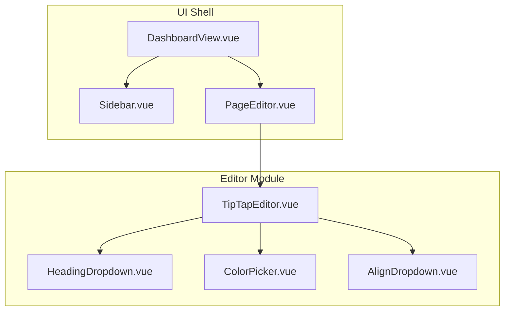
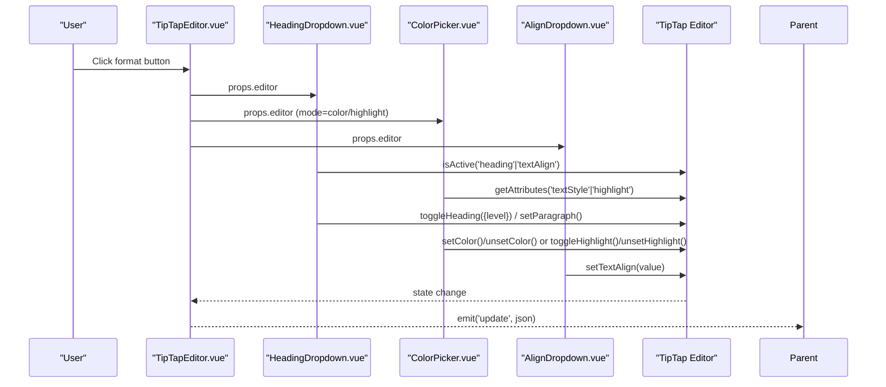
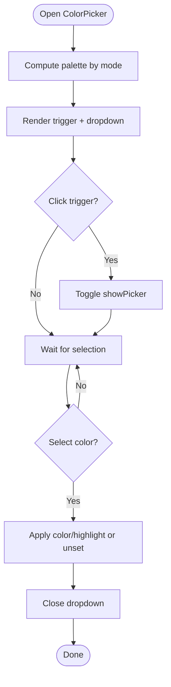
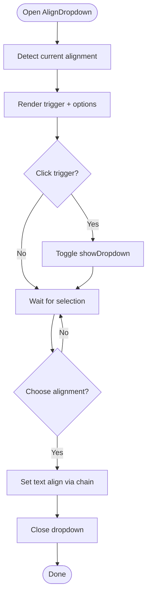
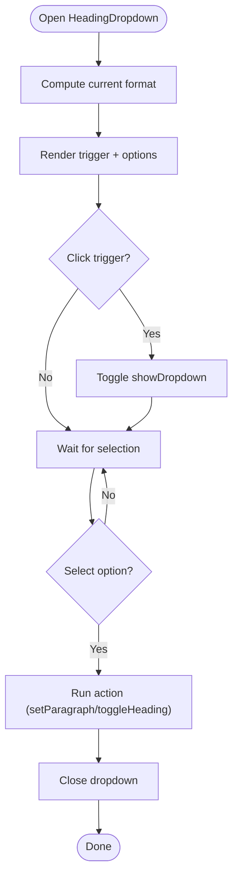
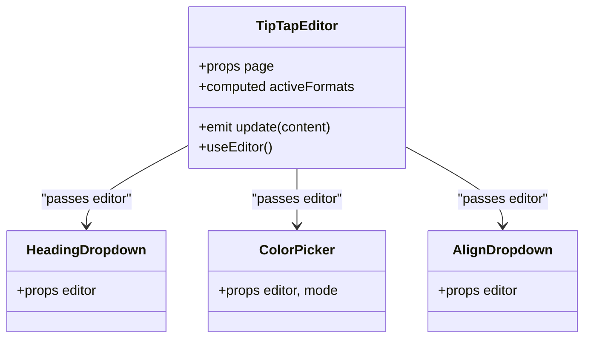
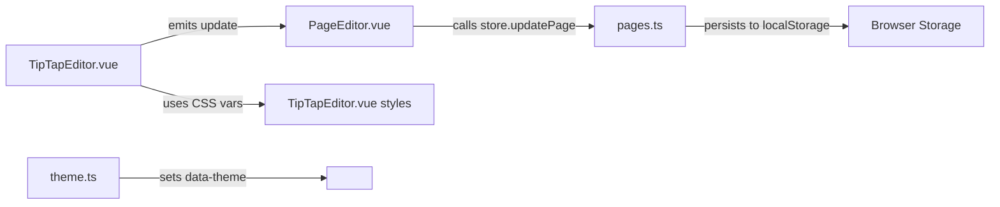

# Formatting Tools & UI Components

<cite>
**Referenced Files in This Document**
- [ColorPicker.vue](file://code/client/src/components/editor/ColorPicker.vue)
- [AlignDropdown.vue](file://code/client/src/components/editor/AlignDropdown.vue)
- [HeadingDropdown.vue](file://code/client/src/components/editor/HeadingDropdown.vue)
- [TipTapEditor.vue](file://code/client/src/components/editor/TipTapEditor.vue)
- [PageEditor.vue](file://code/client/src/components/editor/PageEditor.vue)
- [DashboardView.vue](file://code/client/src/views/DashboardView.vue)
- [Sidebar.vue](file://code/client/src/components/sidebar/Sidebar.vue)
- [pages.ts](file://code/client/src/stores/pages.ts)
- [index.ts](file://code/client/src/types/index.ts)
- [theme.ts](file://code/client/src/stores/theme.ts)
</cite>

## Table of Contents
1. [Introduction](#introduction)
2. [Project Structure](#project-structure)
3. [Core Components](#core-components)
4. [Architecture Overview](#architecture-overview)
5. [Detailed Component Analysis](#detailed-component-analysis)
6. [Dependency Analysis](#dependency-analysis)
7. [Performance Considerations](#performance-considerations)
8. [Accessibility and UX](#accessibility-and-ux)
9. [Integration Examples](#integration-examples)
10. [Troubleshooting Guide](#troubleshooting-guide)
11. [Conclusion](#conclusion)

## Introduction
This document explains the rich text formatting tools and UI components that power the editor’s toolbar. It focuses on three primary components:
- ColorPicker: selects text color or highlight background with a curated palette and persistent state.
- AlignDropdown: toggles paragraph and heading text alignment (left, center, right, justify).
- HeadingDropdown: switches between paragraph and heading levels (H1–H6) with live preview of current format.

It covers component composition patterns, prop interfaces, event handling, integration with the TipTap editor, customization, accessibility, keyboard navigation, and responsive design.

## Project Structure
The formatting components are part of the editor module and are composed into the TipTap-based editor toolbar. The editor is embedded in the main dashboard layout alongside a sidebar and page list.

**Diagram sources**
- [DashboardView.vue:15-22](file://code/client/src/views/DashboardView.vue#L15-L22)
- [Sidebar.vue:11-12](file://code/client/src/components/sidebar/Sidebar.vue#L11-L12)
- [PageEditor.vue:119-122](file://code/client/src/components/editor/PageEditor.vue#L119-L122)
- [TipTapEditor.vue:376-418](file://code/client/src/components/editor/TipTapEditor.vue#L376-L418)

**Section sources**
- [DashboardView.vue:10-22](file://code/client/src/views/DashboardView.vue#L10-L22)
- [Sidebar.vue:11-12](file://code/client/src/components/sidebar/Sidebar.vue#L11-L12)
- [PageEditor.vue:119-122](file://code/client/src/components/editor/PageEditor.vue#L119-L122)
- [TipTapEditor.vue:376-418](file://code/client/src/components/editor/TipTapEditor.vue#L376-L418)

## Core Components
- ColorPicker
  - Purpose: Apply text color or highlight background via TipTap commands.
  - Props: editor (TipTap instance), mode ('color' | 'highlight').
  - Behavior: Maintains an internal dropdown state, computes current color from TipTap attributes, applies color/highlight/unset actions, and closes on outside click.
- AlignDropdown
  - Purpose: Set text alignment for paragraphs/headings.
  - Props: editor (TipTap instance).
  - Behavior: Determines current alignment, renders four options, applies textAlign via TipTap chain, and closes on outside click.
- HeadingDropdown
  - Purpose: Switch between paragraph and heading levels (H1–H6).
  - Props: editor (TipTap instance).
  - Behavior: Computes current block type/format, renders options with live preview styles, toggles headings or sets paragraph, and closes on outside click.

**Section sources**
- [ColorPicker.vue:12-71](file://code/client/src/components/editor/ColorPicker.vue#L12-L71)
- [AlignDropdown.vue:12-39](file://code/client/src/components/editor/AlignDropdown.vue#L12-L39)
- [HeadingDropdown.vue:12-43](file://code/client/src/components/editor/HeadingDropdown.vue#L12-L43)

## Architecture Overview
The TipTapEditor composes formatting components into a toolbar. Each component receives the TipTap editor instance and uses it to query state and issue commands. The editor emits updates to the parent, enabling persistence and synchronization.

**Diagram sources**
- [TipTapEditor.vue:376-418](file://code/client/src/components/editor/TipTapEditor.vue#L376-L418)
- [HeadingDropdown.vue:22-43](file://code/client/src/components/editor/HeadingDropdown.vue#L22-L43)
- [ColorPicker.vue:49-71](file://code/client/src/components/editor/ColorPicker.vue#L49-L71)
- [AlignDropdown.vue:29-39](file://code/client/src/components/editor/AlignDropdown.vue#L29-L39)

## Detailed Component Analysis

### ColorPicker Component
- Props
  - editor: TipTap editor instance
  - mode: 'color' or 'highlight'
- Palette
  - Text colors: default, gray, red, orange, yellow, green, blue, purple, pink
  - Highlight colors: none, red, orange, yellow, green, blue, purple, pink, gray
- State and Events
  - Internal showPicker flag controls dropdown visibility.
  - Outside-click handler closes dropdown when clicks occur outside trigger/picker.
  - Current color derived from TipTap attributes for active selection.
- Commands
  - Text color: apply color or unset color.
  - Highlight: apply highlight with color or unset highlight.
- Accessibility and UX
  - Trigger button supports title attributes.
  - Active swatch indicated visually.
  - Empty swatch represents reset/unset.

**Diagram sources**
- [ColorPicker.vue:49-84](file://code/client/src/components/editor/ColorPicker.vue#L49-L84)

**Section sources**
- [ColorPicker.vue:12-84](file://code/client/src/components/editor/ColorPicker.vue#L12-L84)

### AlignDropdown Component
- Props
  - editor: TipTap editor instance
- Options
  - left, center, right, justify
- State and Events
  - Tracks current alignment via isActive checks.
  - Dropdown opens/closes on trigger click.
  - Outside-click handler closes dropdown.
- Commands
  - setTextAlign(value) applied via TipTap chain.
- Accessibility and UX
  - Dynamic SVG icons reflect current alignment.
  - Active option highlighted.

**Diagram sources**
- [AlignDropdown.vue:29-52](file://code/client/src/components/editor/AlignDropdown.vue#L29-L52)

**Section sources**
- [AlignDropdown.vue:12-52](file://code/client/src/components/editor/AlignDropdown.vue#L12-L52)

### HeadingDropdown Component
- Props
  - editor: TipTap editor instance
- Options
  - Paragraph, Heading 1–6 with dynamic font size/weight for visual preview.
- State and Events
  - Computes current format by checking heading levels and falls back to paragraph.
  - Dropdown opens/closes on trigger click.
  - Outside-click handler closes dropdown.
- Commands
  - setParagraph() for paragraph.
  - toggleHeading({ level }) for headings.
- Accessibility and UX
  - Active option highlighted.
  - Arrow rotates when open.

**Diagram sources**
- [HeadingDropdown.vue:22-56](file://code/client/src/components/editor/HeadingDropdown.vue#L22-L56)

**Section sources**
- [HeadingDropdown.vue:12-56](file://code/client/src/components/editor/HeadingDropdown.vue#L12-L56)

### Composition in TipTapEditor
- The TipTapEditor composes formatting components into its toolbar and passes the editor instance to each.
- It also manages auto-hide behavior, keyboard shortcuts, slash command menu, link dialog, image upload, and table bubble menu.
- Emits content updates to the parent for persistence.

**Diagram sources**
- [TipTapEditor.vue:42-50](file://code/client/src/components/editor/TipTapEditor.vue#L42-L50)
- [TipTapEditor.vue:376-418](file://code/client/src/components/editor/TipTapEditor.vue#L376-L418)

**Section sources**
- [TipTapEditor.vue:42-50](file://code/client/src/components/editor/TipTapEditor.vue#L42-L50)
- [TipTapEditor.vue:376-418](file://code/client/src/components/editor/TipTapEditor.vue#L376-L418)

## Dependency Analysis
- Editor state and persistence
  - TipTapEditor emits updates to the parent (PageEditor), which persists content via the pages store.
  - The pages store serializes/deserializes TipTap JSON content and syncs with local storage.
- Theming
  - The theme store applies a data-theme attribute to the document root, influencing CSS variables consumed by the editor and components.
- Routing and layout
  - DashboardView composes Sidebar and PageEditor; PageEditor hosts TipTapEditor.

**Diagram sources**
- [TipTapEditor.vue:48-50](file://code/client/src/components/editor/TipTapEditor.vue#L48-L50)
- [PageEditor.vue:45-49](file://code/client/src/components/editor/PageEditor.vue#L45-L49)
- [pages.ts:98-104](file://code/client/src/stores/pages.ts#L98-L104)
- [theme.ts:42-44](file://code/client/src/stores/theme.ts#L42-L44)

**Section sources**
- [TipTapEditor.vue:48-50](file://code/client/src/components/editor/TipTapEditor.vue#L48-L50)
- [PageEditor.vue:45-49](file://code/client/src/components/editor/PageEditor.vue#L45-L49)
- [pages.ts:98-104](file://code/client/src/stores/pages.ts#L98-L104)
- [theme.ts:42-44](file://code/client/src/stores/theme.ts#L42-L44)

## Performance Considerations
- Avoid unnecessary re-computation: HeadingDropdown and AlignDropdown compute current state on render; memoize isActive checks if needed.
- Debounce toolbar visibility: TipTapEditor already uses timeouts and debouncing to manage auto-hide behavior.
- Minimize DOM: Dropdowns are rendered conditionally and rely on click-outside handlers; ensure listeners are attached/unmounted properly (as implemented).
- Rendering cost: ColorPicker grid is small (≤9 swatches), so rendering cost is negligible.

## Accessibility and UX
- Keyboard navigation
  - Buttons use native focus and hover states; no explicit keyboard handlers are present in these components. Consider adding arrow-key navigation and Enter/Space activation for screen reader support.
- Focus and ARIA
  - Add aria-haspopup, aria-expanded, and role="button" to trigger elements for improved semantics.
- Titles and labels
  - Tooltips (title attributes) are present; ensure they are localized if needed.
- Color contrast
  - Ensure active states and highlights meet contrast guidelines against backgrounds; theme-aware CSS variables help maintain consistency.

## Integration Examples
- Basic integration
  - Import and render components inside the TipTapEditor toolbar, passing the editor instance and, for ColorPicker, the mode.
- Customization
  - Adjust colors by modifying the palette arrays in ColorPicker.
  - Extend AlignDropdown or HeadingDropdown by adding new options and corresponding TipTap commands.
- Persistence
  - Subscribe to TipTapEditor’s update event and persist content to your store or backend.
- Theming
  - Use the theme store to switch modes; the editor respects CSS variables applied to the document root.

**Section sources**
- [TipTapEditor.vue:376-418](file://code/client/src/components/editor/TipTapEditor.vue#L376-L418)
- [ColorPicker.vue:23-45](file://code/client/src/components/editor/ColorPicker.vue#L23-L45)
- [TipTapEditor.vue:48-50](file://code/client/src/components/editor/TipTapEditor.vue#L48-L50)
- [theme.ts:42-44](file://code/client/src/stores/theme.ts#L42-L44)

## Troubleshooting Guide
- Dropdown does not close
  - Ensure outside-click handler is attached on mount and detached on unmount.
  - Verify refs are correctly passed to the handler.
- Selected color not applied
  - Confirm the editor instance is passed and active selection exists.
  - Check that TipTap extensions for color/highlight are enabled.
- Alignment not sticking
  - Ensure textAlign extension is configured and the selection targets supported nodes (paragraphs/headings).
- Toolbar flicker or not hiding
  - Review auto-hide logic and ensure timeouts are cleared on unmount.

**Section sources**
- [ColorPicker.vue:73-84](file://code/client/src/components/editor/ColorPicker.vue#L73-L84)
- [AlignDropdown.vue:41-52](file://code/client/src/components/editor/AlignDropdown.vue#L41-L52)
- [TipTapEditor.vue:128-131](file://code/client/src/components/editor/TipTapEditor.vue#L128-L131)

## Conclusion
The formatting components provide a cohesive, extensible toolkit for rich text editing. They integrate tightly with TipTap, leverage a clean prop/event model, and offer a consistent dark-themed UI. Extending them involves adding new options, commands, and persistence hooks while maintaining accessibility and responsiveness.