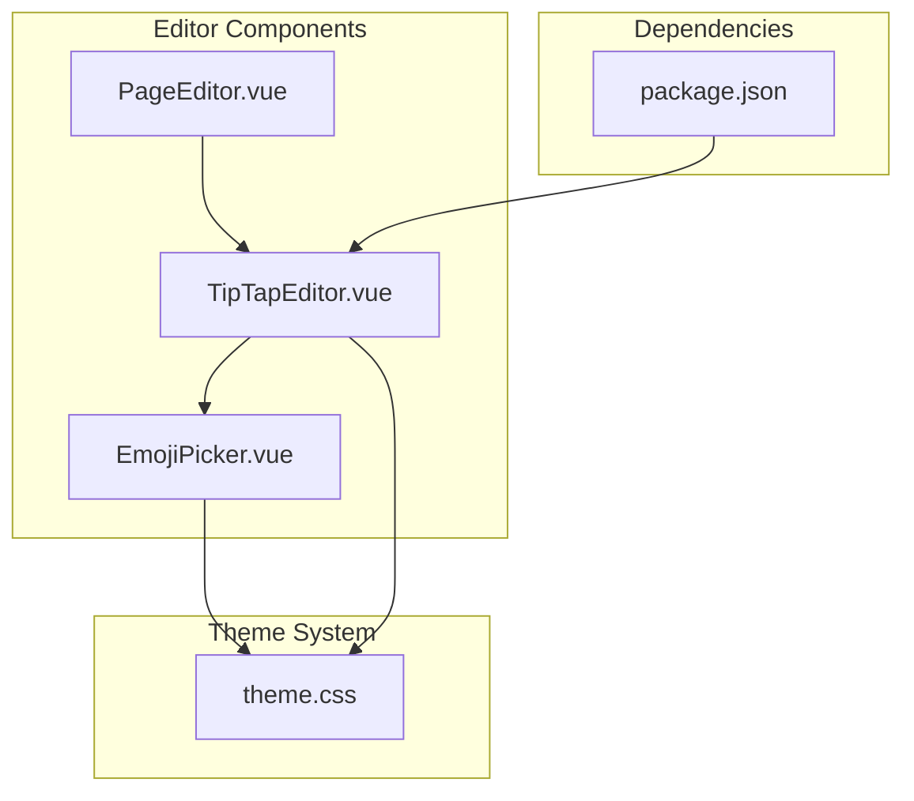
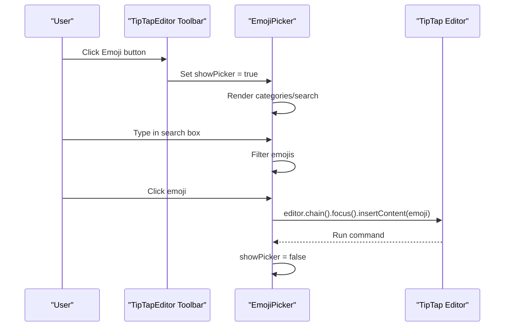
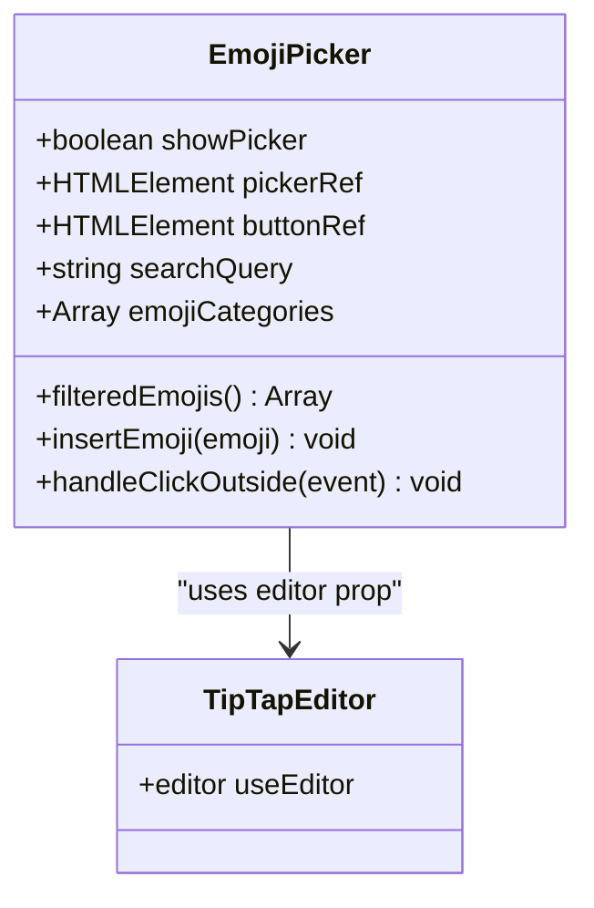
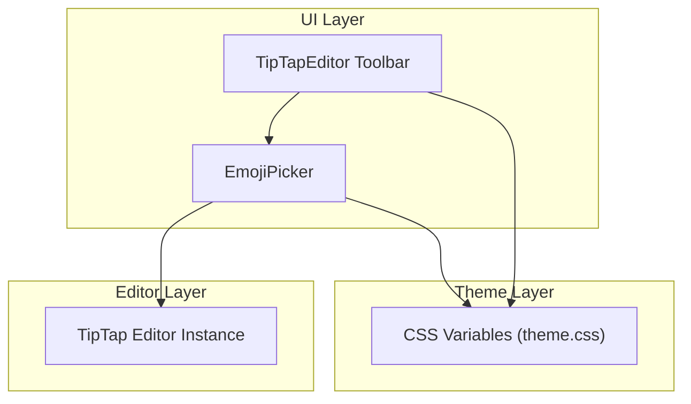
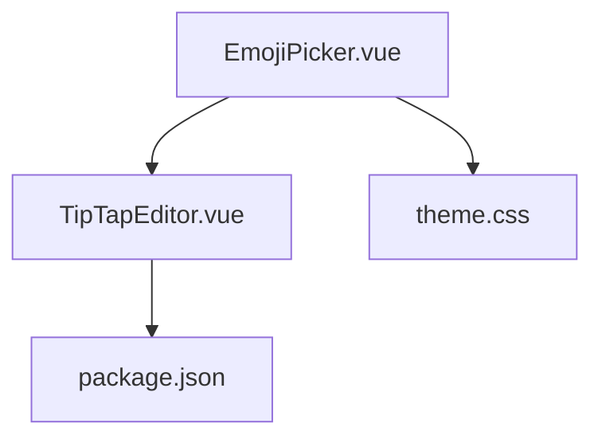

# Emoji Picker Component

<cite>
**Referenced Files in This Document**
- [EmojiPicker.vue](file://code/client/src/components/editor/EmojiPicker.vue)
- [TipTapEditor.vue](file://code/client/src/components/editor/TipTapEditor.vue)
- [PageEditor.vue](file://code/client/src/components/editor/PageEditor.vue)
- [theme.css](file://code/client/src/styles/theme.css)
- [package.json](file://code/client/package.json)
</cite>

## Table of Contents
1. [Introduction](#introduction)
2. [Project Structure](#project-structure)
3. [Core Components](#core-components)
4. [Architecture Overview](#architecture-overview)
5. [Detailed Component Analysis](#detailed-component-analysis)
6. [Dependency Analysis](#dependency-analysis)
7. [Performance Considerations](#performance-considerations)
8. [Troubleshooting Guide](#troubleshooting-guide)
9. [Conclusion](#conclusion)

## Introduction
This document provides comprehensive documentation for the EmojiPicker component, focusing on the emoji selection interface, emoji data management, integration with the editor, state management, customization options, accessibility, internationalization, and performance considerations. The EmojiPicker is integrated into the TipTap-based editor and provides a categorized emoji grid with search functionality, enabling users to insert emojis into the editor content.

## Project Structure
The EmojiPicker resides within the editor components and integrates with TipTapEditor, which manages the overall editor state and toolbar. The theme system defines the visual appearance of the picker and surrounding UI.

**Diagram sources**
- [TipTapEditor.vue:32](file://code/client/src/components/editor/TipTapEditor.vue#L32)
- [EmojiPicker.vue:10](file://code/client/src/components/editor/EmojiPicker.vue#L10)
- [theme.css:1](file://code/client/src/styles/theme.css#L1)
- [package.json:34](file://code/client/package.json#L34)

**Section sources**
- [TipTapEditor.vue:32](file://code/client/src/components/editor/TipTapEditor.vue#L32)
- [EmojiPicker.vue:10](file://code/client/src/components/editor/EmojiPicker.vue#L10)
- [theme.css:1](file://code/client/src/styles/theme.css#L1)
- [package.json:34](file://code/client/package.json#L34)

## Core Components
- EmojiPicker: Provides the emoji selection UI with categories, search, and insertion into the editor.
- TipTapEditor: Hosts the editor instance and integrates the EmojiPicker into the toolbar.
- PageEditor: Wraps the TipTapEditor and provides page-level context and content synchronization.
- Theme System: Defines CSS variables for consistent theming across the editor and picker.

Key responsibilities:
- EmojiPicker handles state for visibility, search queries, and emoji insertion via the editor chain.
- TipTapEditor initializes the editor and passes the editor instance to EmojiPicker.
- Theme system ensures consistent visual appearance in light/dark modes.

**Section sources**
- [EmojiPicker.vue:10](file://code/client/src/components/editor/EmojiPicker.vue#L10)
- [TipTapEditor.vue:112](file://code/client/src/components/editor/TipTapEditor.vue#L112)
- [PageEditor.vue:119](file://code/client/src/components/editor/PageEditor.vue#L119)
- [theme.css:78](file://code/client/src/styles/theme.css#L78)

## Architecture Overview
The EmojiPicker is a child component of TipTapEditor and is rendered within the editor toolbar. It receives the editor instance as a prop and uses it to insert emojis at the current cursor position. The component maintains local state for visibility and search queries, and applies theme-aware styles.

**Diagram sources**
- [TipTapEditor.vue:476](file://code/client/src/components/editor/TipTapEditor.vue#L476)
- [EmojiPicker.vue:19](file://code/client/src/components/editor/EmojiPicker.vue#L19)
- [EmojiPicker.vue:48](file://code/client/src/components/editor/EmojiPicker.vue#L48)
- [EmojiPicker.vue:54](file://code/client/src/components/editor/EmojiPicker.vue#L54)

## Detailed Component Analysis

### EmojiPicker Component
The EmojiPicker component encapsulates the emoji selection interface, including:
- Category navigation: Displays predefined emoji categories with names and emoji grids.
- Search functionality: Filters emojis based on the search query.
- Keyboard shortcuts: Not implemented in the current component; can be extended via input events.
- Emoji insertion: Uses the editor chain to insert the selected emoji at the current cursor position.
- Click-outside detection: Closes the picker when clicking outside the trigger or picker area.

State and data:
- Local refs: showPicker, pickerRef, buttonRef.
- Emoji categories: A static array of category objects containing names and emoji arrays.
- Search state: Reactive searchQuery bound to the input field.
- Computed filter: Returns filtered emojis when a query exists.

Integration with editor:
- Receives editor as a prop.
- Calls editor.chain().focus().insertContent(emoji).run() to insert the emoji.
- Uses click handlers to toggle visibility and manage click-outside behavior.

Accessibility and internationalization:
- The component uses semantic markup and relies on CSS variables for theming.
- No explicit ARIA attributes are present; can be enhanced with aria-labels and roles.
- Emojis are Unicode characters; ensure proper rendering across platforms.

Customization hooks:
- Theming: Controlled via CSS variables defined in theme.css.
- Categories: Modify the emojiCategories array to change displayed categories.
- Search behavior: Adjust the filtering logic in filteredEmojis.

**Section sources**
- [EmojiPicker.vue:10](file://code/client/src/components/editor/EmojiPicker.vue#L10)
- [EmojiPicker.vue:23](file://code/client/src/components/editor/EmojiPicker.vue#L23)
- [EmojiPicker.vue:48](file://code/client/src/components/editor/EmojiPicker.vue#L48)
- [EmojiPicker.vue:54](file://code/client/src/components/editor/EmojiPicker.vue#L54)
- [EmojiPicker.vue:59](file://code/client/src/components/editor/EmojiPicker.vue#L59)

#### EmojiPicker Class Diagram

**Diagram sources**
- [EmojiPicker.vue:10](file://code/client/src/components/editor/EmojiPicker.vue#L10)
- [TipTapEditor.vue:112](file://code/client/src/components/editor/TipTapEditor.vue#L112)

### TipTapEditor Integration
TipTapEditor initializes the editor instance and includes the EmojiPicker in the toolbar. It:
- Creates the editor with TipTap extensions.
- Manages toolbar visibility and editor lifecycle.
- Passes the editor instance to EmojiPicker as a prop.

EmojiPicker placement:
- Rendered within the toolbar alongside other formatting controls.
- Integrated via a dedicated button that toggles the picker visibility.

**Section sources**
- [TipTapEditor.vue:112](file://code/client/src/components/editor/TipTapEditor.vue#L112)
- [TipTapEditor.vue:476](file://code/client/src/components/editor/TipTapEditor.vue#L476)

### PageEditor Context
PageEditor provides the page context and delegates content updates to the editor. While it does not directly interact with the EmojiPicker, it ensures the editor content remains synchronized with the current page.

**Section sources**
- [PageEditor.vue:119](file://code/client/src/components/editor/PageEditor.vue#L119)

### Theme System
The theme system defines CSS variables for light and dark modes, ensuring consistent visual appearance across components. The EmojiPicker leverages these variables for background, borders, and text colors.

Key theme variables used by EmojiPicker:
- Background colors for the panel and dropdowns.
- Border colors for input and panel edges.
- Text colors for placeholders and labels.
- Hover and active states for interactive elements.

**Section sources**
- [theme.css:78](file://code/client/src/styles/theme.css#L78)
- [theme.css](file://code/client/src/styles/theme.css#L1)

### Dependencies and Extensions
The project includes TipTap and related extensions for rich text editing. The EmojiPicker relies on the editor instance provided by TipTap to insert content.

External dependencies relevant to emoji handling:
- TipTap extensions for content manipulation.
- Optional emoji-picker-element library present in package.json.

**Section sources**
- [package.json:34](file://code/client/package.json#L34)
- [package.json:37](file://code/client/package.json#L37)

## Architecture Overview
The EmojiPicker participates in the editor toolbar and interacts with the TipTap editor through a well-defined prop interface. The component manages its own local state while delegating content insertion to the editor chain.

**Diagram sources**
- [TipTapEditor.vue:476](file://code/client/src/components/editor/TipTapEditor.vue#L476)
- [EmojiPicker.vue:14](file://code/client/src/components/editor/EmojiPicker.vue#L14)
- [theme.css:78](file://code/client/src/styles/theme.css#L78)

## Detailed Component Analysis

### Emoji Selection Interface
- Trigger button: Opens/closes the picker and applies active state styling.
- Search input: Filters emojis when a query is present.
- Category grids: Displays emojis grouped by category names.
- Insertion mechanism: Inserts the selected emoji at the current cursor position.

Keyboard shortcuts:
- Not implemented in the current component. Can be added by listening to keydown events on the search input and picker container.

Accessibility enhancements:
- Add aria-haspopup, aria-expanded, and aria-controls attributes to the trigger button.
- Provide keyboard navigation (arrow keys) to move between emoji cells.
- Announce category names and selected emoji via screen readers.

Internationalization:
- Category names are currently hardcoded in Chinese. To support i18n, replace with translation keys and load localized strings.

**Section sources**
- [EmojiPicker.vue:75](file://code/client/src/components/editor/EmojiPicker.vue#L75)
- [EmojiPicker.vue:87](file://code/client/src/components/editor/EmojiPicker.vue#L87)
- [EmojiPicker.vue:104](file://code/client/src/components/editor/EmojiPicker.vue#L104)

### Emoji Data Management
Current implementation:
- Static emojiCategories array defines categories and emoji lists.
- Filtering performed by checking if an emoji string includes the search query.

Unicode handling:
- Emojis are represented as Unicode code points in the emojiCategories array.
- Rendering depends on platform font support; ensure fallback fonts if needed.

Fallback mechanisms:
- If a platform lacks emoji glyphs, consider providing alt text or image fallbacks.
- Validate emoji rendering and provide graceful degradation.

Extending emoji sets:
- Replace or augment emojiCategories with external data sources.
- Implement lazy loading for large emoji datasets to improve initial render performance.

**Section sources**
- [EmojiPicker.vue:23](file://code/client/src/components/editor/EmojiPicker.vue#L23)
- [EmojiPicker.vue:48](file://code/client/src/components/editor/EmojiPicker.vue#L48)

### Editor Integration and Positioning
The EmojiPicker integrates with TipTapEditor through:
- Passing the editor instance as a prop.
- Using editor.chain().focus().insertContent(emoji).run() to insert content.
- Managing picker visibility via toolbar interactions.

Positioning:
- The picker is positioned absolutely below the trigger button using CSS.
- Ensure proper z-index stacking and viewport constraints for mobile devices.

**Section sources**
- [TipTapEditor.vue:476](file://code/client/src/components/editor/TipTapEditor.vue#L476)
- [EmojiPicker.vue:54](file://code/client/src/components/editor/EmojiPicker.vue#L54)
- [EmojiPicker.vue:85](file://code/client/src/components/editor/EmojiPicker.vue#L85)

### State Management
Local state:
- showPicker: Controls picker visibility.
- searchQuery: Stores the current search term.
- pickerRef/buttonRef: DOM references for click-outside detection.

Persistent state (not implemented):
- Recent emojis: Could maintain a list of recently inserted emojis.
- Favorites: Allow users to mark favorite emojis for quick access.
- Search history: Track frequent search terms for quick recall.

Implementation suggestions:
- Use localStorage or a global store to persist recent/favorite items.
- Debounce search input to reduce filtering overhead.
- Implement virtual scrolling for large emoji datasets.

**Section sources**
- [EmojiPicker.vue:19](file://code/client/src/components/editor/EmojiPicker.vue#L19)
- [EmojiPicker.vue:46](file://code/client/src/components/editor/EmojiPicker.vue#L46)

### Customization Examples
- Customizing emoji themes:
  - Modify CSS variables in theme.css to adjust colors for the picker panel and inputs.
  - Override component-specific styles in the scoped style block if needed.

- Adding custom emoji sets:
  - Extend emojiCategories with new category objects containing emoji arrays.
  - Fetch emoji data from an API and populate categories dynamically.

- Implementing emoji filtering:
  - Enhance filteredEmojis to support fuzzy search or regex matching.
  - Add category filtering alongside keyword search.

**Section sources**
- [theme.css:78](file://code/client/src/styles/theme.css#L78)
- [EmojiPicker.vue:23](file://code/client/src/components/editor/EmojiPicker.vue#L23)
- [EmojiPicker.vue:48](file://code/client/src/components/editor/EmojiPicker.vue#L48)

## Dependency Analysis
The EmojiPicker depends on:
- TipTap editor instance for content insertion.
- Vue reactivity for state management.
- CSS variables for theming.

Potential circular dependencies:
- None observed; the component is a leaf node in the editor hierarchy.

External dependencies:
- TipTap extensions for editor functionality.
- Optional emoji-picker-element library for alternative picker implementations.

**Diagram sources**
- [EmojiPicker.vue:10](file://code/client/src/components/editor/EmojiPicker.vue#L10)
- [TipTapEditor.vue:112](file://code/client/src/components/editor/TipTapEditor.vue#L112)
- [theme.css:1](file://code/client/src/styles/theme.css#L1)
- [package.json:34](file://code/client/package.json#L34)

**Section sources**
- [EmojiPicker.vue:10](file://code/client/src/components/editor/EmojiPicker.vue#L10)
- [TipTapEditor.vue:112](file://code/client/src/components/editor/TipTapEditor.vue#L112)
- [theme.css:1](file://code/client/src/styles/theme.css#L1)
- [package.json:34](file://code/client/package.json#L34)

## Performance Considerations
- Large emoji datasets:
  - Implement virtual scrolling to render only visible emojis.
  - Lazy-load emoji categories on demand.
  - Debounce search input to avoid frequent recomputation.

- Rendering optimization:
  - Use computed properties for filtered emojis to leverage Vue's reactivity efficiently.
  - Avoid unnecessary re-renders by minimizing reactive dependencies.

- Memory management:
  - Clean up event listeners on component unmount.
  - Dispose of editor instances properly during teardown.

- Accessibility and UX:
  - Provide keyboard navigation and ARIA attributes for screen readers.
  - Ensure responsive layout for mobile devices.

[No sources needed since this section provides general guidance]

## Troubleshooting Guide
Common issues and resolutions:
- Picker not closing on outside click:
  - Verify handleClickOutside logic and ensure event targets are checked against pickerRef and buttonRef.

- Emojis not inserting:
  - Confirm editor prop is passed correctly and editor.chain().focus().insertContent(emoji).run() executes without errors.

- Theme inconsistencies:
  - Check CSS variable overrides and ensure theme.css is loaded before component styles.

- Search not working:
  - Validate v-model binding on search input and filteredEmojis computation.

**Section sources**
- [EmojiPicker.vue:59](file://code/client/src/components/editor/EmojiPicker.vue#L59)
- [EmojiPicker.vue:54](file://code/client/src/components/editor/EmojiPicker.vue#L54)
- [theme.css:78](file://code/client/src/styles/theme.css#L78)
- [EmojiPicker.vue:48](file://code/client/src/components/editor/EmojiPicker.vue#L48)

## Conclusion
The EmojiPicker component provides a focused, theme-aware emoji selection experience integrated into the TipTap editor. Its current implementation offers category navigation, search, and seamless emoji insertion. Future enhancements can include keyboard shortcuts, persistent state for recent/favorites, improved accessibility, internationalization, and performance optimizations for large datasets.