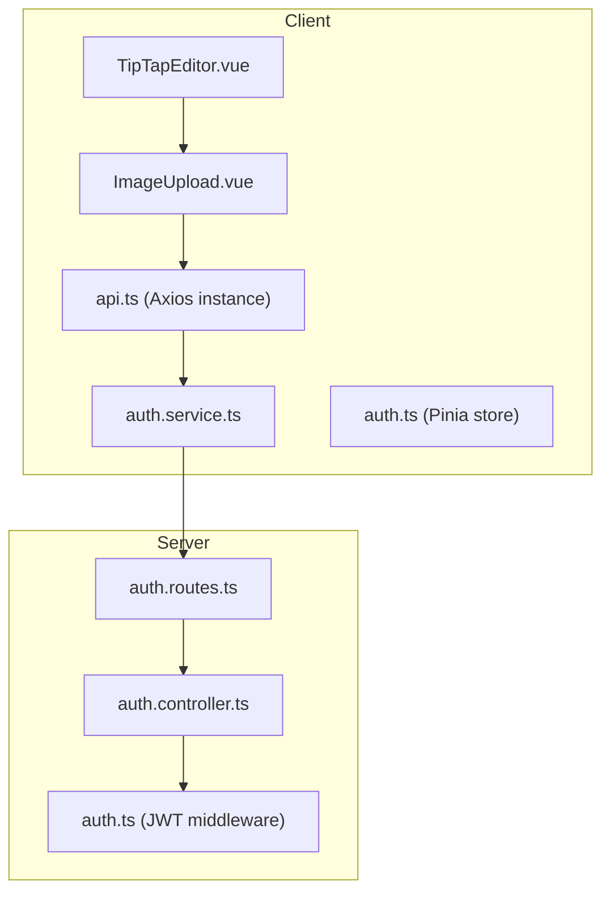
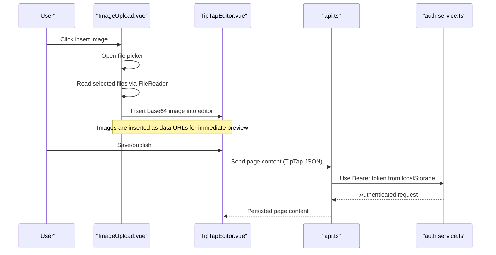
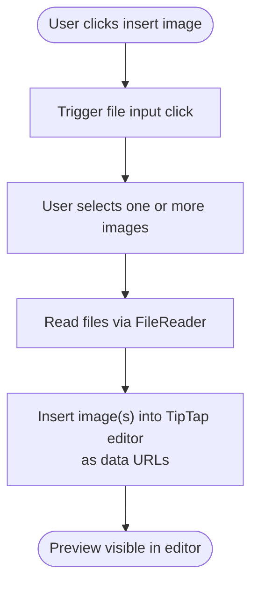
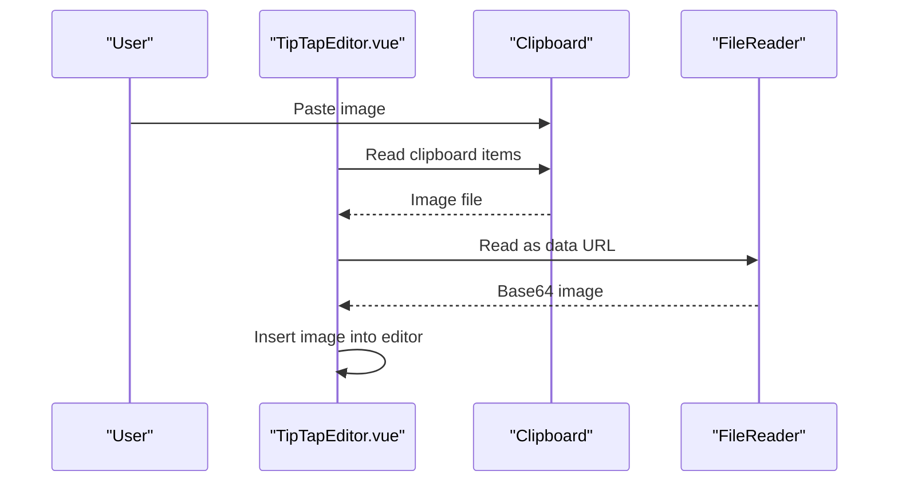
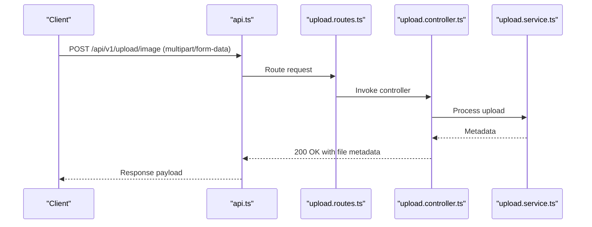
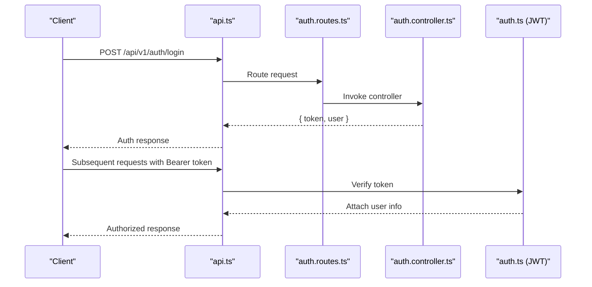
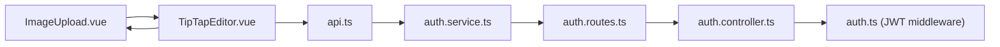

# Image Upload Component

<cite>
**Referenced Files in This Document**
- [ImageUpload.vue](file://code/client/src/components/editor/ImageUpload.vue)
- [TipTapEditor.vue](file://code/client/src/components/editor/TipTapEditor.vue)
- [api.ts](file://code/client/src/services/api.ts)
- [auth.service.ts](file://code/client/src/services/auth.service.ts)
- [auth.ts](file://code/server/src/middleware/auth.ts)
- [auth.controller.ts](file://code/server/src/controllers/auth.controller.ts)
- [auth.routes.ts](file://code/server/src/routes/auth.routes.ts)
- [API-SPEC.md](file://api-spec/API-SPEC.md)
- [001_init.sql](file://db/001_init.sql)
- [index.ts](file://code/client/src/types/index.ts)
</cite>

## Table of Contents
1. [Introduction](#introduction)
2. [Project Structure](#project-structure)
3. [Core Components](#core-components)
4. [Architecture Overview](#architecture-overview)
5. [Detailed Component Analysis](#detailed-component-analysis)
6. [Dependency Analysis](#dependency-analysis)
7. [Performance Considerations](#performance-considerations)
8. [Troubleshooting Guide](#troubleshooting-guide)
9. [Conclusion](#conclusion)

## Introduction
This document explains the ImageUpload component implementation and its integration with the TipTap editor. It covers the file upload workflow, validation, preview generation, backend integration, authentication, progress tracking, error handling, supported formats, and performance considerations. It also provides guidance on customizing upload behavior and handling failures securely.

## Project Structure
The ImageUpload component resides in the editor feature area alongside the TipTap editor. It integrates with the global API client and authentication store to upload images to the backend and insert them into the editor.

**Diagram sources**
- [ImageUpload.vue:1-90](file://code/client/src/components/editor/ImageUpload.vue#L1-L90)
- [TipTapEditor.vue:1-833](file://code/client/src/components/editor/TipTapEditor.vue#L1-L833)
- [api.ts:1-64](file://code/client/src/services/api.ts#L1-L64)
- [auth.service.ts:1-46](file://code/client/src/services/auth.service.ts#L1-L46)
- [auth.ts:1-60](file://code/server/src/middleware/auth.ts#L1-L60)
- [auth.controller.ts:1-82](file://code/server/src/controllers/auth.controller.ts#L1-L82)
- [auth.routes.ts:1-106](file://code/server/src/routes/auth.routes.ts#L1-L106)

**Section sources**
- [ImageUpload.vue:1-90](file://code/client/src/components/editor/ImageUpload.vue#L1-L90)
- [TipTapEditor.vue:1-833](file://code/client/src/components/editor/TipTapEditor.vue#L1-L833)
- [api.ts:1-64](file://code/client/src/services/api.ts#L1-L64)
- [auth.service.ts:1-46](file://code/client/src/services/auth.service.ts#L1-L46)
- [auth.ts:1-60](file://code/server/src/middleware/auth.ts#L1-L60)
- [auth.controller.ts:1-82](file://code/server/src/controllers/auth.controller.ts#L1-L82)
- [auth.routes.ts:1-106](file://code/server/src/routes/auth.routes.ts#L1-L106)

## Core Components
- ImageUpload.vue: Provides a button to trigger file selection, reads selected files via FileReader, and inserts base64-encoded images into the TipTap editor.
- TipTapEditor.vue: Hosts the TipTap editor, registers the Image extension, and handles paste events to insert images from clipboard.
- api.ts: Axios instance with automatic Bearer token injection and centralized 401 handling.
- auth.service.ts: Wraps authentication endpoints and returns structured responses.
- auth.ts (server): JWT middleware that validates Bearer tokens and attaches user info to requests.
- auth.controller.ts: Implements login, registration, and current user retrieval.
- auth.routes.ts: Defines routes for authentication with Zod validation.
- API-SPEC.md: Documents the upload endpoint, supported formats, and size limits.
- 001_init.sql: Enforces a 5 MB file size constraint at the database level.

**Section sources**
- [ImageUpload.vue:1-90](file://code/client/src/components/editor/ImageUpload.vue#L1-L90)
- [TipTapEditor.vue:1-833](file://code/client/src/components/editor/TipTapEditor.vue#L1-L833)
- [api.ts:1-64](file://code/client/src/services/api.ts#L1-L64)
- [auth.service.ts:1-46](file://code/client/src/services/auth.service.ts#L1-L46)
- [auth.ts:1-60](file://code/server/src/middleware/auth.ts#L1-L60)
- [auth.controller.ts:1-82](file://code/server/src/controllers/auth.controller.ts#L1-L82)
- [auth.routes.ts:1-106](file://code/server/src/routes/auth.routes.ts#L1-L106)
- [API-SPEC.md:594-630](file://api-spec/API-SPEC.md#L594-L630)
- [001_init.sql:117-144](file://db/001_init.sql#L117-L144)

## Architecture Overview
The upload flow begins in the ImageUpload component, which reads files locally and immediately previews them in the editor. For persistent storage, the current implementation focuses on immediate preview rather than server-side upload. Authentication is enforced via Bearer tokens injected by the Axios interceptor.

**Diagram sources**
- [ImageUpload.vue:19-44](file://code/client/src/components/editor/ImageUpload.vue#L19-L44)
- [TipTapEditor.vue:112-194](file://code/client/src/components/editor/TipTapEditor.vue#L112-L194)
- [api.ts:30-41](file://code/client/src/services/api.ts#L30-L41)
- [auth.service.ts:23-45](file://code/client/src/services/auth.service.ts#L23-L45)

## Detailed Component Analysis

### ImageUpload.vue
- Purpose: Trigger file selection, validate selection, read files, and insert images into the TipTap editor.
- Key behaviors:
  - Opens a hidden file input when the toolbar button is clicked.
  - Reads each selected file as a data URL and inserts it into the editor using setImage.
  - Resets the input to allow re-selecting the same file.
- Supported formats: The input accepts image/*, which broadly covers common web image formats.
- Preview generation: Uses FileReader to convert files to data URLs for immediate preview in the editor.

**Diagram sources**
- [ImageUpload.vue:19-44](file://code/client/src/components/editor/ImageUpload.vue#L19-L44)

**Section sources**
- [ImageUpload.vue:1-90](file://code/client/src/components/editor/ImageUpload.vue#L1-L90)

### TipTapEditor.vue Integration
- Registers the Image extension so images can be rendered in the editor.
- Handles paste events: detects clipboard image items, converts to data URLs, and inserts them into the editor.
- Exposes an ImageUpload toolbar button that opens a file picker and inserts images similarly.

**Diagram sources**
- [TipTapEditor.vue:154-175](file://code/client/src/components/editor/TipTapEditor.vue#L154-L175)

**Section sources**
- [TipTapEditor.vue:112-194](file://code/client/src/components/editor/TipTapEditor.vue#L112-L194)

### Backend Upload API (Planned)
According to the API specification, the server supports uploading images via multipart/form-data with the following constraints:
- Endpoint: POST /api/v1/upload/image
- Authentication: Required (Bearer token)
- Content-Type: multipart/form-data
- Validation:
  - file: required, image file
  - Supported formats: jpg, png, gif, webp
  - Size limit: ≤ 5 MB
- Response: Returns metadata including id, url, filename, size, mimeType, and createdAt.

**Diagram sources**
- [API-SPEC.md:594-630](file://api-spec/API-SPEC.md#L594-L630)

**Section sources**
- [API-SPEC.md:594-630](file://api-spec/API-SPEC.md#L594-L630)

### Authentication and Authorization
- Frontend:
  - api.ts injects Authorization: Bearer <token> into outgoing requests.
  - On 401 responses, clears local token and redirects to login.
- Backend:
  - auth.routes.ts defines routes for auth operations with Zod validation.
  - auth.controller.ts implements login, register, and current user retrieval.
  - auth.ts middleware validates JWT and attaches user info to requests.

**Diagram sources**
- [api.ts:30-61](file://code/client/src/services/api.ts#L30-L61)
- [auth.routes.ts:77-102](file://code/server/src/routes/auth.routes.ts#L77-L102)
- [auth.controller.ts:26-81](file://code/server/src/controllers/auth.controller.ts#L26-L81)
- [auth.ts:29-59](file://code/server/src/middleware/auth.ts#L29-L59)

**Section sources**
- [api.ts:1-64](file://code/client/src/services/api.ts#L1-L64)
- [auth.service.ts:1-46](file://code/client/src/services/auth.service.ts#L1-L46)
- [auth.routes.ts:1-106](file://code/server/src/routes/auth.routes.ts#L1-L106)
- [auth.controller.ts:1-82](file://code/server/src/controllers/auth.controller.ts#L1-L82)
- [auth.ts:1-60](file://code/server/src/middleware/auth.ts#L1-L60)

## Dependency Analysis
- ImageUpload depends on TipTap’s editor instance to insert images.
- TipTapEditor integrates ImageUpload and sets up paste handling and the editor lifecycle.
- api.ts centralizes HTTP behavior and authentication headers.
- auth.service.ts abstracts authentication endpoints.
- Server-side auth middleware enforces Bearer token validation.

**Diagram sources**
- [ImageUpload.vue:1-90](file://code/client/src/components/editor/ImageUpload.vue#L1-L90)
- [TipTapEditor.vue:1-833](file://code/client/src/components/editor/TipTapEditor.vue#L1-L833)
- [api.ts:1-64](file://code/client/src/services/api.ts#L1-L64)
- [auth.service.ts:1-46](file://code/client/src/services/auth.service.ts#L1-L46)
- [auth.routes.ts:1-106](file://code/server/src/routes/auth.routes.ts#L1-L106)
- [auth.controller.ts:1-82](file://code/server/src/controllers/auth.controller.ts#L1-L82)
- [auth.ts:1-60](file://code/server/src/middleware/auth.ts#L1-L60)

**Section sources**
- [ImageUpload.vue:1-90](file://code/client/src/components/editor/ImageUpload.vue#L1-L90)
- [TipTapEditor.vue:1-833](file://code/client/src/components/editor/TipTapEditor.vue#L1-L833)
- [api.ts:1-64](file://code/client/src/services/api.ts#L1-L64)
- [auth.service.ts:1-46](file://code/client/src/services/auth.service.ts#L1-L46)
- [auth.routes.ts:1-106](file://code/server/src/routes/auth.routes.ts#L1-L106)
- [auth.controller.ts:1-82](file://code/server/src/controllers/auth.controller.ts#L1-L82)
- [auth.ts:1-60](file://code/server/src/middleware/auth.ts#L1-L60)

## Performance Considerations
- Current behavior: Images are inserted as base64 data URLs directly into the editor. This avoids network overhead but increases DOM size and memory usage, especially for large images.
- Recommendations:
  - For large images, consider compressing client-side before insertion or uploading to the server and replacing the data URL with a server-provided URL after upload completes.
  - Debounce or batch multiple file selections to avoid overwhelming the editor.
  - Use lazy loading for images in the editor content to reduce initial render cost.
  - Implement progressive enhancement: show a placeholder and swap with the real image after upload.

[No sources needed since this section provides general guidance]

## Troubleshooting Guide
- 401 Unauthorized:
  - Symptom: Requests fail with 401.
  - Cause: Missing or invalid Bearer token.
  - Resolution: Ensure localStorage contains a valid token; api.ts automatically injects the token; on 401, the interceptor clears the token and redirects to login.
- File too large:
  - Symptom: Upload rejected or database constraint violation.
  - Cause: File exceeds 5 MB limit.
  - Resolution: Compress images or select smaller files; the database enforces a 5 MB size check.
- Unsupported format:
  - Symptom: Upload fails validation.
  - Cause: Selected file is not a supported image type.
  - Resolution: Choose jpg, png, gif, or webp.
- Paste not working:
  - Symptom: Pasting images does nothing.
  - Cause: Clipboard lacks image items or browser restrictions.
  - Resolution: Try selecting images via the toolbar or ensure the browser allows clipboard image access.

**Section sources**
- [api.ts:48-61](file://code/client/src/services/api.ts#L48-L61)
- [API-SPEC.md:594-607](file://api-spec/API-SPEC.md#L594-L607)
- [001_init.sql:125-126](file://db/001_init.sql#L125-L126)

## Conclusion
The ImageUpload component currently enables immediate image insertion via data URLs for quick preview. For production-grade workflows, integrate server-side upload with progress tracking, compression, and secure URL generation. Maintain strict validation and enforce size/format limits at both client and server layers. Use the existing authentication and API client infrastructure to ensure secure and consistent behavior.