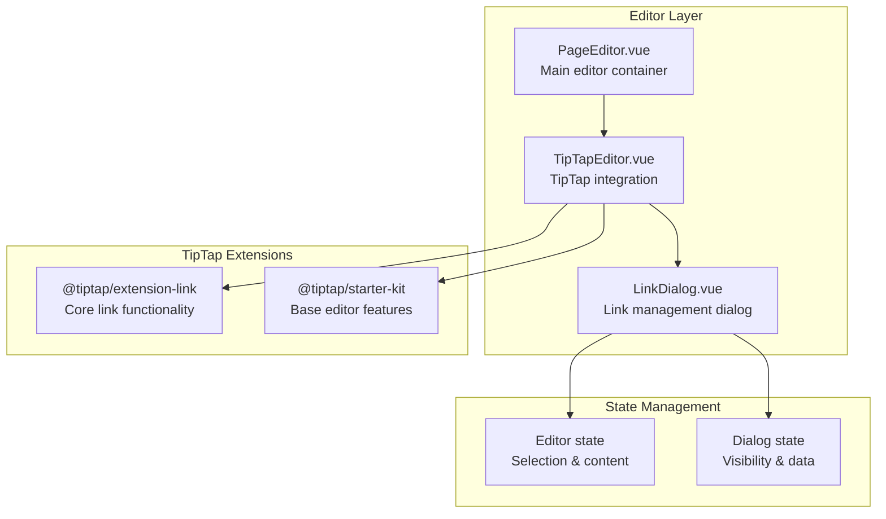
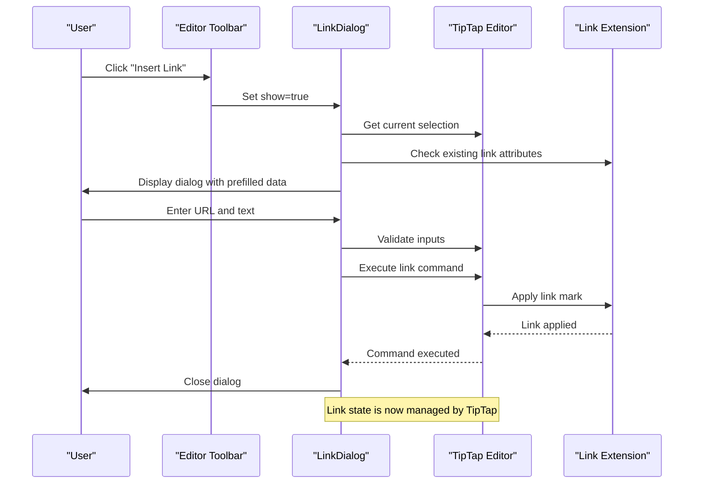
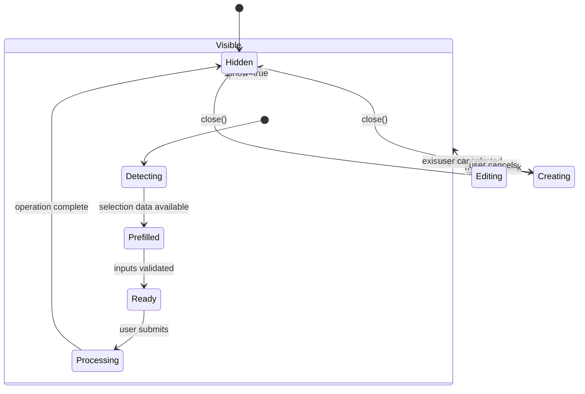
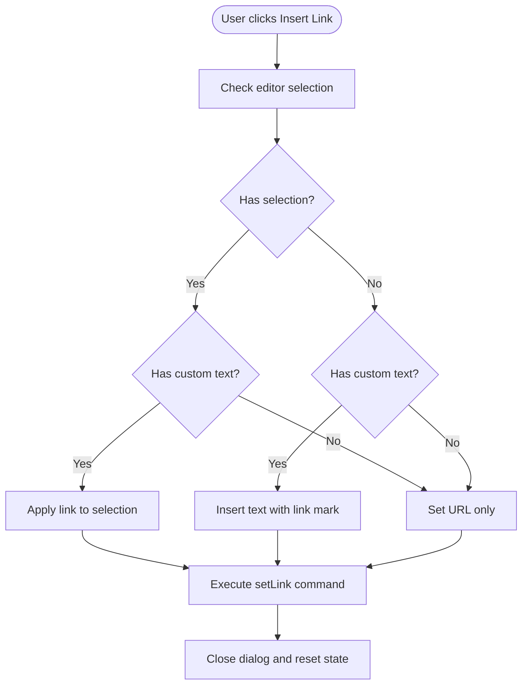
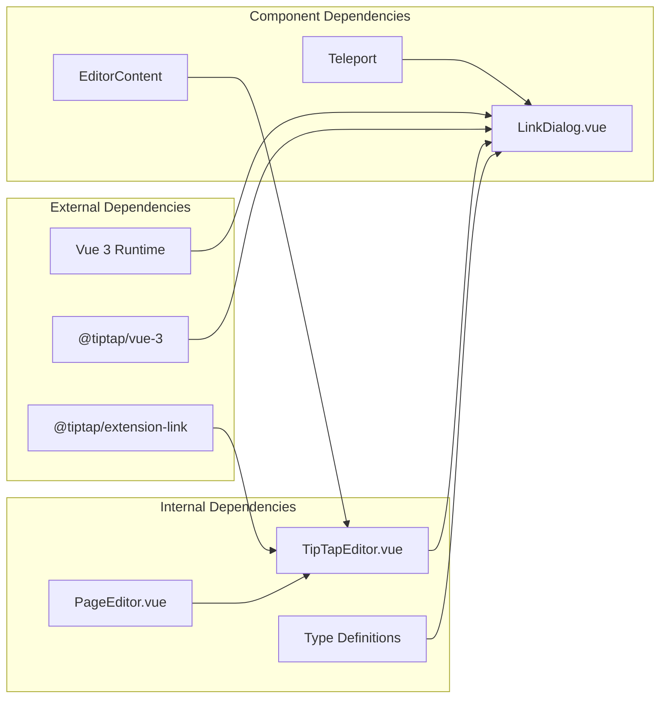

# Link Dialog Component

<cite>
**Referenced Files in This Document**
- [LinkDialog.vue](file://code/client/src/components/editor/LinkDialog.vue)
- [TipTapEditor.vue](file://code/client/src/components/editor/TipTapEditor.vue)
- [PageEditor.vue](file://code/client/src/components/editor/PageEditor.vue)
- [ARCHITECTURE.md](file://arch/ARCHITECTURE.md)
</cite>

## Table of Contents
1. [Introduction](#introduction)
2. [Project Structure](#project-structure)
3. [Core Components](#core-components)
4. [Architecture Overview](#architecture-overview)
5. [Detailed Component Analysis](#detailed-component-analysis)
6. [Dependency Analysis](#dependency-analysis)
7. [Performance Considerations](#performance-considerations)
8. [Security and Accessibility](#security-and-accessibility)
9. [Troubleshooting Guide](#troubleshooting-guide)
10. [Conclusion](#conclusion)

## Introduction

The Link Dialog component is a crucial part of the Yule Notion rich text editor system. It provides a user-friendly interface for creating, editing, and removing hyperlinks within the TipTap editor. This component integrates seamlessly with the TipTap Link extension to offer a comprehensive link management solution that supports URL validation, target configuration, and link text customization.

The component follows modern Vue 3 Composition API patterns and implements a clean separation of concerns between the dialog interface and the underlying editor functionality. It leverages TipTap's powerful link extension while maintaining a simple, intuitive user experience.

## Project Structure

The Link Dialog component is part of a larger editor ecosystem built with Vue 3 and TipTap. The component architecture demonstrates clear separation between presentation, logic, and integration layers.

**Diagram sources**
- [TipTapEditor.vue:112-194](file://code/client/src/components/editor/TipTapEditor.vue#L112-L194)
- [LinkDialog.vue:10-84](file://code/client/src/components/editor/LinkDialog.vue#L10-L84)

**Section sources**
- [TipTapEditor.vue:112-194](file://code/client/src/components/editor/TipTapEditor.vue#L112-L194)
- [LinkDialog.vue:10-84](file://code/client/src/components/editor/LinkDialog.vue#L10-L84)

## Core Components

The Link Dialog implementation consists of several key components working together to provide comprehensive link management functionality:

### LinkDialog Component
The primary component responsible for user interaction and link manipulation. It handles:
- URL input validation and processing
- Link text customization
- Existing link detection and editing
- Integration with TipTap editor commands

### TipTapEditor Integration
The parent component that manages the overall editor state and coordinates link dialog interactions. It provides:
- Editor instance management
- Toolbar integration
- Content synchronization
- Dialog state coordination

### PageEditor Container
The highest-level component that orchestrates the entire editing experience and passes data down to child components.

**Section sources**
- [LinkDialog.vue:13-25](file://code/client/src/components/editor/LinkDialog.vue#L13-L25)
- [TipTapEditor.vue:42-50](file://code/client/src/components/editor/TipTapEditor.vue#L42-L50)
- [PageEditor.vue:10-16](file://code/client/src/components/editor/PageEditor.vue#L10-L16)

## Architecture Overview

The Link Dialog component follows a unidirectional data flow pattern with clear boundaries between components. The architecture emphasizes separation of concerns and maintainable code structure.

**Diagram sources**
- [TipTapEditor.vue:227-228](file://code/client/src/components/editor/TipTapEditor.vue#L227-L228)
- [LinkDialog.vue:27-48](file://code/client/src/components/editor/LinkDialog.vue#L27-L48)
- [LinkDialog.vue:50-70](file://code/client/src/components/editor/LinkDialog.vue#L50-L70)

The architecture demonstrates several key patterns:

1. **Event-Driven Communication**: Components communicate through well-defined events and props
2. **State Delegation**: Parent components manage shared state while children handle specific UI concerns
3. **Command Pattern**: Editor operations are executed through TipTap's chain-based command system
4. **Extension Integration**: Clean integration with TipTap's modular extension architecture

**Section sources**
- [TipTapEditor.vue:297-305](file://code/client/src/components/editor/TipTapEditor.vue#L297-L305)
- [LinkDialog.vue:18-21](file://code/client/src/components/editor/LinkDialog.vue#L18-L21)

## Detailed Component Analysis

### LinkDialog Component Implementation

The LinkDialog component implements a sophisticated workflow for link management with comprehensive state handling and user interaction support.

#### State Management and Lifecycle

**Diagram sources**
- [LinkDialog.vue:27-48](file://code/client/src/components/editor/LinkDialog.vue#L27-L48)
- [LinkDialog.vue:78-83](file://code/client/src/components/editor/LinkDialog.vue#L78-L83)

#### Link Creation Workflow

The component implements three distinct link creation scenarios:

1. **Existing Selection with URL**: Applies link to selected text
2. **Custom Text with URL**: Inserts new text with link mark
3. **URL Only**: Creates link without modifying selection

**Diagram sources**
- [LinkDialog.vue:50-70](file://code/client/src/components/editor/LinkDialog.vue#L50-L70)

#### Form Validation and User Feedback

The component implements basic but effective validation patterns:

- **URL Presence Validation**: Prevents empty URL submissions
- **Selection Awareness**: Automatically detects existing selections
- **Existing Link Detection**: Identifies and prepares for link editing
- **Visual Feedback**: Disabled states and button labels adapt to context

**Section sources**
- [LinkDialog.vue:51-70](file://code/client/src/components/editor/LinkDialog.vue#L51-L70)
- [LinkDialog.vue:144-149](file://code/client/src/components/editor/LinkDialog.vue#L144-L149)

### TipTap Integration Patterns

The Link Dialog integrates deeply with TipTap's architecture through several key mechanisms:

#### Link Extension Configuration

The TipTap editor is configured with the Link extension using `openOnClick: false` to prevent automatic link opening behavior. This allows the dialog to manage link interactions programmatically.

#### Editor State Synchronization

The component maintains bidirectional communication with the editor through:
- Selection state detection
- Content inspection
- Command execution delegation
- State cleanup

**Section sources**
- [TipTapEditor.vue:125](file://code/client/src/components/editor/TipTapEditor.vue#L125)
- [LinkDialog.vue:39-46](file://code/client/src/components/editor/LinkDialog.vue#L39-L46)

### Dialog State Management

The dialog implements sophisticated state management for different operational modes:

#### Edit Mode Detection

The component automatically detects whether it should operate in edit mode by checking the current link attributes in the editor. This enables seamless switching between creation and modification workflows.

#### Teleport Integration

The dialog uses Vue's Teleport feature to render outside the normal component hierarchy, ensuring proper z-index stacking and modal behavior across different parent contexts.

**Section sources**
- [LinkDialog.vue:27-48](file://code/client/src/components/editor/LinkDialog.vue#L27-L48)
- [LinkDialog.vue:86-154](file://code/client/src/components/editor/LinkDialog.vue#L86-L154)

## Dependency Analysis

The Link Dialog component has carefully managed dependencies that reflect the overall architecture goals of maintainability and modularity.

**Diagram sources**
- [LinkDialog.vue:10-11](file://code/client/src/components/editor/LinkDialog.vue#L10-L11)
- [TipTapEditor.vue:13-40](file://code/client/src/components/editor/TipTapEditor.vue#L13-L40)

The dependency structure demonstrates several important characteristics:

1. **Minimal External Dependencies**: Only essential libraries are used
2. **Clear Internal Boundaries**: Components have well-defined responsibilities
3. **Type Safety**: Full TypeScript integration ensures compile-time safety
4. **Framework Integration**: Seamless integration with Vue 3 ecosystem

**Section sources**
- [TipTapEditor.vue:13-40](file://code/client/src/components/editor/TipTapEditor.vue#L13-L40)
- [LinkDialog.vue:10-11](file://code/client/src/components/editor/LinkDialog.vue#L10-L11)

## Performance Considerations

The Link Dialog component is designed with performance optimization in mind, particularly given the real-time nature of editor interactions.

### Efficient State Updates

The component uses Vue's reactivity system efficiently:
- Reactive references for URL and text inputs
- Computed properties for derived state
- Minimal DOM manipulation through template binding
- Optimized watcher patterns for dialog visibility

### Memory Management

Key performance considerations include:
- Proper cleanup of editor references
- Efficient event listener management
- Minimal memory footprint during idle states
- Optimized rendering through conditional templates

### Editor Integration Efficiency

The component minimizes editor state churn by:
- Batch operations using TipTap's chain system
- Selective state updates
- Efficient selection detection
- Minimal unnecessary re-renders

## Security and Accessibility

### Security Considerations

The current implementation focuses on basic URL presence validation. For production deployments, consider implementing:

#### URL Validation Enhancements
- Protocol whitelist enforcement (https/http/mailto)
- Domain allowlisting for external links
- Malicious URL pattern detection
- Sanitization of potentially dangerous protocols

#### Content Security
- XSS prevention through proper escaping
- Safe attribute handling
- Cross-site scripting protection
- Input sanitization for custom text

### Accessibility Compliance

The component follows several accessibility best practices:
- Keyboard navigation support (Enter key handling)
- Focus management during dialog operations
- Screen reader friendly labels
- Proper ARIA attributes where applicable
- High contrast color schemes
- Responsive touch targets

**Section sources**
- [LinkDialog.vue:109-124](file://code/client/src/components/editor/LinkDialog.vue#L109-L124)
- [TipTapEditor.vue:444-449](file://code/client/src/components/editor/TipTapEditor.vue#L444-L449)

## Troubleshooting Guide

### Common Issues and Solutions

#### Link Not Applied
**Symptoms**: Clicking "Insert" has no effect
**Causes**: 
- Empty URL field
- Editor not focused
- Selection conflicts

**Solutions**:
- Ensure URL field has valid content
- Verify editor focus before operation
- Check for conflicting selections

#### Existing Link Not Detected
**Symptoms**: Dialog shows blank URL when editing existing links
**Causes**:
- Incorrect selection boundaries
- Link attributes not properly detected
- Editor state inconsistencies

**Solutions**:
- Re-select the link text precisely
- Refresh editor state
- Check for nested marks interference

#### Dialog Visibility Issues
**Symptoms**: Dialog appears but cannot be closed
**Causes**:
- Event propagation issues
- Parent component state conflicts
- Teleport rendering problems

**Solutions**:
- Verify click-outside handler works
- Check parent component dialog state
- Ensure proper z-index stacking

### Debugging Strategies

1. **Console Logging**: Add targeted console.log statements in key lifecycle hooks
2. **State Inspection**: Use Vue DevTools to inspect component state
3. **Editor State**: Monitor TipTap editor state changes
4. **Event Flow**: Trace event propagation through component hierarchy

**Section sources**
- [LinkDialog.vue:27-48](file://code/client/src/components/editor/LinkDialog.vue#L27-L48)
- [TipTapEditor.vue:297-305](file://code/client/src/components/editor/TipTapEditor.vue#L297-L305)

## Conclusion

The Link Dialog component represents a well-architected solution for link management within the Yule Notion editor system. Its implementation demonstrates excellent separation of concerns, efficient state management, and clean integration with the TipTap ecosystem.

The component successfully balances simplicity with functionality, providing users with an intuitive interface for link creation and editing while maintaining robust integration with the underlying editor infrastructure. The architecture supports future enhancements such as custom validation rules, advanced link handlers, and expanded link type support.

Key strengths of the implementation include:
- Clean separation between UI and editor logic
- Efficient state management and lifecycle handling
- Robust integration with TipTap's extension system
- Comprehensive user feedback mechanisms
- Maintainable code structure with clear dependencies

Future enhancements could include advanced URL validation, custom link type support, and expanded accessibility features, all while maintaining the component's current architectural strengths.