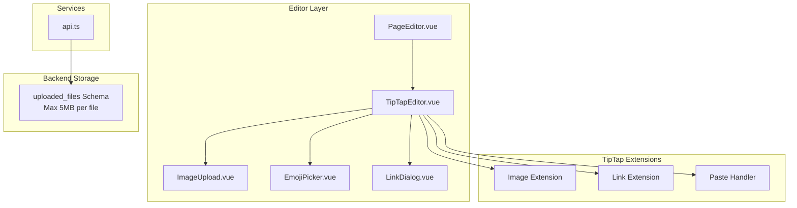
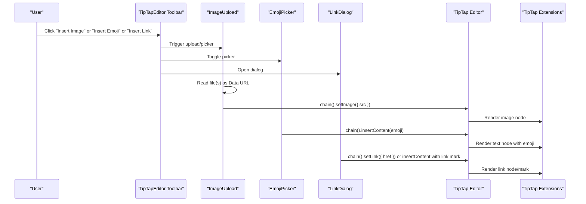
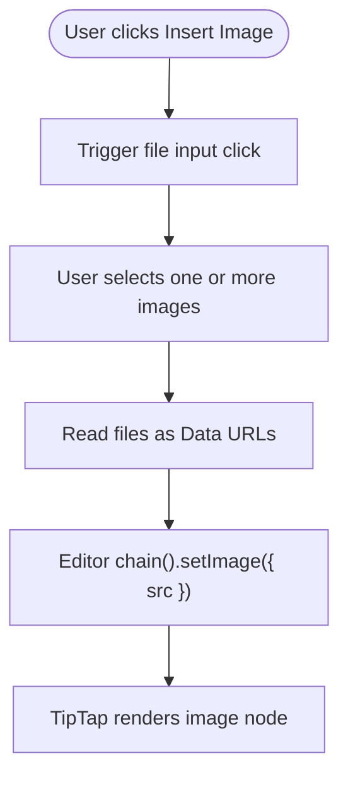
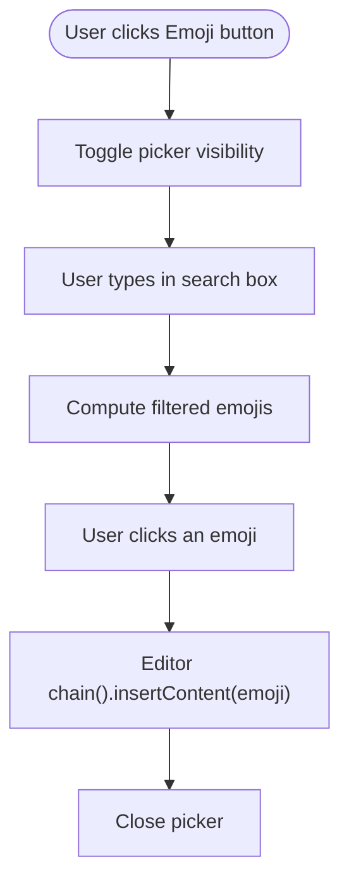
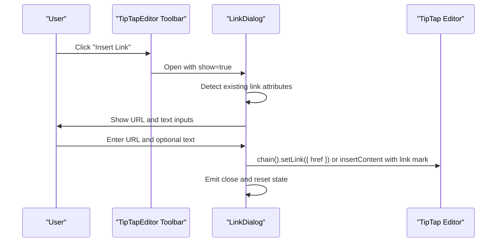
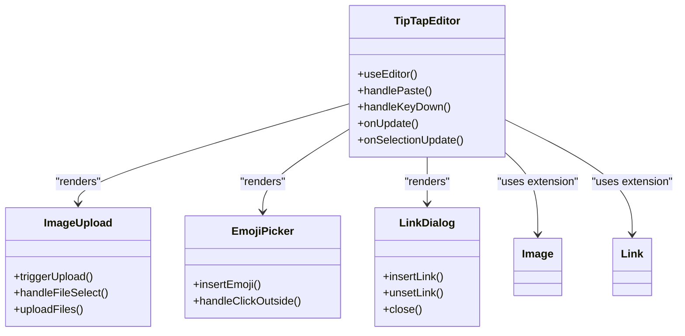
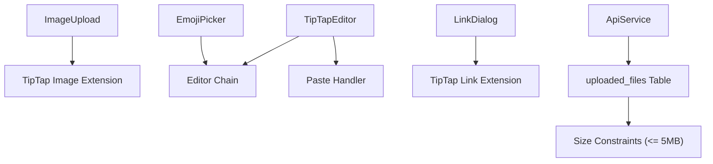
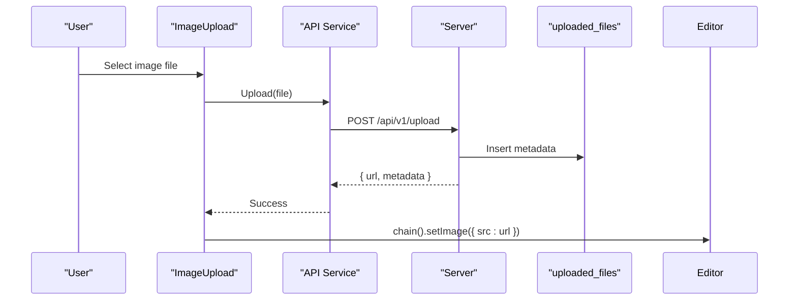

# Media Insertion & Management

<cite>
**Referenced Files in This Document**
- [ImageUpload.vue](file://code/client/src/components/editor/ImageUpload.vue)
- [EmojiPicker.vue](file://code/client/src/components/editor/EmojiPicker.vue)
- [LinkDialog.vue](file://code/client/src/components/editor/LinkDialog.vue)
- [TipTapEditor.vue](file://code/client/src/components/editor/TipTapEditor.vue)
- [PageEditor.vue](file://code/client/src/components/editor/PageEditor.vue)
- [api.ts](file://code/client/src/services/api.ts)
- [001_init.sql](file://db/001_init.sql)
- [20260319_init.ts](file://code/server/src/db/migrations/20260319_init.ts)
</cite>

## Table of Contents
1. [Introduction](#introduction)
2. [Project Structure](#project-structure)
3. [Core Components](#core-components)
4. [Architecture Overview](#architecture-overview)
5. [Detailed Component Analysis](#detailed-component-analysis)
6. [Dependency Analysis](#dependency-analysis)
7. [Performance Considerations](#performance-considerations)
8. [Security Considerations](#security-considerations)
9. [Customization Guide](#customization-guide)
10. [Troubleshooting Guide](#troubleshooting-guide)
11. [Conclusion](#conclusion)

## Introduction
This document provides comprehensive documentation for media insertion and management features in the editor. It covers three primary capabilities:
- Image upload via file selection and paste, integrated with TipTap's image extension
- Emoji insertion through a categorized picker with search and click-to-insert behavior
- Link insertion and management via a modal dialog supporting URL and text customization

The documentation explains the complete workflow from user interaction to content rendering, along with customization options, security considerations, and performance optimization strategies for media-heavy content.

## Project Structure
The media-related functionality is implemented as Vue components within the editor module and integrates with TipTap for rich text editing. Supporting infrastructure includes:
- Frontend components for image, emoji, and link management
- TipTap editor configuration enabling media extensions and paste handlers
- Backend database schema for file metadata storage with size constraints
- API service for client-server communication

**Diagram sources**
- [TipTapEditor.vue:112-194](file://code/client/src/components/editor/TipTapEditor.vue#L112-L194)
- [ImageUpload.vue:9-44](file://code/client/src/components/editor/ImageUpload.vue#L9-L44)
- [EmojiPicker.vue:10-70](file://code/client/src/components/editor/EmojiPicker.vue#L10-L70)
- [LinkDialog.vue:10-84](file://code/client/src/components/editor/LinkDialog.vue#L10-L84)
- [api.ts:15-64](file://code/client/src/services/api.ts#L15-L64)
- [001_init.sql:116-132](file://db/001_init.sql#L116-L132)

**Section sources**
- [TipTapEditor.vue:112-194](file://code/client/src/components/editor/TipTapEditor.vue#L112-L194)
- [ImageUpload.vue:9-44](file://code/client/src/components/editor/ImageUpload.vue#L9-L44)
- [EmojiPicker.vue:10-70](file://code/client/src/components/editor/EmojiPicker.vue#L10-L70)
- [LinkDialog.vue:10-84](file://code/client/src/components/editor/LinkDialog.vue#L10-L84)
- [api.ts:15-64](file://code/client/src/services/api.ts#L15-L64)
- [001_init.sql:116-132](file://db/001_init.sql#L116-L132)

## Core Components
This section outlines the primary components responsible for media insertion and management.

- ImageUpload: Handles file selection and paste events, converts images to data URLs, and inserts them into the editor using TipTap's image extension.
- EmojiPicker: Provides a categorized emoji picker with search and click-to-insert behavior, integrating with the editor chain.
- LinkDialog: Manages URL and text insertion, supports editing existing links, and removal of links.

These components are integrated into the TipTapEditor toolbar and leverage TipTap's extensions for rendering and persistence.

**Section sources**
- [ImageUpload.vue:9-44](file://code/client/src/components/editor/ImageUpload.vue#L9-L44)
- [EmojiPicker.vue:10-70](file://code/client/src/components/editor/EmojiPicker.vue#L10-L70)
- [LinkDialog.vue:10-84](file://code/client/src/components/editor/LinkDialog.vue#L10-L84)
- [TipTapEditor.vue:475-499](file://code/client/src/components/editor/TipTapEditor.vue#L475-L499)

## Architecture Overview
The media insertion workflow spans user interaction, component logic, TipTap integration, and backend persistence. The following diagram illustrates the end-to-end flow for each media type.

**Diagram sources**
- [TipTapEditor.vue:475-499](file://code/client/src/components/editor/TipTapEditor.vue#L475-L499)
- [ImageUpload.vue:33-44](file://code/client/src/components/editor/ImageUpload.vue#L33-L44)
- [EmojiPicker.vue:54-57](file://code/client/src/components/editor/EmojiPicker.vue#L54-L57)
- [LinkDialog.vue:50-83](file://code/client/src/components/editor/LinkDialog.vue#L50-L83)

## Detailed Component Analysis

### ImageUpload Component
The ImageUpload component enables inserting images through:
- File selection: Opens a native file input, reads selected files as Data URLs, and inserts them into the editor.
- Paste support: Integrated into TipTap's paste handler to convert clipboard images to Data URLs and insert them.

Key behaviors:
- Accepts image/* files and allows multiple selections
- Resets the file input after selection to enable re-selection of the same file
- Uses FileReader to produce Data URLs for immediate preview and insertion
- Inserts images via TipTap's setImage command

**Diagram sources**
- [ImageUpload.vue:19-44](file://code/client/src/components/editor/ImageUpload.vue#L19-L44)
- [TipTapEditor.vue:154-175](file://code/client/src/components/editor/TipTapEditor.vue#L154-L175)

**Section sources**
- [ImageUpload.vue:9-44](file://code/client/src/components/editor/ImageUpload.vue#L9-L44)
- [TipTapEditor.vue:154-175](file://code/client/src/components/editor/TipTapEditor.vue#L154-L175)

### EmojiPicker Component
The EmojiPicker component provides:
- Categorized emoji groups (Recently Used, Smileys, Gestures, Objects, Symbols)
- Search functionality to filter emojis by content
- Click-to-insert behavior that focuses the editor and inserts the selected emoji

Behavior highlights:
- Maintains an internal state to show/hide the picker and track the search query
- Computes filtered emojis when the search query is present
- Uses a click-outside handler to close the picker when clicking outside the component
- Inserts emojis using the editor chain's insertContent method

**Diagram sources**
- [EmojiPicker.vue:19-70](file://code/client/src/components/editor/EmojiPicker.vue#L19-L70)
- [EmojiPicker.vue:48-57](file://code/client/src/components/editor/EmojiPicker.vue#L48-L57)

**Section sources**
- [EmojiPicker.vue:10-70](file://code/client/src/components/editor/EmojiPicker.vue#L10-L70)
- [EmojiPicker.vue:48-57](file://code/client/src/components/editor/EmojiPicker.vue#L48-L57)

### LinkDialog Component
The LinkDialog component manages URL and text insertion:
- Detects existing link attributes when opened
- Supports inserting a link with selected text, inserting text with a link mark, or setting a link without selected text
- Provides an option to remove an existing link
- Emits a close event to reset state and dismiss the dialog

**Diagram sources**
- [LinkDialog.vue:27-83](file://code/client/src/components/editor/LinkDialog.vue#L27-L83)
- [TipTapEditor.vue:227-245](file://code/client/src/components/editor/TipTapEditor.vue#L227-L245)

**Section sources**
- [LinkDialog.vue:10-84](file://code/client/src/components/editor/LinkDialog.vue#L10-L84)
- [TipTapEditor.vue:227-245](file://code/client/src/components/editor/TipTapEditor.vue#L227-L245)

### TipTapEditor Integration
The TipTapEditor orchestrates media insertion through:
- Toolbar integration: Embeds ImageUpload, EmojiPicker, and LinkDialog components
- Paste handling: Converts clipboard images to Data URLs and inserts them into the editor
- Extension configuration: Enables TipTap's Image and Link extensions for rendering and editing
- Content synchronization: Emits updates to the parent component for persistence

**Diagram sources**
- [TipTapEditor.vue:112-194](file://code/client/src/components/editor/TipTapEditor.vue#L112-L194)
- [TipTapEditor.vue:475-499](file://code/client/src/components/editor/TipTapEditor.vue#L475-L499)

**Section sources**
- [TipTapEditor.vue:112-194](file://code/client/src/components/editor/TipTapEditor.vue#L112-L194)
- [TipTapEditor.vue:475-499](file://code/client/src/components/editor/TipTapEditor.vue#L475-L499)

## Dependency Analysis
The media insertion features depend on:
- TipTap extensions for rendering and editing (Image, Link)
- Vue components for UI interactions (ImageUpload, EmojiPicker, LinkDialog)
- Paste handlers for seamless image insertion from clipboard
- API service for backend integration (when extending upload to server)
- Database schema for storing file metadata with size constraints

**Diagram sources**
- [TipTapEditor.vue:112-194](file://code/client/src/components/editor/TipTapEditor.vue#L112-L194)
- [ImageUpload.vue:33-44](file://code/client/src/components/editor/ImageUpload.vue#L33-L44)
- [EmojiPicker.vue:54-57](file://code/client/src/components/editor/EmojiPicker.vue#L54-L57)
- [LinkDialog.vue:50-83](file://code/client/src/components/editor/LinkDialog.vue#L50-L83)
- [api.ts:15-64](file://code/client/src/services/api.ts#L15-L64)
- [001_init.sql:125](file://db/001_init.sql#L125)

**Section sources**
- [TipTapEditor.vue:112-194](file://code/client/src/components/editor/TipTapEditor.vue#L112-L194)
- [ImageUpload.vue:33-44](file://code/client/src/components/editor/ImageUpload.vue#L33-L44)
- [EmojiPicker.vue:54-57](file://code/client/src/components/editor/EmojiPicker.vue#L54-L57)
- [LinkDialog.vue:50-83](file://code/client/src/components/editor/LinkDialog.vue#L50-L83)
- [api.ts:15-64](file://code/client/src/services/api.ts#L15-L64)
- [001_init.sql:125](file://db/001_init.sql#L125)

## Performance Considerations
- Image data URLs: The current implementation converts images to Data URLs for immediate insertion. While convenient, Data URLs increase document size and can impact rendering performance for large images. Consider transitioning to server-side uploads with optimized image delivery for heavy content.
- Paste handling: Clipboard image conversion occurs synchronously during paste events. For very large images, consider debouncing or async processing to avoid blocking the UI.
- Emoji rendering: The emoji picker uses a grid layout with categorized sections. For large emoji sets, virtualization or pagination could improve responsiveness.
- Link rendering: Links are inserted as marks/nodes. Keep link text concise and avoid excessive nesting to maintain editor performance.

[No sources needed since this section provides general guidance]

## Security Considerations
- File size limits: The backend enforces a maximum file size constraint of 5 MB for uploaded files. This prevents abuse and ensures efficient storage and retrieval.
- MIME type validation: Enforce MIME type checks on the server to ensure only images are accepted.
- Sanitization: Sanitize user-provided content to prevent XSS attacks, especially when rendering external links.
- Authentication and authorization: Ensure all upload requests are authenticated and scoped to the user's context.

**Section sources**
- [001_init.sql:125](file://db/001_init.sql#L125)
- [20260319_init.ts:148](file://code/server/src/db/migrations/20260319_init.ts#L148)

## Customization Guide

### Customizing Media Handling
- Image insertion: Extend the paste handler to integrate with a custom upload provider. After successful upload, replace the Data URL with the server-provided URL and store metadata in the database.
- Emoji categories: Modify the emoji categories array to reflect brand-specific or localized emoji sets.
- Link behavior: Customize link insertion logic to support additional attributes (e.g., target, rel) and validation rules.

### Implementing Custom Upload Providers
- Backend endpoint: Create an API endpoint to receive file uploads, validate size and MIME type, and return a signed URL or direct URL.
- Frontend integration: Replace the Data URL insertion in ImageUpload with a call to the upload endpoint and update the editor with the returned URL.
- Metadata management: Store file metadata (original name, storage path, MIME type, size) in the uploaded_files table.

**Diagram sources**
- [ImageUpload.vue:33-44](file://code/client/src/components/editor/ImageUpload.vue#L33-L44)
- [api.ts:15-64](file://code/client/src/services/api.ts#L15-L64)
- [001_init.sql:116-132](file://db/001_init.sql#L116-L132)

### Managing Media Metadata
- Store original filename, storage path, MIME type, and size in the uploaded_files table.
- Index user_id for efficient queries and audits.
- Apply size constraints to prevent oversized uploads.

**Section sources**
- [001_init.sql:116-132](file://db/001_init.sql#L116-L132)
- [20260319_init.ts:140-149](file://code/server/src/db/migrations/20260319_init.ts#L140-L149)

## Troubleshooting Guide
Common issues and resolutions:
- Images not inserting: Verify that the file input accepts image/* and that the paste handler is enabled. Ensure the editor chain is focused before insertion.
- Emoji picker not closing: Confirm the click-outside handler is registered and that the picker state toggles correctly.
- Link dialog not updating: Check that the dialog watches the show prop and reads link attributes from the editor state.
- Upload failures: Validate API endpoint availability, authentication headers, and server-side size/MIME checks.

**Section sources**
- [ImageUpload.vue:19-44](file://code/client/src/components/editor/ImageUpload.vue#L19-L44)
- [EmojiPicker.vue:59-70](file://code/client/src/components/editor/EmojiPicker.vue#L59-L70)
- [LinkDialog.vue:27-48](file://code/client/src/components/editor/LinkDialog.vue#L27-L48)
- [api.ts:30-61](file://code/client/src/services/api.ts#L30-L61)

## Conclusion
The media insertion and management system combines Vue components with TipTap extensions to deliver a seamless user experience for inserting images, emojis, and links. By leveraging paste handlers, categorized emoji selection, and a configurable link dialog, the system supports flexible content creation. For production deployments, consider migrating from Data URLs to server-side uploads, enforcing strict validation, and optimizing rendering for media-heavy documents.