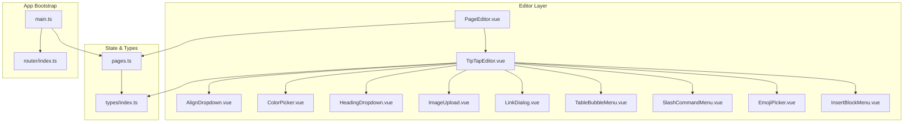
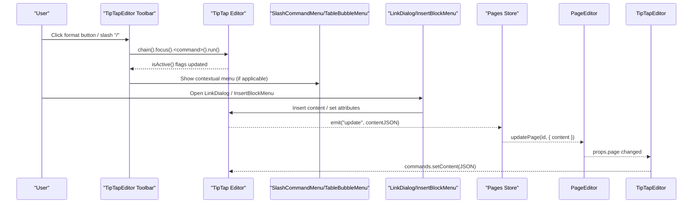
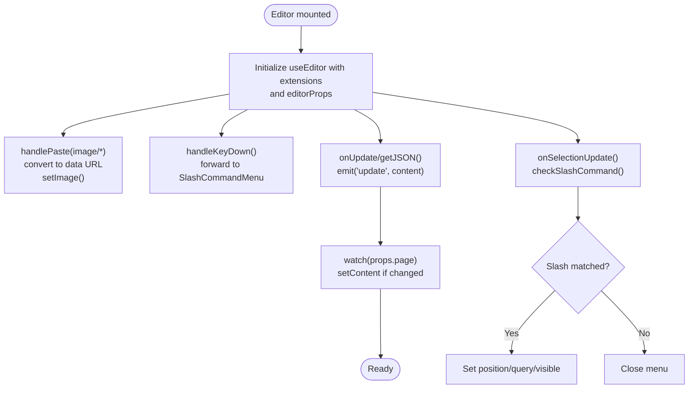
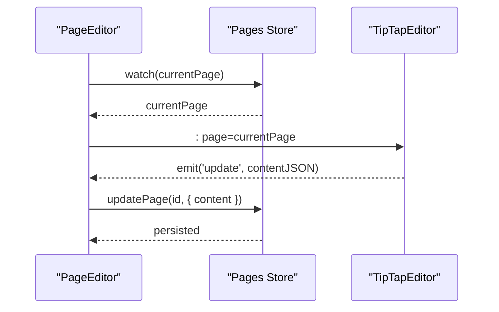
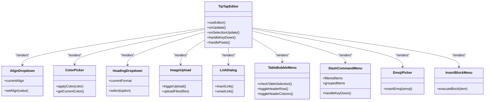
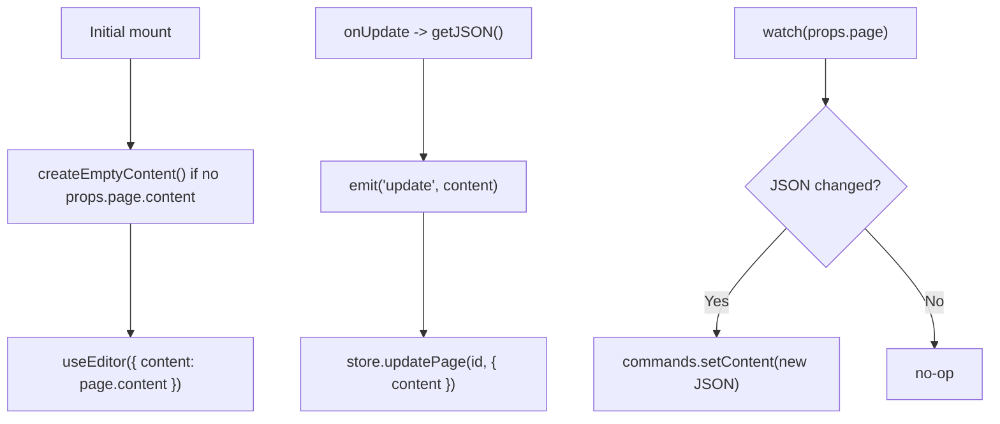
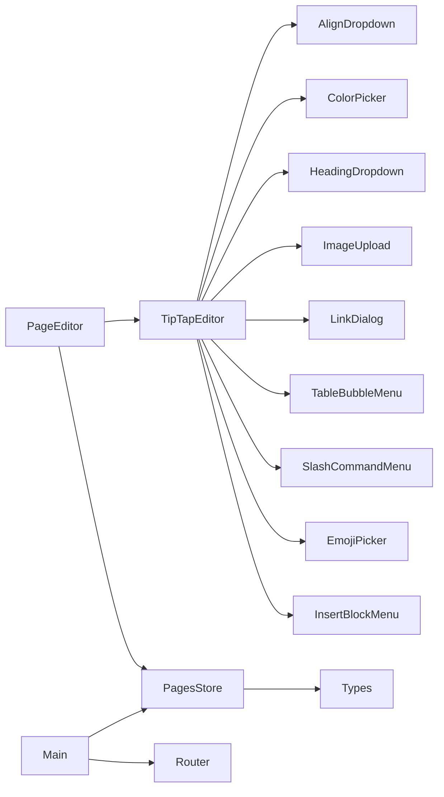

# Rich Text Editor

<cite>
**Referenced Files in This Document**
- [TipTapEditor.vue](file://code/client/src/components/editor/TipTapEditor.vue)
- [PageEditor.vue](file://code/client/src/components/editor/PageEditor.vue)
- [AlignDropdown.vue](file://code/client/src/components/editor/AlignDropdown.vue)
- [ColorPicker.vue](file://code/client/src/components/editor/ColorPicker.vue)
- [HeadingDropdown.vue](file://code/client/src/components/editor/HeadingDropdown.vue)
- [ImageUpload.vue](file://code/client/src/components/editor/ImageUpload.vue)
- [LinkDialog.vue](file://code/client/src/components/editor/LinkDialog.vue)
- [TableBubbleMenu.vue](file://code/client/src/components/editor/TableBubbleMenu.vue)
- [SlashCommandMenu.vue](file://code/client/src/components/editor/SlashCommandMenu.vue)
- [EmojiPicker.vue](file://code/client/src/components/editor/EmojiPicker.vue)
- [InsertBlockMenu.vue](file://code/client/src/components/editor/InsertBlockMenu.vue)
- [pages.ts](file://code/client/src/stores/pages.ts)
- [index.ts](file://code/client/src/types/index.ts)
- [index.ts](file://code/client/src/router/index.ts)
- [main.ts](file://code/client/src/main.ts)
</cite>

## Table of Contents
1. [Introduction](#introduction)
2. [Project Structure](#project-structure)
3. [Core Components](#core-components)
4. [Architecture Overview](#architecture-overview)
5. [Detailed Component Analysis](#detailed-component-analysis)
6. [Dependency Analysis](#dependency-analysis)
7. [Performance Considerations](#performance-considerations)
8. [Troubleshooting Guide](#troubleshooting-guide)
9. [Conclusion](#conclusion)
10. [Appendices](#appendices)

## Introduction
This document explains the TipTap-based rich text editor implementation used in a Notion-like application. It covers the editor architecture, extension system, and customization patterns that enable a broad set of formatting features. It also documents editor state management, content serialization/deserialization, collaborative editing readiness, component composition patterns, reusable UI components (ColorPicker, AlignDropdown, etc.), and integration with the page management system. Guidance is included for performance optimization, content validation, accessibility, extending the editor with custom extensions, and handling edge cases in content rendering.

## Project Structure
The editor is implemented as a set of cohesive Vue components under the editor folder, orchestrated by a page-level editor container and integrated with a Pinia-based page store. The router and main entry initialize the app and authentication state.

**Diagram sources**
- [TipTapEditor.vue:1-732](file://code/client/src/components/editor/TipTapEditor.vue#L1-L732)
- [PageEditor.vue:1-208](file://code/client/src/components/editor/PageEditor.vue#L1-L208)
- [pages.ts:1-165](file://code/client/src/stores/pages.ts#L1-L165)
- [index.ts:72-90](file://code/client/src/types/index.ts#L72-L90)
- [index.ts:14-93](file://code/client/src/router/index.ts#L14-L93)
- [main.ts:1-54](file://code/client/src/main.ts#L1-L54)

**Section sources**
- [TipTapEditor.vue:1-732](file://code/client/src/components/editor/TipTapEditor.vue#L1-L732)
- [PageEditor.vue:1-208](file://code/client/src/components/editor/PageEditor.vue#L1-L208)
- [pages.ts:1-165](file://code/client/src/stores/pages.ts#L1-L165)
- [index.ts:72-90](file://code/client/src/types/index.ts#L72-L90)
- [index.ts:14-93](file://code/client/src/router/index.ts#L14-L93)
- [main.ts:1-54](file://code/client/src/main.ts#L1-L54)

## Core Components
- TipTapEditor: The central editor component that initializes TipTap, composes extensions, wires keyboard shortcuts, paste handlers, and emits content updates. It renders the toolbar with reusable controls and manages slash command menus and table bubble menu.
- PageEditor: The page-level container that binds the current page from the store, renders the title and metadata, and passes the page’s content to TipTapEditor while receiving updates.
- Reusable Controls: AlignDropdown, ColorPicker, HeadingDropdown, ImageUpload, LinkDialog, TableBubbleMenu, SlashCommandMenu, EmojiPicker, InsertBlockMenu.
- State Management: Pinia pages store persists pages locally and exposes current page, creation/update/delete actions, and helpers for hierarchy.

Key capabilities:
- Formatting: headings, paragraphs, bold, italic, strikethrough, underline, code inline/code block, lists (bullet, ordered, task), blockquote, horizontal rule.
- Media: images via upload/paste; emoji picker.
- Links: dialog-based insertion/editing/removal.
- Tables: floating bubble menu for resizing, header toggles, row/column operations, merge/split cells, deletion.
- Slash commands: contextual menu with filtering and recent commands.
- Persistence: TipTap JSON content stored in the page model; automatic saving via emitted updates.

**Section sources**
- [TipTapEditor.vue:61-133](file://code/client/src/components/editor/TipTapEditor.vue#L61-L133)
- [TipTapEditor.vue:136-219](file://code/client/src/components/editor/TipTapEditor.vue#L136-L219)
- [PageEditor.vue:45-49](file://code/client/src/components/editor/PageEditor.vue#L45-L49)
- [pages.ts:72-90](file://code/client/src/stores/pages.ts#L72-L90)

## Architecture Overview
The editor follows a component-driven architecture:
- TipTapEditor composes TipTap with a curated set of extensions and editorProps.
- Child components encapsulate UI affordances and delegate to TipTap chainable commands.
- PageEditor mediates between the store and the editor, ensuring two-way synchronization of title and content.
- The pages store persists content as TipTap JSON and exposes CRUD operations.

**Diagram sources**
- [TipTapEditor.vue:28-60](file://code/client/src/components/editor/TipTapEditor.vue#L28-L60)
- [TipTapEditor.vue:136-219](file://code/client/src/components/editor/TipTapEditor.vue#L136-L219)
- [LinkDialog.vue:28-83](file://code/client/src/components/editor/LinkDialog.vue#L28-L83)
- [InsertBlockMenu.vue:118-159](file://code/client/src/components/editor/InsertBlockMenu.vue#L118-L159)
- [PageEditor.vue:45-49](file://code/client/src/components/editor/PageEditor.vue#L45-L49)
- [pages.ts:98-104](file://code/client/src/stores/pages.ts#L98-L104)

## Detailed Component Analysis

### TipTapEditor: Extensions, Commands, and Menus
- Extensions: StarterKit (with configurable heading levels and list behavior), Placeholder, Link, Image, Underline, TextAlign, TextStyle, Color, Highlight (multicolor), TaskList/TaskItem (nested), Table/TableRow/TableCell/TableHeader (resizable).
- Editor lifecycle: useEditor initializes with content, attributes, keydown/keypress handlers, paste handler for images, and onUpdate/onSelectionUpdate callbacks.
- Slash command detection: listens to selection and key events to compute menu visibility and position; supports keyboard navigation and selection.
- Table bubble menu: shown when inside a table; supports width modes, header toggles, row/column operations, merge/split, and deletion.

**Diagram sources**
- [TipTapEditor.vue:61-133](file://code/client/src/components/editor/TipTapEditor.vue#L61-L133)
- [TipTapEditor.vue:188-229](file://code/client/src/components/editor/TipTapEditor.vue#L188-L229)
- [TipTapEditor.vue:236-243](file://code/client/src/components/editor/TipTapEditor.vue#L236-L243)

**Section sources**
- [TipTapEditor.vue:61-133](file://code/client/src/components/editor/TipTapEditor.vue#L61-L133)
- [TipTapEditor.vue:136-219](file://code/client/src/components/editor/TipTapEditor.vue#L136-L219)
- [TipTapEditor.vue:236-259](file://code/client/src/components/editor/TipTapEditor.vue#L236-L259)

### PageEditor: Composition and Two-Way Sync
- Binds the current page from the pages store, renders title and metadata, and passes the page to TipTapEditor.
- Receives content updates from the editor and persists them via store.updatePage.
- Provides empty state UX when no page is selected.

**Diagram sources**
- [PageEditor.vue:24-49](file://code/client/src/components/editor/PageEditor.vue#L24-L49)
- [pages.ts:98-104](file://code/client/src/stores/pages.ts#L98-L104)

**Section sources**
- [PageEditor.vue:1-208](file://code/client/src/components/editor/PageEditor.vue#L1-L208)
- [pages.ts:1-165](file://code/client/src/stores/pages.ts#L1-L165)

### Reusable Controls: Alignment, Colors, Headings, Images, Links, Emoji, Tables, Slash, Blocks
- AlignDropdown: Toggles text alignment; displays current alignment; click-outside closes.
- ColorPicker: Applies text color or highlight with predefined palettes; shows current color indicator.
- HeadingDropdown: Switches between paragraph and headings 1–6; reflects current format.
- ImageUpload: Triggers file input, reads as data URL, inserts image; supports paste-to-upload.
- LinkDialog: Detects selection and existing link attributes; supports insert/edit/remove.
- EmojiPicker: Category-based picker with search; inserts emoji at cursor.
- TableBubbleMenu: Floating menu for table operations; tracks selection and updates position.
- SlashCommandMenu: Filters by query, maintains recent items, keyboard navigation, Teleported overlay.
- InsertBlockMenu: Alternative insertion menu with categories and recent items.

**Diagram sources**
- [TipTapEditor.vue:295-417](file://code/client/src/components/editor/TipTapEditor.vue#L295-L417)
- [AlignDropdown.vue:1-160](file://code/client/src/components/editor/AlignDropdown.vue#L1-L160)
- [ColorPicker.vue:1-192](file://code/client/src/components/editor/ColorPicker.vue#L1-L192)
- [HeadingDropdown.vue:1-148](file://code/client/src/components/editor/HeadingDropdown.vue#L1-L148)
- [ImageUpload.vue:1-90](file://code/client/src/components/editor/ImageUpload.vue#L1-L90)
- [LinkDialog.vue:1-155](file://code/client/src/components/editor/LinkDialog.vue#L1-L155)
- [TableBubbleMenu.vue:1-337](file://code/client/src/components/editor/TableBubbleMenu.vue#L1-L337)
- [SlashCommandMenu.vue:1-300](file://code/client/src/components/editor/SlashCommandMenu.vue#L1-L300)
- [EmojiPicker.vue:1-198](file://code/client/src/components/editor/EmojiPicker.vue#L1-L198)
- [InsertBlockMenu.vue:1-410](file://code/client/src/components/editor/InsertBlockMenu.vue#L1-L410)

**Section sources**
- [TipTapEditor.vue:295-417](file://code/client/src/components/editor/TipTapEditor.vue#L295-L417)
- [AlignDropdown.vue:1-160](file://code/client/src/components/editor/AlignDropdown.vue#L1-L160)
- [ColorPicker.vue:1-192](file://code/client/src/components/editor/ColorPicker.vue#L1-L192)
- [HeadingDropdown.vue:1-148](file://code/client/src/components/editor/HeadingDropdown.vue#L1-L148)
- [ImageUpload.vue:1-90](file://code/client/src/components/editor/ImageUpload.vue#L1-L90)
- [LinkDialog.vue:1-155](file://code/client/src/components/editor/LinkDialog.vue#L1-L155)
- [TableBubbleMenu.vue:1-337](file://code/client/src/components/editor/TableBubbleMenu.vue#L1-L337)
- [SlashCommandMenu.vue:1-300](file://code/client/src/components/editor/SlashCommandMenu.vue#L1-L300)
- [EmojiPicker.vue:1-198](file://code/client/src/components/editor/EmojiPicker.vue#L1-L198)
- [InsertBlockMenu.vue:1-410](file://code/client/src/components/editor/InsertBlockMenu.vue#L1-L410)

### State Management and Serialization
- Content storage: TipTap JSON is stored in the page.content field.
- Empty content: createEmptyContent produces a minimal doc/paragraph structure.
- Persistence: pages store writes to localStorage and updates timestamps on edits.
- Two-way sync: watcher ensures editor content reflects store changes; editor emits updates to store.

**Diagram sources**
- [TipTapEditor.vue:232-243](file://code/client/src/components/editor/TipTapEditor.vue#L232-L243)
- [pages.ts:32-42](file://code/client/src/stores/pages.ts#L32-L42)
- [pages.ts:98-104](file://code/client/src/stores/pages.ts#L98-L104)

**Section sources**
- [TipTapEditor.vue:232-243](file://code/client/src/components/editor/TipTapEditor.vue#L232-L243)
- [pages.ts:32-42](file://code/client/src/stores/pages.ts#L32-L42)
- [pages.ts:98-104](file://code/client/src/stores/pages.ts#L98-L104)

### Real-Time Collaboration Readiness
- The current implementation uses local state and JSON serialization. There is no active Yjs or awareness integration present in the editor components.
- To enable real-time collaboration, integrate a Yjs binding with TipTap (e.g., @tiptap-pro/extension-yjs) and a provider (e.g., y-websocket). The editor would then operate on shared documents instead of local JSON.

[No sources needed since this section provides general guidance]

## Dependency Analysis
- Editor depends on TipTap core and official extensions.
- Child components depend on the editor instance passed via props.
- PageEditor depends on the pages store and the Page type.
- Router and main bootstrap initialize Pinia and authentication state.

**Diagram sources**
- [TipTapEditor.vue:1-732](file://code/client/src/components/editor/TipTapEditor.vue#L1-L732)
- [PageEditor.vue:1-208](file://code/client/src/components/editor/PageEditor.vue#L1-L208)
- [pages.ts:1-165](file://code/client/src/stores/pages.ts#L1-L165)
- [index.ts:72-90](file://code/client/src/types/index.ts#L72-L90)
- [index.ts:14-93](file://code/client/src/router/index.ts#L14-L93)
- [main.ts:1-54](file://code/client/src/main.ts#L1-L54)

**Section sources**
- [TipTapEditor.vue:1-732](file://code/client/src/components/editor/TipTapEditor.vue#L1-L732)
- [PageEditor.vue:1-208](file://code/client/src/components/editor/PageEditor.vue#L1-L208)
- [pages.ts:1-165](file://code/client/src/stores/pages.ts#L1-L165)
- [index.ts:72-90](file://code/client/src/types/index.ts#L72-L90)
- [index.ts:14-93](file://code/client/src/router/index.ts#L14-L93)
- [main.ts:1-54](file://code/client/src/main.ts#L1-L54)

## Performance Considerations
- Large documents: Prefer lazy rendering patterns and virtualization if content grows very large. Consider splitting content into blocks and loading on demand.
- Update frequency: Debounce or throttle content persistence to reduce write pressure.
- Rendering cost: Keep toolbar components lightweight; avoid unnecessary re-computation of isActive flags outside computed watchers.
- Paste handling: Limit concurrent paste operations; cancel previous reads if a new paste occurs quickly.
- Tables: Disable resizable behavior or limit column count for very large tables to reduce DOM overhead.
- Local storage: Batch updates and compress content when feasible; consider incremental sync to backend for large datasets.

[No sources needed since this section provides general guidance]

## Troubleshooting Guide
Common issues and resolutions:
- Content not updating: Verify the watcher on props.page and setContent path; ensure JSON equality checks are correct.
- Slash menu not closing: Confirm global click handler and closeSlashMenu logic; ensure Teleport target exists.
- Link dialog not detecting selection: Ensure selection range and getAttributes are called after focus.
- Table bubble menu not positioning: Confirm selectionUpdate/transaction listeners and DOM queries for table element.
- Images not inserting: Check paste event items and FileReader result; ensure setImage is chained after focus.
- Color/alignment not applying: Verify isActive checks and chain().focus() calls before toggles.

**Section sources**
- [TipTapEditor.vue:221-229](file://code/client/src/components/editor/TipTapEditor.vue#L221-L229)
- [LinkDialog.vue:28-48](file://code/client/src/components/editor/LinkDialog.vue#L28-L48)
- [TableBubbleMenu.vue:138-152](file://code/client/src/components/editor/TableBubbleMenu.vue#L138-L152)
- [ImageUpload.vue:33-44](file://code/client/src/components/editor/ImageUpload.vue#L33-L44)
- [ColorPicker.vue:49-64](file://code/client/src/components/editor/ColorPicker.vue#L49-L64)
- [AlignDropdown.vue:36-39](file://code/client/src/components/editor/AlignDropdown.vue#L36-L39)

## Conclusion
The editor leverages TipTap’s modular extension system and Vue composition to deliver a comprehensive, Notion-like editing experience. Its componentized design promotes reuse and maintainability, while the pages store provides robust local persistence. With minor additions (e.g., Yjs integration), the system can evolve toward collaborative editing. The architecture supports extensibility for custom nodes/marks and advanced UX patterns.

## Appendices

### Available Formatting Options
- Headings: 1–6 via HeadingDropdown; configurable in StarterKit.
- Lists: Bullet, ordered, and task lists with nested support.
- Inline styles: Bold, italic, strikethrough, underline, code.
- Colors: Text color and highlight via ColorPicker.
- Alignment: Left, center, right, justify via AlignDropdown.
- Links: Insert/edit/remove via LinkDialog.
- Media: Images via ImageUpload and paste; Emoji via EmojiPicker.
- Tables: Full suite via TableBubbleMenu (width, headers, rows/columns, merge/split, delete).
- Blocks: Slash commands and InsertBlockMenu for quick insertion.

**Section sources**
- [TipTapEditor.vue:61-90](file://code/client/src/components/editor/TipTapEditor.vue#L61-L90)
- [TipTapEditor.vue:136-186](file://code/client/src/components/editor/TipTapEditor.vue#L136-L186)
- [HeadingDropdown.vue:30-38](file://code/client/src/components/editor/HeadingDropdown.vue#L30-L38)
- [AlignDropdown.vue:22-27](file://code/client/src/components/editor/AlignDropdown.vue#L22-L27)
- [ColorPicker.vue:23-45](file://code/client/src/components/editor/ColorPicker.vue#L23-L45)
- [ImageUpload.vue:33-44](file://code/client/src/components/editor/ImageUpload.vue#L33-L44)
- [LinkDialog.vue:50-76](file://code/client/src/components/editor/LinkDialog.vue#L50-L76)
- [TableBubbleMenu.vue:64-114](file://code/client/src/components/editor/TableBubbleMenu.vue#L64-L114)
- [SlashCommandMenu.vue:67-79](file://code/client/src/components/editor/SlashCommandMenu.vue#L67-L79)
- [InsertBlockMenu.vue:75-116](file://code/client/src/components/editor/InsertBlockMenu.vue#L75-L116)

### Extending the Editor with Custom Extensions
- Add TipTap extensions to the extensions array in TipTapEditor.
- Expose UI controls similar to existing components (e.g., dropdowns, pickers).
- Integrate with editor.chain().focus().<command>() patterns.
- Persist custom attributes in TipTap JSON; ensure backward compatibility.

**Section sources**
- [TipTapEditor.vue:61-90](file://code/client/src/components/editor/TipTapEditor.vue#L61-L90)

### Accessibility Considerations
- Keyboard navigation: Ensure all interactive components are reachable via Tab and support Enter/Escape keys (already implemented in menus).
- Focus management: Always call chain().focus() before applying commands.
- ARIA roles and labels: Add meaningful aria-labels to buttons and menus.
- Color contrast: Maintain sufficient contrast for text and highlights.
- Screen readers: Announce active states and menu positions for assistive technologies.

**Section sources**
- [SlashCommandMenu.vue:118-148](file://code/client/src/components/editor/SlashCommandMenu.vue#L118-L148)
- [TableBubbleMenu.vue:167-273](file://code/client/src/components/editor/TableBubbleMenu.vue#L167-L273)
- [TipTapEditor.vue:281-289](file://code/client/src/components/editor/TipTapEditor.vue#L281-L289)