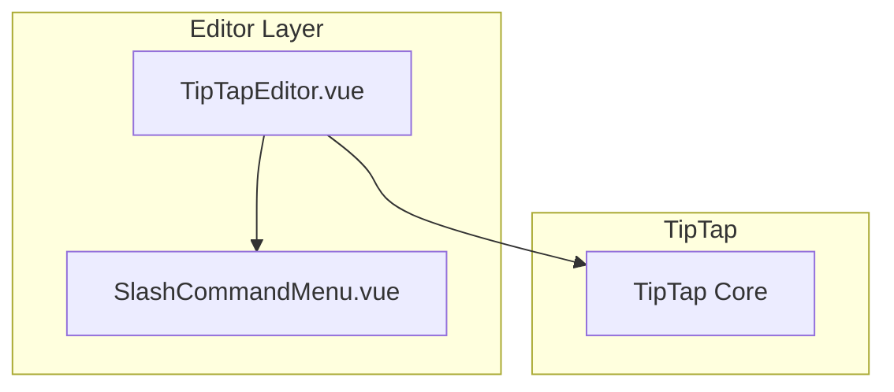
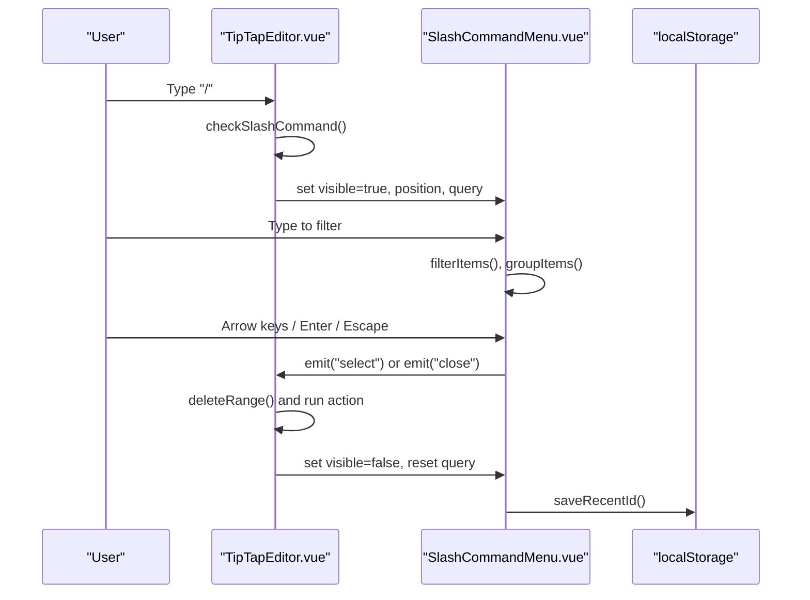
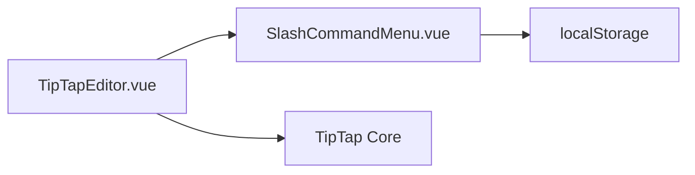

# Slash Command System

<cite>
**Referenced Files in This Document**
- [SlashCommandMenu.vue](file://code/client/src/components/editor/SlashCommandMenu.vue)
- [TipTapEditor.vue](file://code/client/src/components/editor/TipTapEditor.vue)
- [PageEditor.vue](file://code/client/src/components/editor/PageEditor.vue)
</cite>

## Table of Contents
1. [Introduction](#introduction)
2. [Project Structure](#project-structure)
3. [Core Components](#core-components)
4. [Architecture Overview](#architecture-overview)
5. [Detailed Component Analysis](#detailed-component-analysis)
6. [Dependency Analysis](#dependency-analysis)
7. [Performance Considerations](#performance-considerations)
8. [Troubleshooting Guide](#troubleshooting-guide)
9. [Conclusion](#conclusion)

## Introduction
This document explains the slash command system implementation used to trigger and execute editor commands in the Yule Notion application. It covers the keyboard detection mechanism, position calculation, visibility management, command filtering and search, execution workflow, menu positioning, and extension patterns. The system integrates with the TipTap editor to provide contextual command suggestions triggered by typing "/".

## Project Structure
The slash command system spans two primary components:
- SlashCommandMenu.vue: A reusable menu component that renders command suggestions, handles keyboard navigation, and persists recent selections.
- TipTapEditor.vue: The main editor wrapper that detects the "/" trigger, calculates menu position, manages visibility, and executes selected commands.

**Diagram sources**
- [TipTapEditor.vue:112-194](file://code/client/src/components/editor/TipTapEditor.vue#L112-L194)
- [SlashCommandMenu.vue:170-206](file://code/client/src/components/editor/SlashCommandMenu.vue#L170-L206)

**Section sources**
- [TipTapEditor.vue:112-194](file://code/client/src/components/editor/TipTapEditor.vue#L112-L194)
- [SlashCommandMenu.vue:170-206](file://code/client/src/components/editor/SlashCommandMenu.vue#L170-L206)

## Core Components
- SlashCommandMenu.vue
  - Renders a fixed-position menu with categorized commands.
  - Implements keyboard navigation (up/down/enter/escape).
  - Filters commands by query and groups results.
  - Persists recent commands to localStorage.
- TipTapEditor.vue
  - Detects "/" in the editor content and computes menu coordinates.
  - Manages visibility, query, and selection lifecycle.
  - Executes command actions and cleans up the slash command state.

Key responsibilities:
- Keyboard detection: Watches editor events and intercepts keydown when the menu is visible.
- Position calculation: Uses TipTap’s view coordinates to place the menu near the caret.
- Visibility management: Shows/hides the menu based on selection and user input.
- Execution: Deletes the slash command text and runs the chosen action.

**Section sources**
- [SlashCommandMenu.vue:118-167](file://code/client/src/components/editor/SlashCommandMenu.vue#L118-L167)
- [TipTapEditor.vue:147-153](file://code/client/src/components/editor/TipTapEditor.vue#L147-L153)
- [TipTapEditor.vue:249-265](file://code/client/src/components/editor/TipTapEditor.vue#L249-L265)
- [TipTapEditor.vue:267-274](file://code/client/src/components/editor/TipTapEditor.vue#L267-L274)

## Architecture Overview
The slash command system is composed of a trigger in the editor and a menu component that responds to user input and keyboard events.

**Diagram sources**
- [TipTapEditor.vue:249-274](file://code/client/src/components/editor/TipTapEditor.vue#L249-L274)
- [SlashCommandMenu.vue:66-97](file://code/client/src/components/editor/SlashCommandMenu.vue#L66-L97)
- [SlashCommandMenu.vue:118-167](file://code/client/src/components/editor/SlashCommandMenu.vue#L118-L167)

## Detailed Component Analysis

### SlashCommandMenu.vue
Responsibilities:
- Define the SlashMenuItem interface with id, label, description, icon, category, and action.
- Compute filtered items based on query.
- Group items by category and prepend recent items when query is empty.
- Flatten grouped items for keyboard navigation.
- Persist recent selections to localStorage and expose a method to handle keydown events.

Keyboard navigation:
- ArrowUp/ArrowDown move selection with wrap-around.
- Enter selects the current item and emits "select".
- Escape closes the menu and emits "close".

Menu rendering:
- Teleports to body for fixed positioning.
- Uses groupedItems to render categories and flatItems for keyboard traversal.

Recent commands:
- Reads and writes to localStorage under a dedicated key.
- Limits stored entries to a maximum count.

Visibility and position:
- Controlled by props and styled with fixed coordinates.

**Section sources**
- [SlashCommandMenu.vue:14-21](file://code/client/src/components/editor/SlashCommandMenu.vue#L14-L21)
- [SlashCommandMenu.vue:66-97](file://code/client/src/components/editor/SlashCommandMenu.vue#L66-L97)
- [SlashCommandMenu.vue:100-111](file://code/client/src/components/editor/SlashCommandMenu.vue#L100-L111)
- [SlashCommandMenu.vue:118-167](file://code/client/src/components/editor/SlashCommandMenu.vue#L118-L167)
- [SlashCommandMenu.vue:44-56](file://code/client/src/components/editor/SlashCommandMenu.vue#L44-L56)

### TipTapEditor.vue
Responsibilities:
- Initialize TipTap editor with extensions and placeholder.
- Detect "/" in the current selection and compute menu position using TipTap’s view coordinates.
- Manage slash menu state: visibility, query, position, and selection start position.
- Intercept keydown events to delegate to the menu when visible.
- Execute selected command by deleting the slash command text and running the action chain.
- Close the menu on global clicks outside the menu element.

Slash command detection:
- Scans text before the caret for a trailing "/" followed by non-whitespace characters.
- Calculates the caret’s bottom-left coordinates and positions the menu accordingly.

Execution workflow:
- On selection, deletes the range from the slash to the caret and runs the chosen action.
- Resets query and clears the selection start position.

Menu integration:
- Passes items, query, visibility, and position to the menu component.
- Exposes a ref to the menu for keydown delegation.

**Section sources**
- [TipTapEditor.vue:112-194](file://code/client/src/components/editor/TipTapEditor.vue#L112-L194)
- [TipTapEditor.vue:249-265](file://code/client/src/components/editor/TipTapEditor.vue#L249-L265)
- [TipTapEditor.vue:267-274](file://code/client/src/components/editor/TipTapEditor.vue#L267-L274)
- [TipTapEditor.vue:488-496](file://code/client/src/components/editor/TipTapEditor.vue#L488-L496)

### Available Commands
The system ships with a predefined set of commands organized by category. These commands demonstrate the available block types and insertions:

- Paragraph: Inserts a paragraph block.
- Headings: Levels 1–6 with toggle actions.
- Lists: Bullet list, ordered list, and task list.
- Blocks: Blockquote, code block, horizontal rule, and table.
- Media: Link and image insertion.

These are defined in the editor component and passed to the menu as items.

**Section sources**
- [TipTapEditor.vue:197-247](file://code/client/src/components/editor/TipTapEditor.vue#L197-L247)

### Command Filtering and Search
The menu filters commands by:
- Query presence: If empty, shows recent items (when available) plus all items grouped by category.
- Query matching: Case-insensitive match against label, description, and id.

Grouping:
- When query is empty and recent items exist, they appear as a separate "Recent" group.
- Otherwise, items are grouped by category.

Flat list:
- A flattened list is constructed to support keyboard navigation while avoiding duplicates.

**Section sources**
- [SlashCommandMenu.vue:66-97](file://code/client/src/components/editor/SlashCommandMenu.vue#L66-L97)
- [SlashCommandMenu.vue:100-111](file://code/client/src/components/editor/SlashCommandMenu.vue#L100-L111)

### Command Execution Workflow
End-to-end execution:
- Trigger: User types "/" in the editor.
- Detection: Editor computes position and sets visible=true with query and start position.
- Interaction: User types to filter, navigates with arrow keys, and presses Enter to select.
- Deletion: Editor deletes the range from slash to caret.
- Action: Runs the selected command’s action chain.
- Cleanup: Resets visibility, query, and selection start position.

Keyboard delegation:
- When the menu is visible, keydown events are delegated to the menu’s handler.

Global click handling:
- Closes the menu when clicking outside it.

**Section sources**
- [TipTapEditor.vue:249-274](file://code/client/src/components/editor/TipTapEditor.vue#L249-L274)
- [TipTapEditor.vue:282-290](file://code/client/src/components/editor/TipTapEditor.vue#L282-L290)
- [SlashCommandMenu.vue:118-167](file://code/client/src/components/editor/SlashCommandMenu.vue#L118-L167)

### Menu Positioning System
Positioning:
- Uses TipTap’s view coordinates at the caret position to compute top/left placement.
- Adds a small offset below the caret for visual alignment.

Viewport awareness and collision detection:
- The current implementation positions the menu near the caret and relies on fixed positioning.
- There is no explicit viewport boundary checking or collision detection logic in the codebase.

**Section sources**
- [TipTapEditor.vue:258-259](file://code/client/src/components/editor/TipTapEditor.vue#L258-L259)

### Adding Custom Commands
To add a new command:
- Extend the items array in the editor component with a new SlashMenuItem.
- Provide an action that manipulates the TipTap editor chain.
- Optionally categorize the command to influence grouping.

Categories:
- Commands are grouped by category; recent items appear first when query is empty.

Recent tracking:
- The menu automatically tracks and displays recent selections.

**Section sources**
- [TipTapEditor.vue:197-247](file://code/client/src/components/editor/TipTapEditor.vue#L197-L247)
- [SlashCommandMenu.vue:82-97](file://code/client/src/components/editor/SlashCommandMenu.vue#L82-L97)
- [SlashCommandMenu.vue:59-64](file://code/client/src/components/editor/SlashCommandMenu.vue#L59-L64)

### Extending the Command System
Patterns for extension:
- Add new categories to group related commands.
- Implement actions that leverage TipTap’s chainable commands.
- Integrate dialogs or upload handlers for complex insertions (e.g., links, images).

Integration points:
- The editor exposes refs and emits updates; menu actions can trigger dialogs or upload flows.

**Section sources**
- [TipTapEditor.vue:227-246](file://code/client/src/components/editor/TipTapEditor.vue#L227-L246)
- [TipTapEditor.vue:488-496](file://code/client/src/components/editor/TipTapEditor.vue#L488-L496)

## Dependency Analysis
The slash command system has clear boundaries:
- TipTapEditor.vue depends on TipTap for content and coordinates.
- SlashCommandMenu.vue depends on SlashMenuItem interface and localStorage for recent items.
- Both components communicate via props/events.

**Diagram sources**
- [TipTapEditor.vue:488-496](file://code/client/src/components/editor/TipTapEditor.vue#L488-L496)
- [SlashCommandMenu.vue:44-56](file://code/client/src/components/editor/SlashCommandMenu.vue#L44-L56)

**Section sources**
- [TipTapEditor.vue:488-496](file://code/client/src/components/editor/TipTapEditor.vue#L488-L496)
- [SlashCommandMenu.vue:44-56](file://code/client/src/components/editor/SlashCommandMenu.vue#L44-L56)

## Performance Considerations
Current implementation characteristics:
- Filtering and grouping are performed on the client with small command sets, minimizing overhead.
- Keyboard navigation uses a flattened list derived from grouped items, avoiding repeated recomputation.
- Menu rendering uses Teleport to body for fixed positioning, which avoids layout thrashing.

Potential improvements:
- Debounce query input to reduce frequent filtering computations during rapid typing.
- Virtualize long command lists if the number of commands grows significantly.
- Memoize computed properties for filteredItems and groupedItems to avoid redundant work.
- Consider lazy initialization of the menu to defer heavy DOM operations until needed.

[No sources needed since this section provides general guidance]

## Troubleshooting Guide
Common issues and resolutions:
- Menu does not appear:
  - Ensure "/" is typed at the beginning of a line or after whitespace.
  - Verify the editor is focused and selection is valid.
- Menu appears off-screen:
  - The current implementation does not include viewport collision detection; adjust caret position or window scroll to bring the menu into view.
- Keyboard navigation not working:
  - Confirm the menu is visible and the editor delegates keydown events to the menu.
- Selected command not executed:
  - Check that the action chain is valid and the editor is initialized.
- Recent commands not saved:
  - Confirm localStorage is enabled and accessible.

**Section sources**
- [TipTapEditor.vue:249-265](file://code/client/src/components/editor/TipTapEditor.vue#L249-L265)
- [TipTapEditor.vue:147-153](file://code/client/src/components/editor/TipTapEditor.vue#L147-L153)
- [SlashCommandMenu.vue:118-167](file://code/client/src/components/editor/SlashCommandMenu.vue#L118-L167)

## Conclusion
The slash command system provides a clean, extensible way to trigger editor actions. It integrates tightly with TipTap for detection and positioning, offers intuitive keyboard navigation, and supports recent command tracking. While viewport-aware collision detection is not implemented, the system’s modular design makes it straightforward to extend with new commands, categories, and advanced features.