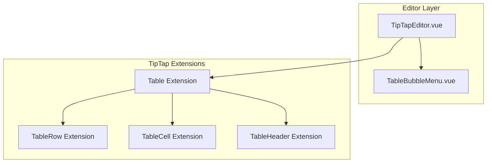
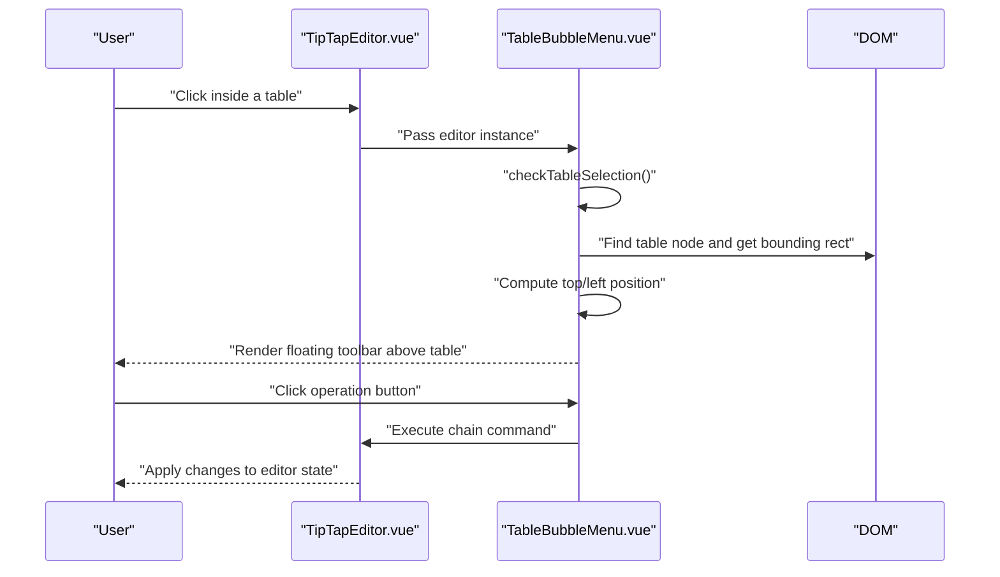
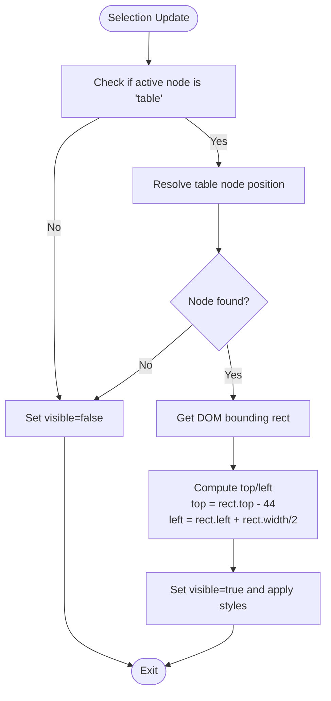
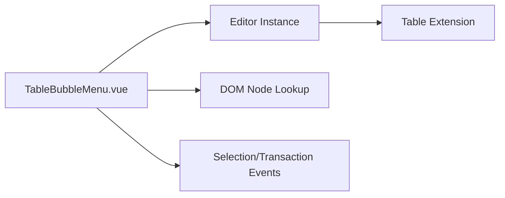

# Table Bubble Menu

<cite>
**Referenced Files in This Document**
- [TableBubbleMenu.vue](file://code/client/src/components/editor/TableBubbleMenu.vue)
- [TipTapEditor.vue](file://code/client/src/components/editor/TipTapEditor.vue)
</cite>

## Table of Contents
1. [Introduction](#introduction)
2. [Project Structure](#project-structure)
3. [Core Components](#core-components)
4. [Architecture Overview](#architecture-overview)
5. [Detailed Component Analysis](#detailed-component-analysis)
6. [Dependency Analysis](#dependency-analysis)
7. [Performance Considerations](#performance-considerations)
8. [Troubleshooting Guide](#troubleshooting-guide)
9. [Conclusion](#conclusion)
10. [Appendices](#appendices)

## Introduction
This document explains the Table Bubble Menu component that provides a floating toolbar for table editing within the TipTap editor. It covers menu positioning, visibility conditions, user interaction patterns, available table operations, integration with table selection states and cursor positioning, responsive design considerations, viewport collision handling, accessibility, keyboard navigation, and touch device support. It also includes guidance for customizing table operations and extending the component.

## Project Structure
The Table Bubble Menu is integrated into the TipTap editor and rendered as a floating overlay positioned relative to the active table element.

**Diagram sources**
- [TipTapEditor.vue:112-141](file://code/client/src/components/editor/TipTapEditor.vue#L112-L141)
- [TableBubbleMenu.vue:13-25](file://code/client/src/components/editor/TableBubbleMenu.vue#L13-L25)

**Section sources**
- [TipTapEditor.vue:484](file://code/client/src/components/editor/TipTapEditor.vue#L484)
- [TipTapEditor.vue:134-141](file://code/client/src/components/editor/TipTapEditor.vue#L134-L141)

## Core Components
- TableBubbleMenu.vue: Implements the floating toolbar for table editing, including visibility detection, positioning, and operation buttons.
- TipTapEditor.vue: Initializes TipTap with table-related extensions and renders the TableBubbleMenu.

Key responsibilities:
- Detect when the cursor is inside a table and compute the menu’s position above the table.
- Provide operations for column width modes, header toggles, row/column insertions/deletions, cell merge/split, and table deletion.
- Manage visibility and lifecycle events (selection updates, transactions, click-outside behavior).

**Section sources**
- [TableBubbleMenu.vue:27-62](file://code/client/src/components/editor/TableBubbleMenu.vue#L27-L62)
- [TableBubbleMenu.vue:166-273](file://code/client/src/components/editor/TableBubbleMenu.vue#L166-L273)
- [TipTapEditor.vue:134-141](file://code/client/src/components/editor/TipTapEditor.vue#L134-L141)

## Architecture Overview
The Table Bubble Menu is a child component of the TipTap editor. It listens to editor events and reacts to selection changes to show or hide itself. It uses Teleport to render the menu in the document body for proper stacking context and positioning.

**Diagram sources**
- [TableBubbleMenu.vue:27-62](file://code/client/src/components/editor/TableBubbleMenu.vue#L27-L62)
- [TableBubbleMenu.vue:166-273](file://code/client/src/components/editor/TableBubbleMenu.vue#L166-L273)
- [TipTapEditor.vue:181-194](file://code/client/src/components/editor/TipTapEditor.vue#L181-L194)

## Detailed Component Analysis

### Visibility and Positioning
- Visibility triggers:
  - The menu becomes visible when the editor reports the active node is a table.
  - It listens to selection updates and transactions to re-check visibility.
- Positioning:
  - The menu computes the table element’s bounding rectangle and positions itself above the table’s center.
  - Uses a fixed position with a translation adjustment to center the menu horizontally.

**Diagram sources**
- [TableBubbleMenu.vue:27-62](file://code/client/src/components/editor/TableBubbleMenu.vue#L27-L62)

**Section sources**
- [TableBubbleMenu.vue:27-62](file://code/client/src/components/editor/TableBubbleMenu.vue#L27-L62)
- [TableBubbleMenu.vue:166-176](file://code/client/src/components/editor/TableBubbleMenu.vue#L166-L176)

### Available Operations
The menu exposes the following table operations grouped by function:

- Width modes
  - Equal width: Sets table layout to fixed width and full width.
  - Auto width: Resets to automatic layout and full width.
- Header toggles
  - Toggle first row as header.
  - Toggle first column as header.
- Row/Column insertion
  - Insert row before current row.
  - Insert row after current row.
  - Insert column before current column.
  - Insert column after current column.
- Cell merge/split
  - Merge selected cells into one.
  - Split merged cells back into individual cells.
- Deletion
  - Delete current row.
  - Delete current column.
  - Delete entire table.

Each operation is bound to a button that executes a TipTap chain command focused on the current selection.

**Section sources**
- [TableBubbleMenu.vue:64-104](file://code/client/src/components/editor/TableBubbleMenu.vue#L64-L104)
- [TableBubbleMenu.vue:106-114](file://code/client/src/components/editor/TableBubbleMenu.vue#L106-L114)
- [TableBubbleMenu.vue:217-270](file://code/client/src/components/editor/TableBubbleMenu.vue#L217-L270)

### Integration with Selection and Cursor Positioning
- The component checks whether the current selection is inside a table using the editor’s active state.
- It resolves the table node position by walking up the selection depth until it finds a table node.
- It retrieves the DOM element for the table node and computes its bounding rectangle for precise placement.

**Section sources**
- [TableBubbleMenu.vue:27-62](file://code/client/src/components/editor/TableBubbleMenu.vue#L27-L62)

### Click-Outsite Behavior and Lifecycle
- The menu registers a global mousedown handler to hide itself when clicking outside the menu and outside the table wrapper.
- It subscribes to editor events for selection updates and transactions to keep visibility and position synchronized.
- It cleans up listeners on unmount.

**Section sources**
- [TableBubbleMenu.vue:125-152](file://code/client/src/components/editor/TableBubbleMenu.vue#L125-L152)
- [TableBubbleMenu.vue:154-163](file://code/client/src/components/editor/TableBubbleMenu.vue#L154-L163)

### Responsive Design and Viewport Collision Handling
- The menu uses fixed positioning and centers itself horizontally via a transform translation.
- The container is a flex layout with nowrap wrapping to prevent line breaks in small viewports.
- The component does not implement explicit viewport boundary detection; it relies on the browser’s default behavior for fixed-positioned elements near edges.

Recommendations for viewport collision handling:
- Add logic to detect when the computed top would place the menu above the viewport and adjust to appear below the table instead.
- Add logic to detect when the computed left/right would exceed viewport bounds and clamp the position accordingly.

**Section sources**
- [TableBubbleMenu.vue:166-176](file://code/client/src/components/editor/TableBubbleMenu.vue#L166-L176)
- [TableBubbleMenu.vue:275-336](file://code/client/src/components/editor/TableBubbleMenu.vue#L275-L336)

### Accessibility, Keyboard Navigation, and Touch Support
- Accessibility:
  - Buttons include title attributes for screen readers.
  - Focus management is implicit through editor commands; ensure focus returns to the editor after operations.
- Keyboard navigation:
  - The component does not implement dedicated keyboard shortcuts for menu actions. Users rely on mouse clicks or tab navigation to reach buttons.
  - Consider adding keyboard shortcuts (e.g., Alt+Shift+R for row insertion) and arrow-key navigation among menu items.
- Touch devices:
  - Buttons are sized appropriately for touch targets.
  - No gesture handlers are present; consider adding tap-and-hold or swipe gestures for quick actions.

**Section sources**
- [TableBubbleMenu.vue:178-270](file://code/client/src/components/editor/TableBubbleMenu.vue#L178-L270)

### Customizing Table Operations
Examples of customizing operations:
- Add a “Duplicate Row” action by chaining a row duplication command.
- Add a “Clear Cell Content” action by targeting the current cell and clearing its content.
- Add a “Set Column Width” action by computing desired width and applying it to the table’s style.

Implementation tips:
- Use the editor’s chain API to combine focus and command operations.
- Ensure operations guard against invalid selections (e.g., merging cells when none are selected).

**Section sources**
- [TableBubbleMenu.vue:217-270](file://code/client/src/components/editor/TableBubbleMenu.vue#L217-L270)

### Implementing Custom Table Extensions
To extend table capabilities:
- Extend TipTap’s table extension configuration to enable additional features (e.g., custom attributes, drag handles).
- Add new buttons in the menu template and bind them to custom chain commands.
- Update the visibility and positioning logic to account for new DOM structures if needed.

Integration points:
- TipTapEditor initializes table extensions with resizable and custom HTML attributes.
- TableBubbleMenu consumes the editor instance to execute commands.

**Section sources**
- [TipTapEditor.vue:134-141](file://code/client/src/components/editor/TipTapEditor.vue#L134-L141)
- [TableBubbleMenu.vue:166-273](file://code/client/src/components/editor/TableBubbleMenu.vue#L166-L273)

### Edge Cases in Table Editing
Common edge cases and mitigations:
- Empty selection inside a table: The menu remains hidden until a valid selection is made.
- Nested tables or complex layouts: Ensure the node resolution logic walks the correct depth to find the intended table.
- Very small tables: The menu appears above the table; consider adjusting the offset or flipping to below when near the top of the viewport.
- Multi-cell selection: Merging and splitting operate on the current selection; ensure UX communicates the affected cells.

**Section sources**
- [TableBubbleMenu.vue:27-62](file://code/client/src/components/editor/TableBubbleMenu.vue#L27-L62)

## Dependency Analysis
The Table Bubble Menu depends on:
- TipTap editor instance for selection state and command execution.
- DOM traversal to locate the table node and measure its bounding rectangle.
- Vue lifecycle hooks for event subscription and cleanup.

**Diagram sources**
- [TableBubbleMenu.vue:13-25](file://code/client/src/components/editor/TableBubbleMenu.vue#L13-L25)
- [TipTapEditor.vue:112-141](file://code/client/src/components/editor/TipTapEditor.vue#L112-L141)

**Section sources**
- [TableBubbleMenu.vue:13-25](file://code/client/src/components/editor/TableBubbleMenu.vue#L13-L25)
- [TipTapEditor.vue:112-141](file://code/client/src/components/editor/TipTapEditor.vue#L112-L141)

## Performance Considerations
- Event throttling: Debounce selection updates and transaction handlers to avoid excessive re-computation.
- DOM measurement: Cache bounding rectangles when possible and invalidate only on selection changes.
- Rendering: Keep the menu lightweight with minimal DOM nodes and scoped styles.

[No sources needed since this section provides general guidance]

## Troubleshooting Guide
- Menu does not appear:
  - Verify the editor is active and selection is inside a table.
  - Confirm the editor emits selectionUpdate and transaction events.
- Incorrect position:
  - Ensure the table node is correctly resolved and the DOM element is available.
  - Check for CSS that affects table layout or overflow that could alter the bounding rectangle.
- Click-outside behavior:
  - Confirm the global mousedown handler is registered and that the menu element is correctly referenced.

**Section sources**
- [TableBubbleMenu.vue:125-152](file://code/client/src/components/editor/TableBubbleMenu.vue#L125-L152)
- [TableBubbleMenu.vue:27-62](file://code/client/src/components/editor/TableBubbleMenu.vue#L27-L62)

## Conclusion
The Table Bubble Menu provides a focused, context-aware editing surface for tables within the TipTap editor. It integrates seamlessly with TipTap’s selection model and commands, offering essential operations for table manipulation. With minor enhancements for viewport collision handling, keyboard navigation, and touch gestures, it can become a robust and accessible editing experience.

[No sources needed since this section summarizes without analyzing specific files]

## Appendices

### API Surface Summary
- Props:
  - editor: TipTap editor instance.
- Methods:
  - checkTableSelection: Determines visibility and position.
  - setEqualWidth/setAutoWidth: Switches table layout modes.
  - toggleHeaderRow/toggleHeaderColumn: Toggles header rows/columns.
  - Row/Column insert/delete: Adds/removes rows/columns around the current selection.
  - mergeCells/splitCell: Merges or splits selected cells.
  - deleteRow/deleteColumn/deleteTable: Removes table elements.
- Events:
  - selectionUpdate: Re-checks visibility and position.
  - transaction: Re-validates visibility when content changes.

**Section sources**
- [TableBubbleMenu.vue:27-114](file://code/client/src/components/editor/TableBubbleMenu.vue#L27-L114)
- [TableBubbleMenu.vue:217-270](file://code/client/src/components/editor/TableBubbleMenu.vue#L217-L270)