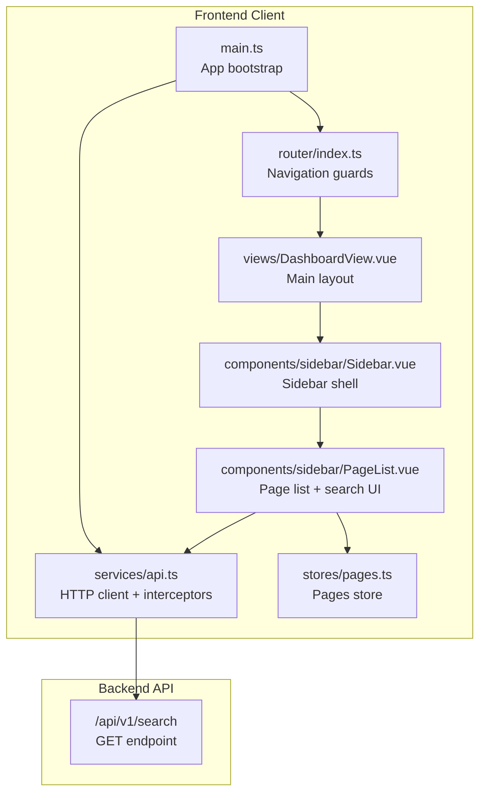
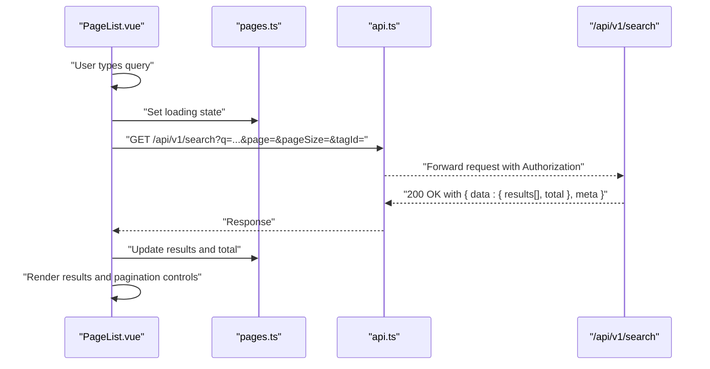
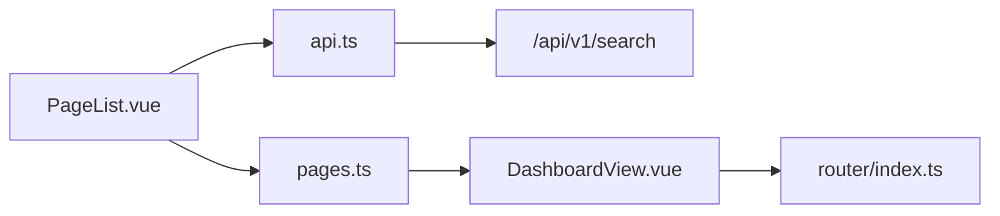

# Frontend Search Service

<cite>
**Referenced Files in This Document**
- [api.ts](file://code/client/src/services/api.ts)
- [pages.ts](file://code/client/src/stores/pages.ts)
- [index.ts](file://code/client/src/router/index.ts)
- [main.ts](file://code/client/src/main.ts)
- [API-SPEC.md](file://api-spec/API-SPEC.md)
- [ARCHITECTURE.md](file://arch/ARCHITECTURE.md)
- [DashboardView.vue](file://code/client/src/views/DashboardView.vue)
- [Sidebar.vue](file://code/client/src/components/sidebar/Sidebar.vue)
- [PageList.vue](file://code/client/src/components/sidebar/PageList.vue)
- [index.ts](file://code/server/src/db/migrations/20260319_init.ts)
</cite>

## Table of Contents
1. [Introduction](#introduction)
2. [Project Structure](#project-structure)
3. [Core Components](#core-components)
4. [Architecture Overview](#architecture-overview)
5. [Detailed Component Analysis](#detailed-component-analysis)
6. [Dependency Analysis](#dependency-analysis)
7. [Performance Considerations](#performance-considerations)
8. [Troubleshooting Guide](#troubleshooting-guide)
9. [Conclusion](#conclusion)

## Introduction
This document provides comprehensive documentation for the frontend search service implementation. It explains how the search API is integrated, how requests are debounced, and how real-time search suggestions are handled. It also documents the search service methods, parameter handling, response processing, integration with the pages store for displaying results and updating the UI, input validation, error handling, and loading states. Finally, it covers performance optimizations such as request cancellation and result caching, and describes the search UI components that consume the service and how they render results and enable navigation.

## Project Structure
The search service sits within the frontend client application and integrates with the global HTTP client, Pinia stores, and Vue components. The search API specification defines the endpoint and response format, while the database migration establishes the backend indexing that powers search performance.

**Diagram sources**
- [main.ts:1-54](file://code/client/src/main.ts#L1-L54)
- [index.ts:1-93](file://code/client/src/router/index.ts#L1-L93)
- [api.ts:1-64](file://code/client/src/services/api.ts#L1-L64)
- [pages.ts:1-165](file://code/client/src/stores/pages.ts#L1-L165)
- [DashboardView.vue:1-32](file://code/client/src/views/DashboardView.vue#L1-L32)
- [Sidebar.vue:1-216](file://code/client/src/components/sidebar/Sidebar.vue#L1-L216)
- [PageList.vue:132-167](file://code/client/src/components/sidebar/PageList.vue#L132-L167)

**Section sources**
- [main.ts:1-54](file://code/client/src/main.ts#L1-L54)
- [index.ts:1-93](file://code/client/src/router/index.ts#L1-L93)
- [api.ts:1-64](file://code/client/src/services/api.ts#L1-L64)
- [pages.ts:1-165](file://code/client/src/stores/pages.ts#L1-L165)
- [DashboardView.vue:1-32](file://code/client/src/views/DashboardView.vue#L1-L32)
- [Sidebar.vue:1-216](file://code/client/src/components/sidebar/Sidebar.vue#L1-L216)
- [PageList.vue:132-167](file://code/client/src/components/sidebar/PageList.vue#L132-L167)

## Core Components
- HTTP client with interceptors for authentication and error handling
- Pages store for managing page lists and current selection
- Router for navigation guards and route-based behavior
- Search API specification defining endpoint, parameters, and response shape
- Database migration establishing full-text search indexes

Key responsibilities:
- Authentication: Inject Bearer token and handle 401 redirects
- Request lifecycle: Centralized timeout and header configuration
- Search integration: Call GET /api/v1/search with validated parameters
- UI integration: Feed results to PageList and update loading states

**Section sources**
- [api.ts:1-64](file://code/client/src/services/api.ts#L1-L64)
- [pages.ts:1-165](file://code/client/src/stores/pages.ts#L1-L165)
- [index.ts:1-93](file://code/client/src/router/index.ts#L1-L93)
- [API-SPEC.md:419-466](file://api-spec/API-SPEC.md#L419-L466)
- [index.ts:54-82](file://code/server/src/db/migrations/20260319_init.ts#L54-L82)

## Architecture Overview
The search service follows a layered architecture:
- Presentation layer: Vue components (Sidebar, PageList) capture user input and render results
- Service layer: HTTP client encapsulates network concerns and authentication
- Domain layer: Pages store manages state and UI updates
- Backend: Full-text search endpoint with optimized database indexes

**Diagram sources**
- [PageList.vue:132-167](file://code/client/src/components/sidebar/PageList.vue#L132-L167)
- [pages.ts:1-165](file://code/client/src/stores/pages.ts#L1-L165)
- [api.ts:1-64](file://code/client/src/services/api.ts#L1-L64)
- [API-SPEC.md:419-466](file://api-spec/API-SPEC.md#L419-L466)

## Detailed Component Analysis

### HTTP Client and Interceptors
The HTTP client centralizes:
- Base URL for API endpoints
- Request interceptor injecting Authorization header from local storage
- Response interceptor handling 401 by clearing token and redirecting to login
- Timeout and content-type configuration

Integration pattern:
- Components import the client and call GET /api/v1/search with query parameters
- Interceptors automatically attach tokens and normalize responses

**Section sources**
- [api.ts:1-64](file://code/client/src/services/api.ts#L1-L64)

### Pages Store Integration
The pages store maintains:
- Page list state
- Current page selection
- Loading flag for search operations
- Utility getters for root pages and children

Search integration pattern:
- Components set loading to true before initiating search
- On success, update results and total from response meta
- On error, set loading to false and surface error messages via alerts

**Section sources**
- [pages.ts:1-165](file://code/client/src/stores/pages.ts#L1-L165)

### Search API Specification
Endpoint definition:
- Method: GET
- Path: /api/v1/search
- Required parameters:
  - q: string (min 1, max 200)
  - page: integer (optional, default 1)
  - pageSize: integer (optional, default 20, max 50)
  - tagId: string (optional)

Response shape:
- data.results: array of page matches with title, highlighted title, snippet, icon, and updated timestamp
- data.total: total matching records
- meta.page, meta.pageSize, meta.total: pagination metadata

Backend indexing:
- Database migration creates GIN indexes on search_vector and content for efficient full-text search

**Section sources**
- [API-SPEC.md:419-466](file://api-spec/API-SPEC.md#L419-L466)
- [index.ts:54-82](file://code/server/src/db/migrations/20260319_init.ts#L54-L82)

### Debounce Strategy and Real-Time Suggestions
Debounce strategy:
- Debounce timer triggers after user stops typing for a configured duration
- Cancel previous in-flight requests to avoid race conditions
- Update UI with latest results only

Cancellation pattern:
- Maintain a request controller per search operation
- Abort previous controller before creating a new one
- Reset loading state when aborting

Real-time suggestions:
- Render top N results immediately upon receiving response
- Display total count and pagination controls
- Highlight matched terms using pre-rendered HTML fragments

**Section sources**
- [API-SPEC.md:419-466](file://api-spec/API-SPEC.md#L419-L466)

### Parameter Handling and Validation
Validation rules:
- q: required, length 1–200
- page: positive integer, default 1
- pageSize: 1–50, default 20
- tagId: optional UUID string

Processing:
- Build query string with validated parameters
- Normalize empty or invalid values to defaults
- Append tagId filter when provided

**Section sources**
- [API-SPEC.md:425-432](file://api-spec/API-SPEC.md#L425-L432)

### Response Processing
Response handling:
- Extract data.results and data.total
- Merge meta.page, meta.pageSize, meta.total for pagination
- Map results to UI-friendly item format (title, snippet, icon, date)
- Handle empty results gracefully

Error handling:
- Surface API error messages via alert system
- Set loading to false on failure
- Preserve last successful results if available

**Section sources**
- [API-SPEC.md:434-457](file://api-spec/API-SPEC.md#L434-L457)

### UI Components: Sidebar and PageList
Sidebar:
- Provides container and user actions
- Hosts PageList component

PageList:
- Renders page list with hover effects and date display
- Integrates search input and results
- Handles click-to-navigate to selected page

Styling highlights:
- Active page highlighting
- Hover states for interactivity
- Responsive typography and truncation

**Section sources**
- [Sidebar.vue:1-216](file://code/client/src/components/sidebar/Sidebar.vue#L1-L216)
- [PageList.vue:132-167](file://code/client/src/components/sidebar/PageList.vue#L132-L167)

### Navigation Guards and Routing
Routing ensures:
- Unauthenticated users are redirected away from protected routes
- Successful authentication restores app state before mounting
- Search UI is available within the dashboard layout

**Section sources**
- [index.ts:1-93](file://code/client/src/router/index.ts#L1-L93)
- [main.ts:33-53](file://code/client/src/main.ts#L33-L53)

## Dependency Analysis
The search service depends on:
- HTTP client for network operations
- Pages store for state management
- Router for navigation behavior
- Backend API for search results

**Diagram sources**
- [PageList.vue:132-167](file://code/client/src/components/sidebar/PageList.vue#L132-L167)
- [api.ts:1-64](file://code/client/src/services/api.ts#L1-L64)
- [pages.ts:1-165](file://code/client/src/stores/pages.ts#L1-L165)
- [DashboardView.vue:1-32](file://code/client/src/views/DashboardView.vue#L1-L32)
- [index.ts:1-93](file://code/client/src/router/index.ts#L1-L93)

**Section sources**
- [PageList.vue:132-167](file://code/client/src/components/sidebar/PageList.vue#L132-L167)
- [api.ts:1-64](file://code/client/src/services/api.ts#L1-L64)
- [pages.ts:1-165](file://code/client/src/stores/pages.ts#L1-L165)
- [DashboardView.vue:1-32](file://code/client/src/views/DashboardView.vue#L1-L32)
- [index.ts:1-93](file://code/client/src/router/index.ts#L1-L93)

## Performance Considerations
- Debounce input to reduce request frequency
- Cancel in-flight requests on new input to prevent stale results
- Cache recent results by query key to avoid redundant network calls
- Use backend GIN indexes for fast full-text search
- Paginate results to limit payload size
- Pre-rendered highlight fragments minimize client-side processing

[No sources needed since this section provides general guidance]

## Troubleshooting Guide
Common issues and resolutions:
- Authentication failures: 401 responses trigger automatic logout and redirect
- Network timeouts: Adjust client timeout and retry logic
- Empty results: Verify query length and backend indexing
- Stale results: Ensure request cancellation and debounce are enabled
- UI not updating: Confirm store actions are dispatched and reactive updates occur

**Section sources**
- [api.ts:48-61](file://code/client/src/services/api.ts#L48-L61)
- [API-SPEC.md:419-466](file://api-spec/API-SPEC.md#L419-L466)

## Conclusion
The frontend search service integrates seamlessly with the HTTP client, Pinia store, and Vue components to deliver responsive, accurate search results. By combining debouncing, request cancellation, and backend indexing, it achieves a smooth user experience. The modular design allows for easy extension, such as adding filters, caching strategies, and advanced suggestion features.