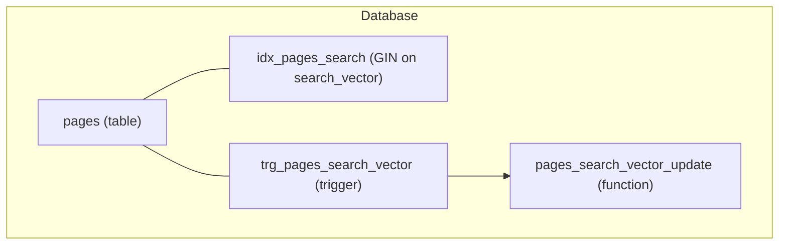
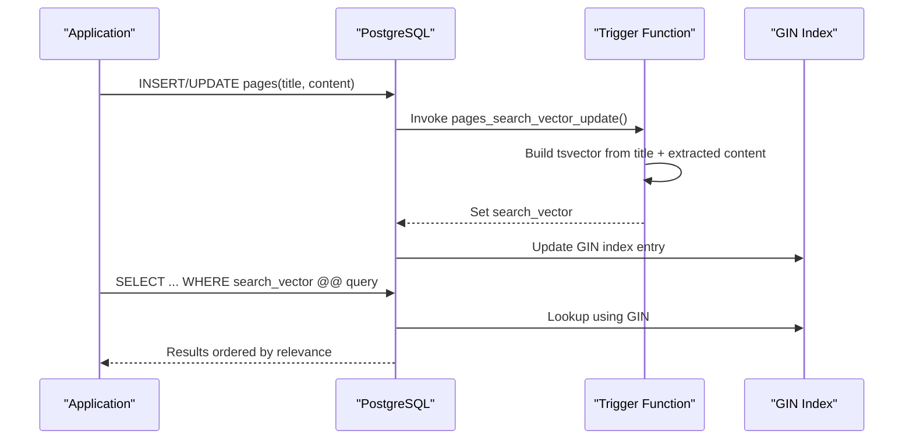
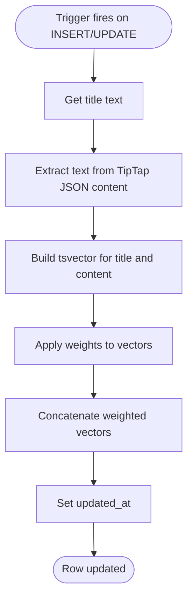
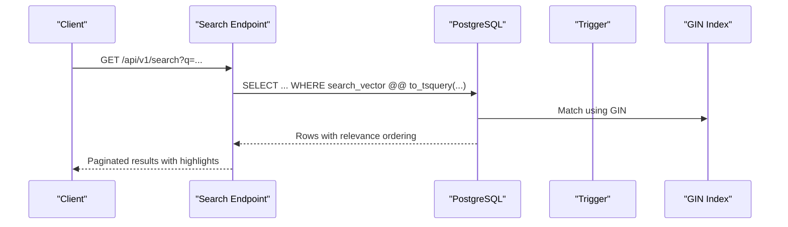
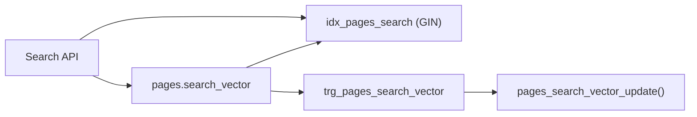

# PostgreSQL Full-Text Search Implementation

<cite>
**Referenced Files in This Document**
- [001_init.sql](file://db/001_init.sql)
- [ER-DIAGRAM.md](file://db/ER-DIAGRAM.md)
- [20260319_init.ts](file://code/server/src/db/migrations/20260319_init.ts)
- [connection.ts](file://code/server/src/db/connection.ts)
- [API-SPEC.md](file://api-spec/API-SPEC.md)
</cite>

## Table of Contents
1. [Introduction](#introduction)
2. [Project Structure](#project-structure)
3. [Core Components](#core-components)
4. [Architecture Overview](#architecture-overview)
5. [Detailed Component Analysis](#detailed-component-analysis)
6. [Dependency Analysis](#dependency-analysis)
7. [Performance Considerations](#performance-considerations)
8. [Troubleshooting Guide](#troubleshooting-guide)
9. [Conclusion](#conclusion)
10. [Appendices](#appendices)

## Introduction
This document explains the PostgreSQL full-text search implementation used by the application. It covers the tsvector-based indexing strategy, automatic maintenance via triggers, the GIN index on the search vector, and the multilingual-friendly configuration using the simple dictionary. It also documents the search operators and ranking mechanisms, and provides guidance on query construction, performance tuning, and maintenance procedures for keeping search indexes current.

## Project Structure
The full-text search capability is defined in the database initialization script and reflected in the migration file. The pages table includes a tsvector column and a GIN index. A trigger function automatically builds the search vector from the title and TipTap JSON content.

**Diagram sources**
- [001_init.sql:50-65](file://db/001_init.sql#L50-L65)
- [001_init.sql:166-211](file://db/001_init.sql#L166-L211)

**Section sources**
- [001_init.sql:14-254](file://db/001_init.sql#L14-L254)
- [ER-DIAGRAM.md:128-144](file://db/ER-DIAGRAM.md#L128-L144)

## Core Components
- Pages table with a tsvector column dedicated to full-text search.
- GIN index on the tsvector column for efficient retrieval.
- Trigger function that rebuilds the tsvector on insert/update of title or content.
- TipTap JSON content extraction logic embedded in the trigger function to build a unified text corpus.

Key implementation references:
- Pages table definition and search_vector column: [001_init.sql:36-55](file://db/001_init.sql#L36-L55)
- GIN index on search_vector: [001_init.sql:64-65](file://db/001_init.sql#L64-L65)
- Trigger function and trigger: [001_init.sql:166-211](file://db/001_init.sql#L166-L211)
- Migration-equivalent creation statements: [20260319_init.ts:54-82](file://code/server/src/db/migrations/20260319_init.ts#L54-L82), [20260319_init.ts:196-242](file://code/server/src/db/migrations/20260319_init.ts#L196-L242)

**Section sources**
- [001_init.sql:36-65](file://db/001_init.sql#L36-L65)
- [20260319_init.ts:54-82](file://code/server/src/db/migrations/20260319_init.ts#L54-L82)
- [20260319_init.ts:196-242](file://code/server/src/db/migrations/20260319_init.ts#L196-L242)

## Architecture Overview
The search pipeline integrates database-level indexing with application-level query construction. The trigger ensures the search vector stays synchronized with content changes. Queries leverage PostgreSQL’s full-text search operators and ranking functions.

**Diagram sources**
- [001_init.sql:166-211](file://db/001_init.sql#L166-L211)
- [001_init.sql:64-65](file://db/001_init.sql#L64-L65)

## Detailed Component Analysis

### Trigger Function: pages_search_vector_update
Purpose:
- Construct a tsvector combining the page title and the textual content extracted from TipTap JSON.
- Assign weights to differentiate the importance of title vs. body content.
- Update the updated_at timestamp to reflect content changes.

Implementation highlights:
- Uses a simple text dictionary for tokenization and normalization.
- Extracts text nodes from nested TipTap JSON content arrays.
- Concatenates tokens with setweight to produce a weighted tsvector.
- Sets updated_at on change.

References:
- Function definition and logic: [001_init.sql:166-205](file://db/001_init.sql#L166-L205)
- Trigger attachment: [001_init.sql:208-211](file://db/001_init.sql#L208-L211)
- Migration-equivalent statements: [20260319_init.ts:196-242](file://code/server/src/db/migrations/20260319_init.ts#L196-L242)

**Diagram sources**
- [001_init.sql:166-205](file://db/001_init.sql#L166-L205)

**Section sources**
- [001_init.sql:166-211](file://db/001_init.sql#L166-L211)
- [20260319_init.ts:196-242](file://code/server/src/db/migrations/20260319_init.ts#L196-L242)

### GIN Index on search_vector
Purpose:
- Enable fast lookup of tsquery matches against the tsvector column.
- Support ranking and filtering during search.

References:
- Index creation: [001_init.sql:64-65](file://db/001_init.sql#L64-L65)
- Migration-equivalent: [20260319_init.ts:78](file://code/server/src/db/migrations/20260319_init.ts#L78)
- Index listing: [ER-DIAGRAM.md:137](file://db/ER-DIAGRAM.md#L137)

**Section sources**
- [001_init.sql:64-65](file://db/001_init.sql#L64-L65)
- [20260319_init.ts:78](file://code/server/src/db/migrations/20260319_init.ts#L78)
- [ER-DIAGRAM.md:137](file://db/ER-DIAGRAM.md#L137)

### Multilingual Text Processing with pg_trgm
Observation:
- The initialization script enables the pg_trgm extension.
- However, the trigger function uses the simple dictionary for tsvector construction and does not apply trigram-based similarity matching in the search vector itself.
- The extension is available for potential use in similarity queries or partial matching scenarios outside the primary full-text search vector.

References:
- Extension enablement: [001_init.sql:9](file://db/001_init.sql#L9)
- Index listing: [ER-DIAGRAM.md:137](file://db/ER-DIAGRAM.md#L137)

**Section sources**
- [001_init.sql:9](file://db/001_init.sql#L9)
- [ER-DIAGRAM.md:137](file://db/ER-DIAGRAM.md#L137)

### Search Operators and Query Types
The application exposes a search endpoint with a single query parameter. While the API specification does not define explicit operator syntax, typical PostgreSQL full-text search patterns can be applied:

- @@ (match operator): Used to match a tsvector against a tsquery.
- websearch_to_tsquery: Converts natural-language queries into a form suitable for @@ matching.
- phraseto_tsquery and plainto_tsquery: Alternative forms for phrase and plain queries.

Notes:
- The trigger uses the simple dictionary; therefore, stemming and language-specific normalization are not applied. This simplifies behavior but may reduce recall for inflected forms.
- For similarity or partial matching, pg_trgm can complement exact full-text search.

References:
- API search endpoint: [API-SPEC.md:419-465](file://api-spec/API-SPEC.md#L419-L465)

**Section sources**
- [API-SPEC.md:419-465](file://api-spec/API-SPEC.md#L419-L465)

### Ranking and Relevance Scoring
Observation:
- The trigger assigns weights to the title and content parts of the tsvector.
- The API specification indicates that results are ordered by relevance and that titles receive higher weight than content.
- Ranking functions such as ts_rank or ts_rank_cd can be used to compute scores; however, the current trigger does not precompute scores.

Recommendations:
- To achieve deterministic ranking, compute a score per row using ts_rank or ts_rank_cd with appropriate weights and order by it.
- Consider custom weights per field to fine-tune relevance.

References:
- Weight assignment in trigger: [001_init.sql:169-200](file://db/001_init.sql#L169-L200)
- API ranking expectation: [API-SPEC.md:461-462](file://api-spec/API-SPEC.md#L461-L462)

**Section sources**
- [001_init.sql:169-200](file://db/001_init.sql#L169-L200)
- [API-SPEC.md:461-462](file://api-spec/API-SPEC.md#L461-L462)

### Search Execution Flow
End-to-end flow for a typical search request:

**Diagram sources**
- [API-SPEC.md:419-465](file://api-spec/API-SPEC.md#L419-L465)
- [001_init.sql:64-65](file://db/001_init.sql#L64-L65)

## Dependency Analysis
- The pages table depends on the trigger function to maintain search_vector.
- The GIN index depends on the presence of search_vector values.
- The application’s search endpoint depends on the availability of the GIN index and proper query construction.

**Diagram sources**
- [001_init.sql:50-65](file://db/001_init.sql#L50-L65)
- [001_init.sql:166-211](file://db/001_init.sql#L166-L211)

**Section sources**
- [001_init.sql:50-65](file://db/001_init.sql#L50-L65)
- [001_init.sql:166-211](file://db/001_init.sql#L166-L211)

## Performance Considerations
- Index selection: GIN is optimal for tsvector lookups; avoid GiST for this workload.
- Trigger overhead: The trigger runs on INSERT/UPDATE of title or content; keep content updates minimal to reduce re-indexing cost.
- Dictionary choice: Using the simple dictionary avoids language-specific processing, reducing CPU overhead but potentially lowering recall for inflected forms.
- Ranking computation: Compute ts_rank/ts_rank_cd per row to ensure deterministic ordering and to tune weights.
- Connection pooling: Configure the database connection pool appropriately for concurrent search workloads.
- Monitoring: Track query plans and index scans to ensure GIN is being used.

[No sources needed since this section provides general guidance]

## Troubleshooting Guide
Common issues and resolutions:
- Empty or stale results after content updates:
  - Verify that the trigger is firing and updating search_vector.
  - Confirm that the GIN index exists and is not corrupted.
  - References: [001_init.sql:166-211](file://db/001_init.sql#L166-L211), [001_init.sql:64-65](file://db/001_init.sql#L64-L65)
- Poor recall for inflected words:
  - Consider switching the dictionary to a language-specific variant if applicable.
  - Alternatively, use pg_trgm for similarity matching alongside exact full-text search.
  - Reference: [001_init.sql:9](file://db/001_init.sql#L9)
- Slow queries:
  - Ensure the GIN index is present and up to date.
  - Use EXPLAIN/EXPLAIN ANALYZE to confirm index usage.
  - Reference: [ER-DIAGRAM.md:137](file://db/ER-DIAGRAM.md#L137)
- Connection exhaustion:
  - Tune the connection pool size in the database client configuration.
  - Reference: [connection.ts:22-29](file://code/server/src/db/connection.ts#L22-L29)

**Section sources**
- [001_init.sql:166-211](file://db/001_init.sql#L166-L211)
- [001_init.sql:64-65](file://db/001_init.sql#L64-L65)
- [001_init.sql:9](file://db/001_init.sql#L9)
- [ER-DIAGRAM.md:137](file://db/ER-DIAGRAM.md#L137)
- [connection.ts:22-29](file://code/server/src/db/connection.ts#L22-L29)

## Conclusion
The system employs a robust tsvector-based full-text search strategy centered on a GIN index and an automated trigger-driven maintenance model. The simple dictionary ensures predictable behavior and lower processing overhead, while the weighting scheme prioritizes title matches. By leveraging ts_rank/ts_rank_cd for scoring and carefully managing the trigger and index lifecycle, the system achieves reliable and scalable search performance.

[No sources needed since this section summarizes without analyzing specific files]

## Appendices

### Database Schema Modifications Summary
- Added tsvector column to the pages table.
- Created a GIN index on the tsvector column.
- Implemented a trigger function to populate the tsvector from title and TipTap JSON content.
- Enabled pg_trgm for potential similarity matching.

References:
- Pages table and column: [001_init.sql:36-55](file://db/001_init.sql#L36-L55)
- GIN index: [001_init.sql:64-65](file://db/001_init.sql#L64-L65)
- Trigger and function: [001_init.sql:166-211](file://db/001_init.sql#L166-L211)
- pg_trgm enablement: [001_init.sql:9](file://db/001_init.sql#L9)
- Migration-equivalent: [20260319_init.ts:54-82](file://code/server/src/db/migrations/20260319_init.ts#L54-L82), [20260319_init.ts:196-242](file://code/server/src/db/migrations/20260319_init.ts#L196-L242)

**Section sources**
- [001_init.sql:36-65](file://db/001_init.sql#L36-L65)
- [001_init.sql:166-211](file://db/001_init.sql#L166-L211)
- [001_init.sql:9](file://db/001_init.sql#L9)
- [20260319_init.ts:54-82](file://code/server/src/db/migrations/20260319_init.ts#L54-L82)
- [20260319_init.ts:196-242](file://code/server/src/db/migrations/20260319_init.ts#L196-L242)