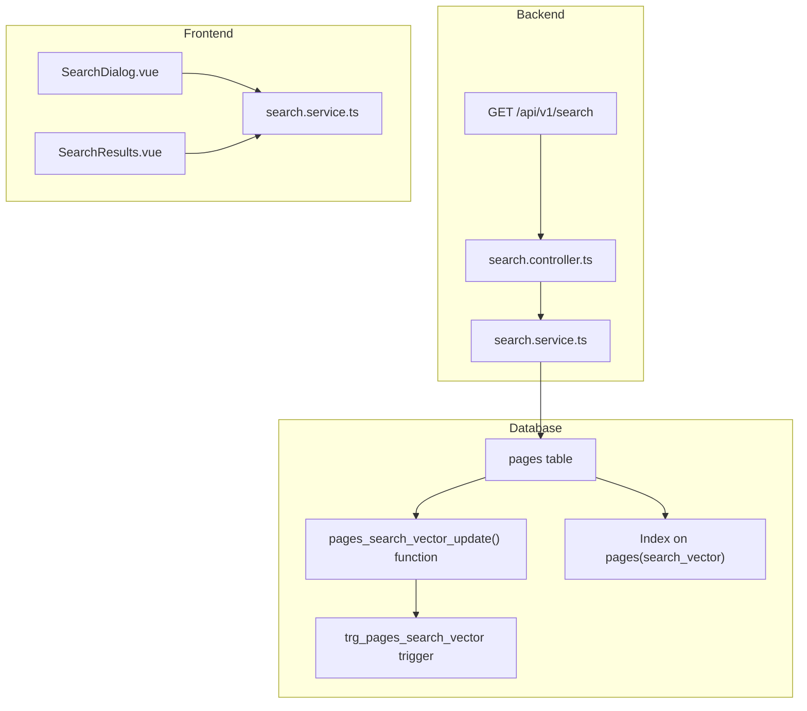
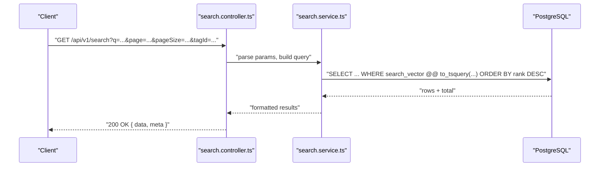
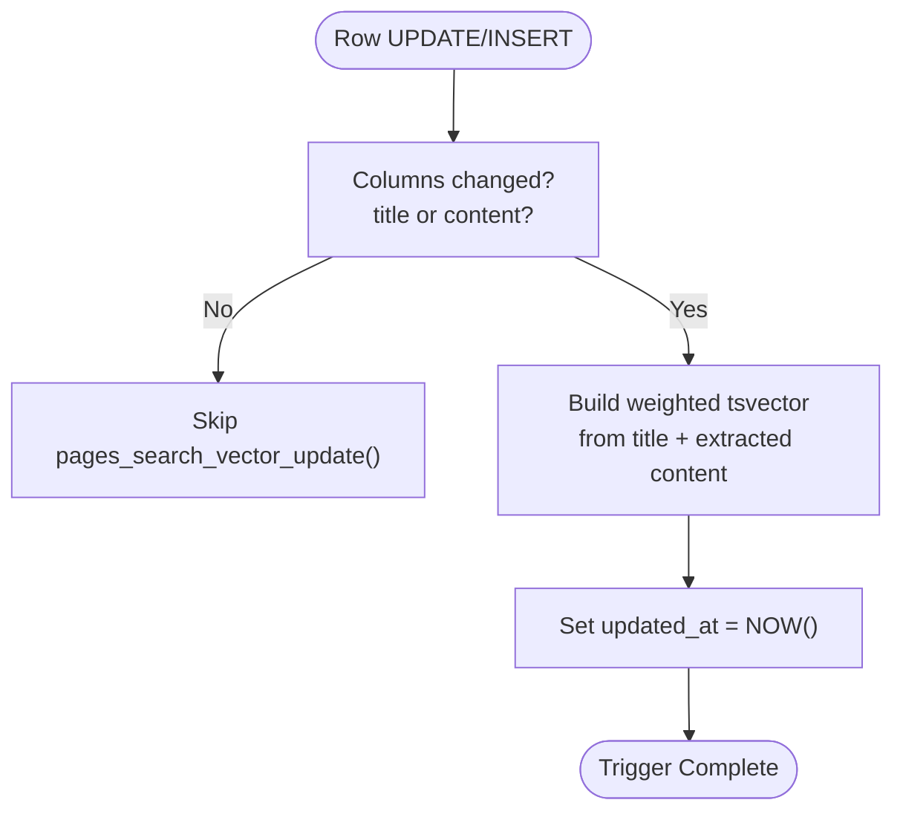
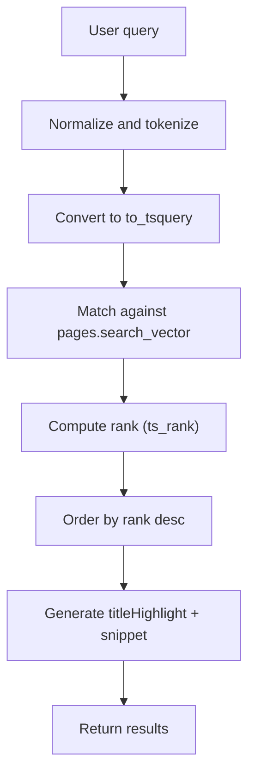
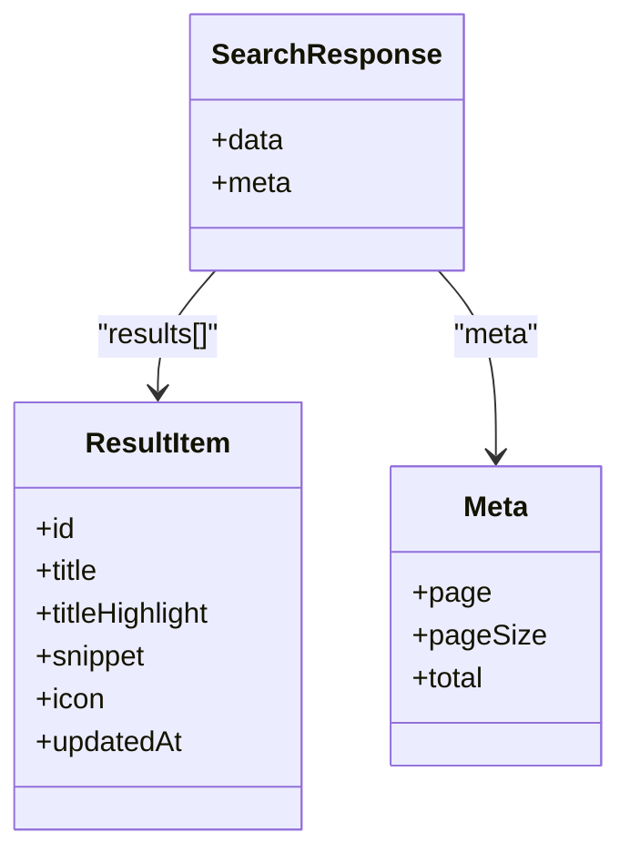
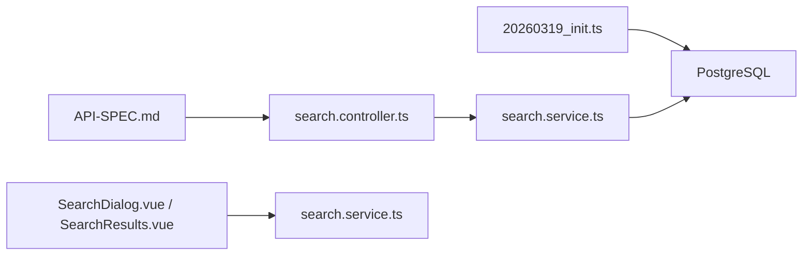

# Search Functionality

<cite>
**Referenced Files in This Document**
- [API-SPEC.md](file://api-spec/API-SPEC.md)
- [ARCHITECTURE.md](file://arch/ARCHITECTURE.md)
- [001_init.sql](file://db/001_init.sql)
- [20260319_init.ts](file://code/server/src/db/migrations/20260319_init.ts)
- [REVIEW-M1.md](file://review/REVIEW-M1.md)
- [TEST-REPORT-M1-BACKEND.md](file://test/backend/TEST-REPORT-M1-BACKEND.md)
</cite>

## Table of Contents
1. [Introduction](#introduction)
2. [Project Structure](#project-structure)
3. [Core Components](#core-components)
4. [Architecture Overview](#architecture-overview)
5. [Detailed Component Analysis](#detailed-component-analysis)
6. [Dependency Analysis](#dependency-analysis)
7. [Performance Considerations](#performance-considerations)
8. [Troubleshooting Guide](#troubleshooting-guide)
9. [Conclusion](#conclusion)
10. [Appendices](#appendices)

## Introduction
This document explains the PostgreSQL full-text search implementation powering the application’s search capability. It covers the tsvector-based indexing strategy, multilingual considerations, relevance scoring, and the search API contract. It also documents the database schema changes, trigger-based indexing, and operational maintenance procedures. While the frontend project structure indicates search-related components, the current backend implementation focuses on the database-level indexing and the API specification defines the search contract.

## Project Structure
The search functionality spans three primary areas:
- Database schema and migration scripts that define the search vector column, extraction logic from TipTap JSON content, and triggers.
- Backend API specification that defines the search endpoint, query parameters, and response shape.
- Frontend project structure indicating UI components and services for search, though the actual implementation files are not present in the current snapshot.

**Diagram sources**
- [001_init.sql:171-213](file://db/001_init.sql#L171-L213)
- [20260319_init.ts:196-242](file://code/server/src/db/migrations/20260319_init.ts#L196-L242)
- [API-SPEC.md:419-466](file://api-spec/API-SPEC.md#L419-L466)
- [ARCHITECTURE.md:238-286](file://arch/ARCHITECTURE.md#L238-L286)

**Section sources**
- [ARCHITECTURE.md:89-236](file://arch/ARCHITECTURE.md#L89-L236)
- [API-SPEC.md:419-466](file://api-spec/API-SPEC.md#L419-L466)

## Core Components
- Database search vector generation:
  - A PostgreSQL function extracts text from TipTap JSON content and builds a weighted tsvector combining title and content.
  - A trigger updates the search_vector on insert/update of title or content.
- API contract:
  - GET /api/v1/search supports keyword search, pagination, and optional tag filtering.
  - Responses include highlighted title, snippet, icon, and updatedAt metadata.

Key implementation anchors:
- Trigger and function definition: [001_init.sql:171-213](file://db/001_init.sql#L171-L213), [20260319_init.ts:196-242](file://code/server/src/db/migrations/20260319_init.ts#L196-L242)
- API specification: [API-SPEC.md:419-466](file://api-spec/API-SPEC.md#L419-L466)

**Section sources**
- [001_init.sql:171-213](file://db/001_init.sql#L171-L213)
- [20260319_init.ts:196-242](file://code/server/src/db/migrations/20260319_init.ts#L196-L242)
- [API-SPEC.md:419-466](file://api-spec/API-SPEC.md#L419-L466)

## Architecture Overview
The search architecture leverages PostgreSQL’s native full-text search capabilities with a precomputed search_vector column. The backend exposes a single search endpoint that queries the pages table using the tsvector column and returns ranked results with highlights.

**Diagram sources**
- [API-SPEC.md:419-466](file://api-spec/API-SPEC.md#L419-L466)
- [20260319_init.ts:196-242](file://code/server/src/db/migrations/20260319_init.ts#L196-L242)

## Detailed Component Analysis

### Database Schema and Trigger-Based Indexing
- Column and extraction:
  - The pages table includes a search_vector column generated by a PL/pgSQL function.
  - The function builds a weighted tsvector from title (weight A) and extracted text from TipTap JSON content (weight B).
  - Extraction logic traverses nested JSON nodes and aggregates text values.
- Trigger:
  - A BEFORE INSERT OR UPDATE OF title, content trigger invokes the function to keep search_vector synchronized.
- Maintenance:
  - An independent updated_at trigger ensures timestamps remain accurate even when only non-title/content columns change.

**Diagram sources**
- [001_init.sql:171-213](file://db/001_init.sql#L171-L213)
- [20260319_init.ts:196-242](file://code/server/src/db/migrations/20260319_init.ts#L196-L242)

**Section sources**
- [001_init.sql:171-213](file://db/001_init.sql#L171-L213)
- [20260319_init.ts:196-242](file://code/server/src/db/migrations/20260319_init.ts#L196-L242)
- [TEST-REPORT-M1-BACKEND.md:210-229](file://test/backend/TEST-REPORT-M1-BACKEND.md#L210-L229)

### Relevance Scoring and Ranking
- Weighted tsvector:
  - Title receives weight A; content receives weight B. Higher weight for title improves relevance for exact or prominent matches in titles.
- Ranking:
  - Results are ordered by descending rank derived from the ts_rank function applied to the tsvector match.
- Highlighting:
  - The API specification requires titleHighlight and snippet fields with keyword emphasis via HTML tags, produced by the backend service.

**Diagram sources**
- [API-SPEC.md:459-465](file://api-spec/API-SPEC.md#L459-L465)
- [20260319_init.ts:196-242](file://code/server/src/db/migrations/20260319_init.ts#L196-L242)

**Section sources**
- [API-SPEC.md:459-465](file://api-spec/API-SPEC.md#L459-L465)

### Search API Endpoint Definition
- Endpoint: GET /api/v1/search
- Required parameter: q (keyword)
- Optional parameters: page, pageSize, tagId
- Response shape includes results array with id, title, titleHighlight, snippet, icon, updatedAt, and pagination metadata.

**Diagram sources**
- [API-SPEC.md:434-457](file://api-spec/API-SPEC.md#L434-L457)

**Section sources**
- [API-SPEC.md:419-466](file://api-spec/API-SPEC.md#L419-L466)

### Frontend Search Service and UI (Structure)
- Project structure indicates:
  - Search dialog and results components under the frontend components/search directory.
  - A dedicated search service module for API interactions.
- Current snapshot does not include the actual frontend implementation files; therefore, this section describes the intended structure and responsibilities without quoting code.

[No sources needed since this section describes project structure without analyzing specific files]

## Dependency Analysis
- Backend depends on:
  - Database migration scripts to define the search_vector function and trigger.
  - API specification to enforce endpoint behavior and response shape.
- Frontend depends on:
  - Backend API contract to drive search requests and render results.

**Diagram sources**
- [20260319_init.ts:196-242](file://code/server/src/db/migrations/20260319_init.ts#L196-L242)
- [API-SPEC.md:419-466](file://api-spec/API-SPEC.md#L419-L466)
- [ARCHITECTURE.md:238-286](file://arch/ARCHITECTURE.md#L238-L286)

**Section sources**
- [20260319_init.ts:196-242](file://code/server/src/db/migrations/20260319_init.ts#L196-L242)
- [API-SPEC.md:419-466](file://api-spec/API-SPEC.md#L419-L466)
- [ARCHITECTURE.md:238-286](file://arch/ARCHITECTURE.md#L238-L286)

## Performance Considerations
- Indexing:
  - Ensure a GIN index exists on the search_vector column for efficient tsvector operations.
  - Consider a GIN index on tag_id if tag filtering is frequently used.
- Query planning:
  - Use EXPLAIN/EXPLAIN ANALYZE to inspect query plans and confirm index usage.
- Tokenization and weights:
  - Keep the simple dictionary for content to minimize overhead; adjust weights to balance title vs content relevance.
- Pagination:
  - Enforce pageSize limits and avoid deep pagination for large offsets.
- Caching:
  - Cache frequent low-cardinality queries (e.g., popular terms) at the application level.
  - Use CDN or reverse proxy caching for static or near-static search endpoints if appropriate.
- Concurrency:
  - Tune PostgreSQL max_parallel_workers and related parallelism settings for heavy workloads.
- Maintenance:
  - Periodically rebuild indexes after large bulk loads.
  - Monitor long-running queries and slow log.

[No sources needed since this section provides general guidance]

## Troubleshooting Guide
- Trigger immutability warning:
  - The function declares IMMUTABLE but modifies NEW.updated_at and calls NOW(). This is semantically incorrect and should be corrected to VOLATILE or removed.
  - See: [REVIEW-M1.md:220-230](file://review/REVIEW-M1.md#L220-L230)
- Updated-at timestamp accuracy:
  - The search vector trigger only fires on changes to title or content. Updates to other columns do not refresh updated_at.
  - A separate updated_at trigger is recommended to ensure consistent timestamps.
  - See: [TEST-REPORT-M1-BACKEND.md:210-229](file://test/backend/TEST-REPORT-M1-BACKEND.md#L210-L229)
- Production migration configuration:
  - The knexfile lacks a production environment, causing migrations to fall back to development in production.
  - See: [REVIEW-M1.md:210-218](file://review/REVIEW-M1.md#L210-L218)

**Section sources**
- [REVIEW-M1.md:210-230](file://review/REVIEW-M1.md#L210-L230)
- [TEST-REPORT-M1-BACKEND.md:210-229](file://test/backend/TEST-REPORT-M1-BACKEND.md#L210-L229)

## Conclusion
The search implementation centers on a PostgreSQL-triggered tsvector column that captures both title and TipTap content. The API specification defines a straightforward search endpoint with pagination and optional tag filtering, returning relevance-ranked results with highlights. The frontend structure indicates dedicated components and services for search, although the actual implementation files are not included in this snapshot. Operational readiness requires correcting the trigger function semantics, ensuring accurate timestamps, and validating production migration configuration.

[No sources needed since this section summarizes without analyzing specific files]

## Appendices

### Database Migration Notes
- Migration script creates the pages_search_vector_update function and the associated trigger.
- The function uses setweight and concatenation to combine title and content vectors.
- The trigger fires on INSERT or UPDATE OF title, content.

**Section sources**
- [20260319_init.ts:196-242](file://code/server/src/db/migrations/20260319_init.ts#L196-L242)
- [001_init.sql:171-213](file://db/001_init.sql#L171-L213)

### API Parameter Reference
- q: search keyword (required)
- page: page number (optional)
- pageSize: items per page (optional)
- tagId: filter by tag ID (optional)

**Section sources**
- [API-SPEC.md:425-433](file://api-spec/API-SPEC.md#L425-L433)