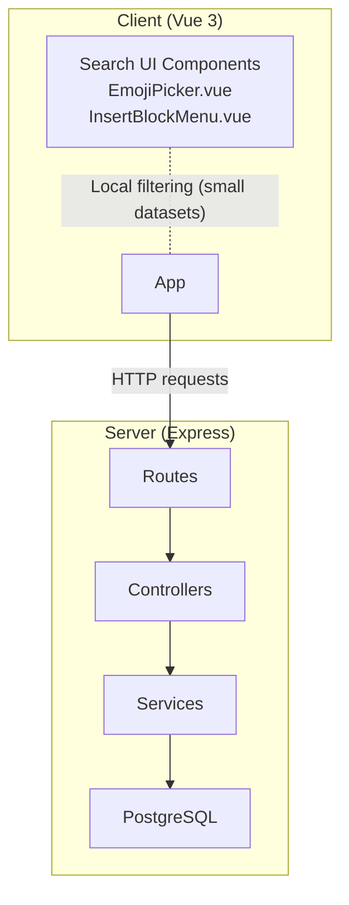
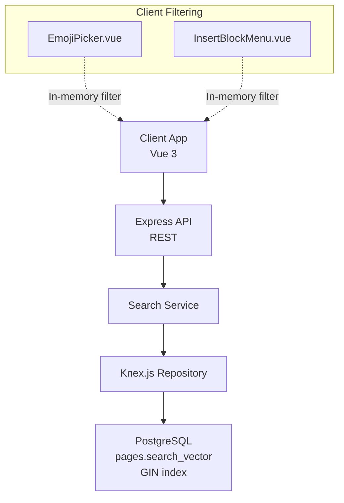
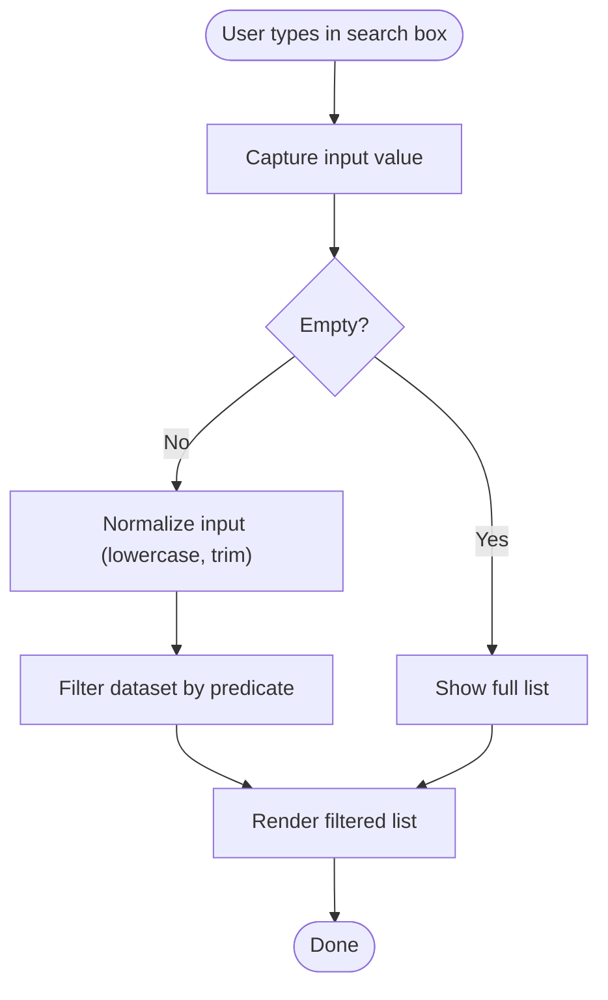
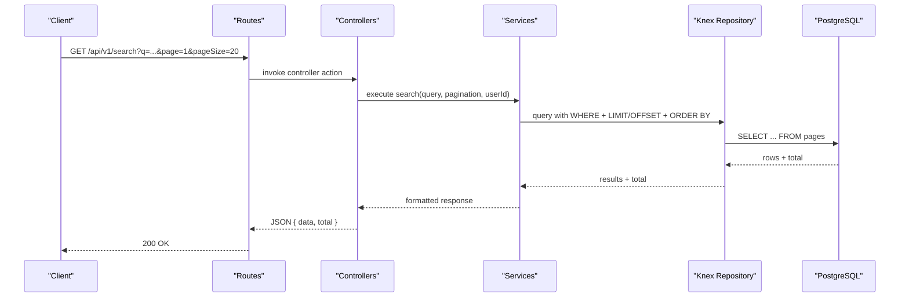
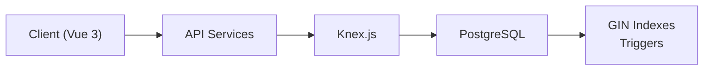

# Search Performance & Optimization

<cite>
**Referenced Files in This Document**
- [README.md](file://README.md)
- [ARCHITECTURE.md](file://arch/ARCHITECTURE.md)
- [API-SPEC.md](file://api-spec/API-SPEC.md)
- [001_init.sql](file://db/001_init.sql)
- [ER-DIAGRAM.md](file://db/ER-DIAGRAM.md)
- [EmojiPicker.vue](file://code/client/src/components/editor/EmojiPicker.vue)
- [InsertBlockMenu.vue](file://code/client/src/components/editor/InsertBlockMenu.vue)
- [client package.json](file://code/client/package.json)
- [server package.json](file://code/server/package.json)
- [knexfile.ts](file://code/server/knexfile.ts)
- [connection.ts](file://code/server/src/db/connection.ts)
- [docker-compose.yml](file://docker/docker-compose.yml)
</cite>

## Table of Contents
1. [Introduction](#introduction)
2. [Project Structure](#project-structure)
3. [Core Components](#core-components)
4. [Architecture Overview](#architecture-overview)
5. [Detailed Component Analysis](#detailed-component-analysis)
6. [Dependency Analysis](#dependency-analysis)
7. [Performance Considerations](#performance-considerations)
8. [Troubleshooting Guide](#troubleshooting-guide)
9. [Conclusion](#conclusion)
10. [Appendices](#appendices)

## Introduction
This document provides a comprehensive guide to search performance optimization for the Yule Notion project. It consolidates the existing architecture and implementation details to define practical strategies for query optimization, index maintenance, search algorithm tuning, caching, pagination, lazy loading, monitoring, and balancing accuracy versus performance. It also outlines benchmarking, load testing, and capacity planning recommendations tailored to the current stack (Vue 3 + Express + PostgreSQL with full-text search).

## Project Structure
The repository follows a monorepo layout with separate client and server packages. The search capability is primarily implemented on the backend via PostgreSQL’s full-text search engine with triggers and GIN indexes, while the frontend provides lightweight UI components for quick filtering within small datasets (e.g., emoji picker and block insertion menus).

**Diagram sources**
- [ARCHITECTURE.md](file://arch/ARCHITECTURE.md)
- [EmojiPicker.vue](file://code/client/src/components/editor/EmojiPicker.vue)
- [InsertBlockMenu.vue](file://code/client/src/components/editor/InsertBlockMenu.vue)

**Section sources**
- [README.md](file://README.md)
- [ARCHITECTURE.md](file://arch/ARCHITECTURE.md)

## Core Components
- Full-text search engine: PostgreSQL tsvector with GIN index and trigger-based maintenance.
- Lightweight client-side filtering: In-memory search for small lists (emoji picker, insert block menu).
- Backend API: REST endpoints for search and CRUD operations, with pagination and data isolation.
- Database schema: JSONB storage for page content, tree model for hierarchical pages, and auxiliary tables for tags and sync logs.

Key implementation anchors:
- Full-text search design and index strategy are documented in the architecture and database schema.
- Pagination and response metadata are standardized in the API specification.
- Client-side filtering demonstrates low-latency, client-side search for small datasets.

**Section sources**
- [ARCHITECTURE.md](file://arch/ARCHITECTURE.md)
- [API-SPEC.md](file://api-spec/API-SPEC.md)
- [001_init.sql](file://db/001_init.sql)
- [ER-DIAGRAM.md](file://db/ER-DIAGRAM.md)
- [EmojiPicker.vue](file://code/client/src/components/editor/EmojiPicker.vue)
- [InsertBlockMenu.vue](file://code/client/src/components/editor/InsertBlockMenu.vue)

## Architecture Overview
The search architecture leverages PostgreSQL’s native full-text search capabilities for scalable, accurate content retrieval. The client handles immediate feedback for small-scale UI searches, while the server executes efficient full-text queries with pagination and access control.

**Diagram sources**
- [ARCHITECTURE.md](file://arch/ARCHITECTURE.md)
- [001_init.sql](file://db/001_init.sql)
- [EmojiPicker.vue](file://code/client/src/components/editor/EmojiPicker.vue)
- [InsertBlockMenu.vue](file://code/client/src/components/editor/InsertBlockMenu.vue)

## Detailed Component Analysis

### PostgreSQL Full-Text Search Engine
- Data model: pages.content stored as JSONB; a generated search_vector column enables fast full-text indexing.
- Indexing: GIN index on tsvector for rapid phrase and word matching.
- Trigger: Automatic maintenance of search_vector on insert/update.
- Ranking: Built-in rank functions can be used to sort results by relevance.
- Query patterns: Support for phrase matching, prefix queries, and weighted configurations.

Optimization levers:
- Use appropriate text search configurations (e.g., simple, english) depending on content language.
- Weighted vectors to prioritize title over content.
- Normalize input (lowercase, remove extra whitespace) to improve match rates.
- Consider materialized search views for frequently accessed subsets.

**Section sources**
- [ARCHITECTURE.md](file://arch/ARCHITECTURE.md)
- [001_init.sql](file://db/001_init.sql)
- [ER-DIAGRAM.md](file://db/ER-DIAGRAM.md)

### Client-Side Filtering (Small Datasets)
Two UI components demonstrate efficient client-side search for small lists:
- EmojiPicker: Filters a curated emoji list by substring matching.
- InsertBlockMenu: Filters recent items and supports prefix-based filtering.

Implementation characteristics:
- Immediate feedback with minimal latency.
- No network overhead for small datasets.
- Debouncing and normalization reduce unnecessary re-computation.

**Diagram sources**
- [EmojiPicker.vue](file://code/client/src/components/editor/EmojiPicker.vue)
- [InsertBlockMenu.vue](file://code/client/src/components/editor/InsertBlockMenu.vue)

**Section sources**
- [EmojiPicker.vue](file://code/client/src/components/editor/EmojiPicker.vue)
- [InsertBlockMenu.vue](file://code/client/src/components/editor/InsertBlockMenu.vue)

### Backend API and Pagination
- Standardized pagination: page and pageSize query parameters; response includes total count.
- Data isolation: all endpoints automatically filter by userId to prevent cross-user access.
- Endpoint contract: RESTful resources under /api/v1 with consistent error and response formats.

**Diagram sources**
- [ARCHITECTURE.md](file://arch/ARCHITECTURE.md)
- [API-SPEC.md](file://api-spec/API-SPEC.md)

**Section sources**
- [ARCHITECTURE.md](file://arch/ARCHITECTURE.md)
- [API-SPEC.md](file://api-spec/API-SPEC.md)

### Index Maintenance Procedures
- Automated maintenance: trigger updates search_vector on INSERT/UPDATE.
- Periodic vacuum/analyze: maintain index statistics and query planner effectiveness.
- Reindexing strategy: schedule offline reindex during low-traffic windows for large content updates.
- Monitoring: track index bloat and query performance regressions.

Operational checklist:
- Verify trigger presence after schema changes.
- Confirm GIN index usage in EXPLAIN ANALYZE output.
- Monitor autovacuum thresholds and adjust if needed.

**Section sources**
- [ARCHITECTURE.md](file://arch/ARCHITECTURE.md)
- [001_init.sql](file://db/001_init.sql)

### Search Algorithm Tuning
- Text configuration: choose appropriate dictionaries and parsers for content language.
- Ranking: incorporate weights for title vs. body; consider proximity and phrase matching.
- Fuzzy matching: enable ILIKE with wildcards judiciously; prefer trigram GIN indexes for approximate matching if needed.
- Stemming: configure appropriate stemmers per language; test impact on recall and precision.
- Stop words: tune stop-word lists to balance precision and recall.

Validation:
- A/B test ranking changes with controlled traffic.
- Measure precision@k and mean reciprocal rank on curated test sets.

**Section sources**
- [ARCHITECTURE.md](file://arch/ARCHITECTURE.md)

### Caching Strategies for Frequently Searched Terms
- Application-level cache: memoize recent queries with TTL to reduce repeated work.
- Database-level hints: leverage connection pooling and prepared statements for repeated queries.
- CDN/static caching: not applicable for dynamic search results; focus on application cache.
- Cache invalidation: invalidate on page updates/deletes; consider write-through for hot keys.

Recommendations:
- Use short TTLs for freshness; longer TTLs for cold, stable terms.
- Segment caches by user to respect data isolation.

**Section sources**
- [ARCHITECTURE.md](file://arch/ARCHITECTURE.md)

### Result Pagination and Lazy Loading
- Pagination: standardized page/pageSize with total; avoid deep pagination for large offsets.
- Lazy loading: defer rendering of offscreen results; virtualize long lists.
- Infinite scroll: combine pagination with intersection observer for seamless UX.

**Section sources**
- [API-SPEC.md](file://api-spec/API-SPEC.md)

### Performance Monitoring, Execution Plans, and Bottlenecks
- Enable logging of slow queries and query execution stats.
- Use EXPLAIN ANALYZE to inspect index usage and plan changes.
- Track metrics: query latency, throughput, cache hit ratio, and DB resource utilization.
- Identify bottlenecks: slow joins, missing indexes, long-running transactions, or contention.

**Section sources**
- [ARCHITECTURE.md](file://arch/ARCHITECTURE.md)

### Trade-offs Between Accuracy and Performance
- Stemming: improves recall but may increase false positives; test with domain-specific corpora.
- Fuzzy matching: enhances robustness but increases cost; cap edit distance and use early pruning.
- Ranking: heavier ranking functions improve relevance but add CPU overhead; precompute scores for top-N.
- Index coverage: broader coverage improves accuracy but increases storage and maintenance cost.

**Section sources**
- [ARCHITECTURE.md](file://arch/ARCHITECTURE.md)

### Benchmarking Methodologies and Load Testing
- Synthetic benchmarks: fixed test suites with controlled queries and varying loads.
- Realistic load tests: simulate concurrent users performing typical search workflows.
- Metrics: p50/p95/p99 latency, error rate, DB queue length, and cache hit ratios.
- Capacity planning: extrapolate from load tests to peak traffic; provision headroom for spikes.

**Section sources**
- [README.md](file://README.md)
- [docker-compose.yml](file://docker/docker-compose.yml)

## Dependency Analysis
- Client depends on services for API communication; UI components perform local filtering for small datasets.
- Server depends on Knex.js for SQL abstraction and PostgreSQL for persistence.
- PostgreSQL depends on GIN indexes and triggers for full-text search performance.

**Diagram sources**
- [ARCHITECTURE.md](file://arch/ARCHITECTURE.md)
- [knexfile.ts](file://code/server/knexfile.ts)
- [connection.ts](file://code/server/src/db/connection.ts)

**Section sources**
- [ARCHITECTURE.md](file://arch/ARCHITECTURE.md)
- [knexfile.ts](file://code/server/knexfile.ts)
- [connection.ts](file://code/server/src/db/connection.ts)

## Performance Considerations
- Prefer GIN indexes for tsvector; avoid GiST for high-cardinality text unless specific operators require it.
- Normalize input and apply consistent preprocessing to maximize index effectiveness.
- Use LIMIT/OFFSET for pagination; consider keyset pagination for very large datasets.
- Keep queries simple and selective; push filtering to the database.
- Monitor and tune autovacuum and maintenance workloads to keep index stats fresh.

[No sources needed since this section provides general guidance]

## Troubleshooting Guide
- Queries unexpectedly slow: inspect execution plans, verify GIN index usage, and check for table bloat.
- Missed matches: confirm trigger updates and reindex if content was bulk-loaded without triggers.
- Pagination anomalies: ensure page/pageSize parameters are respected and totals are computed efficiently.
- Client-side filtering lag: verify DOM rendering costs and consider virtualization for large lists.

**Section sources**
- [ARCHITECTURE.md](file://arch/ARCHITECTURE.md)
- [API-SPEC.md](file://api-spec/API-SPEC.md)

## Conclusion
By combining PostgreSQL’s full-text search with careful index maintenance, judicious caching, and thoughtful pagination, Yule Notion can achieve responsive search at scale. Complement backend optimizations with client-side micro-searches for immediate UI feedback, and continuously monitor and iterate on query plans and ranking to balance accuracy and performance.

[No sources needed since this section summarizes without analyzing specific files]

## Appendices

### Appendix A: Relevant Configuration and Environment Anchors
- Database connectivity and migrations are managed via Knex and PostgreSQL.
- Deployment compose file defines service dependencies and ports.

**Section sources**
- [knexfile.ts](file://code/server/knexfile.ts)
- [docker-compose.yml](file://docker/docker-compose.yml)