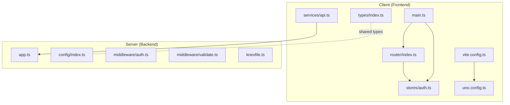
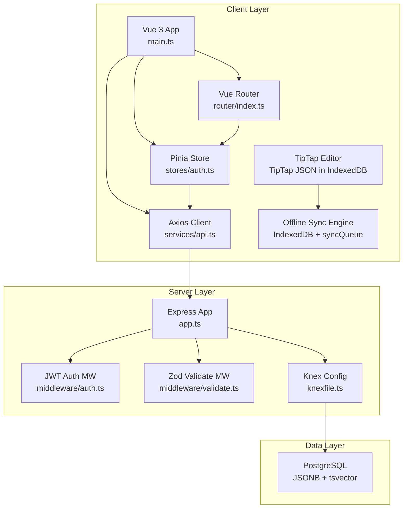
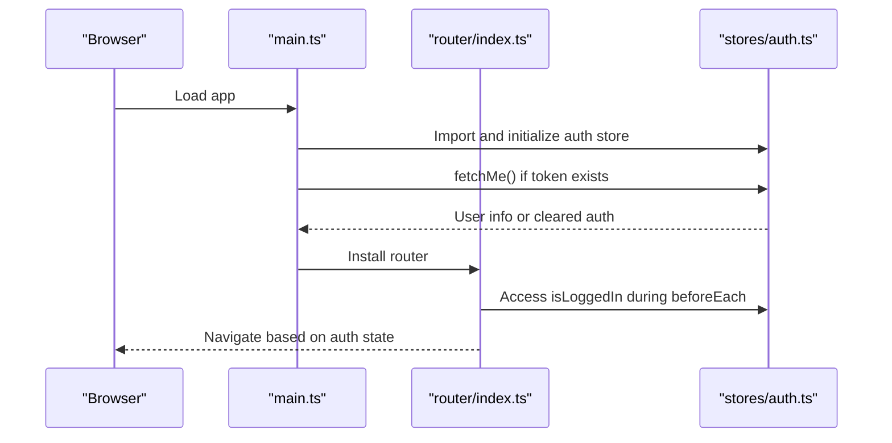
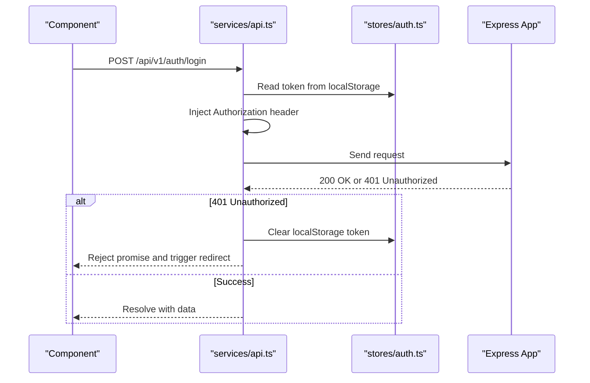
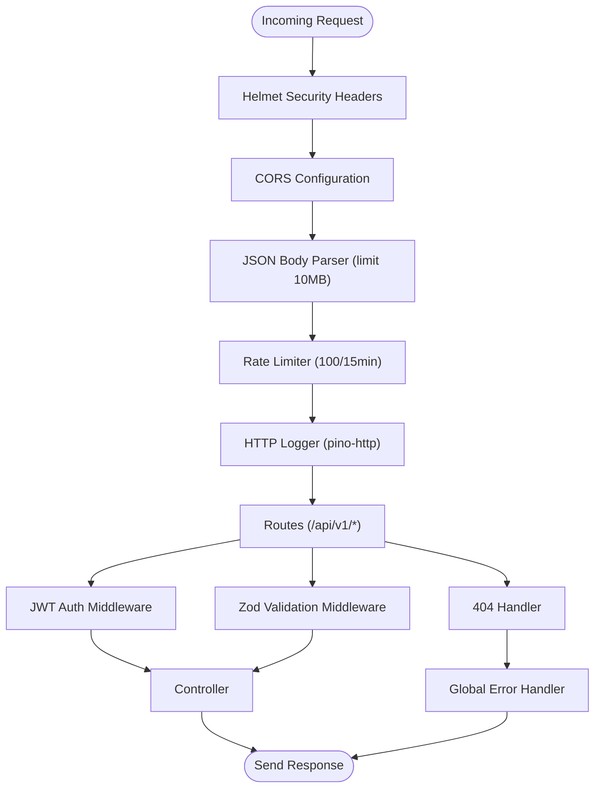
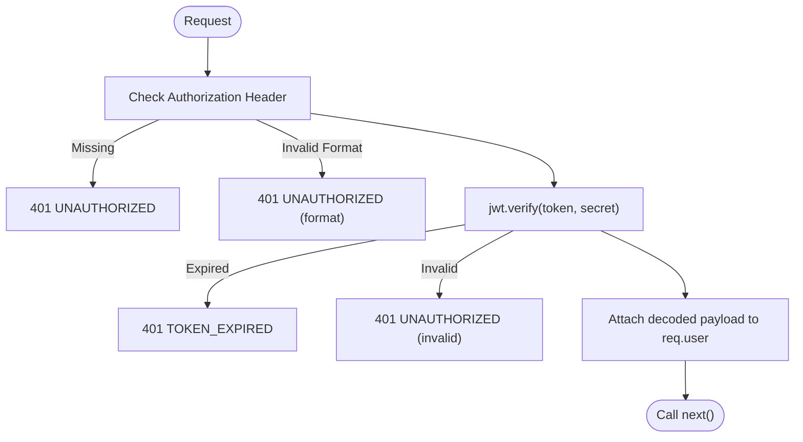
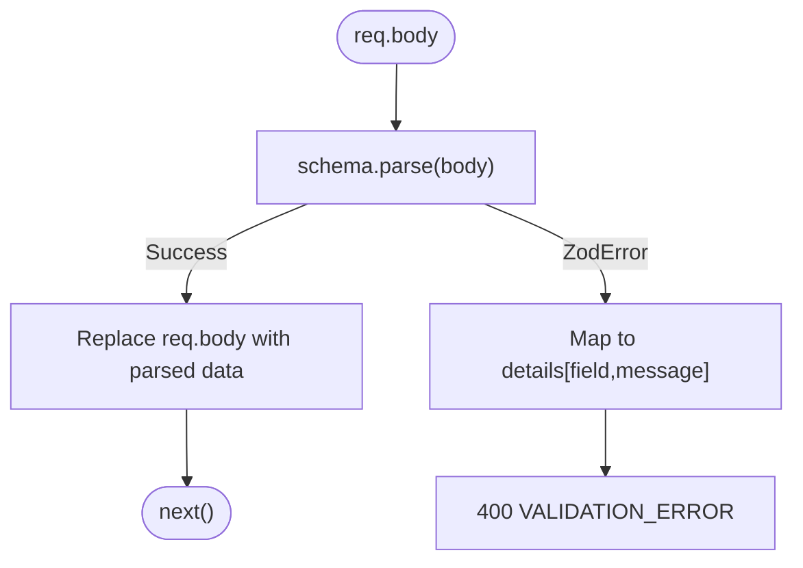
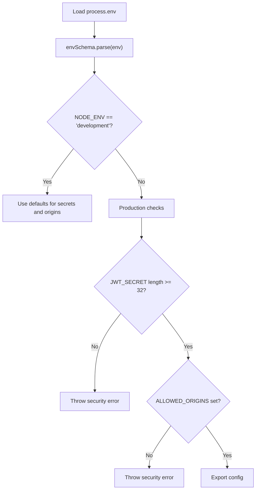
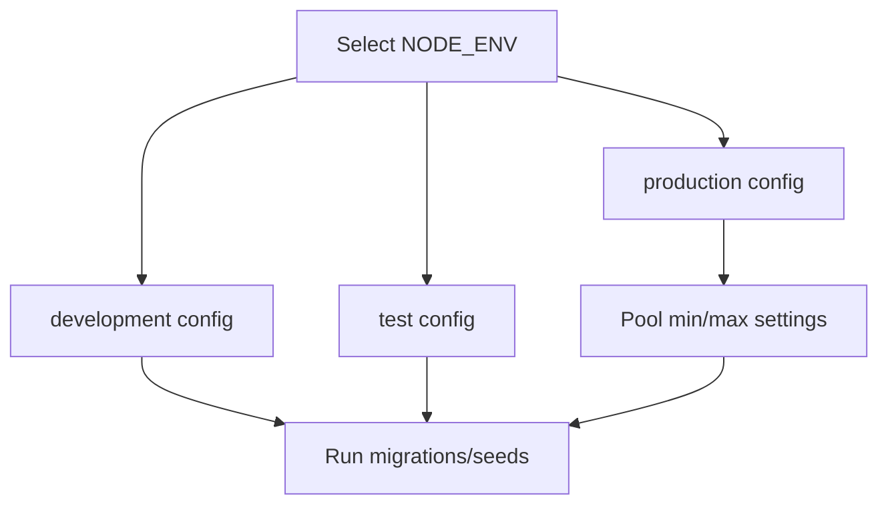
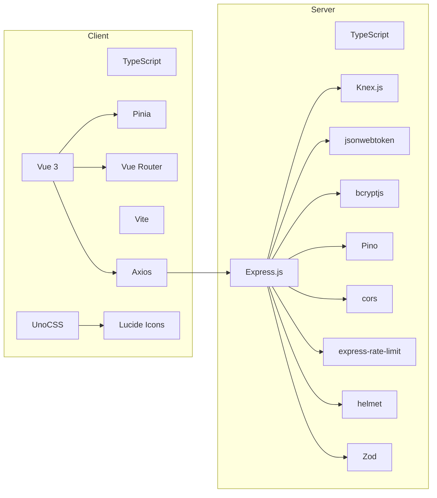

# Technology Stack & Dependencies

<cite>
**Referenced Files in This Document**
- [README.md](file://README.md)
- [ARCHITECTURE.md](file://arch/ARCHITECTURE.md)
- [client/package.json](file://code/client/package.json)
- [server/package.json](file://code/server/package.json)
- [vite.config.ts](file://code/client/vite.config.ts)
- [uno.config.ts](file://code/client/uno.config.ts)
- [tsconfig.json (client)](file://code/client/tsconfig.json)
- [tsconfig.json (server)](file://code/server/tsconfig.json)
- [main.ts](file://code/client/src/main.ts)
- [router/index.ts](file://code/client/src/router/index.ts)
- [stores/auth.ts](file://code/client/src/stores/auth.ts)
- [services/api.ts](file://code/client/src/services/api.ts)
- [types/index.ts](file://code/client/src/types/index.ts)
- [app.ts](file://code/server/src/app.ts)
- [config/index.ts](file://code/server/src/config/index.ts)
- [middleware/auth.ts](file://code/server/src/middleware/auth.ts)
- [middleware/validate.ts](file://code/server/src/middleware/validate.ts)
- [knexfile.ts](file://code/server/knexfile.ts)
</cite>

## Table of Contents
1. [Introduction](#introduction)
2. [Project Structure](#project-structure)
3. [Core Components](#core-components)
4. [Architecture Overview](#architecture-overview)
5. [Detailed Component Analysis](#detailed-component-analysis)
6. [Dependency Analysis](#dependency-analysis)
7. [Performance Considerations](#performance-considerations)
8. [Troubleshooting Guide](#troubleshooting-guide)
9. [Conclusion](#conclusion)
10. [Appendices](#appendices)

## Introduction
This document provides a comprehensive technology stack and dependencies guide for Yule Notion. It explains the frontend stack (Vue 3, TypeScript, Pinia, Vue Router, Vite, UnoCSS, Lucide Icons) and the backend stack (Express.js, PostgreSQL via Knex.js ORM, JWT authentication, BcryptJS, Pino logging, Zod validation, and security middleware). It also covers version requirements, compatibility considerations, upgrade paths, and integration patterns between frontend and backend, including how the stack supports rich text editing and offline synchronization.

## Project Structure
Yule Notion follows a monorepo-like structure with two primary packages:
- Frontend (client): Vue 3 SPA with Vite, Pinia, Vue Router, UnoCSS, and Lucide Icons.
- Backend (server): Express.js REST API with TypeScript, Knex.js ORM, JWT, BcryptJS, Pino, Zod, and security middleware.

**Diagram sources**
- [main.ts:1-54](file://code/client/src/main.ts#L1-L54)
- [router/index.ts:1-93](file://code/client/src/router/index.ts#L1-L93)
- [stores/auth.ts:1-138](file://code/client/src/stores/auth.ts#L1-L138)
- [services/api.ts:1-64](file://code/client/src/services/api.ts#L1-L64)
- [vite.config.ts:1-37](file://code/client/vite.config.ts#L1-L37)
- [uno.config.ts:1-52](file://code/client/uno.config.ts#L1-L52)
- [types/index.ts:1-101](file://code/client/src/types/index.ts#L1-L101)
- [app.ts:1-121](file://code/server/src/app.ts#L1-L121)
- [config/index.ts:1-101](file://code/server/src/config/index.ts#L1-L101)
- [middleware/auth.ts:1-60](file://code/server/src/middleware/auth.ts#L1-L60)
- [middleware/validate.ts:1-72](file://code/server/src/middleware/validate.ts#L1-L72)
- [knexfile.ts:1-69](file://code/server/knexfile.ts#L1-L69)

**Section sources**
- [README.md:23-41](file://README.md#L23-L41)
- [ARCHITECTURE.md:164-286](file://arch/ARCHITECTURE.md#L164-L286)

## Core Components
This section documents the frontend and backend stacks, their roles, and integration patterns.

### Frontend Stack
- Vue 3 + TypeScript: Application framework and type safety.
- Pinia: State management for authentication and UI state.
- Vue Router: Navigation and route guards.
- Vite: Build tool and dev server with fast HMR.
- UnoCSS + Lucide Icons: Atomic CSS and iconography.
- Axios: HTTP client with interceptors for JWT and error handling.

Key integration points:
- Axios baseURL set to /api/v1 with request/response interceptors injecting Bearer tokens and handling 401.
- Vue Router guards protect routes and redirect unauthenticated users.
- Pinia manages authentication state and persists tokens in localStorage.

**Section sources**
- [README.md:7-14](file://README.md#L7-L14)
- [client/package.json:11-51](file://code/client/package.json#L11-L51)
- [vite.config.ts:12-36](file://code/client/vite.config.ts#L12-L36)
- [uno.config.ts:12-51](file://code/client/uno.config.ts#L12-L51)
- [main.ts:13-53](file://code/client/src/main.ts#L13-L53)
- [router/index.ts:14-93](file://code/client/src/router/index.ts#L14-L93)
- [stores/auth.ts:26-137](file://code/client/src/stores/auth.ts#L26-L137)
- [services/api.ts:15-63](file://code/client/src/services/api.ts#L15-L63)
- [types/index.ts:6-101](file://code/client/src/types/index.ts#L6-L101)

### Backend Stack
- Express.js + TypeScript: Web framework and type-safe development.
- PostgreSQL via Knex.js ORM: Relational data persistence and migrations.
- JWT + BcryptJS: Authentication and secure password hashing.
- Pino: Structured logging for development and production.
- Zod: Runtime validation for requests and environment variables.
- Security middleware: Helmet, CORS, and rate limiting.

Key integration points:
- Centralized config module validates and exposes environment variables using Zod.
- Middleware pipeline applies Helmet, CORS, JSON parsing, rate limiting, and HTTP logging.
- Auth middleware extracts and verifies JWT; validation middleware enforces Zod schemas.

**Section sources**
- [README.md:15-22](file://README.md#L15-L22)
- [server/package.json:15-38](file://code/server/package.json#L15-L38)
- [app.ts:29-121](file://code/server/src/app.ts#L29-L121)
- [config/index.ts:16-98](file://code/server/src/config/index.ts#L16-L98)
- [middleware/auth.ts:29-59](file://code/server/src/middleware/auth.ts#L29-L59)
- [middleware/validate.ts:31-71](file://code/server/src/middleware/validate.ts#L31-L71)
- [knexfile.ts:13-68](file://code/server/knexfile.ts#L13-L68)

## Architecture Overview
The system is a classic three-layer architecture with clear separation of concerns:
- Client layer: Vue 3 SPA with Vite, TipTap for rich text editing, Pinia for state, Vue Router for navigation, and IndexedDB for offline storage.
- Server layer: Express REST API with JWT auth, Zod validation, Knex ORM, and Pino logging.
- Data layer: PostgreSQL with JSONB for TipTap content, GIN indexes for full-text search, and migrations/seeds managed by Knex.

**Diagram sources**
- [main.ts:24-53](file://code/client/src/main.ts#L24-L53)
- [router/index.ts:51-93](file://code/client/src/router/index.ts#L51-L93)
- [stores/auth.ts:26-137](file://code/client/src/stores/auth.ts#L26-L137)
- [services/api.ts:15-63](file://code/client/src/services/api.ts#L15-L63)
- [app.ts:65-121](file://code/server/src/app.ts#L65-L121)
- [middleware/auth.ts:29-59](file://code/server/src/middleware/auth.ts#L29-L59)
- [middleware/validate.ts:31-71](file://code/server/src/middleware/validate.ts#L31-L71)
- [knexfile.ts:13-68](file://code/server/knexfile.ts#L13-L68)

**Section sources**
- [ARCHITECTURE.md:14-87](file://arch/ARCHITECTURE.md#L14-L87)
- [ARCHITECTURE.md:311-352](file://arch/ARCHITECTURE.md#L311-L352)
- [ARCHITECTURE.md:521-531](file://arch/ARCHITECTURE.md#L521-L531)
- [ARCHITECTURE.md:534-544](file://arch/ARCHITECTURE.md#L534-L544)

## Detailed Component Analysis

### Frontend: Application Initialization and Routing
- Initialization sequence ensures Pinia and Router are installed before mounting, and theme initialization occurs after Pinia is ready.
- Router guards enforce authentication for protected routes and prevent authenticated users from accessing login/register.

**Diagram sources**
- [main.ts:33-53](file://code/client/src/main.ts#L33-L53)
- [router/index.ts:68-93](file://code/client/src/router/index.ts#L68-L93)
- [stores/auth.ts:114-122](file://code/client/src/stores/auth.ts#L114-L122)

**Section sources**
- [main.ts:13-53](file://code/client/src/main.ts#L13-L53)
- [router/index.ts:14-93](file://code/client/src/router/index.ts#L14-L93)
- [stores/auth.ts:26-137](file://code/client/src/stores/auth.ts#L26-L137)

### Frontend: HTTP Client and Interceptors
- Axios instance configured with baseURL /api/v1, timeout, and JSON headers.
- Request interceptor injects Authorization: Bearer <token> from localStorage.
- Response interceptor handles 401 by clearing token and redirecting to login.

**Diagram sources**
- [services/api.ts:15-63](file://code/client/src/services/api.ts#L15-L63)
- [stores/auth.ts:32-71](file://code/client/src/stores/auth.ts#L32-L71)
- [app.ts:107-121](file://code/server/src/app.ts#L107-L121)

**Section sources**
- [services/api.ts:15-63](file://code/client/src/services/api.ts#L15-L63)
- [stores/auth.ts:32-71](file://code/client/src/stores/auth.ts#L32-L71)

### Backend: Express App and Middleware Pipeline
- Middleware order: Helmet, CORS, JSON parser, rate limiter, HTTP logger, routes, 404, global error handler.
- Health check endpoint exposed without authentication.
- Centralized configuration module validates environment variables using Zod.

**Diagram sources**
- [app.ts:67-121](file://code/server/src/app.ts#L67-L121)
- [config/index.ts:16-98](file://code/server/src/config/index.ts#L16-L98)
- [middleware/auth.ts:29-59](file://code/server/src/middleware/auth.ts#L29-L59)
- [middleware/validate.ts:31-71](file://code/server/src/middleware/validate.ts#L31-L71)

**Section sources**
- [app.ts:29-121](file://code/server/src/app.ts#L29-L121)
- [config/index.ts:16-98](file://code/server/src/config/index.ts#L16-L98)

### Backend: Authentication Middleware
- Extracts Bearer token from Authorization header.
- Verifies JWT using configured secret and attaches decoded payload to req.user.
- Returns standardized errors for missing or invalid tokens.

**Diagram sources**
- [middleware/auth.ts:29-59](file://code/server/src/middleware/auth.ts#L29-L59)

**Section sources**
- [middleware/auth.ts:29-59](file://code/server/src/middleware/auth.ts#L29-L59)

### Backend: Validation Middleware (Zod)
- Factory function creates a reusable validation middleware using Zod schemas.
- On validation failure, converts Zod errors into structured details and returns 400 VALIDATION_ERROR.

**Diagram sources**
- [middleware/validate.ts:31-71](file://code/server/src/middleware/validate.ts#L31-L71)

**Section sources**
- [middleware/validate.ts:31-71](file://code/server/src/middleware/validate.ts#L31-L71)

### Backend: Environment Configuration (Zod)
- Defines a strongly typed environment schema with defaults for local development.
- Enforces production security requirements: minimum length for JWT_SECRET and required ALLOWED_ORIGINS.

**Diagram sources**
- [config/index.ts:16-98](file://code/server/src/config/index.ts#L16-L98)

**Section sources**
- [config/index.ts:16-98](file://code/server/src/config/index.ts#L16-L98)

### Backend: Database Configuration (Knex)
- Supports development, test, and production environments with separate configurations.
- Uses TypeScript migration files and configurable pools for production.

**Diagram sources**
- [knexfile.ts:13-68](file://code/server/knexfile.ts#L13-L68)

**Section sources**
- [knexfile.ts:13-68](file://code/server/knexfile.ts#L13-L68)

## Dependency Analysis
This section outlines the relationships among frontend and backend components and external libraries.

**Diagram sources**
- [client/package.json:11-51](file://code/client/package.json#L11-L51)
- [server/package.json:15-38](file://code/server/package.json#L15-L38)

**Section sources**
- [client/package.json:11-51](file://code/client/package.json#L11-L51)
- [server/package.json:15-38](file://code/server/package.json#L15-L38)

## Performance Considerations
- Frontend
  - Vite provides fast HMR and optimized builds; UnoCSS reduces runtime overhead with atomic CSS.
  - Axios timeout prevents hanging requests; centralized interceptors reduce duplication.
- Backend
  - Pino offers efficient JSON logging; rate limiting protects endpoints from abuse.
  - Knex migrations and seeds keep schema changes deterministic and reversible.
- Offline Synchronization
  - IndexedDB with Dexie.js enables efficient local writes; sync queue batches changes for network efficiency.
  - LWW conflict resolution simplifies reconciliation; automatic retries improve reliability.

[No sources needed since this section provides general guidance]

## Troubleshooting Guide
Common issues and resolutions:
- 401 Unauthorized on API calls
  - Cause: Missing or expired Bearer token.
  - Resolution: Ensure token is present in localStorage and injected by Axios interceptor; re-authenticate if needed.
- CORS errors in development
  - Cause: Origin mismatch or missing credentials.
  - Resolution: Verify allowed origins and credentials flag in CORS middleware.
- Rate limit exceeded
  - Cause: Too many requests within the time window.
  - Resolution: Back off or adjust limits; monitor logs via Pino.
- JWT verification failures
  - Cause: Invalid signature or expired token.
  - Resolution: Regenerate token or refresh flow; confirm JWT_SECRET consistency.
- Zod validation errors
  - Cause: Request body does not match schema.
  - Resolution: Inspect details array for field-specific messages; align client payload.

**Section sources**
- [services/api.ts:48-61](file://code/client/src/services/api.ts#L48-L61)
- [app.ts:73-96](file://code/server/src/app.ts#L73-L96)
- [middleware/auth.ts:48-58](file://code/server/src/middleware/auth.ts#L48-L58)
- [middleware/validate.ts:51-66](file://code/server/src/middleware/validate.ts#L51-L66)

## Conclusion
Yule Notion’s stack balances modern developer experience with robust backend practices. The frontend leverages Vue 3, Pinia, and Vite for a responsive UI, while the backend employs Express, Knex, JWT, BcryptJS, Pino, and Zod to deliver a secure, maintainable API. The integration patterns—Axios interceptors, route guards, middleware pipeline, and centralized configuration—ensure consistent behavior across environments. Offline synchronization and rich text editing are supported through IndexedDB and TipTap JSON stored in PostgreSQL.

[No sources needed since this section summarizes without analyzing specific files]

## Appendices

### Version Requirements and Compatibility
- Node.js: v20+ (as per README environment requirements).
- PostgreSQL: 14+ (as per README environment requirements); configured for 15+ in deployment.
- TypeScript: Latest stable for both client and server.
- Vue 3 ecosystem: Latest compatible versions pinned in package.json.
- Express: Latest LTS recommended for stability.
- Knex.js: Latest version for migrations and seeds.
- Pino: Latest version for structured logging.
- Zod: Latest version for runtime validation.
- UnoCSS: Latest version for atomic CSS and icon presets.

**Section sources**
- [README.md:45-48](file://README.md#L45-L48)
- [ARCHITECTURE.md:574-578](file://arch/ARCHITECTURE.md#L574-L578)
- [client/package.json:47-50](file://code/client/package.json#L47-L50)
- [server/package.json:35-36](file://code/server/package.json#L35-L36)

### Upgrade Paths
- Frontend
  - Vue 3 minor updates: Review breaking changes in Vue and Pinia; update Vite and UnoCSS accordingly.
  - TypeScript: Align compilerOptions with latest stable; keep moduleResolution and bundler settings consistent.
- Backend
  - Express: Prefer LTS releases; update middleware packages (Helmet, CORS, Rate Limiting) with security patches.
  - Knex.js: Keep migration files in TypeScript; verify pool settings for production scaling.
  - Pino: Use structured logging in production; avoid pretty printing in non-development environments.
  - Zod: Incrementally adopt new schema features; maintain backward-compatible error responses.
- Shared
  - Axios: Keep baseURL aligned with backend /api/v1 prefix; preserve interceptors.
  - JWT: Rotate secrets periodically; enforce minimum length for JWT_SECRET in production.

[No sources needed since this section provides general guidance]