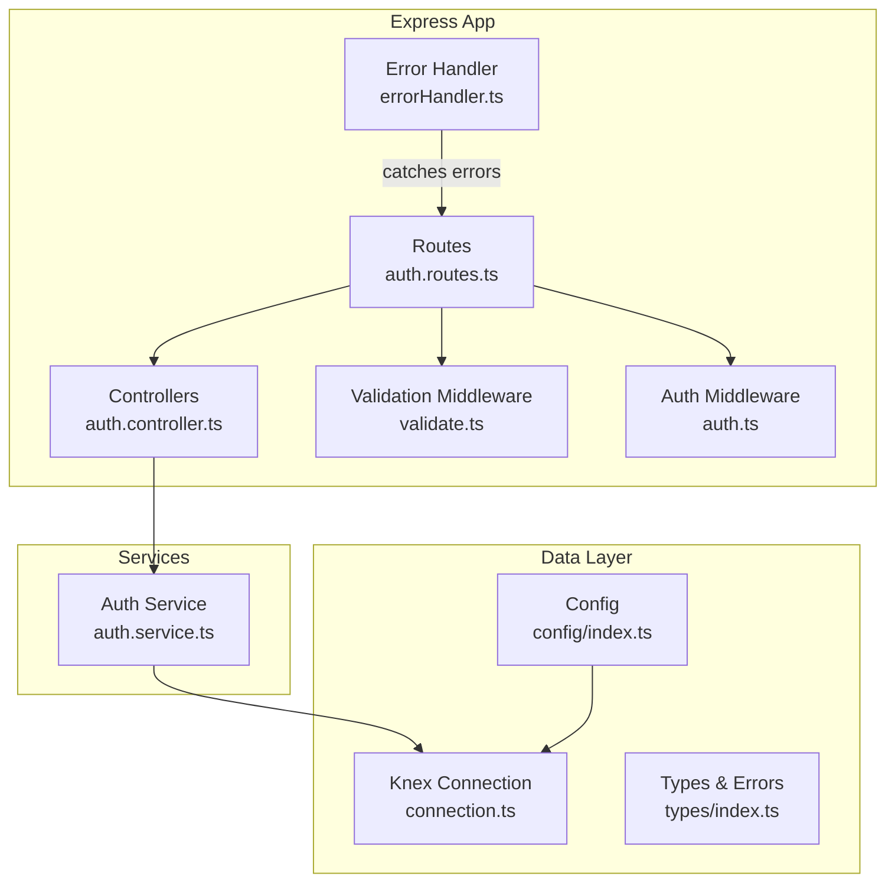
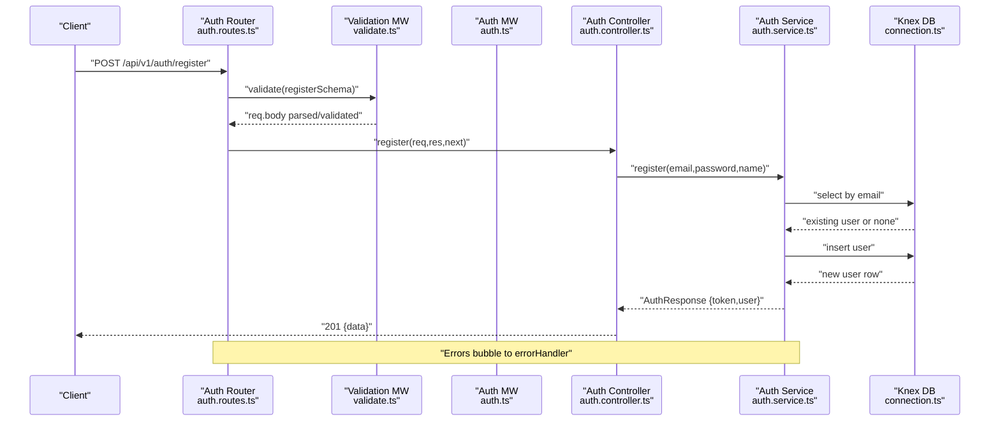
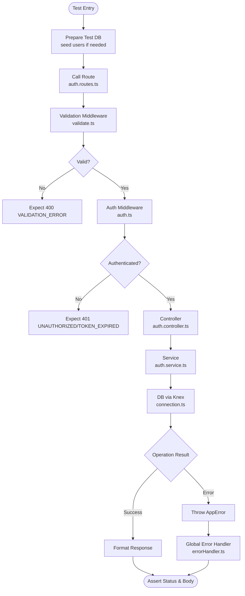
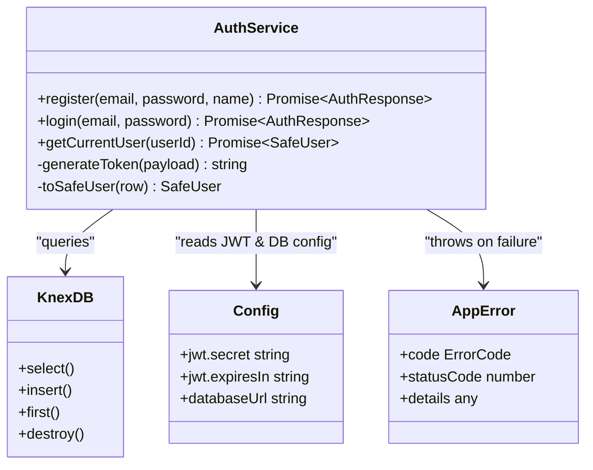
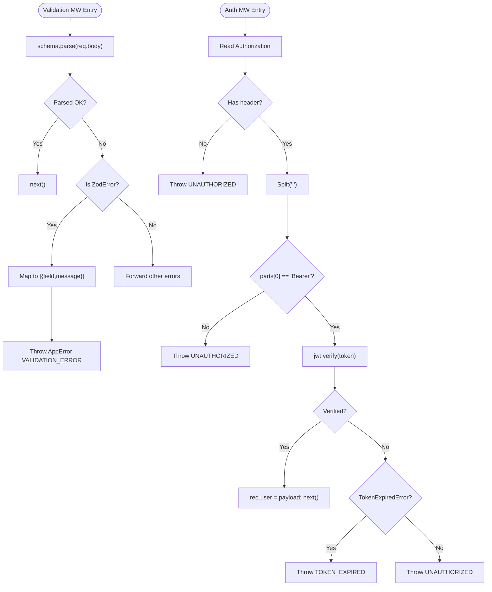
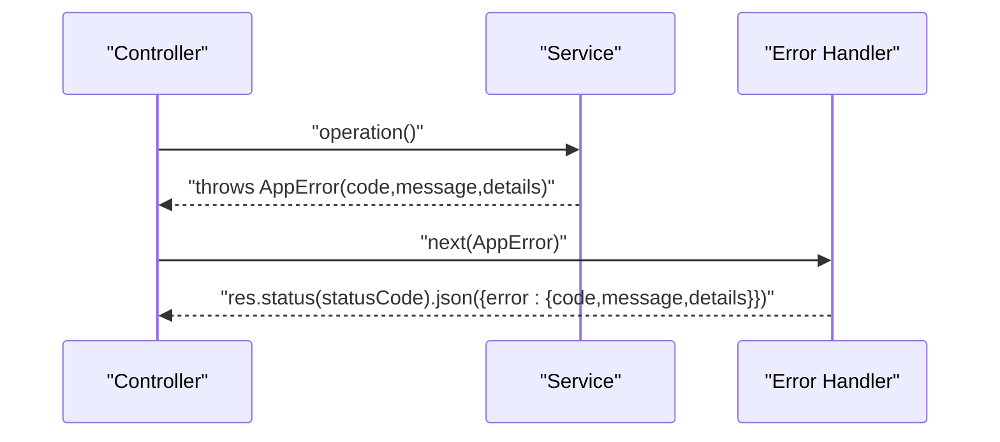
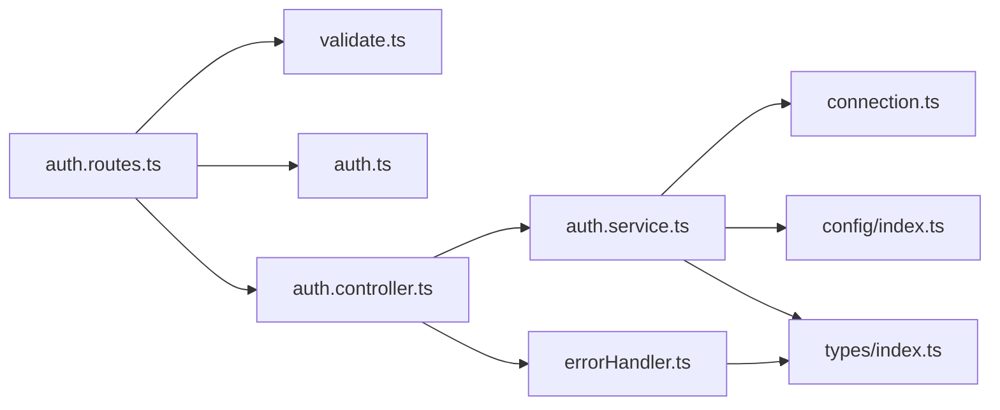

# Backend Testing

<cite>
**Referenced Files in This Document**
- [auth.controller.ts](file://code/server/src/controllers/auth.controller.ts)
- [auth.service.ts](file://code/server/src/services/auth.service.ts)
- [auth.routes.ts](file://code/server/src/routes/auth.routes.ts)
- [auth.middleware.ts](file://code/server/src/middleware/auth.ts)
- [validate.middleware.ts](file://code/server/src/middleware/validate.ts)
- [errorHandler.middleware.ts](file://code/server/src/middleware/errorHandler.ts)
- [connection.ts](file://code/server/src/db/connection.ts)
- [config.index.ts](file://code/server/src/config/index.ts)
- [types.index.ts](file://code/server/src/types/index.ts)
- [package.json](file://code/server/package.json)
- [TEST-REPORT-M1-BACKEND.md](file://test/backend/TEST-REPORT-M1-BACKEND.md)
</cite>

## Table of Contents
1. [Introduction](#introduction)
2. [Project Structure](#project-structure)
3. [Core Components](#core-components)
4. [Architecture Overview](#architecture-overview)
5. [Detailed Component Analysis](#detailed-component-analysis)
6. [Dependency Analysis](#dependency-analysis)
7. [Performance Considerations](#performance-considerations)
8. [Troubleshooting Guide](#troubleshooting-guide)
9. [Conclusion](#conclusion)
10. [Appendices](#appendices)

## Introduction
This document provides comprehensive backend testing guidance for the Yule Notion Node.js/Express application. It focuses on setting up tests with Jest, testing controllers and services, validating authentication flows, database operations, middleware, and error handling. It also covers mocking database connections, testing API routes, schema validation, testing utilities, database cleanup strategies, and environment configuration tailored to the existing architecture.

## Project Structure
The backend follows a layered architecture:
- Routes define endpoints and compose middleware.
- Controllers handle HTTP requests/responses and delegate to services.
- Services encapsulate business logic, including database operations and JWT handling.
- Middleware enforces validation and authentication.
- Database connection is managed via Knex with a shared connection instance.
- Configuration is validated and typed using Zod.

**Diagram sources**
- [auth.routes.ts:20-105](file://code/server/src/routes/auth.routes.ts#L20-L105)
- [auth.controller.ts:26-81](file://code/server/src/controllers/auth.controller.ts#L26-L81)
- [auth.service.ts:68-165](file://code/server/src/services/auth.service.ts#L68-L165)
- [validate.middleware.ts:31-71](file://code/server/src/middleware/validate.ts#L31-L71)
- [auth.middleware.ts:29-59](file://code/server/src/middleware/auth.ts#L29-L59)
- [errorHandler.middleware.ts:29-67](file://code/server/src/middleware/errorHandler.ts#L29-L67)
- [connection.ts:22-39](file://code/server/src/db/connection.ts#L22-L39)
- [config.index.ts:72-98](file://code/server/src/config/index.ts#L72-L98)
- [types.index.ts:153-168](file://code/server/src/types/index.ts#L153-L168)

**Section sources**
- [auth.routes.ts:1-106](file://code/server/src/routes/auth.routes.ts#L1-L106)
- [auth.controller.ts:1-82](file://code/server/src/controllers/auth.controller.ts#L1-L82)
- [auth.service.ts:1-166](file://code/server/src/services/auth.service.ts#L1-L166)
- [validate.middleware.ts:1-72](file://code/server/src/middleware/validate.ts#L1-L72)
- [auth.middleware.ts:1-60](file://code/server/src/middleware/auth.ts#L1-L60)
- [errorHandler.middleware.ts:1-68](file://code/server/src/middleware/errorHandler.ts#L1-L68)
- [connection.ts:1-40](file://code/server/src/db/connection.ts#L1-L40)
- [config.index.ts:1-101](file://code/server/src/config/index.ts#L1-L101)
- [types.index.ts:1-187](file://code/server/src/types/index.ts#L1-L187)

## Core Components
- Routes: Define authentication endpoints and compose validation and auth middleware.
- Controllers: Thin handlers that extract request data, call services, and format responses.
- Services: Business logic for registration, login, and fetching current user; integrates with database and JWT.
- Validation Middleware: Zod-based request body validation with structured error responses.
- Auth Middleware: JWT extraction and verification; injects user info into requests.
- Error Handler: Centralized error response formatting and logging.
- Database: Knex connection with a shared instance and graceful shutdown.
- Config: Environment variables parsed and validated with defaults and production safety checks.
- Types: Strongly typed domain models, error codes, and custom error class.

Key testing targets:
- Route composition and middleware chaining.
- Controller behavior under normal and error conditions.
- Service logic correctness and error propagation.
- Middleware validation and auth flows.
- Database integration and cleanup.
- Error handling and response formats.

**Section sources**
- [auth.routes.ts:20-105](file://code/server/src/routes/auth.routes.ts#L20-L105)
- [auth.controller.ts:26-81](file://code/server/src/controllers/auth.controller.ts#L26-L81)
- [auth.service.ts:68-165](file://code/server/src/services/auth.service.ts#L68-L165)
- [validate.middleware.ts:31-71](file://code/server/src/middleware/validate.ts#L31-L71)
- [auth.middleware.ts:29-59](file://code/server/src/middleware/auth.ts#L29-L59)
- [errorHandler.middleware.ts:29-67](file://code/server/src/middleware/errorHandler.ts#L29-L67)
- [connection.ts:22-39](file://code/server/src/db/connection.ts#L22-L39)
- [config.index.ts:72-98](file://code/server/src/config/index.ts#L72-L98)
- [types.index.ts:153-168](file://code/server/src/types/index.ts#L153-L168)

## Architecture Overview
The backend uses a clean separation of concerns:
- Routes → Validation Middleware → Auth Middleware → Controllers → Services → Database.
- Errors propagate upward to the centralized error handler.

**Diagram sources**
- [auth.routes.ts:77-81](file://code/server/src/routes/auth.routes.ts#L77-L81)
- [validate.middleware.ts:44-49](file://code/server/src/middleware/validate.ts#L44-L49)
- [auth.controller.ts:26-36](file://code/server/src/controllers/auth.controller.ts#L26-L36)
- [auth.service.ts:74-100](file://code/server/src/services/auth.service.ts#L74-L100)
- [connection.ts:22-29](file://code/server/src/db/connection.ts#L22-L29)

**Section sources**
- [auth.routes.ts:20-105](file://code/server/src/routes/auth.routes.ts#L20-L105)
- [auth.controller.ts:26-81](file://code/server/src/controllers/auth.controller.ts#L26-L81)
- [auth.service.ts:68-165](file://code/server/src/services/auth.service.ts#L68-L165)
- [connection.ts:22-39](file://code/server/src/db/connection.ts#L22-L39)

## Detailed Component Analysis

### Authentication Endpoints Testing
Focus areas:
- Registration endpoint: validate schema, handle duplicate email, encrypt password, insert user, sign JWT, return safe user.
- Login endpoint: validate schema, fetch user, compare password, sign JWT, return safe user.
- Current user endpoint: require Bearer token, decode JWT, fetch user, return safe user.

Recommended test strategies:
- Use an in-memory database or a dedicated test database with seed data.
- Mock bcrypt and JWT for deterministic tests; verify hashing rounds and token generation indirectly via service tests.
- Test both positive and negative flows for each endpoint.

**Diagram sources**
- [auth.routes.ts:77-102](file://code/server/src/routes/auth.routes.ts#L77-L102)
- [validate.middleware.ts:44-69](file://code/server/src/middleware/validate.ts#L44-L69)
- [auth.middleware.ts:29-59](file://code/server/src/middleware/auth.ts#L29-L59)
- [auth.controller.ts:26-81](file://code/server/src/controllers/auth.controller.ts#L26-L81)
- [auth.service.ts:68-165](file://code/server/src/services/auth.service.ts#L68-L165)
- [errorHandler.middleware.ts:29-67](file://code/server/src/middleware/errorHandler.ts#L29-L67)
- [connection.ts:22-39](file://code/server/src/db/connection.ts#L22-L39)

**Section sources**
- [auth.routes.ts:20-105](file://code/server/src/routes/auth.routes.ts#L20-L105)
- [auth.controller.ts:26-81](file://code/server/src/controllers/auth.controller.ts#L26-L81)
- [auth.service.ts:68-165](file://code/server/src/services/auth.service.ts#L68-L165)
- [auth.middleware.ts:29-59](file://code/server/src/middleware/auth.ts#L29-L59)
- [validate.middleware.ts:31-71](file://code/server/src/middleware/validate.ts#L31-L71)
- [errorHandler.middleware.ts:29-67](file://code/server/src/middleware/errorHandler.ts#L29-L67)
- [connection.ts:22-39](file://code/server/src/db/connection.ts#L22-L39)

### Service Layer Testing Approaches
Key aspects:
- Password hashing and comparison using bcrypt.
- JWT signing and verification.
- Database queries and transformations to safe user objects.
- Error propagation using AppError with appropriate error codes.

Testing guidelines:
- Mock Knex calls to isolate service logic.
- Verify transformed user objects exclude sensitive fields.
- Validate error codes map to expected HTTP statuses.

**Diagram sources**
- [auth.service.ts:68-165](file://code/server/src/services/auth.service.ts#L68-L165)
- [connection.ts:22-39](file://code/server/src/db/connection.ts#L22-L39)
- [config.index.ts:72-98](file://code/server/src/config/index.ts#L72-L98)
- [types.index.ts:153-168](file://code/server/src/types/index.ts#L153-L168)

**Section sources**
- [auth.service.ts:68-165](file://code/server/src/services/auth.service.ts#L68-L165)
- [connection.ts:22-39](file://code/server/src/db/connection.ts#L22-L39)
- [config.index.ts:72-98](file://code/server/src/config/index.ts#L72-L98)
- [types.index.ts:153-168](file://code/server/src/types/index.ts#L153-L168)

### Middleware Testing Strategies
- Validation middleware: ensure Zod errors are converted to AppError with VALIDATION_ERROR and 400 status.
- Auth middleware: test missing header, malformed Bearer token, invalid/expired tokens, and successful decoding.

**Diagram sources**
- [validate.middleware.ts:44-69](file://code/server/src/middleware/validate.ts#L44-L69)
- [auth.middleware.ts:29-59](file://code/server/src/middleware/auth.ts#L29-L59)

**Section sources**
- [validate.middleware.ts:31-71](file://code/server/src/middleware/validate.ts#L31-L71)
- [auth.middleware.ts:29-59](file://code/server/src/middleware/auth.ts#L29-L59)

### Database Operations and Transactions
- Shared Knex instance is used for all database operations.
- Graceful shutdown is supported via destroy().
- For testing, prefer an isolated test database per suite or transaction rollbacks if feasible.

Guidelines:
- Use beforeEach/afterEach to seed and truncate tables.
- Use transactions for isolation and rollback after each test.
- Mock Knex in unit tests to avoid real DB writes.

**Section sources**
- [connection.ts:22-39](file://code/server/src/db/connection.ts#L22-L39)

### Error Handling Scenarios
- AppError carries code, statusCode, and optional details.
- Global error handler logs and returns consistent error responses.
- Ensure tests assert correct status codes and error shapes.

**Diagram sources**
- [auth.controller.ts:33-35](file://code/server/src/controllers/auth.controller.ts#L33-L35)
- [auth.service.ts:76](file://code/server/src/services/auth.service.ts#L76)
- [errorHandler.middleware.ts:29-67](file://code/server/src/middleware/errorHandler.ts#L29-L67)

**Section sources**
- [auth.controller.ts:33-35](file://code/server/src/controllers/auth.controller.ts#L33-L35)
- [auth.service.ts:76](file://code/server/src/services/auth.service.ts#L76)
- [errorHandler.middleware.ts:29-67](file://code/server/src/middleware/errorHandler.ts#L29-L67)

### Testing Utilities and Environment Configuration
- Environment variables are validated and typed; tests should set NODE_ENV=test and provide DATABASE_URL.
- Jest setup should load environment variables before importing modules that depend on config.

Recommended setup:
- Set NODE_ENV=test and DATABASE_URL pointing to a test database.
- Use a test-specific config override if needed.
- Ensure pino logger is configured for tests (quiet or disabled) to reduce noise.

**Section sources**
- [config.index.ts:16-44](file://code/server/src/config/index.ts#L16-L44)
- [config.index.ts:72-98](file://code/server/src/config/index.ts#L72-L98)
- [package.json:7-14](file://code/server/package.json#L7-L14)

### Mocking Database Connections
Approach:
- Replace the shared Knex instance with a mock during tests.
- For unit tests, stub db('users') methods to return controlled data or throw errors.
- For integration tests, use a separate test database and seed data.

Benefits:
- Faster tests without real DB I/O.
- Deterministic outcomes for assertions.
- Isolation from external systems.

**Section sources**
- [connection.ts:22-29](file://code/server/src/db/connection.ts#L22-L29)

### Testing API Routes and Request/Response Schemas
- Use supertest or similar to send HTTP requests to mounted routes.
- Validate response status codes and bodies against expected schemas.
- For Zod validation, assert 400 responses with details array containing field-level messages.

**Section sources**
- [auth.routes.ts:77-102](file://code/server/src/routes/auth.routes.ts#L77-L102)
- [validate.middleware.ts:44-69](file://code/server/src/middleware/validate.ts#L44-L69)

### Authorization Checks and Authentication Flows
- Ensure protected routes require a valid Bearer token.
- Test missing token, wrong format, invalid signature, and expired token scenarios.
- Verify that req.user is injected and used by controllers/services.

**Section sources**
- [auth.routes.ts:98-102](file://code/server/src/routes/auth.routes.ts#L98-L102)
- [auth.middleware.ts:29-59](file://code/server/src/middleware/auth.ts#L29-L59)
- [auth.controller.ts:70-81](file://code/server/src/controllers/auth.controller.ts#L70-L81)

### Asynchronous Database Operations and Error Propagation
- Service methods are async; tests should await them.
- Errors thrown by services should propagate to controllers and be handled by the global error handler.
- Validate that AppError instances carry the correct error codes and mapped HTTP statuses.

**Section sources**
- [auth.service.ts:117-142](file://code/server/src/services/auth.service.ts#L117-L142)
- [auth.controller.ts:33-35](file://code/server/src/controllers/auth.controller.ts#L33-L35)
- [errorHandler.middleware.ts:38-54](file://code/server/src/middleware/errorHandler.ts#L38-L54)

## Dependency Analysis
The following diagram highlights key dependencies among components:

**Diagram sources**
- [auth.routes.ts:10-14](file://code/server/src/routes/auth.routes.ts#L10-L14)
- [auth.controller.ts:13-15](file://code/server/src/controllers/auth.controller.ts#L13-L15)
- [auth.service.ts:12-17](file://code/server/src/services/auth.service.ts#L12-L17)
- [connection.ts:8-9](file://code/server/src/db/connection.ts#L8-L9)
- [config.index.ts:8-9](file://code/server/src/config/index.ts#L8-L9)
- [types.index.ts:16-17](file://code/server/src/types/index.ts#L16-L17)
- [errorHandler.middleware.ts:13-16](file://code/server/src/middleware/errorHandler.ts#L13-L16)

**Section sources**
- [auth.routes.ts:10-14](file://code/server/src/routes/auth.routes.ts#L10-L14)
- [auth.controller.ts:13-15](file://code/server/src/controllers/auth.controller.ts#L13-L15)
- [auth.service.ts:12-17](file://code/server/src/services/auth.service.ts#L12-L17)
- [connection.ts:8-9](file://code/server/src/db/connection.ts#L8-L9)
- [config.index.ts:8-9](file://code/server/src/config/index.ts#L8-L9)
- [types.index.ts:16-17](file://code/server/src/types/index.ts#L16-L17)
- [errorHandler.middleware.ts:13-16](file://code/server/src/middleware/errorHandler.ts#L13-L16)

## Performance Considerations
- Prefer unit tests with mocked database calls for speed.
- Use transaction rollbacks in integration tests to avoid expensive teardown.
- Limit concurrent DB connections in test environments by configuring Knex pools conservatively.
- Avoid heavy cryptographic operations in tests; rely on mocks for bcrypt and JWT.

## Troubleshooting Guide
Common issues and resolutions:
- Unexpected 500 errors: Ensure all business errors are wrapped in AppError so the global error handler can format them consistently.
- Validation failures: Confirm Zod schemas match request bodies and that the validate middleware is applied before controllers.
- Authentication failures: Verify Authorization header format and that JWT_SECRET is properly configured in test environment.
- Database connectivity: Confirm DATABASE_URL points to a reachable test database and that Knex pool settings are appropriate.

**Section sources**
- [errorHandler.middleware.ts:29-67](file://code/server/src/middleware/errorHandler.ts#L29-L67)
- [validate.middleware.ts:31-71](file://code/server/src/middleware/validate.ts#L31-L71)
- [auth.middleware.ts:29-59](file://code/server/src/middleware/auth.ts#L29-L59)
- [config.index.ts:72-98](file://code/server/src/config/index.ts#L72-L98)

## Conclusion
The Yule Notion backend provides a solid foundation for testing with clear separation of concerns and robust error handling. By focusing on route composition, controller behavior, service logic, middleware validation and auth, and database integration, teams can build reliable and maintainable tests. Use mocking for database and crypto operations, configure a dedicated test environment, and leverage the centralized error handling to ensure consistent responses across all scenarios.

## Appendices

### Appendix A: Test Environment Setup Checklist
- Set NODE_ENV=test.
- Provide DATABASE_URL for a test database.
- Configure JWT_SECRET appropriately for tests.
- Ensure pino logger is configured for test runs.
- Use Jest with ts-jest and proper TypeScript support.

**Section sources**
- [config.index.ts:16-44](file://code/server/src/config/index.ts#L16-L44)
- [config.index.ts:72-98](file://code/server/src/config/index.ts#L72-L98)
- [package.json:7-14](file://code/server/package.json#L7-L14)

### Appendix B: Example Test Categories
- Controller tests: Assert status codes and response shape for register, login, and me endpoints.
- Service tests: Mock Knex, bcrypt, and JWT; verify transformations and error codes.
- Middleware tests: Validate Zod parsing and JWT verification behavior.
- Integration tests: Use a test database; seed data; test full request/response cycles.

[No sources needed since this section provides general guidance]