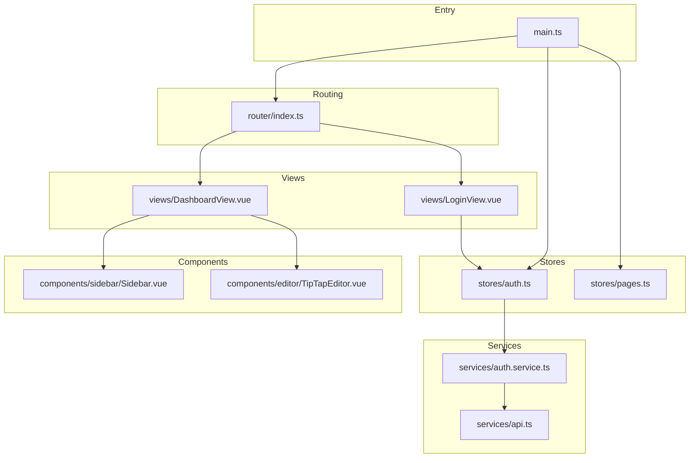
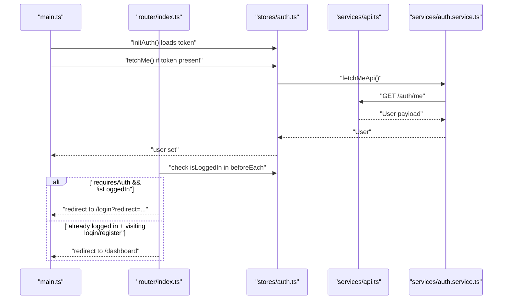
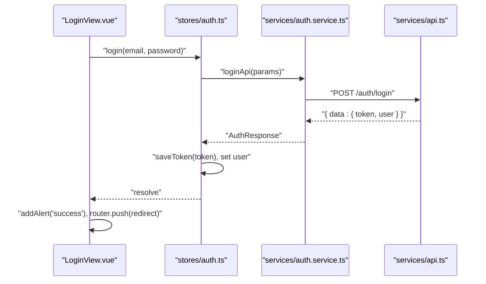
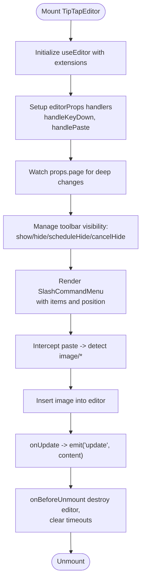
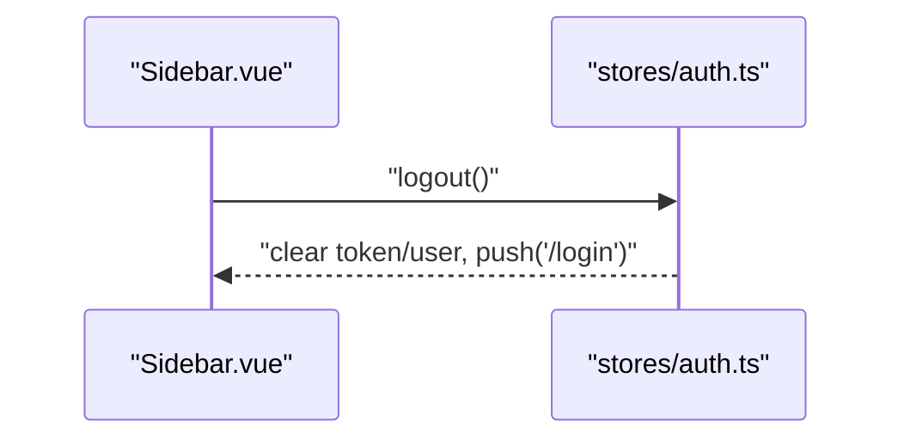
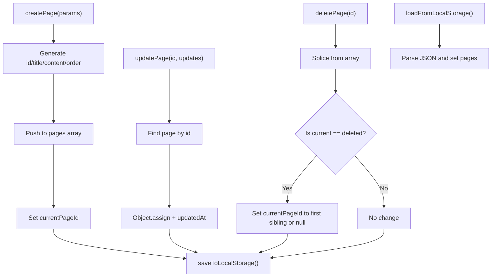
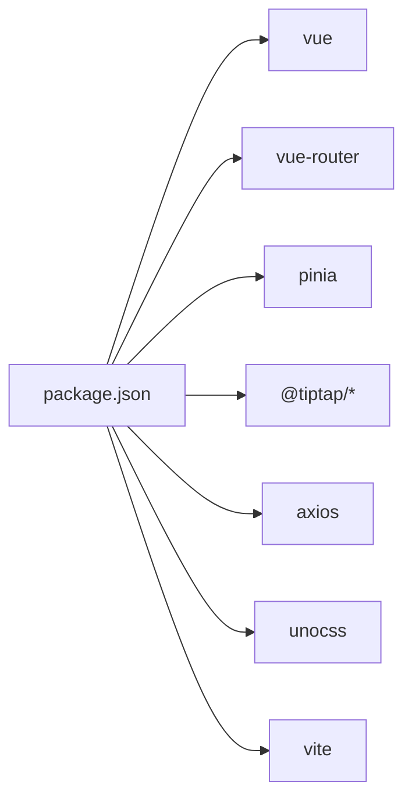

# Frontend Testing

<cite>
**Referenced Files in This Document**
- [TEST-REPORT-M1-FRONTEND.md](file://test/frontend/TEST-REPORT-M1-FRONTEND.md)
- [package.json](file://code/client/package.json)
- [vite.config.ts](file://code/client/vite.config.ts)
- [main.ts](file://code/client/src/main.ts)
- [router/index.ts](file://code/client/src/router/index.ts)
- [services/api.ts](file://code/client/src/services/api.ts)
- [services/auth.service.ts](file://code/client/src/services/auth.service.ts)
- [stores/auth.ts](file://code/client/src/stores/auth.ts)
- [stores/pages.ts](file://code/client/src/stores/pages.ts)
- [types/index.ts](file://code/client/src/types/index.ts)
- [components/editor/TipTapEditor.vue](file://code/client/src/components/editor/TipTapEditor.vue)
- [components/sidebar/Sidebar.vue](file://code/client/src/components/sidebar/Sidebar.vue)
- [views/LoginView.vue](file://code/client/src/views/LoginView.vue)
- [views/DashboardView.vue](file://code/client/src/views/DashboardView.vue)
</cite>

## Table of Contents
1. [Introduction](#introduction)
2. [Project Structure](#project-structure)
3. [Core Components](#core-components)
4. [Architecture Overview](#architecture-overview)
5. [Detailed Component Analysis](#detailed-component-analysis)
6. [Dependency Analysis](#dependency-analysis)
7. [Performance Considerations](#performance-considerations)
8. [Troubleshooting Guide](#troubleshooting-guide)
9. [Conclusion](#conclusion)
10. [Appendices](#appendices)

## Introduction
This document provides comprehensive frontend testing guidance for the Yule Notion Vue 3 application. It focuses on testing setup, component testing strategies, store testing approaches, and practical examples for TipTap editor components, sidebar navigation, authentication flows, and page management components. It also covers mocking Vue dependencies, testing reactive state changes, simulating user interactions, testing utilities and helpers, assertion patterns, lifecycle and event handling, prop validation, asynchronous operations, form validation, and error handling.

## Project Structure
The frontend is a Vue 3 + TypeScript application using Vite, UnoCSS, Pinia for state management, and Vue Router for routing. Authentication is handled via an Axios service with interceptors, and stores manage token persistence and user state. The editor is built with TipTap and integrates with several specialized components for formatting, links, images, emoji, and slash commands.

**Diagram sources**
- [main.ts:1-54](file://code/client/src/main.ts#L1-L54)
- [router/index.ts:1-93](file://code/client/src/router/index.ts#L1-L93)
- [services/api.ts:1-64](file://code/client/src/services/api.ts#L1-L64)
- [services/auth.service.ts:1-46](file://code/client/src/services/auth.service.ts#L1-L46)
- [stores/auth.ts:1-138](file://code/client/src/stores/auth.ts#L1-L138)
- [stores/pages.ts:1-165](file://code/client/src/stores/pages.ts#L1-L165)
- [views/LoginView.vue:1-287](file://code/client/src/views/LoginView.vue#L1-L287)
- [views/DashboardView.vue:1-32](file://code/client/src/views/DashboardView.vue#L1-L32)
- [components/sidebar/Sidebar.vue:1-216](file://code/client/src/components/sidebar/Sidebar.vue#L1-L216)
- [components/editor/TipTapEditor.vue:1-831](file://code/client/src/components/editor/TipTapEditor.vue#L1-L831)

**Section sources**
- [main.ts:1-54](file://code/client/src/main.ts#L1-L54)
- [router/index.ts:1-93](file://code/client/src/router/index.ts#L1-L93)
- [services/api.ts:1-64](file://code/client/src/services/api.ts#L1-L64)
- [services/auth.service.ts:1-46](file://code/client/src/services/auth.service.ts#L1-L46)
- [stores/auth.ts:1-138](file://code/client/src/stores/auth.ts#L1-L138)
- [stores/pages.ts:1-165](file://code/client/src/stores/pages.ts#L1-L165)
- [views/LoginView.vue:1-287](file://code/client/src/views/LoginView.vue#L1-L287)
- [views/DashboardView.vue:1-32](file://code/client/src/views/DashboardView.vue#L1-L32)
- [components/sidebar/Sidebar.vue:1-216](file://code/client/src/components/sidebar/Sidebar.vue#L1-L216)
- [components/editor/TipTapEditor.vue:1-831](file://code/client/src/components/editor/TipTapEditor.vue#L1-L831)

## Core Components
- Authentication service and store: Axios instance with interceptors, token persistence, login/register/fetchMe/logout flows, and router guard integration.
- Routing: Public/private routes, redirect logic, and scroll behavior.
- Editor: TipTap-based rich text editor with toolbar auto-hide, slash command menu, link/image dialogs, and table bubble menu.
- Sidebar: Navigation list, user info, and logout button.
- Views: Login, Register, Dashboard layouts, and form validation.
- Types: Strongly typed API requests/responses, errors, alerts, and pages.

Key testing areas:
- API service configuration and interceptors
- Store actions and getters, token persistence, and error handling
- Router guards and redirects
- Form validation and error messages
- Component lifecycle hooks and event handlers
- Prop validation and emitted events
- Asynchronous operations and loading states
- Mocking dependencies (Axios, localStorage, router, store)

**Section sources**
- [services/api.ts:1-64](file://code/client/src/services/api.ts#L1-L64)
- [services/auth.service.ts:1-46](file://code/client/src/services/auth.service.ts#L1-L46)
- [stores/auth.ts:1-138](file://code/client/src/stores/auth.ts#L1-L138)
- [stores/pages.ts:1-165](file://code/client/src/stores/pages.ts#L1-L165)
- [router/index.ts:1-93](file://code/client/src/router/index.ts#L1-L93)
- [views/LoginView.vue:1-287](file://code/client/src/views/LoginView.vue#L1-L287)
- [components/editor/TipTapEditor.vue:1-831](file://code/client/src/components/editor/TipTapEditor.vue#L1-L831)
- [components/sidebar/Sidebar.vue:1-216](file://code/client/src/components/sidebar/Sidebar.vue#L1-L216)
- [types/index.ts:1-101](file://code/client/src/types/index.ts#L1-L101)

## Architecture Overview
The frontend follows a layered architecture:
- Entry initializes Pinia, installs router, restores auth state, and mounts the app.
- Router defines public/private routes and global navigation guards.
- Services encapsulate HTTP requests and interceptors.
- Stores manage domain state (auth, pages) with persistence and derived state.
- Components compose views and editor features.

**Diagram sources**
- [main.ts:33-48](file://code/client/src/main.ts#L33-L48)
- [stores/auth.ts:114-122](file://code/client/src/stores/auth.ts#L114-L122)
- [services/auth.service.ts:42-45](file://code/client/src/services/auth.service.ts#L42-L45)
- [services/api.ts:48-61](file://code/client/src/services/api.ts#L48-L61)
- [router/index.ts:68-90](file://code/client/src/router/index.ts#L68-L90)

## Detailed Component Analysis

### Authentication Flow Testing
Testing objectives:
- Verify Axios instance configuration and interceptors
- Validate login/register/fetchMe/logout actions
- Confirm localStorage token persistence and clearing
- Ensure router guards redirect appropriately
- Assert error extraction and fallback messaging

Recommended strategies:
- Mock Axios instance to simulate success/failure responses
- Spy on localStorage and router.push
- Use fake timers for interceptor delays and redirects
- Test both positive and negative paths for each action

**Diagram sources**
- [views/LoginView.vue:110-133](file://code/client/src/views/LoginView.vue#L110-L133)
- [stores/auth.ts:80-84](file://code/client/src/stores/auth.ts#L80-L84)
- [services/auth.service.ts:23-26](file://code/client/src/services/auth.service.ts#L23-L26)
- [services/api.ts:30-41](file://code/client/src/services/api.ts#L30-L41)

**Section sources**
- [services/api.ts:14-61](file://code/client/src/services/api.ts#L14-L61)
- [services/auth.service.ts:18-45](file://code/client/src/services/auth.service.ts#L18-L45)
- [stores/auth.ts:26-122](file://code/client/src/stores/auth.ts#L26-L122)
- [views/LoginView.vue:74-133](file://code/client/src/views/LoginView.vue#L74-L133)
- [router/index.ts:68-90](file://code/client/src/router/index.ts#L68-L90)

### TipTap Editor Component Testing
Testing objectives:
- Toolbar visibility and auto-hide behavior
- Slash command menu rendering and selection
- Paste image handling
- Emits content updates
- Prop synchronization with page content
- Lifecycle cleanup and memory safety

Strategies:
- Stub child components (LinkDialog, ImageUpload, EmojiPicker, TableBubbleMenu, SlashCommandMenu)
- Mock editor instance and useEditor hook
- Simulate keydown, paste, focus/blur, and scroll events
- Verify emitted update events and internal state transitions
- Test watcher on props.page to sync content

**Diagram sources**
- [components/editor/TipTapEditor.vue:112-188](file://code/client/src/components/editor/TipTapEditor.vue#L112-L188)
- [components/editor/TipTapEditor.vue:190-284](file://code/client/src/components/editor/TipTapEditor.vue#L190-L284)
- [components/editor/TipTapEditor.vue:301-328](file://code/client/src/components/editor/TipTapEditor.vue#L301-L328)

**Section sources**
- [components/editor/TipTapEditor.vue:13-328](file://code/client/src/components/editor/TipTapEditor.vue#L13-L328)

### Sidebar Navigation Testing
Testing objectives:
- Render logo, brand info, and user details
- Trigger logout action via store
- Compose NewNoteButton and PageList

Strategies:
- Stub child components
- Mock auth store and assert logout invocation
- Verify template bindings for user name/email

**Diagram sources**
- [components/sidebar/Sidebar.vue:21-23](file://code/client/src/components/sidebar/Sidebar.vue#L21-L23)
- [stores/auth.ts:103-107](file://code/client/src/stores/auth.ts#L103-L107)

**Section sources**
- [components/sidebar/Sidebar.vue:11-88](file://code/client/src/components/sidebar/Sidebar.vue#L11-L88)
- [stores/auth.ts:103-107](file://code/client/src/stores/auth.ts#L103-L107)

### Page Management Store Testing
Testing objectives:
- CRUD operations on pages
- Current page selection
- Local storage persistence and recovery
- Derived getters (rootPages, children, currentPage)

Strategies:
- Mock localStorage and assert getItem/setItem calls
- Verify computed derivations with various page hierarchies
- Test ordering and parent-child relationships

**Diagram sources**
- [stores/pages.ts:73-149](file://code/client/src/stores/pages.ts#L73-L149)

**Section sources**
- [stores/pages.ts:44-165](file://code/client/src/stores/pages.ts#L44-L165)

### Form Validation and Error Handling
Testing objectives:
- LoginView validation: email format, password presence
- Error extraction from API responses and network errors
- Loading state and button disabled behavior
- Success and error alert messages

Strategies:
- Provide invalid inputs and assert error messages
- Mock authStore.login to throw with structured error
- Verify alert composition and dismissal

**Section sources**
- [views/LoginView.vue:74-133](file://code/client/src/views/LoginView.vue#L74-L133)
- [services/api.ts:48-61](file://code/client/src/services/api.ts#L48-L61)

## Dependency Analysis
External dependencies relevant to testing:
- Vue 3, Vue Router, Pinia, TipTap ecosystem, Axios
- Vite and UnoCSS for build and styling
- TypeScript strict mode for type safety

**Diagram sources**
- [package.json:11-40](file://code/client/package.json#L11-L40)

**Section sources**
- [package.json:1-53](file://code/client/package.json#L1-L53)

## Performance Considerations
- Prefer shallow mounting for heavy components (TipTap editor) and stubbing expensive children.
- Use fake timers for throttle/debounce and auto-hide delays.
- Limit DOM queries and assertions to essential nodes.
- Avoid unnecessary re-renders by batching state updates.

## Troubleshooting Guide
Common issues and resolutions:
- 401 responses trigger automatic logout and redirect. Ensure tests mock or bypass interceptors when needed.
- localStorage keys must match store constants (e.g., token key). Verify key names in tests.
- Router guards rely on dynamic imports; tests may need to initialize router and store before navigation checks.
- TipTap editor lifecycle requires cleanup; ensure unmounting destroys the editor instance.

**Section sources**
- [services/api.ts:48-61](file://code/client/src/services/api.ts#L48-L61)
- [stores/auth.ts:24](file://code/client/src/stores/auth.ts#L24)
- [router/index.ts:68-90](file://code/client/src/router/index.ts#L68-L90)
- [components/editor/TipTapEditor.vue:324-328](file://code/client/src/components/editor/TipTapEditor.vue#L324-L328)

## Conclusion
The Yule Notion frontend demonstrates robust architecture with clear separation of concerns across services, stores, routing, and components. Testing should emphasize:
- Service-level verification of interceptors and response parsing
- Store-level validation of actions, persistence, and derived state
- Component-level testing of lifecycle, events, and user interactions
- Comprehensive coverage of authentication flows, editor features, and navigation guards

## Appendices

### Testing Utilities and Helpers
- Use fake timers for delayed behaviors (auto-hide, alerts).
- Stub child components to isolate unit tests.
- Mock Axios to simulate network outcomes.
- Spy on localStorage and router to verify side effects.
- Leverage Vue’s Composition API testing patterns with reactive refs and watchers.

### Assertion Patterns
- Assert emitted events from components (e.g., editor update).
- Verify DOM changes for loading states and error messages.
- Confirm store state transitions and localStorage mutations.
- Validate router navigation and query parameters.

### Guidelines for Async Operations, Forms, and Errors
- Async: Use await for store actions and router transitions; mock promises to simulate failures.
- Forms: Drive user interactions via v-model and submit handlers; assert validation messages.
- Errors: Test error extraction from API responses and network failures; ensure fallback messages.