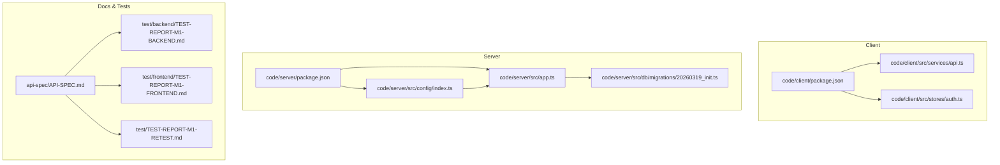
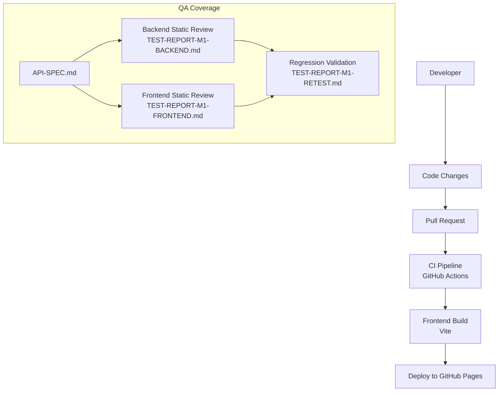
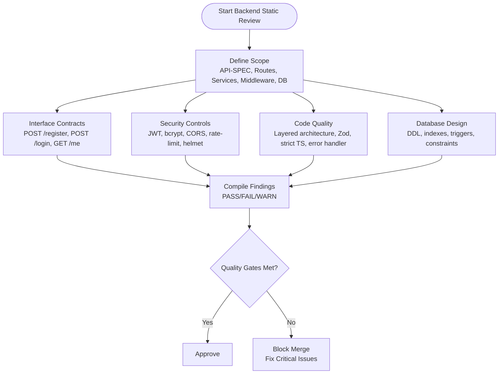
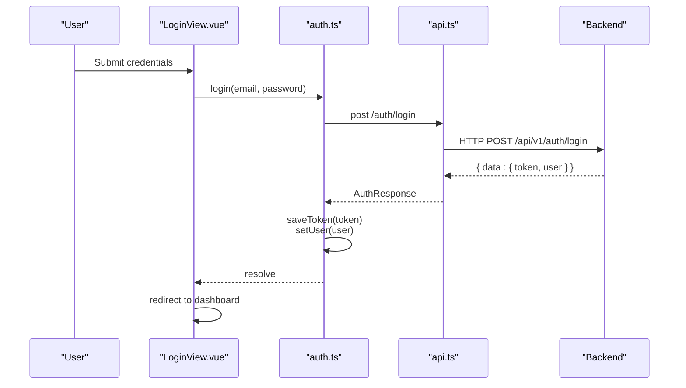
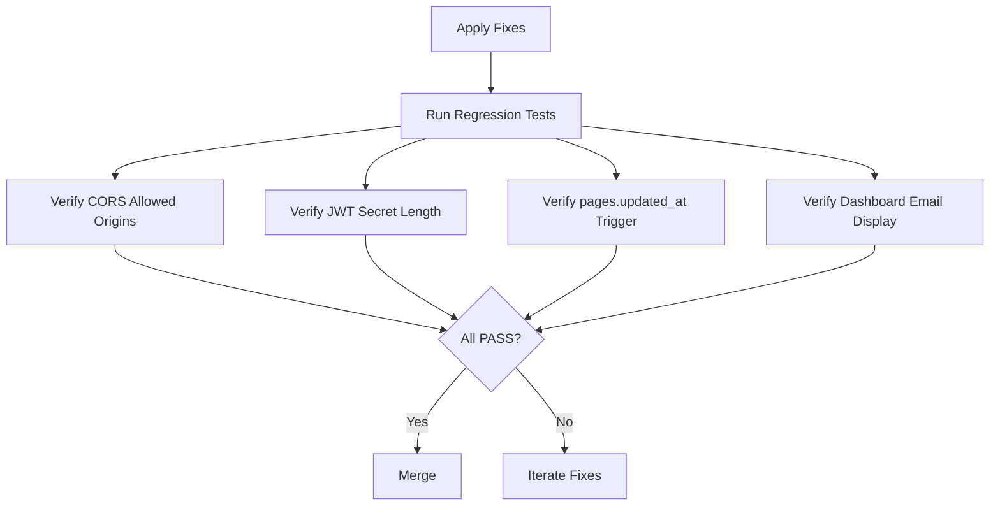
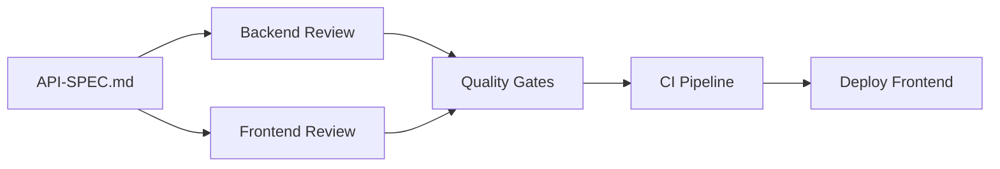

# Test Reporting & Coverage

<cite>
**Referenced Files in This Document**
- [README.md](file://README.md)
- [project-plan.md](file://plan/project-plan.md)
- [API-SPEC.md](file://api-spec/API-SPEC.md)
- [deploy-frontend.yml](file://.github/workflows/deploy-frontend.yml)
- [package.json](file://code/client/package.json)
- [package.json](file://code/server/package.json)
- [api.ts](file://code/client/src/services/api.ts)
- [auth.ts](file://code/client/src/stores/auth.ts)
- [index.ts](file://code/server/src/config/index.ts)
- [app.ts](file://code/server/src/app.ts)
- [20260319_init.ts](file://code/server/src/db/migrations/20260319_init.ts)
- [TEST-REPORT-M1-BACKEND.md](file://test/backend/TEST-REPORT-M1-BACKEND.md)
- [TEST-REPORT-M1-FRONTEND.md](file://test/frontend/TEST-REPORT-M1-FRONTEND.md)
- [TEST-REPORT-M1-RETEST.md](file://test/TEST-REPORT-M1-RETEST.md)
</cite>

## Table of Contents
1. [Introduction](#introduction)
2. [Project Structure](#project-structure)
3. [Core Components](#core-components)
4. [Architecture Overview](#architecture-overview)
5. [Detailed Component Analysis](#detailed-component-analysis)
6. [Dependency Analysis](#dependency-analysis)
7. [Performance Considerations](#performance-considerations)
8. [Troubleshooting Guide](#troubleshooting-guide)
9. [Conclusion](#conclusion)
10. [Appendices](#appendices)

## Introduction
This document describes Yule Notion’s quality assurance processes with a focus on test reporting and coverage. It explains how tests are executed, how coverage metrics are collected, and how results are reported. It also provides guidance on interpreting test outcomes, analyzing coverage reports, tracking performance over time, and establishing continuous integration testing. Finally, it outlines maintenance strategies for tests, detection of flaky tests, and optimization of the test suite, along with monitoring and regression tracking practices.

## Project Structure
The project is a full-stack application with a clear separation between client and server code, each with dedicated scripts and configurations. The test reports demonstrate static code review coverage across backend and frontend modules, validating adherence to the API specification and internal design.

**Diagram sources**
- [package.json:1-53](file://code/client/package.json#L1-L53)
- [api.ts:1-64](file://code/client/src/services/api.ts#L1-L64)
- [auth.ts:1-138](file://code/client/src/stores/auth.ts#L1-L138)
- [package.json:1-39](file://code/server/package.json#L1-L39)
- [index.ts:1-101](file://code/server/src/config/index.ts#L1-L101)
- [app.ts:1-121](file://code/server/src/app.ts#L1-L121)
- [20260319_init.ts:1-300](file://code/server/src/db/migrations/20260319_init.ts#L1-L300)
- [API-SPEC.md:1-884](file://api-spec/API-SPEC.md#L1-L884)
- [TEST-REPORT-M1-BACKEND.md:1-300](file://test/backend/TEST-REPORT-M1-BACKEND.md#L1-L300)
- [TEST-REPORT-M1-FRONTEND.md:1-722](file://test/frontend/TEST-REPORT-M1-FRONTEND.md#L1-L722)
- [TEST-REPORT-M1-RETEST.md:1-87](file://test/TEST-REPORT-M1-RETEST.md#L1-L87)

**Section sources**
- [README.md:1-119](file://README.md#L1-L119)
- [project-plan.md:1-142](file://plan/project-plan.md#L1-L142)

## Core Components
- Backend configuration and runtime security: environment validation, CORS policy, rate limiting, and logging.
- Frontend HTTP client and auth store: Axios instance, interceptors, and Pinia store for authentication state.
- Database schema and triggers: migration-driven DDL, indexes, constraints, and automatic timestamp updates.
- API specification: unified response and error formats, HTTP status codes, and error codes.

Key implementation references:
- Backend security and routing: [app.ts:67-121](file://code/server/src/app.ts#L67-L121), [index.ts:52-67](file://code/server/src/config/index.ts#L52-L67)
- Frontend HTTP client and interceptors: [api.ts:14-64](file://code/client/src/services/api.ts#L14-L64)
- Frontend auth store: [auth.ts:23-138](file://code/client/src/stores/auth.ts#L23-L138)
- Database initialization and triggers: [20260319_init.ts:17-278](file://code/server/src/db/migrations/20260319_init.ts#L17-L278)
- API specification baseline: [API-SPEC.md:10-87](file://api-spec/API-SPEC.md#L10-L87)

**Section sources**
- [app.ts:67-121](file://code/server/src/app.ts#L67-L121)
- [index.ts:52-67](file://code/server/src/config/index.ts#L52-L67)
- [api.ts:14-64](file://code/client/src/services/api.ts#L14-L64)
- [auth.ts:23-138](file://code/client/src/stores/auth.ts#L23-L138)
- [20260319_init.ts:17-278](file://code/server/src/db/migrations/20260319_init.ts#L17-L278)
- [API-SPEC.md:10-87](file://api-spec/API-SPEC.md#L10-L87)

## Architecture Overview
The QA architecture centers on static code review aligned with the API specification for both backend and frontend, plus a CI pipeline that builds and deploys the frontend.

**Diagram sources**
- [deploy-frontend.yml:1-55](file://.github/workflows/deploy-frontend.yml#L1-L55)
- [TEST-REPORT-M1-BACKEND.md:1-300](file://test/backend/TEST-REPORT-M1-BACKEND.md#L1-L300)
- [TEST-REPORT-M1-FRONTEND.md:1-722](file://test/frontend/TEST-REPORT-M1-FRONTEND.md#L1-L722)
- [TEST-REPORT-M1-RETEST.md:1-87](file://test/TEST-REPORT-M1-RETEST.md#L1-L87)
- [API-SPEC.md:1-884](file://api-spec/API-SPEC.md#L1-L884)

## Detailed Component Analysis

### Backend Authentication Module Testing
The backend static review validates API conformance, security posture, error handling, and database schema. It includes:
- Interface contract checks for registration, login, and profile retrieval.
- Security controls: JWT secret enforcement, bcrypt hashing, CORS whitelist, rate limiting, helmet, and production error handling.
- Code quality: layered architecture, AppError/ErrorCode, Zod validation, strict TypeScript, and centralized error handling.
- Database design: DDL correctness, indexes, constraints, triggers, and cascading deletes.

**Diagram sources**
- [TEST-REPORT-M1-BACKEND.md:14-178](file://test/backend/TEST-REPORT-M1-BACKEND.md#L14-L178)
- [API-SPEC.md:90-178](file://api-spec/API-SPEC.md#L90-L178)
- [index.ts:52-67](file://code/server/src/config/index.ts#L52-L67)
- [app.ts:67-121](file://code/server/src/app.ts#L67-L121)
- [20260319_init.ts:17-278](file://code/server/src/db/migrations/20260319_init.ts#L17-L278)

**Section sources**
- [TEST-REPORT-M1-BACKEND.md:14-297](file://test/backend/TEST-REPORT-M1-BACKEND.md#L14-L297)
- [API-SPEC.md:90-178](file://api-spec/API-SPEC.md#L90-L178)
- [index.ts:52-67](file://code/server/src/config/index.ts#L52-L67)
- [app.ts:67-121](file://code/server/src/app.ts#L67-L121)
- [20260319_init.ts:17-278](file://code/server/src/db/migrations/20260319_init.ts#L17-L278)

### Frontend Authentication Module Testing
The frontend static review validates:
- Axios configuration and interceptors.
- Type safety aligned with API spec.
- Authentication lifecycle: login/register/logout/fetchMe.
- Route guards and redirect logic.
- Form validation and error messaging.
- UI components and build configuration.

**Diagram sources**
- [TEST-REPORT-M1-FRONTEND.md:42-125](file://test/frontend/TEST-REPORT-M1-FRONTEND.md#L42-L125)
- [api.ts:14-64](file://code/client/src/services/api.ts#L14-L64)
- [auth.ts:80-107](file://code/client/src/stores/auth.ts#L80-L107)
- [API-SPEC.md:90-160](file://api-spec/API-SPEC.md#L90-L160)

**Section sources**
- [TEST-REPORT-M1-FRONTEND.md:40-535](file://test/frontend/TEST-REPORT-M1-FRONTEND.md#L40-L535)
- [api.ts:14-64](file://code/client/src/services/api.ts#L14-L64)
- [auth.ts:80-138](file://code/client/src/stores/auth.ts#L80-L138)
- [API-SPEC.md:90-160](file://api-spec/API-SPEC.md#L90-L160)

### Regression Validation
After fixes, regression validation confirms:
- Production CORS enforced via environment variable.
- JWT secret length validation.
- Database updated_at trigger covering all column updates.
- Frontend dashboard displays user email.

**Diagram sources**
- [TEST-REPORT-M1-RETEST.md:26-78](file://test/TEST-REPORT-M1-RETEST.md#L26-L78)
- [index.ts:52-67](file://code/server/src/config/index.ts#L52-L67)
- [20260319_init.ts:244-252](file://code/server/src/db/migrations/20260319_init.ts#L244-L252)
- [TEST-REPORT-M1-FRONTEND.md:679-690](file://test/frontend/TEST-REPORT-M1-FRONTEND.md#L679-L690)

**Section sources**
- [TEST-REPORT-M1-RETEST.md:13-87](file://test/TEST-REPORT-M1-RETEST.md#L13-L87)
- [index.ts:52-67](file://code/server/src/config/index.ts#L52-L67)
- [20260319_init.ts:244-252](file://code/server/src/db/migrations/20260319_init.ts#L244-L252)
- [TEST-REPORT-M1-FRONTEND.md:679-690](file://test/frontend/TEST-REPORT-M1-FRONTEND.md#L679-L690)

## Dependency Analysis
The QA process depends on:
- API specification as the single source of truth for contracts and error codes.
- Backend configuration enforcing production security policies.
- Frontend interceptors ensuring consistent request/response handling.
- CI pipeline building and deploying the frontend.

**Diagram sources**
- [API-SPEC.md:10-87](file://api-spec/API-SPEC.md#L10-L87)
- [TEST-REPORT-M1-BACKEND.md:14-178](file://test/backend/TEST-REPORT-M1-BACKEND.md#L14-L178)
- [TEST-REPORT-M1-FRONTEND.md:40-535](file://test/frontend/TEST-REPORT-M1-FRONTEND.md#L40-L535)
- [deploy-frontend.yml:1-55](file://.github/workflows/deploy-frontend.yml#L1-L55)

**Section sources**
- [API-SPEC.md:10-87](file://api-spec/API-SPEC.md#L10-L87)
- [deploy-frontend.yml:1-55](file://.github/workflows/deploy-frontend.yml#L1-L55)

## Performance Considerations
- Static code review is efficient and deterministic, validating design and security without runtime overhead.
- Frontend interceptors and auth store minimize redundant network calls and ensure consistent error handling.
- Database triggers and indexes support fast search and maintain timestamps consistently.

[No sources needed since this section provides general guidance]

## Troubleshooting Guide
Common issues and resolutions derived from the test reports:
- Production CORS misconfiguration: enforce ALLOWED_ORIGINS in production and avoid permissive defaults.
- JWT secret length: validate minimum length alongside default value checks.
- Database updated_at precision: ensure triggers update timestamps for all column changes, not only specific ones.
- Frontend dashboard missing user email: add email display to improve user context.

**Section sources**
- [TEST-REPORT-M1-BACKEND.md:183-245](file://test/backend/TEST-REPORT-M1-BACKEND.md#L183-L245)
- [TEST-REPORT-M1-FRONTEND.md:679-690](file://test/frontend/TEST-REPORT-M1-FRONTEND.md#L679-L690)
- [index.ts:52-67](file://code/server/src/config/index.ts#L52-L67)
- [20260319_init.ts:244-252](file://code/server/src/db/migrations/20260319_init.ts#L244-L252)

## Conclusion
Yule Notion employs a robust QA process centered on static code review against the API specification, supported by production-grade backend security and frontend interceptors. The CI pipeline automates frontend builds and deployment. The test reports provide structured pass/fail outcomes, defect categorization, and regression validation, enabling clear quality gates and continuous improvement.

[No sources needed since this section summarizes without analyzing specific files]

## Appendices

### Test Execution Workflow
- Backend: review backend modules against API-SPEC, validate security and database design, compile findings.
- Frontend: review client modules, interceptors, auth store, route guards, and UI components.
- Regression: re-test after fixes to ensure no regressions.

**Section sources**
- [TEST-REPORT-M1-BACKEND.md:14-297](file://test/backend/TEST-REPORT-M1-BACKEND.md#L14-L297)
- [TEST-REPORT-M1-FRONTEND.md:40-722](file://test/frontend/TEST-REPORT-M1-FRONTEND.md#L40-L722)
- [TEST-REPORT-M1-RETEST.md:13-87](file://test/TEST-REPORT-M1-RETEST.md#L13-L87)

### Coverage Metrics Collection
- Static code review coverage: each module and endpoint validated against API-SPEC.
- Defect classification: block, recommendation, and optimization categories.
- Regression coverage: targeted verification of fixed issues.

**Section sources**
- [TEST-REPORT-M1-BACKEND.md:258-297](file://test/backend/TEST-REPORT-M1-BACKEND.md#L258-L297)
- [TEST-REPORT-M1-FRONTEND.md:649-722](file://test/frontend/TEST-REPORT-M1-FRONTEND.md#L649-L722)
- [TEST-REPORT-M1-RETEST.md:13-87](file://test/TEST-REPORT-M1-RETEST.md#L13-L87)

### Reporting Mechanisms
- Backend report: structured findings, defect lists, and statistics.
- Frontend report: comprehensive test matrix, pass/fail counts, and suggestions.
- Regression report: fix verification checklist and pass/fail outcomes.

**Section sources**
- [TEST-REPORT-M1-BACKEND.md:181-297](file://test/backend/TEST-REPORT-M1-BACKEND.md#L181-L297)
- [TEST-REPORT-M1-FRONTEND.md:649-722](file://test/frontend/TEST-REPORT-M1-FRONTEND.md#L649-L722)
- [TEST-REPORT-M1-RETEST.md:13-87](file://test/TEST-REPORT-M1-RETEST.md#L13-L87)

### Interpreting Test Results
- PASS: requirement satisfied.
- FAIL: requirement violated; requires remediation.
- WARN: recommendation or optimization suggestion.
- Block defects: must be fixed before merge.
- Recommendation defects: should be addressed in subsequent iterations.

**Section sources**
- [TEST-REPORT-M1-BACKEND.md:258-297](file://test/backend/TEST-REPORT-M1-BACKEND.md#L258-L297)
- [TEST-REPORT-M1-FRONTEND.md:649-722](file://test/frontend/TEST-REPORT-M1-FRONTEND.md#L649-L722)

### Continuous Integration Testing Pipeline
- Frontend build and deploy: Vite build triggered by GitHub Actions on push to main/master.
- CI tasks: checkout, setup Node.js, install dependencies, build, configure GitHub Pages, upload artifact, and deploy.

**Section sources**
- [deploy-frontend.yml:1-55](file://.github/workflows/deploy-frontend.yml#L1-L55)
- [package.json:6-10](file://code/client/package.json#L6-L10)

### Automated Test Execution
- Current pipeline focuses on frontend build and deployment.
- Recommendations: integrate unit/e2e tests and coverage collection in future iterations.

[No sources needed since this section provides general guidance]

### Failure Reporting
- Centralized error handling in backend ensures consistent error responses.
- Frontend interceptors handle 401 globally, clearing auth and redirecting to login.

**Section sources**
- [app.ts:119-121](file://code/server/src/app.ts#L119-L121)
- [api.ts:48-61](file://code/client/src/services/api.ts#L48-L61)

### Test Maintenance Strategies
- Flaky test detection: monitor CI logs for intermittent failures; isolate network-dependent tests.
- Test suite optimization: prioritize critical paths (auth, search, CRUD), reduce cross-module coupling, and cache environment setup.
- Test hygiene: keep fixtures minimal, assert only essential behavior, and refactor frequently failing tests.

[No sources needed since this section provides general guidance]

### Monitoring and Regression Tracking
- Track defect trends over milestones; maintain a central registry of open issues.
- Use regression reports to validate hotfixes and prevent reintroduction of known bugs.
- Establish quality gates: block merges with unresolved block defects.

**Section sources**
- [TEST-REPORT-M1-RETEST.md:71-87](file://test/TEST-REPORT-M1-RETEST.md#L71-L87)