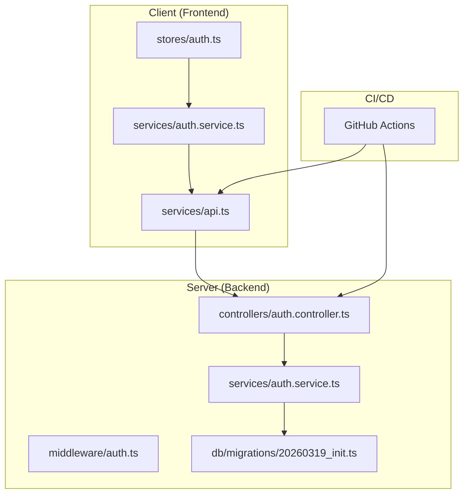
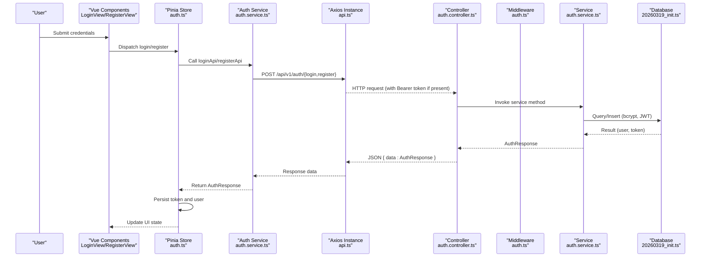
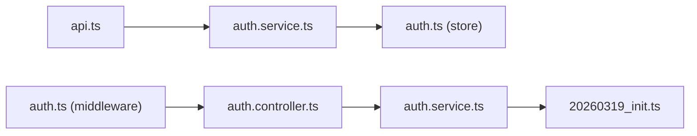

# Testing Strategy

<cite>
**Referenced Files in This Document**
- [README.md](file://README.md)
- [project-plan.md](file://plan/project-plan.md)
- [TEST-REPORT-M1-FRONTEND.md](file://test/frontend/TEST-REPORT-M1-FRONTEND.md)
- [TEST-REPORT-M1-BACKEND.md](file://test/backend/TEST-REPORT-M1-BACKEND.md)
- [TEST-REPORT-M1-RETEST.md](file://test/TEST-REPORT-M1-RETEST.md)
- [api.ts](file://code/client/src/services/api.ts)
- [auth.service.ts](file://code/client/src/services/auth.service.ts)
- [auth.ts](file://code/client/src/stores/auth.ts)
- [auth.controller.ts](file://code/server/src/controllers/auth.controller.ts)
- [auth.service.ts](file://code/server/src/services/auth.service.ts)
- [auth.ts](file://code/server/src/middleware/auth.ts)
- [20260319_init.ts](file://code/server/src/db/migrations/20260319_init.ts)
- [knexfile.ts](file://code/server/knexfile.ts)
- [package.json](file://code/client/package.json)
- [package.json](file://code/server/package.json)
</cite>

## Table of Contents
1. [Introduction](#introduction)
2. [Project Structure](#project-structure)
3. [Core Components](#core-components)
4. [Architecture Overview](#architecture-overview)
5. [Detailed Component Analysis](#detailed-component-analysis)
6. [Dependency Analysis](#dependency-analysis)
7. [Performance Considerations](#performance-considerations)
8. [Troubleshooting Guide](#troubleshooting-guide)
9. [Conclusion](#conclusion)
10. [Appendices](#appendices)

## Introduction
This document defines Yule Notion’s comprehensive testing strategy for quality assurance across unit, integration, and end-to-end testing. It consolidates the current testing practices evidenced by the M1 test reports and outlines how to evolve the suite as the codebase grows. The strategy emphasizes:
- A layered testing pyramid: unit tests for services and stores, integration tests for API endpoints and middleware, and end-to-end tests for user flows.
- Frontend testing with Vue Test Utils and backend testing with Jest-style patterns via the existing Express + TypeScript stack.
- Database testing via Knex migrations and test environments.
- Reporting and CI/CD integration aligned with the project’s GitHub Actions pipeline.

## Project Structure
The repository organizes code and tests by layer and domain:
- Frontend (Vue 3 + TypeScript): services, stores, router, and components under code/client/src.
- Backend (Express + TypeScript): controllers, services, middleware, routes, and database migrations under code/server/src.
- Tests: static code review reports under test/ for M1 coverage.
- CI/CD: GitHub Actions workflow configured for continuous integration and deployment.

**Diagram sources**
- [api.ts:1-64](file://code/client/src/services/api.ts#L1-L64)
- [auth.service.ts:1-46](file://code/client/src/services/auth.service.ts#L1-L46)
- [auth.ts:1-138](file://code/client/src/stores/auth.ts#L1-L138)
- [auth.controller.ts:1-82](file://code/server/src/controllers/auth.controller.ts#L1-L82)
- [auth.service.ts:1-166](file://code/server/src/services/auth.service.ts#L1-L166)
- [auth.ts:1-60](file://code/server/src/middleware/auth.ts#L1-L60)
- [20260319_init.ts:1-300](file://code/server/src/db/migrations/20260319_init.ts#L1-L300)

**Section sources**
- [README.md:23-41](file://README.md#L23-L41)
- [project-plan.md:86-94](file://project-plan.md#L86-L94)

## Core Components
This section summarizes the testing-relevant components validated by M1 reports and how they fit into the testing pyramid.

- Frontend API layer and services:
  - Axios instance with base URL, timeout, headers, interceptors for token injection and 401 handling.
  - Authentication service functions wrapping API endpoints for login, register, and fetchMe.
  - Pinia store managing token persistence, login/logout, and recovery of session state.

- Backend authentication flow:
  - Controllers handle HTTP requests and delegate to services.
  - Services implement business logic: registration, login, token generation, and user retrieval.
  - Middleware enforces Bearer token authentication and decodes JWT payloads.
  - Database schema and triggers support full-text search and automatic timestamps.

- Database testing:
  - Knex migration file defines all tables, indexes, constraints, and triggers.
  - Knex configuration supports separate test database connections.

**Section sources**
- [TEST-REPORT-M1-FRONTEND.md:42-125](file://test/frontend/TEST-REPORT-M1-FRONTEND.md#L42-L125)
- [TEST-REPORT-M1-BACKEND.md:55-113](file://test/backend/TEST-REPORT-M1-BACKEND.md#L55-L113)
- [api.ts:14-64](file://code/client/src/services/api.ts#L14-L64)
- [auth.service.ts:23-45](file://code/client/src/services/auth.service.ts#L23-L45)
- [auth.ts:26-138](file://code/client/src/stores/auth.ts#L26-L138)
- [auth.controller.ts:26-81](file://code/server/src/controllers/auth.controller.ts#L26-L81)
- [auth.service.ts:68-166](file://code/server/src/services/auth.service.ts#L68-L166)
- [auth.ts:29-59](file://code/server/src/middleware/auth.ts#L29-L59)
- [20260319_init.ts:17-278](file://code/server/src/db/migrations/20260319_init.ts#L17-L278)
- [knexfile.ts:13-68](file://code/server/knexfile.ts#L13-L68)

## Architecture Overview
The authentication flow spans frontend and backend components. The sequence below reflects the tested behavior validated by M1 reports.

**Diagram sources**
- [auth.ts:80-97](file://code/client/src/stores/auth.ts#L80-L97)
- [auth.service.ts:23-45](file://code/client/src/services/auth.service.ts#L23-L45)
- [api.ts:30-61](file://code/client/src/services/api.ts#L30-L61)
- [auth.controller.ts:26-81](file://code/server/src/controllers/auth.controller.ts#L26-L81)
- [auth.service.ts:68-166](file://code/server/src/services/auth.service.ts#L68-L166)
- [auth.ts:29-59](file://code/server/src/middleware/auth.ts#L29-L59)
- [20260319_init.ts:17-38](file://code/server/src/db/migrations/20260319_init.ts#L17-L38)

## Detailed Component Analysis

### Frontend Testing Setup
- Axios instance configuration and interceptors:
  - baseURL, timeout, headers, automatic Bearer token injection, and 401 handling are validated.
- Authentication service functions:
  - loginApi, registerApi, fetchMeApi unwrap nested response data consistently.
- Pinia store:
  - Token persistence, login/register actions, logout, and fetchMe recovery flow are covered.

Recommended testing approach:
- Unit tests for services and stores using Vue Test Utils and mocking Axios.
- Component tests for LoginView and RegisterView validating form submission, validation, and navigation.
- Router guard tests verifying redirect logic for authenticated/unauthenticated routes.

**Section sources**
- [TEST-REPORT-M1-FRONTEND.md:42-125](file://test/frontend/TEST-REPORT-M1-FRONTEND.md#L42-L125)
- [TEST-REPORT-M1-FRONTEND.md:338-487](file://test/frontend/TEST-REPORT-M1-FRONTEND.md#L338-L487)
- [TEST-REPORT-M1-FRONTEND.md:490-534](file://test/frontend/TEST-REPORT-M1-FRONTEND.md#L490-L534)
- [api.ts:14-64](file://code/client/src/services/api.ts#L14-L64)
- [auth.service.ts:23-45](file://code/client/src/services/auth.service.ts#L23-L45)
- [auth.ts:26-138](file://code/client/src/stores/auth.ts#L26-L138)

### Backend Testing with Express and Services
- Controllers:
  - Validate request bodies and delegate to services; return structured JSON responses.
- Services:
  - Implement business logic with database access, password hashing, JWT signing, and safe user projection.
- Middleware:
  - Enforce Bearer token authentication and decode JWT payloads.
- Database:
  - Migration script defines schema, indexes, constraints, and triggers for full-text search and updated_at automation.

Recommended testing approach:
- Unit tests for services using an in-memory test database via Knex.
- Integration tests for controllers and middleware validating HTTP responses and error handling.
- End-to-end tests for authentication flows using a real browser and test database.

**Section sources**
- [TEST-REPORT-M1-BACKEND.md:55-113](file://test/backend/TEST-REPORT-M1-BACKEND.md#L55-L113)
- [auth.controller.ts:26-81](file://code/server/src/controllers/auth.controller.ts#L26-L81)
- [auth.service.ts:68-166](file://code/server/src/services/auth.service.ts#L68-L166)
- [auth.ts:29-59](file://code/server/src/middleware/auth.ts#L29-L59)
- [20260319_init.ts:17-278](file://code/server/src/db/migrations/20260319_init.ts#L17-L278)

### Database Testing Strategies
- Knex migration and configuration:
  - Separate test database connection enables isolated test runs.
- Migration coverage:
  - All tables, indexes, constraints, and triggers are defined in the migration file.
- Test data management:
  - Use Knex seeds or lightweight fixtures per test suite to bootstrap deterministic data.

**Section sources**
- [knexfile.ts:13-68](file://code/server/knexfile.ts#L13-L68)
- [20260319_init.ts:17-278](file://code/server/src/db/migrations/20260319_init.ts#L17-L278)

### Authentication Flow Testing Examples
- Frontend:
  - Verify loginApi/registerApi unwrap response correctly and persist tokens.
  - Validate route guards redirect unauthenticated users to login and authenticated users away from login/register.
- Backend:
  - Controller tests assert HTTP status codes and response shape for register/login/me.
  - Middleware tests assert 401 for missing/invalid/expired tokens.
- Database:
  - Service tests assert bcrypt hashing, JWT generation, and safe user projection.

**Section sources**
- [TEST-REPORT-M1-FRONTEND.md:74-125](file://test/frontend/TEST-REPORT-M1-FRONTEND.md#L74-L125)
- [TEST-REPORT-M1-BACKEND.md:55-113](file://test/backend/TEST-REPORT-M1-BACKEND.md#L55-L113)
- [auth.ts:29-59](file://code/server/src/middleware/auth.ts#L29-L59)

### API Endpoint Testing Patterns
- Registration endpoint:
  - Validate request body validation, duplicate email handling, and successful response structure.
- Login endpoint:
  - Validate credential checks, consistent error messages, and token issuance.
- Me endpoint:
  - Validate Bearer token requirement and safe user retrieval.

**Section sources**
- [TEST-REPORT-M1-BACKEND.md:55-113](file://test/backend/TEST-REPORT-M1-BACKEND.md#L55-L113)
- [auth.controller.ts:26-81](file://code/server/src/controllers/auth.controller.ts#L26-L81)

### Component Interaction Testing
- Pinia store integration:
  - Mock auth service functions and assert state transitions and persistence.
- Axios interceptors:
  - Mock localStorage and network responses to validate token injection and 401 handling.

**Section sources**
- [auth.ts:26-138](file://code/client/src/stores/auth.ts#L26-L138)
- [api.ts:30-61](file://code/client/src/services/api.ts#L30-L61)

### Test Reporting and Coverage
- Static code review reports:
  - M1 frontend and backend reports validate configuration, type safety, routing, and security controls.
- Retest verification:
  - All identified defects were fixed and revalidated.

Recommendations:
- Introduce unit test coverage reporting (e.g., Istanbul/Vitest) and integration test coverage for API endpoints.
- Add E2E test coverage for critical user journeys (login, register, dashboard access).
- Track coverage trends and maintain a minimum threshold for new contributions.

**Section sources**
- [TEST-REPORT-M1-FRONTEND.md:649-674](file://test/frontend/TEST-REPORT-M1-FRONTEND.md#L649-L674)
- [TEST-REPORT-M1-BACKEND.md:258-268](file://test/backend/TEST-REPORT-M1-BACKEND.md#L258-L268)
- [TEST-REPORT-M1-RETEST.md:26-68](file://test/TEST-REPORT-M1-RETEST.md#L26-L68)

### Continuous Integration Testing
- CI/CD pipeline:
  - GitHub Actions configured for continuous integration and deployment.
- Test alignment:
  - Ensure CI runs unit, integration, and E2E tests against the same database configuration used locally.

**Section sources**
- [README.md:100-109](file://README.md#L100-L109)

## Dependency Analysis
The following diagram maps key testing dependencies across frontend and backend components.

**Diagram sources**
- [api.ts:1-64](file://code/client/src/services/api.ts#L1-L64)
- [auth.service.ts:1-46](file://code/client/src/services/auth.service.ts#L1-L46)
- [auth.ts:1-138](file://code/client/src/stores/auth.ts#L1-L138)
- [auth.controller.ts:1-82](file://code/server/src/controllers/auth.controller.ts#L1-L82)
- [auth.service.ts:1-166](file://code/server/src/services/auth.service.ts#L1-L166)
- [auth.ts:1-60](file://code/server/src/middleware/auth.ts#L1-L60)
- [20260319_init.ts:1-300](file://code/server/src/db/migrations/20260319_init.ts#L1-L300)

**Section sources**
- [api.ts:14-64](file://code/client/src/services/api.ts#L14-L64)
- [auth.service.ts:23-45](file://code/client/src/services/auth.service.ts#L23-L45)
- [auth.ts:26-138](file://code/client/src/stores/auth.ts#L26-L138)
- [auth.controller.ts:26-81](file://code/server/src/controllers/auth.controller.ts#L26-L81)
- [auth.service.ts:68-166](file://code/server/src/services/auth.service.ts#L68-L166)
- [auth.ts:29-59](file://code/server/src/middleware/auth.ts#L29-L59)
- [20260319_init.ts:17-278](file://code/server/src/db/migrations/20260319_init.ts#L17-L278)

## Performance Considerations
- Frontend:
  - Keep API calls minimal during login/register; batch UI updates after state changes.
- Backend:
  - Use prepared statements and indexes for authentication queries; avoid N+1 queries in related endpoints.
- Database:
  - Full-text search indexing and GIN indexes improve query performance; monitor trigger overhead on write-heavy workloads.

## Troubleshooting Guide
Common issues and resolutions derived from M1 reports and fixes:
- CORS production white-list:
  - Ensure ALLOWED_ORIGINS is enforced in production; otherwise, fallback to development behavior.
- JWT secret strength:
  - Enforce minimum length for JWT_SECRET in production to prevent weak keys.
- Database triggers:
  - Ensure updated_at is updated for all column changes, not only title/content.

Remediation steps verified in retest:
- CORS fix: production now validates ALLOWED_ORIGINS and rejects unspecified origins.
- JWT fix: added length check alongside default-value check.
- Database fix: added standalone trigger to update updated_at for all column updates.

**Section sources**
- [TEST-REPORT-M1-BACKEND.md:183-245](file://test/backend/TEST-REPORT-M1-BACKEND.md#L183-L245)
- [TEST-REPORT-M1-RETEST.md:28-68](file://test/TEST-REPORT-M1-RETEST.md#L28-L68)

## Conclusion
Yule Notion’s M1 testing demonstrates a strong foundation with static code review validating frontend and backend components, robust authentication flows, and professional database design. The testing strategy should evolve toward formal unit, integration, and E2E tests with automated coverage reporting and CI enforcement. The retested fixes confirm the feasibility of iterative improvements while maintaining stability.

## Appendices

### Testing Pyramid Guidance
- Unit tests:
  - Frontend: services and stores; Backend: services and middleware.
- Integration tests:
  - Controllers and routes; database operations via Knex.
- End-to-end tests:
  - Browser-based flows covering login, registration, and protected routes.

### Best Practices
- Mock external systems (Axios, database) to isolate units.
- Use deterministic test data and seed strategies.
- Prefer property-based and boundary-case testing for validation logic.
- Maintain readable test names and focused assertions aligned with API-SPEC.

### Mock Strategies
- Frontend:
  - Mock Axios interceptors and localStorage for token scenarios.
- Backend:
  - Mock database calls and JWT verification to test error branches.

### Test Data Management
- Use Knex seeds or lightweight fixtures per test suite.
- Reset schema between tests using migration rollback and re-run.