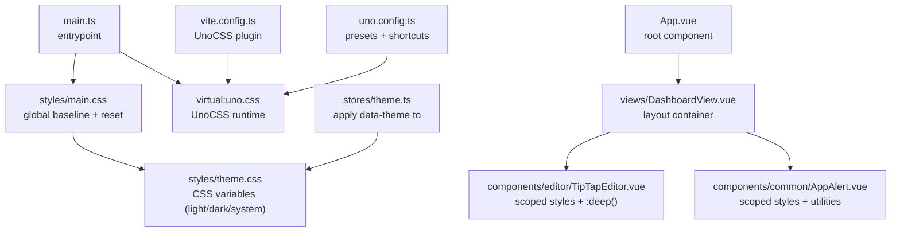
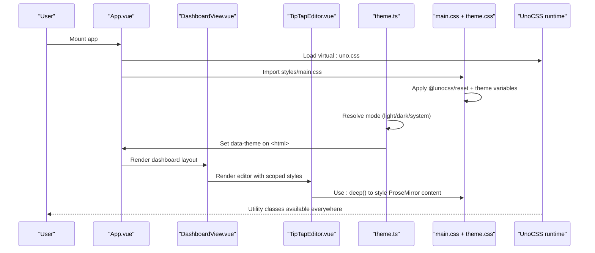
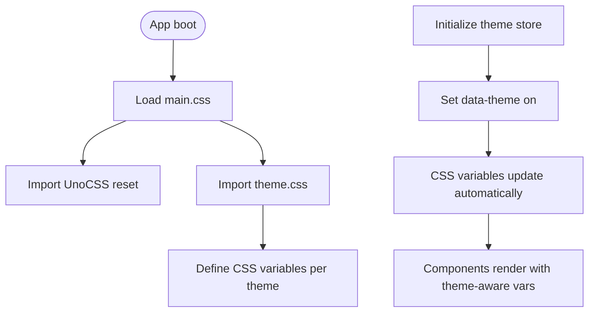
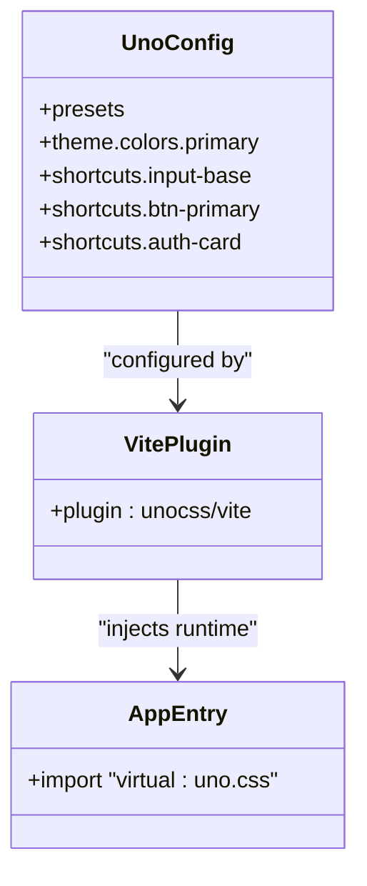
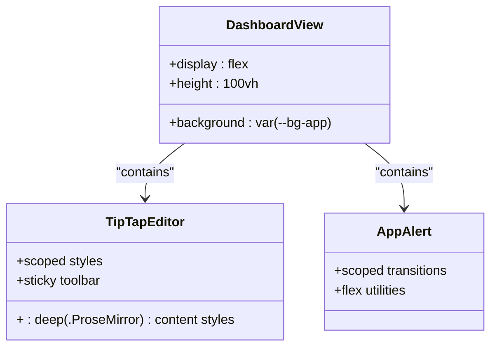
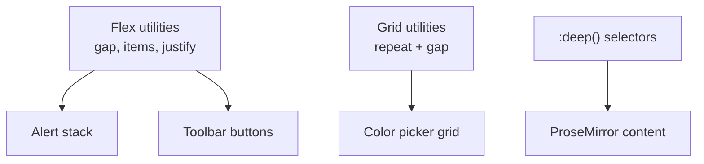
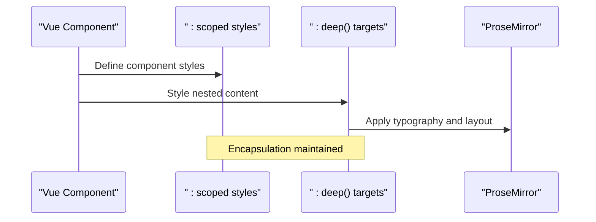
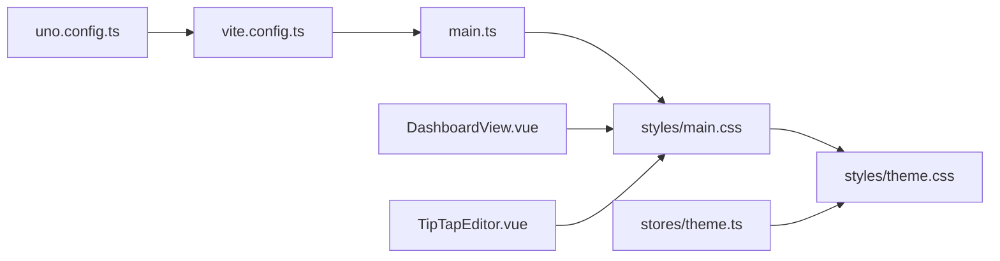

# CSS Architecture & Organization

<cite>
**Referenced Files in This Document**
- [main.css](file://code/client/src/styles/main.css)
- [theme.css](file://code/client/src/styles/theme.css)
- [uno.config.ts](file://code/client/uno.config.ts)
- [vite.config.ts](file://code/client/vite.config.ts)
- [main.ts](file://code/client/src/main.ts)
- [App.vue](file://code/client/src/App.vue)
- [DashboardView.vue](file://code/client/src/views/DashboardView.vue)
- [TipTapEditor.vue](file://code/client/src/components/editor/TipTapEditor.vue)
- [AppAlert.vue](file://code/client/src/components/common/AppAlert.vue)
- [ColorPicker.vue](file://code/client/src/components/editor/ColorPicker.vue)
- [theme.ts](file://code/client/src/stores/theme.ts)
- [package.json](file://code/client/package.json)
</cite>

## Table of Contents
1. [Introduction](#introduction)
2. [Project Structure](#project-structure)
3. [Core Components](#core-components)
4. [Architecture Overview](#architecture-overview)
5. [Detailed Component Analysis](#detailed-component-analysis)
6. [Dependency Analysis](#dependency-analysis)
7. [Performance Considerations](#performance-considerations)
8. [Troubleshooting Guide](#troubleshooting-guide)
9. [Conclusion](#conclusion)

## Introduction
This document explains the CSS architecture and file organization of the client application. It covers the global styles structure, component-scoped styling patterns, CSS custom property usage, CSS-in-JS integration via UnoCSS, utility-first class naming conventions, and style encapsulation strategies. It also documents responsive design approaches, layout systems, and provides guidelines for maintainable CSS, avoiding specificity conflicts, consistent styling, optimization techniques, and development workflow integration.

## Project Structure
The CSS architecture centers around three pillars:
- Global baseline and reset via UnoCSS reset and local theme variables
- Component-scoped styles with utility-first classes
- Dynamic theme switching through CSS custom properties applied to the document element

**Diagram sources**
- [main.ts:18-21](file://code/client/src/main.ts#L18-L21)
- [main.css:8-12](file://code/client/src/styles/main.css#L8-L12)
- [theme.css:9-145](file://code/client/src/styles/theme.css#L9-L145)
- [App.vue:16-19](file://code/client/src/App.vue#L16-L19)
- [DashboardView.vue:25-31](file://code/client/src/views/DashboardView.vue#L25-L31)
- [TipTapEditor.vue:503-800](file://code/client/src/components/editor/TipTapEditor.vue#L503-L800)
- [AppAlert.vue:74-116](file://code/client/src/components/common/AppAlert.vue#L74-L116)
- [theme.ts:42-45](file://code/client/src/stores/theme.ts#L42-L45)
- [vite.config.ts:12-16](file://code/client/vite.config.ts#L12-L16)
- [uno.config.ts:12-51](file://code/client/uno.config.ts#L12-L51)

**Section sources**
- [main.ts:18-21](file://code/client/src/main.ts#L18-L21)
- [main.css:8-12](file://code/client/src/styles/main.css#L8-L12)
- [theme.css:9-145](file://code/client/src/styles/theme.css#L9-L145)
- [vite.config.ts:12-16](file://code/client/vite.config.ts#L12-L16)
- [uno.config.ts:12-51](file://code/client/uno.config.ts#L12-L51)

## Core Components
- Global baseline and reset: UnoCSS Tailwind-compatible reset is imported globally to normalize base styles.
- Theme system: CSS custom properties define light/dark variants and are toggled by setting data-theme on the root element.
- UnoCSS integration: Presets and shortcuts provide utility-first classes and reusable composition patterns.
- Scoped component styles: Vue Single File Components use scoped styles with targeted :deep selectors for content-editable areas.

Key implementation references:
- Global reset and theme import: [main.css:8-12](file://code/client/src/styles/main.css#L8-L12)
- Theme variables (light/dark): [theme.css:9-145](file://code/client/src/styles/theme.css#L9-L145)
- UnoCSS presets and shortcuts: [uno.config.ts:12-51](file://code/client/uno.config.ts#L12-L51)
- Scoped styles with :deep for ProseMirror: [TipTapEditor.vue:503-800](file://code/client/src/components/editor/TipTapEditor.vue#L503-L800)
- Layout container using CSS variables: [DashboardView.vue:25-31](file://code/client/src/views/DashboardView.vue#L25-L31)

**Section sources**
- [main.css:8-12](file://code/client/src/styles/main.css#L8-L12)
- [theme.css:9-145](file://code/client/src/styles/theme.css#L9-L145)
- [uno.config.ts:12-51](file://code/client/uno.config.ts#L12-L51)
- [TipTapEditor.vue:503-800](file://code/client/src/components/editor/TipTapEditor.vue#L503-L800)
- [DashboardView.vue:25-31](file://code/client/src/views/DashboardView.vue#L25-L31)

## Architecture Overview
The CSS pipeline integrates three layers:
- Global baseline: UnoCSS reset and theme variables
- Component layer: scoped styles plus utility classes
- Content layer: :deep selectors for third-party content-editable regions

**Diagram sources**
- [main.ts:18-21](file://code/client/src/main.ts#L18-L21)
- [main.css:8-12](file://code/client/src/styles/main.css#L8-L12)
- [theme.ts:42-45](file://code/client/src/stores/theme.ts#L42-L45)
- [DashboardView.vue:25-31](file://code/client/src/views/DashboardView.vue#L25-L31)
- [TipTapEditor.vue:503-800](file://code/client/src/components/editor/TipTapEditor.vue#L503-L800)

## Detailed Component Analysis

### Global Styles and Theme System
- Reset and baseline: The global stylesheet imports UnoCSS reset and theme variables, ensuring consistent typography, selection, and scrollbar styles across themes.
- Theme variables: Two major blocks define CSS variables for light and dark modes, keyed by [data-theme="light"/"dark"] on the root element.
- Dynamic theme application: The theme store sets data-theme on the document element, triggering automatic variable updates.

**Diagram sources**
- [main.css:8-12](file://code/client/src/styles/main.css#L8-L12)
- [theme.css:9-145](file://code/client/src/styles/theme.css#L9-L145)
- [theme.ts:42-45](file://code/client/src/stores/theme.ts#L42-L45)

**Section sources**
- [main.css:8-12](file://code/client/src/styles/main.css#L8-L12)
- [theme.css:9-145](file://code/client/src/styles/theme.css#L9-L145)
- [theme.ts:42-45](file://code/client/src/stores/theme.ts#L42-L45)

### UnoCSS Integration and Utility-First Classes
- Presets: Tailwind-compatible preset and icons preset enable utility-first classes and icon utilities.
- Shortcuts: Reusable class compositions (e.g., input-base, btn-primary, auth-card) reduce duplication and enforce consistency.
- Runtime: The virtual module virtual:uno.css is imported at the app entry to activate UnoCSS during development and build.

**Diagram sources**
- [uno.config.ts:12-51](file://code/client/uno.config.ts#L12-L51)
- [vite.config.ts:12-16](file://code/client/vite.config.ts#L12-L16)
- [main.ts:18-19](file://code/client/src/main.ts#L18-L19)

**Section sources**
- [uno.config.ts:12-51](file://code/client/uno.config.ts#L12-L51)
- [vite.config.ts:12-16](file://code/client/vite.config.ts#L12-L16)
- [main.ts:18-19](file://code/client/src/main.ts#L18-L19)

### Component-Scoped Styling Patterns
- Dashboard layout: Uses a flex container with height: 100vh and CSS variables for background.
- Editor toolbar and content: Scoped styles with :deep() to style TipTap/ProseMirror content while keeping component boundaries intact.
- Alerts: Scoped animations and utility classes for layout and spacing.

**Diagram sources**
- [DashboardView.vue:25-31](file://code/client/src/views/DashboardView.vue#L25-L31)
- [TipTapEditor.vue:503-800](file://code/client/src/components/editor/TipTapEditor.vue#L503-L800)
- [AppAlert.vue:74-116](file://code/client/src/components/common/AppAlert.vue#L74-L116)

**Section sources**
- [DashboardView.vue:25-31](file://code/client/src/views/DashboardView.vue#L25-L31)
- [TipTapEditor.vue:503-800](file://code/client/src/components/editor/TipTapEditor.vue#L503-L800)
- [AppAlert.vue:74-116](file://code/client/src/components/common/AppAlert.vue#L74-L116)

### Responsive Design and Layout Systems
- Flexbox: Used extensively for stacking and alignment (e.g., alert stack, toolbar buttons).
- Grid: Used for color swatches to form a compact palette.
- Utilities: UnoCSS utilities provide responsive-ready spacing, sizing, and alignment without custom media queries.
- Content-editable: ProseMirror content is styled via :deep selectors to ensure consistent typography and spacing.

**Diagram sources**
- [AppAlert.vue:74-116](file://code/client/src/components/common/AppAlert.vue#L74-L116)
- [ColorPicker.vue:171-191](file://code/client/src/components/editor/ColorPicker.vue#L171-L191)
- [TipTapEditor.vue:503-800](file://code/client/src/components/editor/TipTapEditor.vue#L503-L800)

**Section sources**
- [AppAlert.vue:74-116](file://code/client/src/components/common/AppAlert.vue#L74-L116)
- [ColorPicker.vue:171-191](file://code/client/src/components/editor/ColorPicker.vue#L171-L191)
- [TipTapEditor.vue:503-800](file://code/client/src/components/editor/TipTapEditor.vue#L503-L800)

### Style Encapsulation Strategies
- Scoped styles: Vue SFC scoped styles prevent leakage into other components.
- :deep selectors: Target nested content-editable areas safely without breaking encapsulation.
- Utility-first classes: Prefer composing existing utilities to avoid ad hoc styles and reduce specificity.
- CSS variables: Centralized theming via variables ensures consistent updates across components.

**Diagram sources**
- [TipTapEditor.vue:503-800](file://code/client/src/components/editor/TipTapEditor.vue#L503-L800)

**Section sources**
- [TipTapEditor.vue:503-800](file://code/client/src/components/editor/TipTapEditor.vue#L503-L800)

## Dependency Analysis
The CSS pipeline depends on:
- UnoCSS runtime and presets for utility classes
- Global theme variables for dynamic theming
- Vue component scoping and :deep targeting for content-editable regions

**Diagram sources**
- [uno.config.ts:12-51](file://code/client/uno.config.ts#L12-L51)
- [vite.config.ts:12-16](file://code/client/vite.config.ts#L12-L16)
- [main.ts:18-21](file://code/client/src/main.ts#L18-L21)
- [main.css:8-12](file://code/client/src/styles/main.css#L8-L12)
- [theme.css:9-145](file://code/client/src/styles/theme.css#L9-L145)
- [theme.ts:42-45](file://code/client/src/stores/theme.ts#L42-L45)
- [DashboardView.vue:25-31](file://code/client/src/views/DashboardView.vue#L25-L31)
- [TipTapEditor.vue:503-800](file://code/client/src/components/editor/TipTapEditor.vue#L503-L800)

**Section sources**
- [uno.config.ts:12-51](file://code/client/uno.config.ts#L12-L51)
- [vite.config.ts:12-16](file://code/client/vite.config.ts#L12-L16)
- [main.ts:18-21](file://code/client/src/main.ts#L18-L21)
- [main.css:8-12](file://code/client/src/styles/main.css#L8-L12)
- [theme.css:9-145](file://code/client/src/styles/theme.css#L9-L145)
- [theme.ts:42-45](file://code/client/src/stores/theme.ts#L42-L45)
- [DashboardView.vue:25-31](file://code/client/src/views/DashboardView.vue#L25-L31)
- [TipTapEditor.vue:503-800](file://code/client/src/components/editor/TipTapEditor.vue#L503-L800)

## Performance Considerations
- Atomic CSS: UnoCSS generates only the utilities it detects in use, minimizing unused CSS.
- Minimal globals: Reset and theme variables are small and shared across the app.
- Scoped styles: Limiting component-specific CSS reduces cascade and repaint costs.
- CSS variables: Efficient theming without re-rendering stylesheets.
- Build-time optimization: Vite handles asset hashing and tree-shaking for CSS.

[No sources needed since this section provides general guidance]

## Troubleshooting Guide
Common issues and resolutions:
- Theme not applying: Ensure data-theme is set on the root element and theme variables are defined in theme.css.
- ProseMirror styles not taking effect: Verify :deep() selectors are present in the component’s scoped styles.
- Utilities missing: Confirm UnoCSS plugin is active in Vite and virtual:uno.css is imported in main.ts.
- Conflicts with third-party styles: Use :deep() to target nested content and avoid global resets inside components.

**Section sources**
- [theme.ts:42-45](file://code/client/src/stores/theme.ts#L42-L45)
- [theme.css:9-145](file://code/client/src/styles/theme.css#L9-L145)
- [TipTapEditor.vue:503-800](file://code/client/src/components/editor/TipTapEditor.vue#L503-L800)
- [vite.config.ts:12-16](file://code/client/vite.config.ts#L12-L16)
- [main.ts:18-19](file://code/client/src/main.ts#L18-L19)

## Conclusion
The project employs a clean, scalable CSS architecture:
- Global baseline and theme variables via UnoCSS reset and CSS custom properties
- Utility-first classes through UnoCSS for rapid, consistent styling
- Component-scoped styles with :deep() for content-editable regions
- A centralized theme store that dynamically switches themes by updating the root data attribute

This approach yields maintainable, theme-consistent, and performant styling across the application.