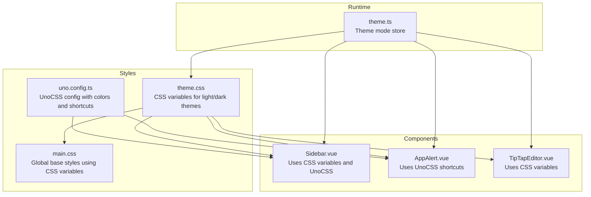
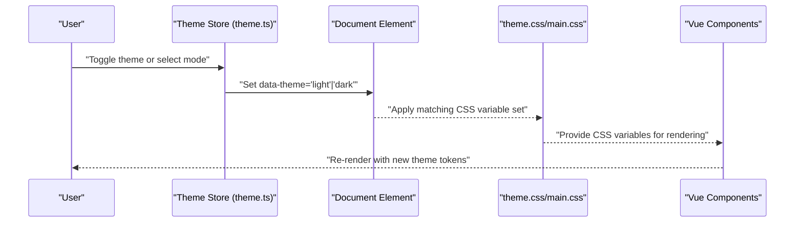
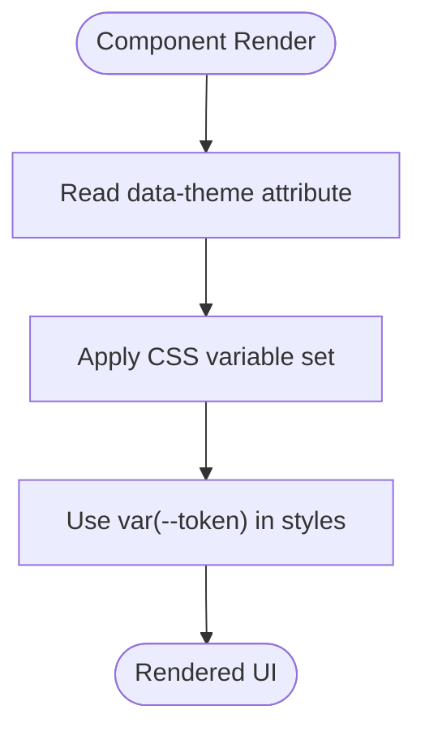
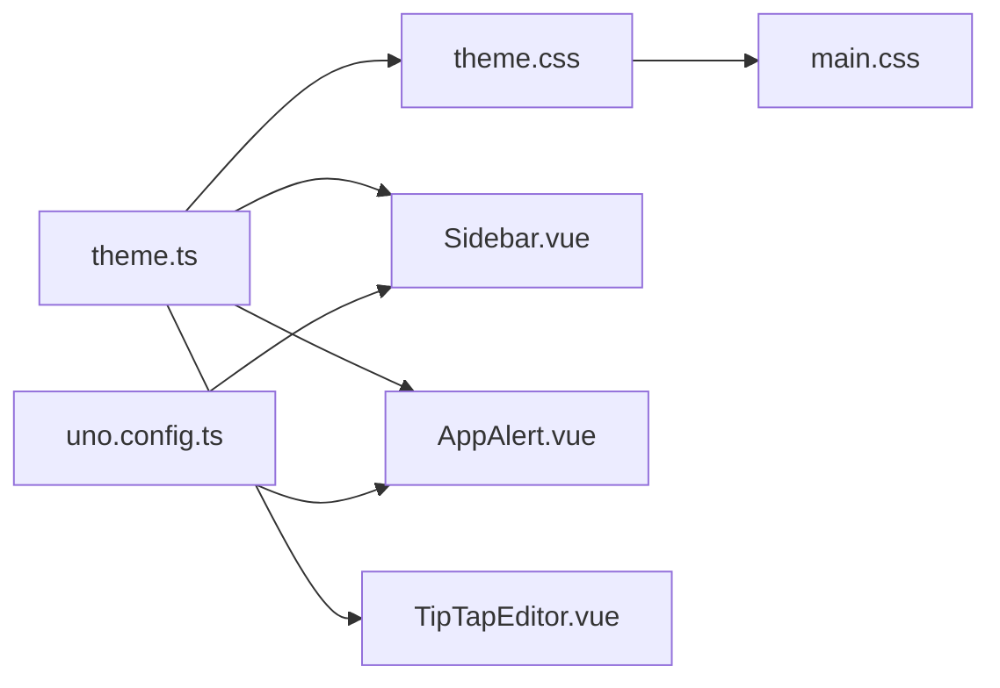

# Design Tokens & Color System

<cite>
**Referenced Files in This Document**
- [theme.css](file://code/client/src/styles/theme.css)
- [main.css](file://code/client/src/styles/main.css)
- [uno.config.ts](file://code/client/uno.config.ts)
- [theme.ts](file://code/client/src/stores/theme.ts)
- [Sidebar.vue](file://code/client/src/components/sidebar/Sidebar.vue)
- [AppAlert.vue](file://code/client/src/components/common/AppAlert.vue)
- [TipTapEditor.vue](file://code/client/src/components/editor/TipTapEditor.vue)
</cite>

## Table of Contents
1. [Introduction](#introduction)
2. [Project Structure](#project-structure)
3. [Core Components](#core-components)
4. [Architecture Overview](#architecture-overview)
5. [Detailed Component Analysis](#detailed-component-analysis)
6. [Dependency Analysis](#dependency-analysis)
7. [Performance Considerations](#performance-considerations)
8. [Troubleshooting Guide](#troubleshooting-guide)
9. [Conclusion](#conclusion)

## Introduction
This document explains the design tokens and color system used throughout the application. It covers the semantic color palette, typography foundations, spacing units, and border radius tokens. It also details how design tokens cascade through the component hierarchy via CSS custom properties, integrates with UnoCSS utilities, and maintains accessibility compliance. Practical examples demonstrate how to use tokens in components, create new tokens, and maintain design consistency.

## Project Structure
The design system is composed of:
- Global CSS variables for themes and tokens
- UnoCSS configuration for utility-first styling and brand color tokens
- Vue stores for theme mode management
- Components that consume tokens via CSS variables and UnoCSS utilities

**Diagram sources**
- [theme.css:1-146](file://code/client/src/styles/theme.css#L1-L146)
- [main.css:1-65](file://code/client/src/styles/main.css#L1-L65)
- [uno.config.ts:1-52](file://code/client/uno.config.ts#L1-L52)
- [theme.ts:1-76](file://code/client/src/stores/theme.ts#L1-L76)
- [Sidebar.vue:1-216](file://code/client/src/components/sidebar/Sidebar.vue#L1-L216)
- [AppAlert.vue:1-136](file://code/client/src/components/common/AppAlert.vue#L1-L136)
- [TipTapEditor.vue:1-831](file://code/client/src/components/editor/TipTapEditor.vue#L1-L831)

**Section sources**
- [theme.css:1-146](file://code/client/src/styles/theme.css#L1-L146)
- [main.css:1-65](file://code/client/src/styles/main.css#L1-L65)
- [uno.config.ts:1-52](file://code/client/uno.config.ts#L1-L52)
- [theme.ts:1-76](file://code/client/src/stores/theme.ts#L1-L76)

## Core Components
- CSS custom properties define semantic tokens for backgrounds, text, borders, brand/accent colors, shadows, scrollbars, selections, and editor-specific tokens. These are applied per theme mode and cascade through the component hierarchy.
- UnoCSS provides utility classes mapped to brand colors and common component styles, enabling rapid composition while staying aligned with the design system.
- The theme store manages theme mode selection and applies the active theme to the document element, ensuring CSS variable sets switch seamlessly.

Key token categories:
- Semantic color palette: backgrounds, surfaces, hover/active states, inputs, dropdowns, modals, links, and editor content.
- Brand/accent palette: primary, primary hover/light, accent, danger, active states.
- Typography foundation: global font stack and inherited text colors.
- Spacing units: implicit spacing via component classes and explicit spacing utilities from UnoCSS.
- Border radius tokens: component-scoped radii (e.g., rounded-lg, rounded-md, 0.5rem) and semantic border tokens (e.g., border defaults and toolbar borders).
- Shadows: layered depth tokens for cards, dropdowns, and toolbars.

**Section sources**
- [theme.css:8-146](file://code/client/src/styles/theme.css#L8-L146)
- [main.css:16-64](file://code/client/src/styles/main.css#L16-L64)
- [uno.config.ts:23-50](file://code/client/uno.config.ts#L23-L50)
- [theme.ts:17-75](file://code/client/src/stores/theme.ts#L17-L75)

## Architecture Overview
The design system architecture ensures tokens are centralized and reactive:
- Tokens are defined as CSS variables in theme.css and loaded in main.css.
- The theme store updates the data-theme attribute on the document element, switching between light and dark variable sets.
- Components consume tokens via var(--token-name) and UnoCSS utilities for brand colors and common layouts.
- Editor-specific tokens are applied within rich text components to maintain consistent visuals.

**Diagram sources**
- [theme.ts:42-52](file://code/client/src/stores/theme.ts#L42-L52)
- [theme.css:9-146](file://code/client/src/styles/theme.css#L9-L146)
- [main.css:16-33](file://code/client/src/styles/main.css#L16-L33)

## Detailed Component Analysis

### Semantic Color Palette
- Background tokens: app, sidebar, editor, toolbar, surface, hover, active, input, dropdown, modal overlay.
- Text tokens: primary, secondary, tertiary, muted, inverse, and toolbar-specific text.
- Border tokens: default, light, and toolbar-specific borders.
- Brand/accent tokens: primary, primary hover/light, accent, accent hover, danger, active, active background.
- Editor tokens: text, headings, code block backgrounds/text, preformatted blocks, blockquote visuals, hr, table borders/headers, cell selection.

These tokens are consumed by components through CSS variables and UnoCSS utilities.

**Section sources**
- [theme.css:11-145](file://code/client/src/styles/theme.css#L11-L145)
- [Sidebar.vue:92-215](file://code/client/src/components/sidebar/Sidebar.vue#L92-L215)
- [TipTapEditor.vue:131-204](file://code/client/src/components/editor/TipTapEditor.vue#L131-L204)

### Typography Scale
- Global font stack is defined in main.css and inherited by components.
- Editor content uses semantic text tokens for readability and contrast.
- No explicit tokenized typographic scale exists; components rely on inherited font properties and UnoCSS text utilities.

**Section sources**
- [main.css:17-27](file://code/client/src/styles/main.css#L17-L27)
- [TipTapEditor.vue:188-204](file://code/client/src/components/editor/TipTapEditor.vue#L188-L204)

### Spacing Units
- Implicit spacing is achieved via component classes (e.g., padding/margin utilities from UnoCSS).
- Explicit spacing tokens are not defined as CSS variables; spacing relies on utility classes and component-defined gaps.

**Section sources**
- [AppAlert.vue:75-116](file://code/client/src/components/common/AppAlert.vue#L75-L116)
- [Sidebar.vue:147-154](file://code/client/src/components/sidebar/Sidebar.vue#L147-L154)

### Border Radius Tokens
- Component-level radii are used (rounded-lg, rounded-md, 0.5rem) for buttons, inputs, cards, and logos.
- Semantic border tokens include default and toolbar borders.

**Section sources**
- [Sidebar.vue:118-119](file://code/client/src/components/sidebar/Sidebar.vue#L118-L119)
- [AppAlert.vue:84-90](file://code/client/src/components/common/AppAlert.vue#L84-L90)
- [theme.css:35-37](file://code/client/src/styles/theme.css#L35-L37)

### Shadow Tokens
- Layered shadows for small, medium, large, and toolbar contexts support depth and focus affordances.

**Section sources**
- [theme.css:50-53](file://code/client/src/styles/theme.css#L50-L53)

### Color Contrast and Accessibility
- The semantic palette provides sufficient contrast between backgrounds and text across light/dark modes.
- Brand/accent colors are used for interactive states and emphasis, with hover/light variants to preserve legibility.
- Editor tokens ensure readable code blocks and highlighted content against themed backgrounds.

Note: Formal WCAG AA/AAA contrast checks are not embedded in the codebase. Teams should validate color combinations using external tools when adding or modifying tokens.

**Section sources**
- [theme.css:24-32](file://code/client/src/styles/theme.css#L24-L32)
- [theme.css:93-101](file://code/client/src/styles/theme.css#L93-L101)
- [TipTapEditor.vue:133-144](file://code/client/src/components/editor/TipTapEditor.vue#L133-L144)

### Relationship Between Tokens and CSS Custom Properties
- theme.css defines CSS variables grouped by theme mode. Components reference tokens via var(--token-name).
- main.css imports theme.css and applies global styles using these variables.
- UnoCSS utilities map to brand colors and component shortcuts, complementing token usage.

**Diagram sources**
- [theme.ts:42-44](file://code/client/src/stores/theme.ts#L42-L44)
- [theme.css:9-146](file://code/client/src/styles/theme.css#L9-L146)
- [main.css:11-12](file://code/client/src/styles/main.css#L11-L12)

### Integration with UnoCSS Utilities
- uno.config.ts defines a primary color scale and common shortcuts for inputs, buttons, and cards.
- Components use UnoCSS utilities alongside CSS variables for consistent branding and layout.

Examples of usage:
- Brand color utilities for interactive elements and cards.
- Input and button shortcuts that include focus states and transitions.
- Component-specific tokens (e.g., rounded corners) via UnoCSS utilities.

**Section sources**
- [uno.config.ts:23-50](file://code/client/uno.config.ts#L23-L50)
- [AppAlert.vue:84-90](file://code/client/src/components/common/AppAlert.vue#L84-L90)
- [Sidebar.vue:196-209](file://code/client/src/components/sidebar/Sidebar.vue#L196-L209)

### Using Design Tokens in Components
- Prefer CSS variables for theme-aware tokens (e.g., background, text, borders).
- Use UnoCSS utilities for brand colors and common component styles.
- Maintain consistency by avoiding ad-hoc hardcoded colors inside components.

Practical patterns:
- Set background and borders via var(--bg-*) and var(--border-*).
- Apply brand colors using UnoCSS shortcuts (e.g., bg-primary, text-primary).
- Use component-level radii (rounded) and semantic border tokens consistently.

**Section sources**
- [Sidebar.vue:95-96](file://code/client/src/components/sidebar/Sidebar.vue#L95-L96)
- [AppAlert.vue:84-90](file://code/client/src/components/common/AppAlert.vue#L84-L90)
- [TipTapEditor.vue:131-139](file://code/client/src/components/editor/TipTapEditor.vue#L131-L139)

### Creating New Tokens
Steps to add a new token:
1. Define the CSS variable in theme.css under the appropriate category and theme mode.
2. Import theme.css in main.css if not already imported.
3. Consume the token in components via var(--token-name).
4. Optionally expose a UnoCSS utility in uno.config.ts for frequent use.

Guidelines:
- Keep token names semantic and scoped (e.g., --bg-surface, --text-primary).
- Mirror token values across light and dark themes.
- Reuse existing tokens where possible to reduce duplication.

**Section sources**
- [theme.css:11-145](file://code/client/src/styles/theme.css#L11-L145)
- [main.css:11-12](file://code/client/src/styles/main.css#L11-L12)
- [uno.config.ts:23-50](file://code/client/uno.config.ts#L23-L50)

### Maintaining Design Consistency
- Centralize tokens in theme.css and consume via var(--token).
- Use UnoCSS shortcuts for common patterns to avoid drift.
- Review theme changes in both light and dark modes to preserve contrast and usability.
- Encourage team-wide documentation of new tokens and their intended use cases.

**Section sources**
- [theme.css:1-146](file://code/client/src/styles/theme.css#L1-L146)
- [uno.config.ts:42-50](file://code/client/uno.config.ts#L42-L50)

## Dependency Analysis
The design system exhibits low coupling and high cohesion:
- theme.css is the single source of truth for tokens.
- theme.ts controls theme mode and propagates changes to the DOM.
- Components depend on CSS variables and UnoCSS utilities, not on internal token definitions.
- There are no circular dependencies among tokens or components.

**Diagram sources**
- [theme.css:1-146](file://code/client/src/styles/theme.css#L1-L146)
- [main.css:1-65](file://code/client/src/styles/main.css#L1-L65)
- [theme.ts:1-76](file://code/client/src/stores/theme.ts#L1-L76)
- [uno.config.ts:1-52](file://code/client/uno.config.ts#L1-L52)
- [Sidebar.vue:1-216](file://code/client/src/components/sidebar/Sidebar.vue#L1-L216)
- [AppAlert.vue:1-136](file://code/client/src/components/common/AppAlert.vue#L1-L136)
- [TipTapEditor.vue:1-831](file://code/client/src/components/editor/TipTapEditor.vue#L1-L831)

**Section sources**
- [theme.css:1-146](file://code/client/src/styles/theme.css#L1-L146)
- [main.css:1-65](file://code/client/src/styles/main.css#L1-L65)
- [theme.ts:1-76](file://code/client/src/stores/theme.ts#L1-L76)
- [uno.config.ts:1-52](file://code/client/uno.config.ts#L1-L52)

## Performance Considerations
- CSS variables enable efficient theme switching without re-rendering components.
- UnoCSS generates optimized utility classes at build time, minimizing runtime overhead.
- Keep token definitions concise and reuse existing tokens to reduce CSS payload.

## Troubleshooting Guide
Common issues and resolutions:
- Token not applying: Verify the data-theme attribute is set and the CSS variable is defined in the active theme mode.
- Inconsistent colors across modes: Ensure both light and dark tokens are present for the target property.
- Missing UnoCSS utility: Confirm the utility is defined in uno.config.ts and rebuild the project.

**Section sources**
- [theme.ts:42-52](file://code/client/src/stores/theme.ts#L42-L52)
- [theme.css:9-146](file://code/client/src/styles/theme.css#L9-L146)
- [uno.config.ts:23-50](file://code/client/uno.config.ts#L23-L50)

## Conclusion
The design tokens and color system are centralized in CSS variables and complemented by UnoCSS utilities. The theme store enables seamless light/dark switching, and components consistently consume tokens via CSS variables and utilities. By following the established patterns and guidelines, teams can extend the system with new tokens while preserving accessibility and design consistency.