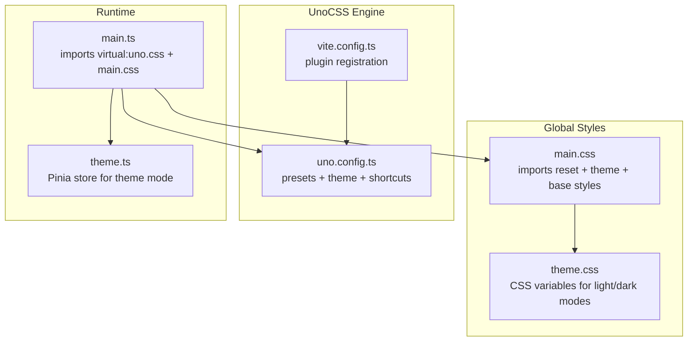
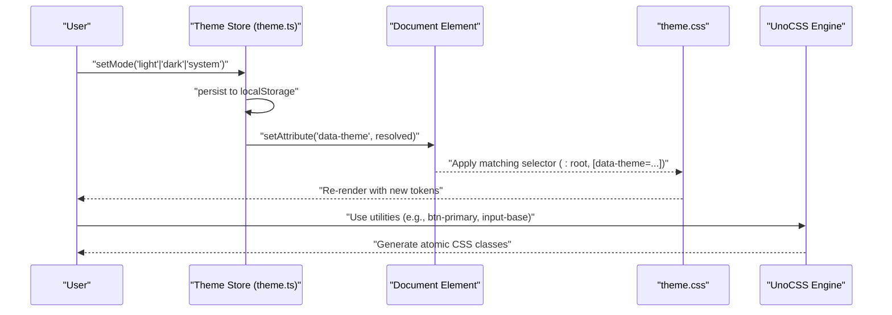
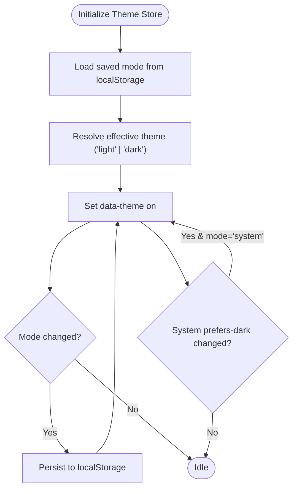
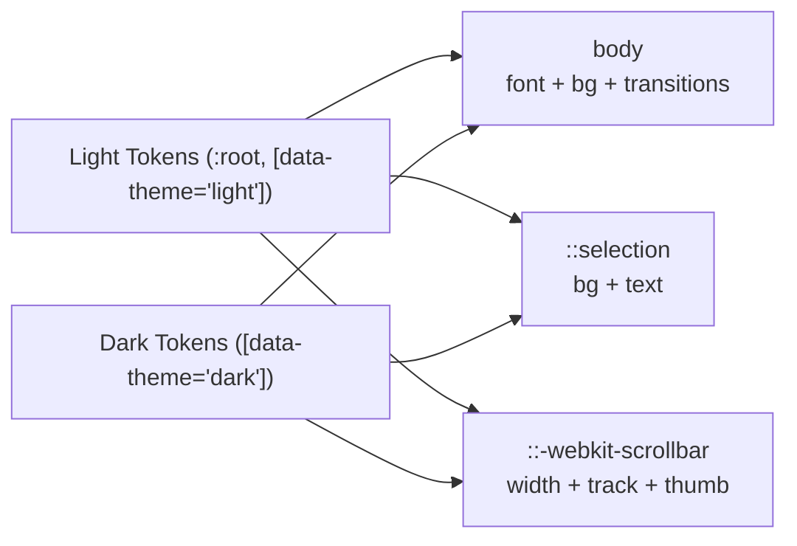
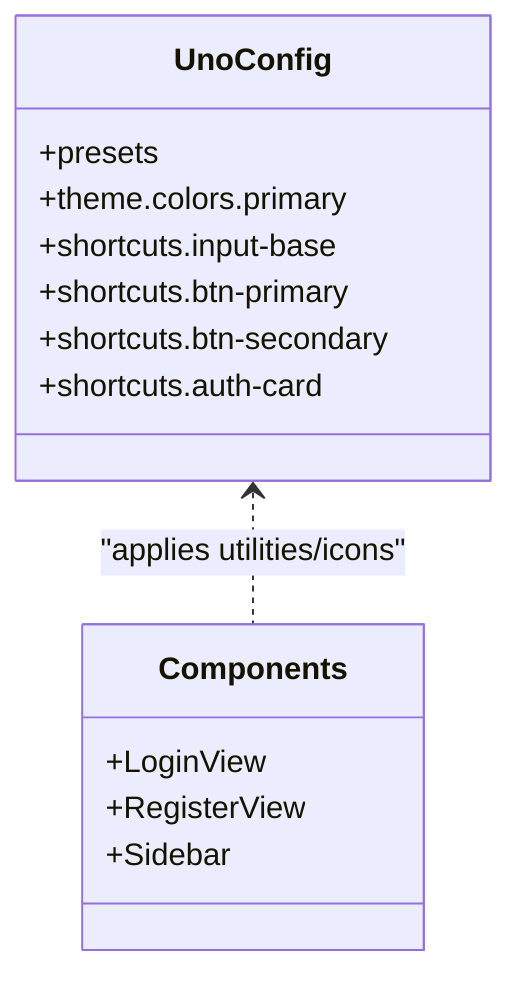
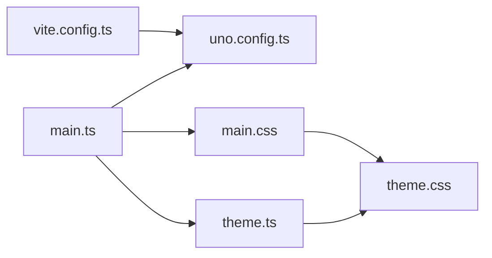

# Theme & Styling System

<cite>
**Referenced Files in This Document**
- [theme.ts](file://code/client/src/stores/theme.ts)
- [theme.css](file://code/client/src/styles/theme.css)
- [main.css](file://code/client/src/styles/main.css)
- [uno.config.ts](file://code/client/uno.config.ts)
- [vite.config.ts](file://code/client/vite.config.ts)
- [main.ts](file://code/client/src/main.ts)
- [LoginView.vue](file://code/client/src/views/LoginView.vue)
- [RegisterView.vue](file://code/client/src/views/RegisterView.vue)
- [Sidebar.vue](file://code/client/src/components/sidebar/Sidebar.vue)
</cite>

## Table of Contents
1. [Introduction](#introduction)
2. [Project Structure](#project-structure)
3. [Core Components](#core-components)
4. [Architecture Overview](#architecture-overview)
5. [Detailed Component Analysis](#detailed-component-analysis)
6. [Dependency Analysis](#dependency-analysis)
7. [Performance Considerations](#performance-considerations)
8. [Troubleshooting Guide](#troubleshooting-guide)
9. [Conclusion](#conclusion)
10. [Appendices](#appendices)

## Introduction
This document explains the theme and styling system of the client application. It covers the UnoCSS utility-first approach, custom theme configuration, and design token management. It documents the theme store implementation with dark/light/system mode switching, color scheme customization, and responsive design patterns. It also details the CSS architecture, component styling conventions, and global style organization. Integration with Lucide Icons via UnoCSS icons preset, a custom icon system, and animation frameworks are addressed. Accessibility considerations, browser compatibility, and performance optimization for styling are included, along with practical examples for creating custom themes, extending the design system, and maintaining visual consistency across components.

## Project Structure
The styling system is organized around three pillars:
- Global styles and tokens: centralized CSS variables and base styles
- UnoCSS configuration: utility-first engine with icons and shortcuts
- Theme store: reactive theme mode management with persistence and system preference detection

**Diagram sources**
- [main.css:1-65](file://code/client/src/styles/main.css#L1-L65)
- [theme.css:1-146](file://code/client/src/styles/theme.css#L1-L146)
- [uno.config.ts:1-52](file://code/client/uno.config.ts#L1-L52)
- [vite.config.ts:1-37](file://code/client/vite.config.ts#L1-L37)
- [main.ts:1-54](file://code/client/src/main.ts#L1-L54)
- [theme.ts:1-76](file://code/client/src/stores/theme.ts#L1-L76)

**Section sources**
- [main.css:1-65](file://code/client/src/styles/main.css#L1-L65)
- [theme.css:1-146](file://code/client/src/styles/theme.css#L1-L146)
- [uno.config.ts:1-52](file://code/client/uno.config.ts#L1-L52)
- [vite.config.ts:1-37](file://code/client/vite.config.ts#L1-L37)
- [main.ts:1-54](file://code/client/src/main.ts#L1-L54)
- [theme.ts:1-76](file://code/client/src/stores/theme.ts#L1-L76)

## Core Components
- Theme store: manages theme mode (light, dark, system), persists to localStorage, applies to the document element, and reacts to system preference changes.
- Design tokens: CSS variables grouped by semantic categories (backgrounds, text, borders, brand colors, shadows, scrollbars, selection, editor-specific tokens) for both light and dark themes.
- Global base styles: typography, selection, scrollbar, transitions, and reset via UnoCSS.
- UnoCSS engine: presetUno for utility classes, presetIcons for Lucide integration, custom theme colors, and reusable shortcuts for inputs and buttons.

Key implementation references:
- Theme store initialization and DOM application: [theme.ts:17-75](file://code/client/src/stores/theme.ts#L17-L75)
- CSS variable definitions for light/dark: [theme.css:8-145](file://code/client/src/styles/theme.css#L8-L145)
- Global base styles and transitions: [main.css:14-64](file://code/client/src/styles/main.css#L14-L64)
- UnoCSS configuration and shortcuts: [uno.config.ts:12-51](file://code/client/uno.config.ts#L12-L51)
- UnoCSS plugin registration: [vite.config.ts:12-16](file://code/client/vite.config.ts#L12-L16)
- Runtime style imports and theme initialization: [main.ts:18-53](file://code/client/src/main.ts#L18-L53)

**Section sources**
- [theme.ts:1-76](file://code/client/src/stores/theme.ts#L1-L76)
- [theme.css:1-146](file://code/client/src/styles/theme.css#L1-L146)
- [main.css:1-65](file://code/client/src/styles/main.css#L1-L65)
- [uno.config.ts:1-52](file://code/client/uno.config.ts#L1-L52)
- [vite.config.ts:1-37](file://code/client/vite.config.ts#L1-L37)
- [main.ts:1-54](file://code/client/src/main.ts#L1-L54)

## Architecture Overview
The theme and styling pipeline integrates runtime theme resolution with static CSS variables and dynamic utilities.

**Diagram sources**
- [theme.ts:17-75](file://code/client/src/stores/theme.ts#L17-L75)
- [theme.css:8-145](file://code/client/src/styles/theme.css#L8-L145)
- [uno.config.ts:12-51](file://code/client/uno.config.ts#L12-L51)

## Detailed Component Analysis

### Theme Store Implementation
The theme store encapsulates:
- Mode state: persisted user choice (light, dark, system)
- Resolved theme: computed effective theme applied to the DOM
- Persistence: localStorage-backed preferences
- System listener: auto-update when OS preference changes
- DOM application: sets data-theme attribute on document element

**Diagram sources**
- [theme.ts:17-75](file://code/client/src/stores/theme.ts#L17-L75)

**Section sources**
- [theme.ts:1-76](file://code/client/src/stores/theme.ts#L1-L76)

### CSS Architecture and Token Management
- Tokens are defined as CSS variables scoped under :root and [data-theme="light"/"dark"] selectors.
- Categories include backgrounds, text, borders, brand/accent colors, shadows, scrollbars, selection, and editor-specific tokens.
- Global base styles leverage these tokens for typography, selection, scrollbar, and transitions.

**Diagram sources**
- [theme.css:8-145](file://code/client/src/styles/theme.css#L8-L145)
- [main.css:14-64](file://code/client/src/styles/main.css#L14-L64)

**Section sources**
- [theme.css:1-146](file://code/client/src/styles/theme.css#L1-L146)
- [main.css:1-65](file://code/client/src/styles/main.css#L1-L65)

### UnoCSS Utilities, Icons, and Shortcuts
- Presets: presetUno for Tailwind-compatible utilities; presetIcons for Lucide integration via i-lucide-* classes.
- Custom theme colors: primary palette with numeric shades mapped to CSS variables.
- Shortcuts: standardized input and button styles to ensure consistency.

**Diagram sources**
- [uno.config.ts:12-51](file://code/client/uno.config.ts#L12-L51)
- [LoginView.vue:180-287](file://code/client/src/views/LoginView.vue#L180-L287)
- [RegisterView.vue:200-350](file://code/client/src/views/RegisterView.vue#L200-L350)
- [Sidebar.vue:1-216](file://code/client/src/components/sidebar/Sidebar.vue#L1-L216)

**Section sources**
- [uno.config.ts:1-52](file://code/client/uno.config.ts#L1-L52)
- [LoginView.vue:180-287](file://code/client/src/views/LoginView.vue#L180-L287)
- [RegisterView.vue:200-350](file://code/client/src/views/RegisterView.vue#L200-L350)
- [Sidebar.vue:1-216](file://code/client/src/components/sidebar/Sidebar.vue#L1-L216)

### Component Styling Conventions
- Scoped component styles use CSS variables for theme-awareness (e.g., background, borders, text).
- Shared utilities are applied via UnoCSS shortcuts and icon classes.
- Example usage:
  - Inputs: class binding with input-base shortcut and conditional border classes
  - Buttons: btn-primary/btn-secondary shortcuts
  - Icons: inline SVG or Lucide icon classes via UnoCSS

References:
- Inputs and buttons in LoginView: [LoginView.vue:180-287](file://code/client/src/views/LoginView.vue#L180-L287)
- Inputs and buttons in RegisterView: [RegisterView.vue:200-350](file://code/client/src/views/RegisterView.vue#L200-L350)
- Sidebar scoped styles using tokens: [Sidebar.vue:91-200](file://code/client/src/components/sidebar/Sidebar.vue#L91-L200)

**Section sources**
- [LoginView.vue:180-287](file://code/client/src/views/LoginView.vue#L180-L287)
- [RegisterView.vue:200-350](file://code/client/src/views/RegisterView.vue#L200-L350)
- [Sidebar.vue:91-200](file://code/client/src/components/sidebar/Sidebar.vue#L91-L200)

### Responsive Design Patterns
- The design system relies on utility-first classes for spacing, sizing, and layout. While no explicit media queries are present in the reviewed files, responsive variants can be composed using UnoCSS utilities (e.g., breakpoints supported by presetUno).
- Components should use responsive prefixes (e.g., sm:, md:, lg:) to adapt layouts across screen sizes.

[No sources needed since this section provides general guidance]

### Animation Frameworks
- Inline SVG spinner demonstrates a simple animation pattern using animate-spin utility.
- Transitions for theme changes are handled via CSS property transitions on body and related elements.

References:
- Spinner usage in LoginView: [LoginView.vue:230-253](file://code/client/src/views/LoginView.vue#L230-L253)
- Transition declarations in main.css: [main.css:60-64](file://code/client/src/styles/main.css#L60-L64)

**Section sources**
- [LoginView.vue:230-253](file://code/client/src/views/LoginView.vue#L230-L253)
- [main.css:60-64](file://code/client/src/styles/main.css#L60-L64)

### Accessibility Considerations
- Color contrast: tokens define sufficient contrast pairs for text and backgrounds in both themes.
- Focus states: shortcuts include focus:border and focus:ring utilities to indicate keyboard focus.
- Selection and scrollbars: tokens customize selection and scrollbar colors for readability and consistency.

References:
- Focus utilities in shortcuts: [uno.config.ts:42-50](file://code/client/uno.config.ts#L42-L50)
- Selection customization: [main.css:40-43](file://code/client/src/styles/main.css#L40-L43)
- Scrollbar customization: [main.css:45-58](file://code/client/src/styles/main.css#L45-L58)

**Section sources**
- [uno.config.ts:42-50](file://code/client/uno.config.ts#L42-L50)
- [main.css:40-58](file://code/client/src/styles/main.css#L40-L58)

### Browser Compatibility
- UnoCSS generates atomic CSS classes compatible with modern browsers.
- CSS variables are used for tokens; ensure fallbacks if targeting legacy environments.
- WebKit-specific pseudo-elements for scrollbars are used; provide alternative styling for non-WebKit engines if necessary.

[No sources needed since this section provides general guidance]

## Dependency Analysis
The styling system depends on:
- UnoCSS engine for utilities and icons
- Theme store for runtime theme resolution
- Global styles for base resets and token application

**Diagram sources**
- [vite.config.ts:12-16](file://code/client/vite.config.ts#L12-L16)
- [uno.config.ts:12-51](file://code/client/uno.config.ts#L12-L51)
- [main.ts:18-53](file://code/client/src/main.ts#L18-L53)
- [main.css:8-12](file://code/client/src/styles/main.css#L8-L12)
- [theme.css:8-145](file://code/client/src/styles/theme.css#L8-L145)
- [theme.ts:17-75](file://code/client/src/stores/theme.ts#L17-L75)

**Section sources**
- [vite.config.ts:1-37](file://code/client/vite.config.ts#L1-L37)
- [uno.config.ts:1-52](file://code/client/uno.config.ts#L1-L52)
- [main.ts:1-54](file://code/client/src/main.ts#L1-L54)
- [main.css:1-65](file://code/client/src/styles/main.css#L1-L65)
- [theme.css:1-146](file://code/client/src/styles/theme.css#L1-L146)
- [theme.ts:1-76](file://code/client/src/stores/theme.ts#L1-L76)

## Performance Considerations
- Atomic CSS generation: UnoCSS emits only the utilities used, minimizing bundle size.
- CSS variables reduce duplication and enable efficient theme switching.
- Minimal JavaScript for theming reduces render-blocking work.
- Prefer utilities over ad-hoc component styles to maintain consistency and reduce CSS bloat.

[No sources needed since this section provides general guidance]

## Troubleshooting Guide
- Theme not applying:
  - Verify data-theme attribute on document element after store initialization.
  - Confirm theme.css selectors match the applied mode.
- Tokens missing or incorrect:
  - Ensure main.css imports theme.css and UnoCSS reset.
  - Check that shortcuts and utilities are configured in uno.config.ts.
- Icons not rendering:
  - Use i-lucide-* classes with presetIcons enabled.
  - Confirm UnoCSS plugin is registered in Vite.

**Section sources**
- [theme.ts:42-45](file://code/client/src/stores/theme.ts#L42-L45)
- [main.css:8-12](file://code/client/src/styles/main.css#L8-L12)
- [uno.config.ts:12-21](file://code/client/uno.config.ts#L12-L21)
- [vite.config.ts:12-16](file://code/client/vite.config.ts#L12-L16)

## Conclusion
The theme and styling system combines a reactive theme store, a comprehensive token library, and a utility-first engine to deliver a consistent, accessible, and performant UI. By centralizing design tokens, leveraging UnoCSS shortcuts, and applying theme-aware utilities, developers can extend the design system while maintaining visual coherence across components.

[No sources needed since this section summarizes without analyzing specific files]

## Appendices

### Creating Custom Themes
- Add new tokens to theme.css under the appropriate category and selector.
- Extend UnoCSS theme colors for additional semantic palettes.
- Update shortcuts for common patterns to keep components consistent.

References:
- Token categories and selectors: [theme.css:8-145](file://code/client/src/styles/theme.css#L8-L145)
- Custom theme colors: [uno.config.ts:23-40](file://code/client/uno.config.ts#L23-L40)
- Shortcuts: [uno.config.ts:42-50](file://code/client/uno.config.ts#L42-L50)

**Section sources**
- [theme.css:8-145](file://code/client/src/styles/theme.css#L8-L145)
- [uno.config.ts:23-50](file://code/client/uno.config.ts#L23-L50)

### Extending the Design System
- Define new shortcuts for frequently reused patterns.
- Introduce semantic tokens for new UI roles (e.g., status colors).
- Keep component styles scoped and token-driven.

References:
- Shortcuts definition: [uno.config.ts:42-50](file://code/client/uno.config.ts#L42-L50)
- Scoped component usage of tokens: [Sidebar.vue:91-200](file://code/client/src/components/sidebar/Sidebar.vue#L91-L200)

**Section sources**
- [uno.config.ts:42-50](file://code/client/uno.config.ts#L42-L50)
- [Sidebar.vue:91-200](file://code/client/src/components/sidebar/Sidebar.vue#L91-L200)

### Maintaining Visual Consistency
- Prefer shortcuts and utilities over inline styles.
- Use CSS variables for theme-aware colors and effects.
- Centralize base styles and resets in main.css.

References:
- Base styles and transitions: [main.css:14-64](file://code/client/src/styles/main.css#L14-L64)
- Shortcut usage in forms: [LoginView.vue:180-287](file://code/client/src/views/LoginView.vue#L180-L287), [RegisterView.vue:200-350](file://code/client/src/views/RegisterView.vue#L200-L350)

**Section sources**
- [main.css:14-64](file://code/client/src/styles/main.css#L14-L64)
- [LoginView.vue:180-287](file://code/client/src/views/LoginView.vue#L180-L287)
- [RegisterView.vue:200-350](file://code/client/src/views/RegisterView.vue#L200-L350)