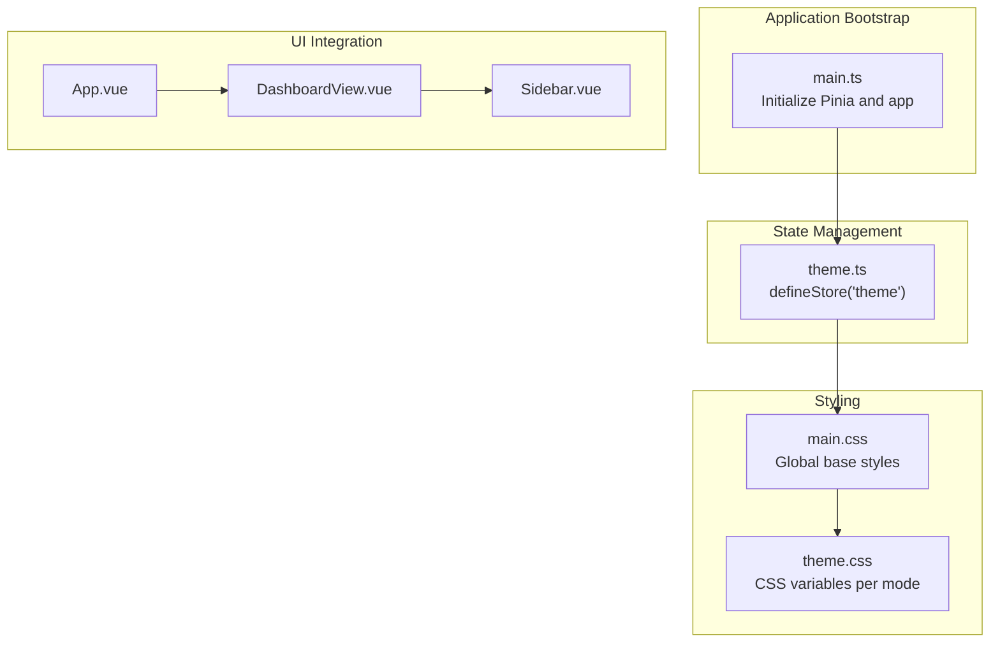
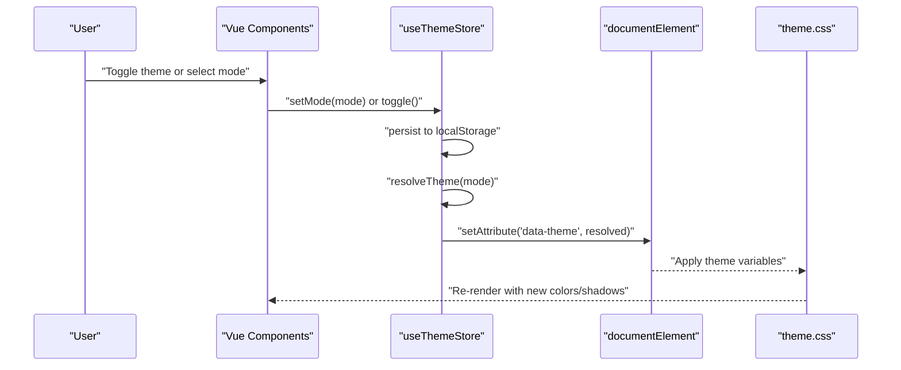
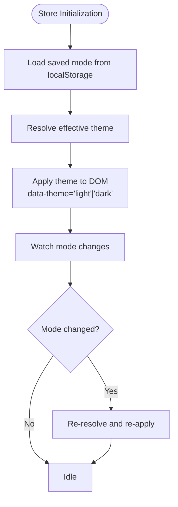
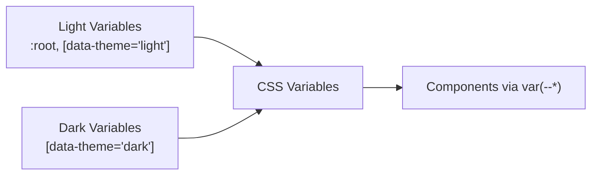
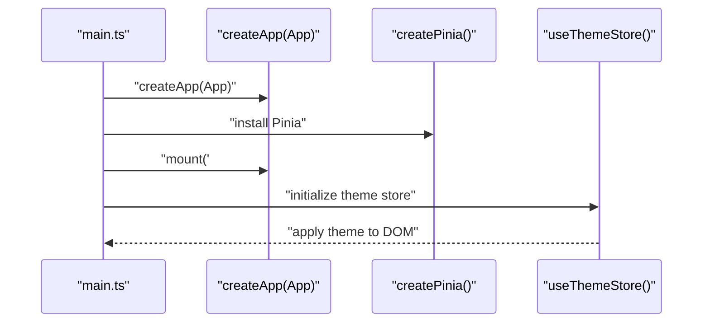
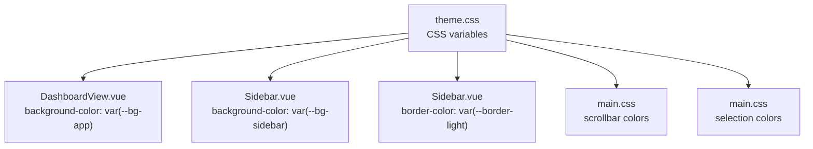
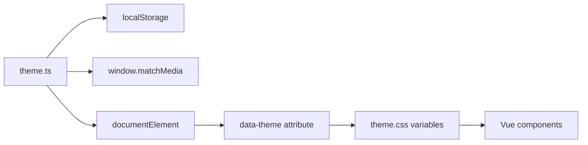

# Theme Store & State Management

<cite>
**Referenced Files in This Document**
- [theme.ts](file://code/client/src/stores/theme.ts)
- [main.ts](file://code/client/src/main.ts)
- [theme.css](file://code/client/src/styles/theme.css)
- [main.css](file://code/client/src/styles/main.css)
- [Sidebar.vue](file://code/client/src/components/sidebar/Sidebar.vue)
- [DashboardView.vue](file://code/client/src/views/DashboardView.vue)
- [App.vue](file://code/client/src/App.vue)
</cite>

## Table of Contents
1. [Introduction](#introduction)
2. [Project Structure](#project-structure)
3. [Core Components](#core-components)
4. [Architecture Overview](#architecture-overview)
5. [Detailed Component Analysis](#detailed-component-analysis)
6. [Dependency Analysis](#dependency-analysis)
7. [Performance Considerations](#performance-considerations)
8. [Troubleshooting Guide](#troubleshooting-guide)
9. [Conclusion](#conclusion)
10. [Appendices](#appendices)

## Introduction
This document explains the theme store implementation using Pinia, focusing on theme mode management (light, dark, system), localStorage persistence, and reactive theme switching. It documents the store’s API, system preference detection via media queries, automatic theme resolution, and practical integration patterns with Vue components. It also covers performance considerations, memory management, and browser compatibility for theme detection.

## Project Structure
The theme system spans three primary areas:
- Store definition and initialization in the theme store module
- Global CSS variables and theme-aware component styles
- Application bootstrap that initializes the theme store after Pinia is ready

**Diagram sources**
- [main.ts:1-54](file://code/client/src/main.ts#L1-L54)
- [theme.ts:17-75](file://code/client/src/stores/theme.ts#L17-L75)
- [main.css:14-65](file://code/client/src/styles/main.css#L14-L65)
- [theme.css:1-146](file://code/client/src/styles/theme.css#L1-L146)
- [App.vue:16-19](file://code/client/src/App.vue#L16-L19)
- [DashboardView.vue:15-31](file://code/client/src/views/DashboardView.vue#L15-L31)
- [Sidebar.vue:91-216](file://code/client/src/components/sidebar/Sidebar.vue#L91-L216)

**Section sources**
- [main.ts:1-54](file://code/client/src/main.ts#L1-L54)
- [theme.ts:17-75](file://code/client/src/stores/theme.ts#L17-L75)
- [main.css:14-65](file://code/client/src/styles/main.css#L14-L65)
- [theme.css:1-146](file://code/client/src/styles/theme.css#L1-L146)
- [App.vue:16-19](file://code/client/src/App.vue#L16-L19)
- [DashboardView.vue:15-31](file://code/client/src/views/DashboardView.vue#L15-L31)
- [Sidebar.vue:91-216](file://code/client/src/components/sidebar/Sidebar.vue#L91-L216)

## Core Components
- Theme store (Pinia)
  - State: mode (light | dark | system), resolved (light | dark)
  - Persistence: localStorage under a fixed key
  - API: setMode(mode), toggle(), reactive state bindings
  - Resolution: resolves to light/dark based on mode and system preference
  - DOM application: sets data-theme attribute on documentElement
- Global CSS
  - Defines CSS variables for light and dark themes
  - Applies variables via :root and [data-theme="..."] selectors
- Vue components
  - Consume CSS variables for colors, borders, shadows, and editor tokens
  - No explicit store binding shown; theme updates propagate automatically via CSS variable updates

Key implementation references:
- Store definition and API: [theme.ts:17-75](file://code/client/src/stores/theme.ts#L17-L75)
- CSS variables and theme mapping: [theme.css:1-146](file://code/client/src/styles/theme.css#L1-L146)
- Global base styles and transitions: [main.css:14-65](file://code/client/src/styles/main.css#L14-L65)
- Application bootstrap and store initialization: [main.ts:49-52](file://code/client/src/main.ts#L49-L52)

**Section sources**
- [theme.ts:17-75](file://code/client/src/stores/theme.ts#L17-L75)
- [theme.css:1-146](file://code/client/src/styles/theme.css#L1-L146)
- [main.css:14-65](file://code/client/src/styles/main.css#L14-L65)
- [main.ts:49-52](file://code/client/src/main.ts#L49-L52)

## Architecture Overview
The theme system follows a reactive, store-driven pattern:
- The theme store computes the effective theme (resolved) from the selected mode and system preferences
- It applies the theme by setting a data-theme attribute on the document element
- Components consume CSS variables that change based on the applied theme
- The store persists the user’s choice to localStorage and listens for system preference changes when in system mode

**Diagram sources**
- [theme.ts:48-61](file://code/client/src/stores/theme.ts#L48-L61)
- [theme.ts:42-45](file://code/client/src/stores/theme.ts#L42-L45)
- [theme.ts:34-39](file://code/client/src/stores/theme.ts#L34-L39)
- [theme.ts:15](file://code/client/src/stores/theme.ts#L15)
- [theme.css:1-146](file://code/client/src/styles/theme.css#L1-L146)

## Detailed Component Analysis

### Theme Store API and Behavior
- Types and constants
  - Mode type: light | dark | system
  - Storage key for persistence
- State
  - mode: current user-selected mode
  - resolved: computed effective theme (light | dark)
- Methods
  - setMode(mode): saves to localStorage, updates mode, re-applies theme
  - toggle(): switches between light and dark modes
- Resolution and application
  - resolveTheme(mode): returns light/dark based on mode and system preference
  - applyTheme(): updates resolved and sets data-theme on documentElement
- Initialization and listeners
  - Watches mode and immediately applies theme
  - Adds a media query listener for prefers-color-scheme changes when in system mode

**Diagram sources**
- [theme.ts:25-31](file://code/client/src/stores/theme.ts#L25-L31)
- [theme.ts:34-39](file://code/client/src/stores/theme.ts#L34-L39)
- [theme.ts:42-45](file://code/client/src/stores/theme.ts#L42-L45)
- [theme.ts:72](file://code/client/src/stores/theme.ts#L72)

**Section sources**
- [theme.ts:17-75](file://code/client/src/stores/theme.ts#L17-L75)

### CSS Variables and Theme Mapping
- Light and dark themes are defined as CSS variables
- Components reference variables (e.g., var(--bg-app), var(--text-primary)) to remain theme-aware
- The [data-theme="..."] selector ensures the correct variable set is applied

**Diagram sources**
- [theme.css:8-76](file://code/client/src/styles/theme.css#L8-L76)
- [theme.css:78-145](file://code/client/src/styles/theme.css#L78-L145)

**Section sources**
- [theme.css:1-146](file://code/client/src/styles/theme.css#L1-L146)

### Application Bootstrap and Store Initialization
- Pinia is installed before mounting the app
- After mounting, the theme store is initialized to apply the theme to the DOM
- This ensures CSS variables are set before any component renders

**Diagram sources**
- [main.ts:23-53](file://code/client/src/main.ts#L23-L53)
- [theme.ts:72](file://code/client/src/stores/theme.ts#L72)

**Section sources**
- [main.ts:23-53](file://code/client/src/main.ts#L23-L53)

### Real-Time Theme-Aware UI Patterns
- Components consume CSS variables directly; no explicit store subscription is required
- Examples:
  - Dashboard container background uses var(--bg-app)
  - Sidebar background and borders use var(--bg-sidebar) and var(--border-light)
  - Scrollbars and selections use theme-specific variables

**Diagram sources**
- [theme.css:1-146](file://code/client/src/styles/theme.css#L1-L146)
- [DashboardView.vue:25-31](file://code/client/src/views/DashboardView.vue#L25-L31)
- [Sidebar.vue:91-216](file://code/client/src/components/sidebar/Sidebar.vue#L91-L216)
- [main.css:45-64](file://code/client/src/styles/main.css#L45-L64)

**Section sources**
- [DashboardView.vue:25-31](file://code/client/src/views/DashboardView.vue#L25-L31)
- [Sidebar.vue:91-216](file://code/client/src/components/sidebar/Sidebar.vue#L91-L216)
- [main.css:45-64](file://code/client/src/styles/main.css#L45-L64)

## Dependency Analysis
- Store depends on:
  - localStorage for persistence
  - window.matchMedia for system preference detection
  - documentElement for applying the theme attribute
- CSS depends on:
  - CSS variables defined per theme
  - [data-theme] selectors to switch variable sets
- Components depend on:
  - CSS variables for rendering

**Diagram sources**
- [theme.ts:25-31](file://code/client/src/stores/theme.ts#L25-L31)
- [theme.ts:64-69](file://code/client/src/stores/theme.ts#L64-L69)
- [theme.ts:42-45](file://code/client/src/stores/theme.ts#L42-L45)
- [theme.css:1-146](file://code/client/src/styles/theme.css#L1-L146)

**Section sources**
- [theme.ts:25-31](file://code/client/src/stores/theme.ts#L25-L31)
- [theme.ts:64-69](file://code/client/src/stores/theme.ts#L64-L69)
- [theme.ts:42-45](file://code/client/src/stores/theme.ts#L42-L45)
- [theme.css:1-146](file://code/client/src/styles/theme.css#L1-L146)

## Performance Considerations
- CSS variable updates are efficient and avoid heavy re-renders
- Media query listener is attached only once and conditionally triggers re-application when in system mode
- localStorage access is minimal and guarded by try/catch
- Transition durations are short for smooth but fast theme changes

Recommendations:
- Keep CSS variable updates scoped to :root and [data-theme] selectors
- Avoid frequent writes to localStorage; the store already persists only on mode changes
- Ensure media query listeners are removed on component unmount if using custom listeners outside the store

**Section sources**
- [theme.ts:64-69](file://code/client/src/stores/theme.ts#L64-L69)
- [theme.ts:50](file://code/client/src/stores/theme.ts#L50)
- [main.css:32](file://code/client/src/styles/main.css#L32)

## Troubleshooting Guide
Common issues and resolutions:
- Theme does not persist across reloads
  - Verify localStorage key and write operations
  - Confirm store initialization order after Pinia installation
- Theme does not switch with OS/system preference
  - Ensure media query listener is active and only applied when mode is system
  - Confirm data-theme attribute updates on change events
- Styles not updating after switching
  - Verify [data-theme] attribute is present on documentElement
  - Confirm CSS selectors target [data-theme="..."] appropriately

**Section sources**
- [theme.ts:15](file://code/client/src/stores/theme.ts#L15)
- [theme.ts:64-69](file://code/client/src/stores/theme.ts#L64-L69)
- [theme.ts:42-45](file://code/client/src/stores/theme.ts#L42-L45)
- [theme.css:9-10](file://code/client/src/styles/theme.css#L9-L10)

## Conclusion
The theme store provides a clean, reactive foundation for managing light/dark/system themes with persistent storage and automatic system preference detection. By applying a single data-theme attribute and leveraging CSS variables, components remain theme-aware without explicit store subscriptions. The implementation balances simplicity, performance, and maintainability while supporting real-time theme switching.

## Appendices

### API Reference
- State
  - mode: current user-selected mode (light | dark | system)
  - resolved: computed effective theme (light | dark)
- Methods
  - setMode(mode): sets mode, persists to localStorage, applies theme
  - toggle(): switches between light and dark modes
- Persistence
  - Uses localStorage with a fixed key for storing the selected mode
- Resolution
  - When mode is system, resolved follows OS preference via matchMedia
  - Otherwise, resolved equals the selected mode

**Section sources**
- [theme.ts:17-75](file://code/client/src/stores/theme.ts#L17-L75)
- [theme.ts:25-31](file://code/client/src/stores/theme.ts#L25-L31)
- [theme.ts:34-39](file://code/client/src/stores/theme.ts#L34-L39)
- [theme.ts:48-61](file://code/client/src/stores/theme.ts#L48-L61)