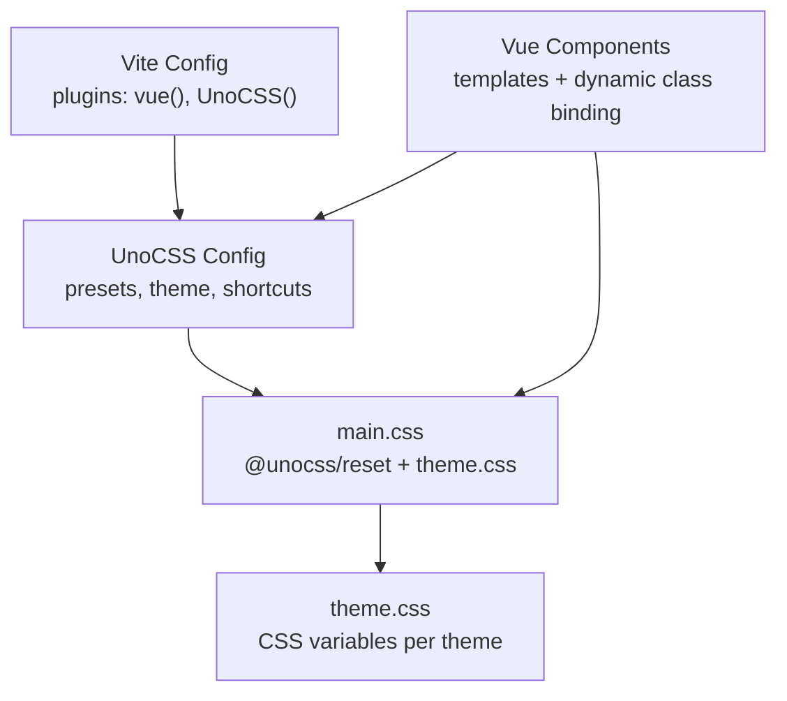
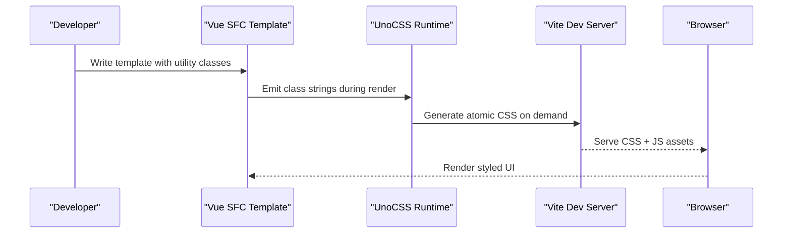
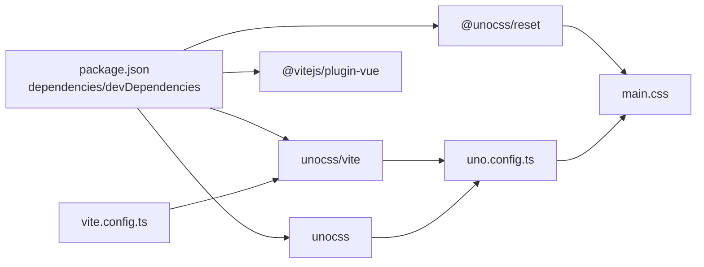

# UnoCSS Configuration & Utilities

<cite>
**Referenced Files in This Document**
- [uno.config.ts](file://code/client/uno.config.ts)
- [vite.config.ts](file://code/client/vite.config.ts)
- [main.css](file://code/client/src/styles/main.css)
- [theme.css](file://code/client/src/styles/theme.css)
- [App.vue](file://code/client/src/App.vue)
- [Sidebar.vue](file://code/client/src/components/sidebar/Sidebar.vue)
- [PageEditor.vue](file://code/client/src/components/editor/PageEditor.vue)
- [LoginView.vue](file://code/client/src/views/LoginView.vue)
- [TipTapEditor.vue](file://code/client/src/components/editor/TipTapEditor.vue)
- [PageList.vue](file://code/client/src/components/sidebar/PageList.vue)
- [AppAlert.vue](file://code/client/src/components/common/AppAlert.vue)
- [package.json](file://code/client/package.json)
</cite>

## Table of Contents
1. [Introduction](#introduction)
2. [Project Structure](#project-structure)
3. [Core Components](#core-components)
4. [Architecture Overview](#architecture-overview)
5. [Detailed Component Analysis](#detailed-component-analysis)
6. [Dependency Analysis](#dependency-analysis)
7. [Performance Considerations](#performance-considerations)
8. [Troubleshooting Guide](#troubleshooting-guide)
9. [Conclusion](#conclusion)
10. [Appendices](#appendices)

## Introduction
This document explains the UnoCSS configuration and utility class system used in the project. It covers configuration options, preset usage, custom utility generation via shortcuts, naming conventions, responsive variants, state modifiers, and integration with Vue components. It also provides practical guidance for creating custom utilities, extending presets, optimizing bundle size, understanding performance implications, debugging utility conflicts, and maintaining consistency while avoiding bloat.

## Project Structure
UnoCSS is integrated into the Vite build pipeline and configured via a dedicated configuration file. Global styles import UnoCSS reset and theme variables. Vue components apply utility classes directly in templates and bind classes dynamically using conditional expressions.

**Diagram sources**
- [vite.config.ts:12-16](file://code/client/vite.config.ts#L12-L16)
- [uno.config.ts:12-51](file://code/client/uno.config.ts#L12-L51)
- [main.css:8-12](file://code/client/src/styles/main.css#L8-L12)
- [theme.css:1-146](file://code/client/src/styles/theme.css#L1-L146)

**Section sources**
- [vite.config.ts:12-16](file://code/client/vite.config.ts#L12-L16)
- [uno.config.ts:12-51](file://code/client/uno.config.ts#L12-L51)
- [main.css:8-12](file://code/client/src/styles/main.css#L8-L12)
- [theme.css:1-146](file://code/client/src/styles/theme.css#L1-L146)

## Core Components
- UnoCSS configuration defines presets, theme overrides, and shortcuts.
- Vite plugin integrates UnoCSS into the build.
- Global CSS imports reset and theme variables.
- Vue components use utility classes and dynamic class binding.

Key configuration highlights:
- Presets: presetUno (Tailwind-compatible), presetIcons (Lucide icons).
- Theme: brand primary color palette with semantic shades.
- Shortcuts: reusable class groups for inputs, buttons, and cards.

**Section sources**
- [uno.config.ts:12-51](file://code/client/uno.config.ts#L12-L51)
- [vite.config.ts:12-16](file://code/client/vite.config.ts#L12-L16)
- [main.css:8-12](file://code/client/src/styles/main.css#L8-L12)
- [theme.css:1-146](file://code/client/src/styles/theme.css#L1-L146)

## Architecture Overview
The runtime architecture ties UnoCSS into Vue SFC rendering and Vite’s dev/build pipeline.

**Diagram sources**
- [vite.config.ts:12-16](file://code/client/vite.config.ts#L12-L16)
- [uno.config.ts:12-51](file://code/client/uno.config.ts#L12-L51)

## Detailed Component Analysis

### UnoCSS Configuration
- Presets:
  - presetUno: Tailwind-compatible utilities.
  - presetIcons: Lucide icon utilities via i-lucide-xxx classes.
- Theme:
  - Adds a primary color palette with multiple tints.
- Shortcuts:
  - input-base: shared input styling.
  - btn-primary / btn-secondary: button variants.
  - auth-card: card layout for auth forms.

Usage examples across components:
- LoginView.vue applies shortcuts and conditional classes for validation states.
- PageEditor.vue and TipTapEditor.vue use utility classes for layout and typography.

**Section sources**
- [uno.config.ts:12-51](file://code/client/uno.config.ts#L12-L51)
- [LoginView.vue:188-227](file://code/client/src/views/LoginView.vue#L188-L227)
- [PageEditor.vue:67-124](file://code/client/src/components/editor/PageEditor.vue#L67-L124)
- [TipTapEditor.vue:480-500](file://code/client/src/components/editor/TipTapEditor.vue#L480-L500)

### Utility Class Naming Conventions
- Tailwind-compatible shorthands (e.g., spacing, colors, typography).
- Icon utilities via presetIcons (e.g., i-lucide-xxx).
- Responsive variants: use colon-separated prefixes (e.g., sm:, md:, lg:).
- State modifiers: hover:, focus:, active:, disabled:.
- Dynamic class binding: v-bind:class, :class with objects/arrays.

Examples in the codebase:
- Conditional border and ring classes on input fields.
- Hover/focus states on buttons and interactive elements.
- Responsive layouts and alignment utilities.

**Section sources**
- [LoginView.vue:188-227](file://code/client/src/views/LoginView.vue#L188-L227)
- [TipTapEditor.vue:340-477](file://code/client/src/components/editor/TipTapEditor.vue#L340-L477)
- [PageList.vue:63-83](file://code/client/src/components/sidebar/PageList.vue#L63-L83)

### Responsive Variants and State Modifiers
- Responsive: prefix variants (e.g., sm:, md:, lg:) to adapt styles across breakpoints.
- States: hover, focus, active, disabled to reflect interactivity.
- Focus-visible and outline utilities are used for accessibility-friendly focus styles.

Evidence:
- Inputs and buttons use focus and hover utilities.
- Toolbars and menus toggle visibility with state classes.

**Section sources**
- [LoginView.vue:225-253](file://code/client/src/views/LoginView.vue#L225-L253)
- [TipTapEditor.vue:517-541](file://code/client/src/components/editor/TipTapEditor.vue#L517-L541)

### Integration with Vue Components and Dynamic Class Binding
- Static utilities: applied directly in templates for layout and composition.
- Dynamic classes:
  - Validation states on inputs using object syntax for conditional classes.
  - Active/inactive states for list items.
  - Button states (loading, disabled) with conditional rendering and classes.

Patterns:
- :class="{ 'focus:border-red-400': errors.password }"
- :class="{ 'page-item-active': currentPageId === page.id }"
- :disabled="loading"

**Section sources**
- [LoginView.vue:188-227](file://code/client/src/views/LoginView.vue#L188-L227)
- [PageList.vue:68-72](file://code/client/src/components/sidebar/PageList.vue#L68-L72)
- [TipTapEditor.vue:380-477](file://code/client/src/components/editor/TipTapEditor.vue#L380-L477)

### Creating Custom Utilities and Extending Presets
- Add shortcuts for frequently reused class combinations.
- Extend theme colors and spacing scales to match design tokens.
- Introduce new presets (e.g., mini, attributify) if needed for specialized use cases.

Practical steps:
- Define shortcuts in the shortcuts section of the UnoCSS config.
- Add new color palettes under theme.colors.
- Import additional presets in the presets array.

**Section sources**
- [uno.config.ts:42-51](file://code/client/uno.config.ts#L42-L51)
- [uno.config.ts:23-39](file://code/client/uno.config.ts#L23-L39)
- [uno.config.ts:13-21](file://code/client/uno.config.ts#L13-L21)

### Conditional Styling Patterns
- Form validation: highlight invalid inputs with focused ring and border utilities.
- Interactive states: use hover and active utilities for buttons and list items.
- Disabled states: apply disabled utilities to reflect non-interactive states.

**Section sources**
- [LoginView.vue:188-227](file://code/client/src/views/LoginView.vue#L188-L227)
- [PageList.vue:132-143](file://code/client/src/components/sidebar/PageList.vue#L132-L143)
- [TipTapEditor.vue:574-599](file://code/client/src/components/editor/TipTapEditor.vue#L574-L599)

### Utility Class Generation and Build Pipeline
- Vite plugin enables UnoCSS to scan templates and generate atomic CSS on demand.
- Global CSS imports reset and theme variables to ensure consistent base styles.

**Section sources**
- [vite.config.ts:12-16](file://code/client/vite.config.ts#L12-L16)
- [main.css:8-12](file://code/client/src/styles/main.css#L8-L12)

## Dependency Analysis
UnoCSS relies on Vite and Vue plugins. The project depends on unocss and @unocss/reset. Theme variables are consumed by both global CSS and Vue components.

**Diagram sources**
- [package.json:11-51](file://code/client/package.json#L11-L51)
- [vite.config.ts:12-16](file://code/client/vite.config.ts#L12-L16)
- [uno.config.ts:12-51](file://code/client/uno.config.ts#L12-L51)
- [main.css:8-12](file://code/client/src/styles/main.css#L8-L12)

**Section sources**
- [package.json:11-51](file://code/client/package.json#L11-L51)
- [vite.config.ts:12-16](file://code/client/vite.config.ts#L12-L16)
- [uno.config.ts:12-51](file://code/client/uno.config.ts#L12-L51)
- [main.css:8-12](file://code/client/src/styles/main.css#L8-L12)

## Performance Considerations
- Atomic CSS reduces duplication and improves cacheability.
- Keep shortcuts concise to avoid generating excessive variants.
- Prefer theme tokens (CSS variables) for colors and spacing to minimize CSS size.
- Limit arbitrary values; use presets and shortcuts to constrain utility surface.
- Use responsive and state utilities judiciously to prevent combinatorial growth.

[No sources needed since this section provides general guidance]

## Troubleshooting Guide
Common issues and resolutions:
- Icons not rendering:
  - Ensure presetIcons is enabled and icon names follow i-lucide-xxx pattern.
- Conflicting utilities:
  - Review conditional class bindings and specificity; prefer shortcuts to reduce ad-hoc overrides.
- Missing reset styles:
  - Confirm @unocss/reset is imported in main.css.
- Theme mismatch:
  - Verify theme.css variables and data-theme attribute usage.

**Section sources**
- [uno.config.ts:17-20](file://code/client/uno.config.ts#L17-L20)
- [main.css:8-12](file://code/client/src/styles/main.css#L8-L12)
- [theme.css:1-146](file://code/client/src/styles/theme.css#L1-L146)

## Conclusion
UnoCSS is configured with Tailwind-compatible utilities and Lucide icons, extended with a custom primary color palette and reusable shortcuts. The Vite plugin integrates seamlessly with Vue components, enabling efficient atomic CSS generation and dynamic class binding. Following the recommended patterns ensures maintainable, performant UI development while keeping the utility surface controlled and consistent.

[No sources needed since this section summarizes without analyzing specific files]

## Appendices

### Practical Examples Index
- Login form with input-base shortcut and conditional validation classes:
  - [LoginView.vue:188-227](file://code/client/src/views/LoginView.vue#L188-L227)
- Editor toolbar with hover/focus states and active toggles:
  - [TipTapEditor.vue:340-477](file://code/client/src/components/editor/TipTapEditor.vue#L340-L477)
- List item selection with active/inactive states:
  - [PageList.vue:68-72](file://code/client/src/components/sidebar/PageList.vue#L68-L72)
- Card layout using auth-card shortcut:
  - [LoginView.vue:161-161](file://code/client/src/views/LoginView.vue#L161-L161)

### Configuration Reference
- Presets: presetUno, presetIcons
- Theme: primary color palette
- Shortcuts: input-base, btn-primary, btn-secondary, auth-card

**Section sources**
- [uno.config.ts:12-51](file://code/client/uno.config.ts#L12-L51)