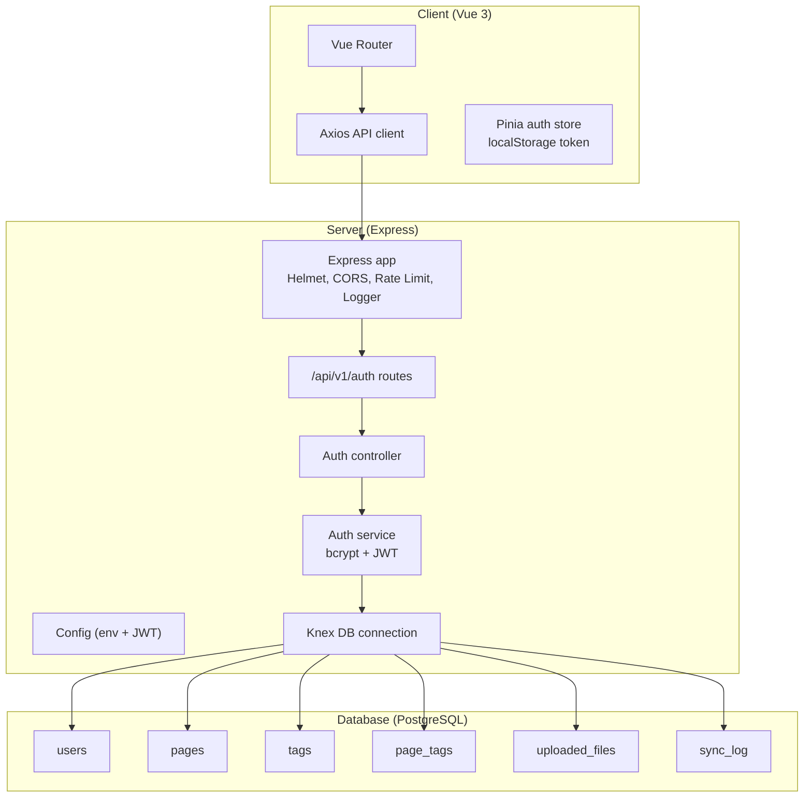
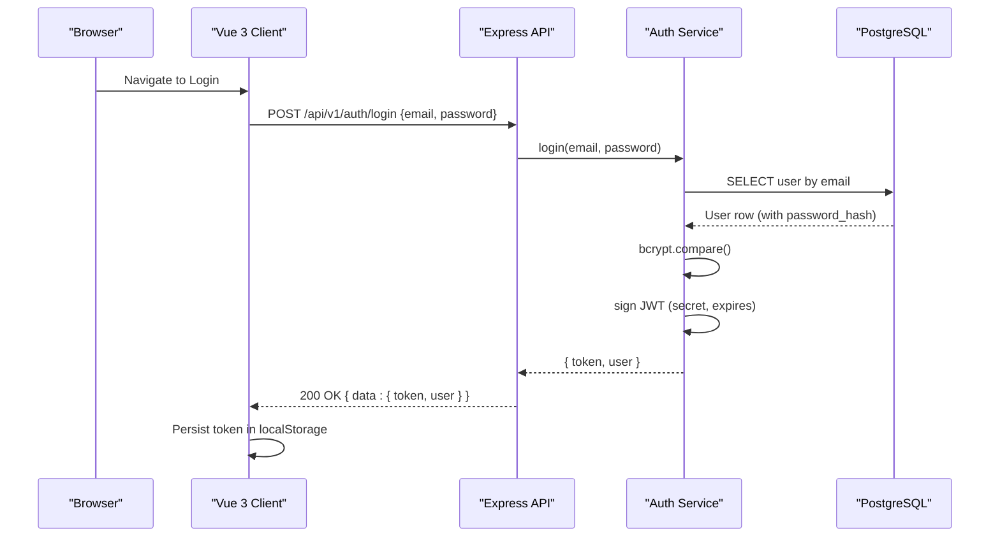
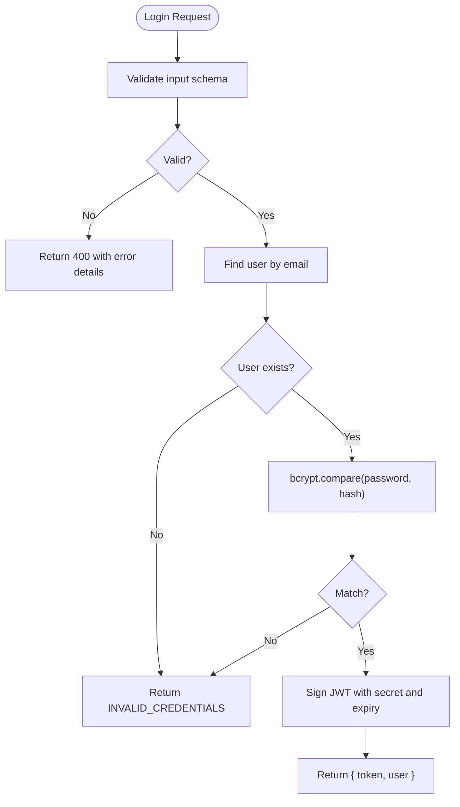
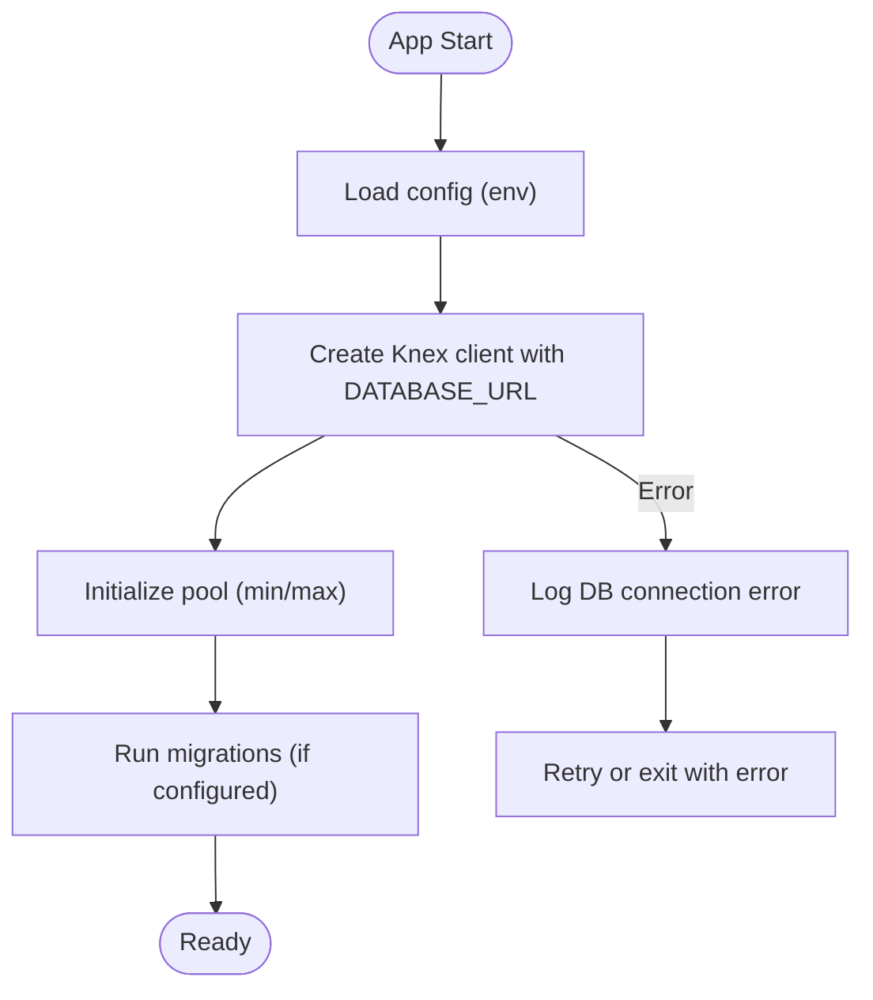
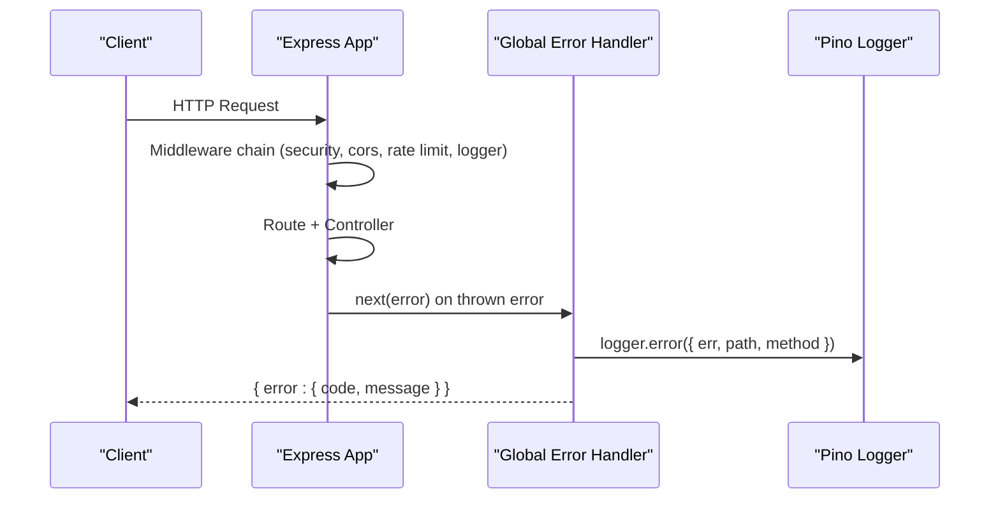
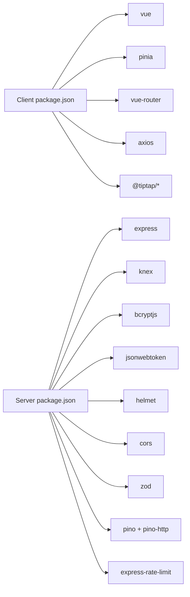

# Troubleshooting & FAQ

<cite>
**Referenced Files in This Document**
- [README.md](file://README.md)
- [ARCHITECTURE.md](file://arch/ARCHITECTURE.md)
- [app.ts](file://code/server/src/app.ts)
- [config/index.ts](file://code/server/src/config/index.ts)
- [knexfile.ts](file://code/server/knexfile.ts)
- [connection.ts](file://code/server/src/db/connection.ts)
- [20260319_init.ts](file://code/server/src/db/migrations/20260319_init.ts)
- [001_init.sql](file://db/001_init.sql)
- [auth.controller.ts](file://code/server/src/controllers/auth.controller.ts)
- [auth.service.ts](file://code/server/src/services/auth.service.ts)
- [auth.routes.ts](file://code/server/src/routes/auth.routes.ts)
- [errorHandler.ts](file://code/server/src/middleware/errorHandler.ts)
- [auth.service.ts (client)](file://code/client/src/services/auth.service.ts)
- [auth.store.ts](file://code/client/src/stores/auth.ts)
- [package.json (client)](file://code/client/package.json)
- [package.json (server)](file://code/server/package.json)
</cite>

## Table of Contents
1. [Introduction](#introduction)
2. [Project Structure](#project-structure)
3. [Core Components](#core-components)
4. [Architecture Overview](#architecture-overview)
5. [Detailed Component Analysis](#detailed-component-analysis)
6. [Dependency Analysis](#dependency-analysis)
7. [Performance Considerations](#performance-considerations)
8. [Troubleshooting Guide](#troubleshooting-guide)
9. [FAQ](#faq)
10. [Conclusion](#conclusion)

## Introduction
This document provides a comprehensive troubleshooting and FAQ guide for Yule Notion. It focuses on diagnosing and resolving common setup issues, database connectivity problems, authentication failures, frontend and backend debugging techniques, performance bottlenecks, and deployment/environment configuration pitfalls. It also covers error interpretation, log analysis, and practical steps to recover from incidents.

## Project Structure
Yule Notion follows a classic three-tier architecture with a Vue 3 frontend and an Express-based Node.js backend. The backend uses PostgreSQL with Knex.js for migrations and connections, and Pino for structured logging. The frontend persists tokens locally and coordinates with the backend via Axios.

**Diagram sources**
- [app.ts:65-121](file://code/server/src/app.ts#L65-L121)
- [auth.routes.ts:20-106](file://code/server/src/routes/auth.routes.ts#L20-L106)
- [auth.controller.ts:13-82](file://code/server/src/controllers/auth.controller.ts#L13-L82)
- [auth.service.ts:12-166](file://code/server/src/services/auth.service.ts#L12-L166)
- [connection.ts:22-39](file://code/server/src/db/connection.ts#L22-L39)
- [20260319_init.ts:17-299](file://code/server/src/db/migrations/20260319_init.ts#L17-L299)
- [001_init.sql:14-253](file://db/001_init.sql#L14-L253)

**Section sources**
- [README.md:23-41](file://README.md#L23-L41)
- [ARCHITECTURE.md:14-87](file://arch/ARCHITECTURE.md#L14-L87)

## Core Components
- Frontend
  - Axios-based API client with automatic token injection and interceptors.
  - Pinia auth store managing token persistence and user state.
  - Vue Router with navigation guards and views.
- Backend
  - Express app with Helmet, CORS, rate limiting, and pino HTTP logging.
  - Environment-driven configuration with Zod validation.
  - Knex connection to PostgreSQL with connection pooling.
  - Authentication service using bcrypt and JWT.
  - Centralized error handler returning consistent error responses.

**Section sources**
- [auth.service.ts (client):10-46](file://code/client/src/services/auth.service.ts#L10-L46)
- [auth.store.ts:26-138](file://code/client/src/stores/auth.ts#L26-L138)
- [app.ts:29-121](file://code/server/src/app.ts#L29-L121)
- [config/index.ts:16-98](file://code/server/src/config/index.ts#L16-L98)
- [connection.ts:22-39](file://code/server/src/db/connection.ts#L22-L39)
- [auth.service.ts:12-166](file://code/server/src/services/auth.service.ts#L12-L166)

## Architecture Overview
The system integrates a browser-based SPA (Vue 3) with a Node.js REST API and PostgreSQL. Requests flow through Nginx (in deployment) or directly in development. The backend enforces security headers, validates requests, authenticates via JWT, and logs all HTTP traffic.

**Diagram sources**
- [auth.routes.ts:88-92](file://code/server/src/routes/auth.routes.ts#L88-L92)
- [auth.controller.ts:47-57](file://code/server/src/controllers/auth.controller.ts#L47-L57)
- [auth.service.ts:117-143](file://code/server/src/services/auth.service.ts#L117-L143)
- [connection.ts:22-39](file://code/server/src/db/connection.ts#L22-L39)

## Detailed Component Analysis

### Authentication Flow and Failure Points
Common issues include invalid credentials, missing or expired tokens, and misconfigured JWT secrets. The backend validates inputs, compares passwords, and signs tokens. The client stores tokens and surfaces errors from the API.

**Diagram sources**
- [auth.routes.ts:35-66](file://code/server/src/routes/auth.routes.ts#L35-L66)
- [auth.controller.ts:47-57](file://code/server/src/controllers/auth.controller.ts#L47-L57)
- [auth.service.ts:117-143](file://code/server/src/services/auth.service.ts#L117-L143)

**Section sources**
- [auth.routes.ts:27-92](file://code/server/src/routes/auth.routes.ts#L27-L92)
- [auth.controller.ts:26-81](file://code/server/src/controllers/auth.controller.ts#L26-L81)
- [auth.service.ts:68-143](file://code/server/src/services/auth.service.ts#L68-L143)
- [auth.store.ts:80-122](file://code/client/src/stores/auth.ts#L80-L122)

### Database Connectivity and Migrations
The backend uses Knex with a connection pool and supports development/test/production environments. Migrations initialize schema and triggers. Connection failures often stem from incorrect DATABASE_URL, network issues, or missing extensions.

**Diagram sources**
- [config/index.ts:16-44](file://code/server/src/config/index.ts#L16-L44)
- [knexfile.ts:13-57](file://code/server/knexfile.ts#L13-L57)
- [connection.ts:22-39](file://code/server/src/db/connection.ts#L22-L39)
- [20260319_init.ts:17-299](file://code/server/src/db/migrations/20260319_init.ts#L17-L299)

**Section sources**
- [config/index.ts:16-98](file://code/server/src/config/index.ts#L16-L98)
- [knexfile.ts:13-68](file://code/server/knexfile.ts#L13-L68)
- [connection.ts:22-39](file://code/server/src/db/connection.ts#L22-L39)
- [20260319_init.ts:17-299](file://code/server/src/db/migrations/20260319_init.ts#L17-L299)
- [001_init.sql:14-253](file://db/001_init.sql#L14-L253)

### Logging and Error Handling
The backend logs all HTTP requests and errors consistently. Production hides internal error details while development exposes messages for debugging. The global error handler ensures uniform responses.

**Diagram sources**
- [app.ts:67-121](file://code/server/src/app.ts#L67-L121)
- [errorHandler.ts:29-67](file://code/server/src/middleware/errorHandler.ts#L29-L67)

**Section sources**
- [app.ts:29-121](file://code/server/src/app.ts#L29-L121)
- [errorHandler.ts:19-67](file://code/server/src/middleware/errorHandler.ts#L19-L67)

## Dependency Analysis
- Frontend dependencies include Vue 3, Pinia, Vue Router, Axios, and TipTap. Ensure compatible versions and lockfiles.
- Backend dependencies include Express, Knex, bcrypt, jsonwebtoken, helmet, cors, zod, pino, and express-rate-limit. Verify environment variables and secrets.

**Diagram sources**
- [package.json (client):11-41](file://code/client/package.json#L11-L41)
- [package.json (server):15-27](file://code/server/package.json#L15-L27)

**Section sources**
- [package.json (client):11-53](file://code/client/package.json#L11-L53)
- [package.json (server):15-39](file://code/server/package.json#L15-L39)

## Performance Considerations
- Database
  - Use connection pooling and appropriate indexes (GIN for JSONB/tsvector).
  - Keep migrations and seed scripts minimal; avoid heavy writes during startup.
- Backend
  - Rate limiting prevents abuse; tune limits per environment.
  - Use pino for efficient structured logging; avoid verbose logs in production.
- Frontend
  - Debounce auto-save to reduce IndexedDB and sync queue churn.
  - Minimize TipTap JSON sizes; leverage tree-shaking and lazy loading.

[No sources needed since this section provides general guidance]

## Troubleshooting Guide

### Setup and Environment Issues
- Symptoms
  - Application fails to start or crashes immediately.
  - Port binding errors or CORS policy warnings.
- Steps
  - Verify Node.js version meets requirements.
  - Ensure environment variables are present and valid (NODE_ENV, PORT, DATABASE_URL, JWT_SECRET, ALLOWED_ORIGINS).
  - Confirm production requires JWT_SECRET ≥ 32 chars and ALLOWED_ORIGINS configured.
  - Check that PostgreSQL is reachable and accepts connections.
- References
  - Environment validation and defaults.
  - Config-driven runtime behavior.
  - Knex configuration per environment.

**Section sources**
- [README.md:45-48](file://README.md#L45-L48)
- [config/index.ts:16-98](file://code/server/src/config/index.ts#L16-L98)
- [knexfile.ts:13-68](file://code/server/knexfile.ts#L13-L68)

### Database Connection Problems
- Symptoms
  - Startup errors mentioning database connection failure.
  - Knex pool errors or timeouts.
- Steps
  - Validate DATABASE_URL format and credentials.
  - Confirm PostgreSQL is running and accepting TCP connections.
  - Run migrations to initialize schema and triggers.
  - Inspect connection pool settings and adjust min/max as needed.
- References
  - Knex client creation and pool configuration.
  - Migration initialization script.

**Section sources**
- [connection.ts:22-39](file://code/server/src/db/connection.ts#L22-L39)
- [knexfile.ts:13-57](file://code/server/knexfile.ts#L13-L57)
- [20260319_init.ts:17-299](file://code/server/src/db/migrations/20260319_init.ts#L17-L299)
- [001_init.sql:14-253](file://db/001_init.sql#L14-L253)

### Authentication Failures
- Symptoms
  - Login returns “invalid credentials” regardless of input.
  - After login, protected routes fail with 401.
- Steps
  - Confirm request body matches validation schema (email, password, name).
  - Ensure bcrypt rounds and JWT signing secret are consistent.
  - Check that the client stores and sends the token in Authorization header.
  - Verify JWT_SECRET length and value in production.
- References
  - Validation schemas for registration and login.
  - Controller-to-service flow and JWT generation.
  - Client-side token persistence and retrieval.

**Section sources**
- [auth.routes.ts:35-66](file://code/server/src/routes/auth.routes.ts#L35-L66)
- [auth.controller.ts:26-81](file://code/server/src/controllers/auth.controller.ts#L26-L81)
- [auth.service.ts:68-143](file://code/server/src/services/auth.service.ts#L68-L143)
- [auth.store.ts:59-122](file://code/client/src/stores/auth.ts#L59-L122)

### API and Backend Debugging
- Symptoms
  - Unexpected 500 errors or inconsistent error payloads.
  - Health check endpoint failing.
- Steps
  - Review pino HTTP logs for request path/method and error context.
  - Check global error handler behavior in development vs production.
  - Validate route registration and middleware order.
  - Confirm rate limit thresholds and CORS origins.
- References
  - Express app middleware stack and health endpoint.
  - Global error handler and logger configuration.

**Section sources**
- [app.ts:67-121](file://code/server/src/app.ts#L67-L121)
- [errorHandler.ts:29-67](file://code/server/src/middleware/errorHandler.ts#L29-L67)

### Frontend Debugging
- Symptoms
  - Login succeeds but UI remains unauthenticated.
  - Auto-save not triggering or sync not occurring.
- Steps
  - Inspect localStorage for the token key.
  - Verify Axios interceptor attaches Authorization header.
  - Confirm router navigation and guards.
  - Check for unhandled rejections and console errors.
- References
  - Client auth service and store.
  - Axios usage in services.

**Section sources**
- [auth.store.ts:26-138](file://code/client/src/stores/auth.ts#L26-L138)
- [auth.service.ts (client):10-46](file://code/client/src/services/auth.service.ts#L10-L46)
- [package.json (client):11-41](file://code/client/package.json#L11-L41)

### Deployment and Environment Configuration
- Symptoms
  - CI/CD builds fail or containers crash on startup.
  - CORS errors in production.
- Steps
  - Ensure JWT_SECRET and ALLOWED_ORIGINS are set in production.
  - Validate Docker Compose services and ports.
  - Confirm Nginx reverse proxy forwards /api/* to backend and serves static assets.
  - Check upload directory permissions and volume mounts.
- References
  - Environment variable requirements for production.
  - Deployment architecture and environment variables.

**Section sources**
- [config/index.ts:52-67](file://code/server/src/config/index.ts#L52-L67)
- [ARCHITECTURE.md:549-585](file://arch/ARCHITECTURE.md#L549-L585)
- [ARCHITECTURE.md:587-598](file://arch/ARCHITECTURE.md#L587-L598)

### Error Message Interpretation and Log Analysis
- Common error codes and causes
  - RATE_LIMIT_EXCEEDED: Too many requests; adjust rate limit or client retry.
  - RESOURCE_NOT_FOUND: Endpoint not found or user not found; verify routes and user existence.
  - INVALID_CREDENTIALS: Email or password mismatch; confirm input and hashing.
  - INTERNAL_ERROR: Unhandled exception; inspect pino logs for stack traces.
- Log analysis tips
  - Filter by path and method to isolate failing requests.
  - In production, rely on structured JSON logs; in development, pretty-printed logs aid readability.
- References
  - Global error handler and logger setup.

**Section sources**
- [app.ts:84-96](file://code/server/src/app.ts#L84-L96)
- [errorHandler.ts:29-67](file://code/server/src/middleware/errorHandler.ts#L29-L67)

### Performance Issues, Memory Leaks, and Optimization Strategies
- Database
  - Monitor slow queries and missing indexes; ensure GIN indexes for JSONB/tsvector.
  - Keep migrations small and avoid long-running transactions.
- Backend
  - Tune rate limits and request body size limits.
  - Use pino with JSON output in production for efficient log aggregation.
- Frontend
  - Debounce auto-save and batch IndexedDB writes.
  - Avoid unnecessary reactivity and excessive watchers.
- References
  - Indexes and triggers in schema.
  - Knex pool configuration.

**Section sources**
- [20260319_init.ts:77-81](file://code/server/src/db/migrations/20260319_init.ts#L77-L81)
- [20260319_init.ts:196-242](file://code/server/src/db/migrations/20260319_init.ts#L196-L242)
- [connection.ts:25-29](file://code/server/src/db/connection.ts#L25-L29)

### Security Concerns, Data Recovery, and Emergency Response
- Security
  - Never use default JWT_SECRET in production; enforce minimum length.
  - Configure ALLOWED_ORIGINS to restrict cross-origin access.
  - Keep bcrypt cost consistent; avoid weak passwords.
- Data Recovery
  - Use soft delete pattern with cleanup policies.
  - Maintain sync_log for auditing and conflict resolution.
- Emergency Response
  - Gracefully shutdown database connections on SIGTERM/SIGINT.
  - Rollback migrations if schema changes cause issues.
- References
  - Production security checks.
  - Soft delete and cleanup guidance.
  - Migration rollback commands.

**Section sources**
- [config/index.ts:52-67](file://code/server/src/config/index.ts#L52-L67)
- [001_init.sql:44-46](file://db/001_init.sql#L44-L46)
- [001_init.sql:137-156](file://db/001_init.sql#L137-L156)
- [README.md:96-97](file://README.md#L96-L97)

## FAQ

### How do I run the project locally?
- Install dependencies for both client and server.
- Start the backend dev server and the frontend dev server.
- Build for production if needed.

**Section sources**
- [README.md:50-84](file://README.md#L50-L84)

### Why does login always fail?
- Ensure the email/password match validation rules and the user exists.
- Confirm bcrypt comparison and JWT signing work as expected.
- Check that the client sends the Authorization header after login.

**Section sources**
- [auth.routes.ts:35-66](file://code/server/src/routes/auth.routes.ts#L35-L66)
- [auth.service.ts:117-143](file://code/server/src/services/auth.service.ts#L117-L143)
- [auth.store.ts:80-84](file://code/client/src/stores/auth.ts#L80-L84)

### How do I fix database connection errors?
- Verify DATABASE_URL format and credentials.
- Ensure PostgreSQL is running and accessible.
- Run migrations to create tables and indexes.

**Section sources**
- [connection.ts:22-39](file://code/server/src/db/connection.ts#L22-L39)
- [20260319_init.ts:17-299](file://code/server/src/db/migrations/20260319_init.ts#L17-L299)

### What environment variables are required?
- Required in production: JWT_SECRET (≥32 chars), ALLOWED_ORIGINS.
- Optional: PORT, DATABASE_URL, JWT_EXPIRES_IN.

**Section sources**
- [config/index.ts:16-98](file://code/server/src/config/index.ts#L16-L98)

### How do I manage migrations?
- Create a new migration, apply latest, or roll back as needed.

**Section sources**
- [README.md:86-98](file://README.md#L86-L98)
- [knexfile.ts:43-57](file://code/server/knexfile.ts#L43-L57)

### Why am I seeing CORS errors?
- In development, CORS allows all origins; in production, configure ALLOWED_ORIGINS.

**Section sources**
- [app.ts:73-76](file://code/server/src/app.ts#L73-L76)
- [config/index.ts:96-98](file://code/server/src/config/index.ts#L96-L98)

### How can I debug API issues?
- Enable development logs, inspect request/response payloads, and check the global error handler output.

**Section sources**
- [app.ts:29-47](file://code/server/src/app.ts#L29-L47)
- [errorHandler.ts:29-67](file://code/server/src/middleware/errorHandler.ts#L29-L67)

### How do I troubleshoot frontend authentication state?
- Check localStorage for the token, ensure the store persists and clears state correctly, and verify Axios interceptors.

**Section sources**
- [auth.store.ts:59-71](file://code/client/src/stores/auth.ts#L59-L71)
- [auth.store.ts:114-122](file://code/client/src/stores/auth.ts#L114-L122)
- [auth.service.ts (client):10-46](file://code/client/src/services/auth.service.ts#L10-L46)

### What should I do if the app crashes on startup?
- Review environment variables, database connectivity, and logs.
- Confirm migrations ran successfully.

**Section sources**
- [config/index.ts:52-67](file://code/server/src/config/index.ts#L52-L67)
- [connection.ts:22-39](file://code/server/src/db/connection.ts#L22-L39)

### How do I handle rate limit exceeded errors?
- Reduce client request frequency or increase limits in non-production environments.

**Section sources**
- [app.ts:84-96](file://code/server/src/app.ts#L84-L96)

### How do I deploy this application?
- Use Docker Compose to orchestrate web, API, and database services.
- Configure environment variables and volumes appropriately.

**Section sources**
- [ARCHITECTURE.md:549-585](file://arch/ARCHITECTURE.md#L549-L585)
- [ARCHITECTURE.md:587-598](file://arch/ARCHITECTURE.md#L587-L598)

## Conclusion
This guide consolidates actionable steps to diagnose and resolve common issues in Yule Notion across setup, database connectivity, authentication, frontend/backend debugging, performance, and deployment. By following the referenced configurations and logs, teams can quickly identify root causes and apply targeted fixes.